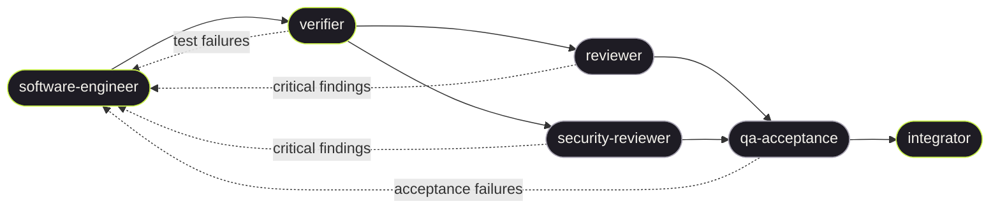

# Building Blocks

Product repo for **The Climb** / paid stacks (`app/`). Agent roles are generic
and live in the pack; **this repo's facts are in `context/`**.

| | Path |
|--|------|
| This product's facts | [`context/README.md`](context/README.md) |
| File tree + how to vendor the pack | [`pack/SETUP.md`](pack/SETUP.md) |
| Template repo | [leeran7/closed-loop-agents](https://github.com/leeran7/closed-loop-agents) |
| Kernel protocol / gates | `skills/closed-loop/protocol.md`, `gates.md` |
| Memory | `loop/learnings.md` |

Edit `agents/` or `skills/`, then `yarn sync`. To refresh the template repo:
`node scripts/export-template.mjs /path/to/closed-loop-agents`.

New skills: `node scripts/create-skill.mjs <name> [--link <skill/file.md> ...]`.
Shared files between skills **must** be symlinks, never copies — single source
of truth. The `create-skill` script enforces this via `--link`.

## When to use the orchestrator

Assess every task before starting. Use the full closed-loop pipeline
(`@orchestrator` / `/closed-loop`) when the task is **substantial**:

| Use orchestrator | Handle directly |
|-----------------|-----------------|
| New features or flows | Typo / comment / formatting fixes |
| Refactors touching >3 files | Single-file bug fix with obvious cause |
| Security-sensitive changes | Config changes (env, deps, CI) |
| Architecture or API changes | Questions, research, explanations |
| >50 LOC of new code | Renaming or moving a symbol |
| Anything touching auth, payments, or trust boundaries | Updating docs to match existing code |

When in doubt, use the orchestrator — it is cheaper to over-verify than to
ship a regression. The user can always say "just do it directly" to skip.

The orchestrator coordinates the 6 required agents:



<details><summary>Text version</summary>

```
                    ┌─────────────────────────────────────────────────────────┐
                    │                     ORCHESTRATOR                        │
                    │                                                         │
                    │        ┌───────────────────┐                            │
                    │        │ software-engineer  │◀─────────────────────┐    │
                    │        └────────┬──────────┘                      │    │
                    │                 │                                  │    │
                    │                 ▼                                  │    │
                    │          ┌───────────┐                             │    │
                    │          │ verifier  │─────────────────────────────┤    │
                    │          └─────┬─────┘                             │    │
                    │       ┌────────┼─────────┐                        │    │
                    │       ▼                   ▼                        │    │
                    │  ┌───────────┐     ┌──────────┐                   │    │
                    │  │ reviewer  │──┐  │ security- │                  │    │
                    │  └───────────┘  │  │ reviewer  │                  │    │
                    │                 │  └─────┬─────┘                  │    │
                    │                 ▼        │       findings / failures    │
                    │          ┌──────────────┐│                        │    │
                    │          │qa-acceptance │◀┘                       │    │
                    │          └──────┬───────┘                         │    │
                    │                 │  · · · · · · · · · · · · · · · ·┘    │
                    │                 ▼                                      │
                    │          ┌───────────┐                                 │
                    │          │integrator │                                 │
                    │          └───────────┘                                 │
                    └─────────────────────────────────────────────────────────┘

  ──▶  forward flow        · · · ·  loop-back (critical findings / failures)
```

</details>

Fix critical findings and re-run until `status: success`. The orchestrator
retro promotes read-only agents' `learnings` to their permanent files.

Product facts go in `context/` or the ledger. Kernel-generic `[all]` lessons
are proposed for `skills/closed-loop/gates.md`. Keep each agent markdown file
under 200 lines.

Git remotes and branch policy: `context/git.md`. Package managers and
gates: `context/profile.json` and `context/gates.json`.
