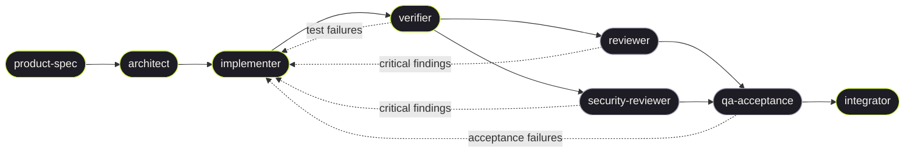

# Building Blocks

Product repo for **The Climb** / paid stacks (`app/`). Agent roles are generic
and live in the pack; **this repo's facts are in `context/`**.

| | Path |
|--|------|
| This product's facts | [`context/README.md`](context/README.md) |
| File tree + how to vendor the pack | [`pack/SETUP.md`](pack/SETUP.md) |
| Template repo | [leeran7/closed-loop-agents](https://github.com/leeran7/closed-loop-agents) |
| Kernel protocol / gates | `skills/closed-loop/protocol.md`, `gates.md` |
| Memory | `loop/learnings.md` |

Edit `agents/` or `skills/`, then `yarn sync`. To refresh the template repo:
`node scripts/export-template.mjs /path/to/closed-loop-agents`.

## Every session runs through the orchestrator

All work goes through `@orchestrator` (or `/closed-loop`). Do not implement
directly — dispatch the closed-loop team. The orchestrator coordinates the
8 required agents:



<details><summary>Text version</summary>

```
                    ┌─────────────────────────────────────────────────────────┐
                    │                     ORCHESTRATOR                        │
                    │                                                         │
                    │   ┌──────────┐   ┌───────────┐   ┌──────────────┐       │
                    │   │ product- │──▶│ architect  │──▶│ implementer  │◀──┐   │
                    │   │   spec   │   └───────────┘   └──────┬───────┘   │   │
                    │   └──────────┘                          │            │   │
                    │                                         ▼            │   │
                    │                                  ┌───────────┐       │   │
                    │                                  │ verifier  │───────┤   │
                    │                                  └─────┬─────┘       │   │
                    │                          ┌─────────────┼─────────┐   │   │
                    │                          ▼                       ▼   │   │
                    │                   ┌───────────┐          ┌──────────┐│   │
                    │                   │ reviewer  │──┐       │ security-││   │
                    │                   └───────────┘  │       │ reviewer ││   │
                    │                                  │       └─────┬────┘│   │
                    │                                  ▼             │     │   │
                    │                           ┌──────────────┐     │     │   │
                    │              findings ····│qa-acceptance │◀────┘     │   │
                    │              loop back    └──────┬───────┘           │   │
                    │                ·                 │                   │   │
                    │                · · · · · · · · · · · · · · · · · · ·┘   │
                    │                                 ▼                       │
                    │                          ┌───────────┐                  │
                    │                          │integrator │                  │
                    │                          └───────────┘                  │
                    └─────────────────────────────────────────────────────────┘

  ──▶  forward flow        · · · ·  loop-back (critical findings / failures)
```

</details>

Fix critical findings and re-run until `status: success`. Persist read-only
agents' `learnings` into `loop/learnings.jsonl`.

Product facts go in `context/` or the ledger. Kernel-generic `[all]` lessons
are proposed for `skills/closed-loop/gates.md`. Keep each agent markdown file
under 200 lines.

Git remotes and branch policy: `context/git.md`. Package managers and
gates: `context/profile.json` and `context/gates.json`.
