# Version 2.0 screenshots

Phone size, from the real screens with sample data. PR #208 links here.

## Shop and skins (#207)

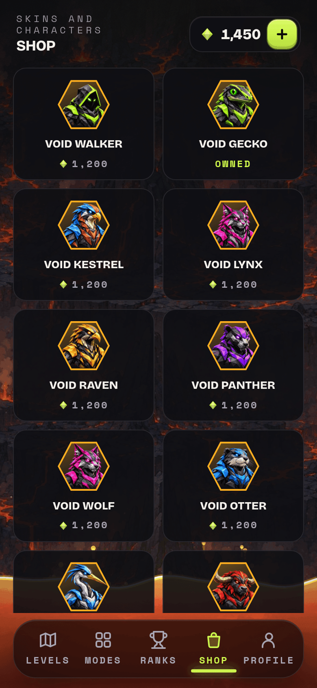 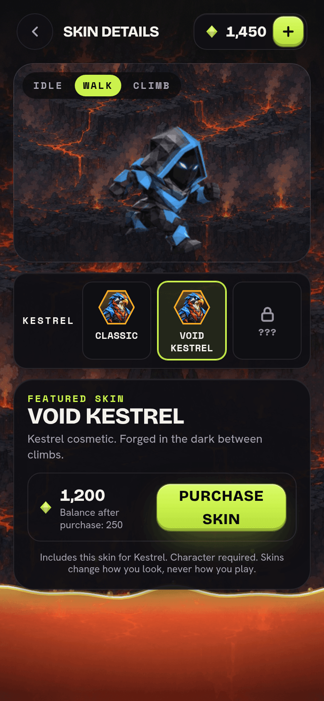 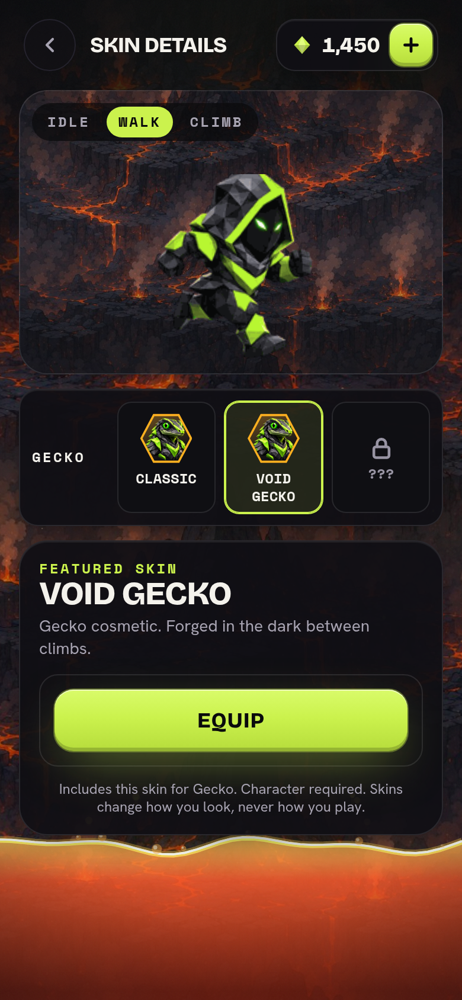

## Gem packs: web, and iPhone with pay on web (#207, #210)

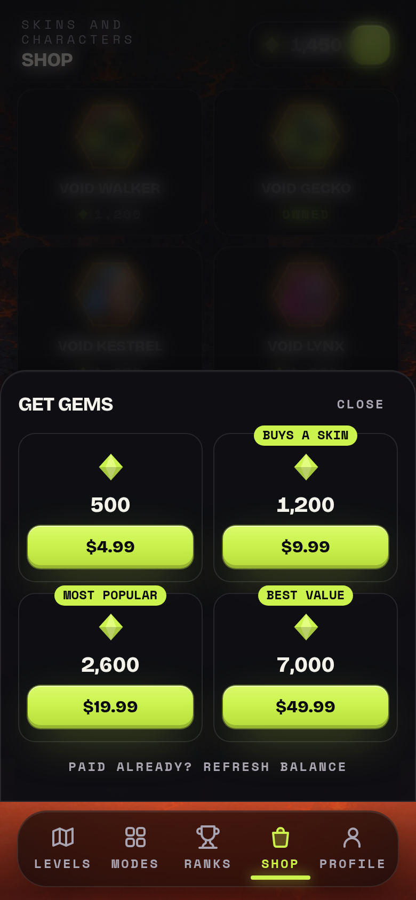 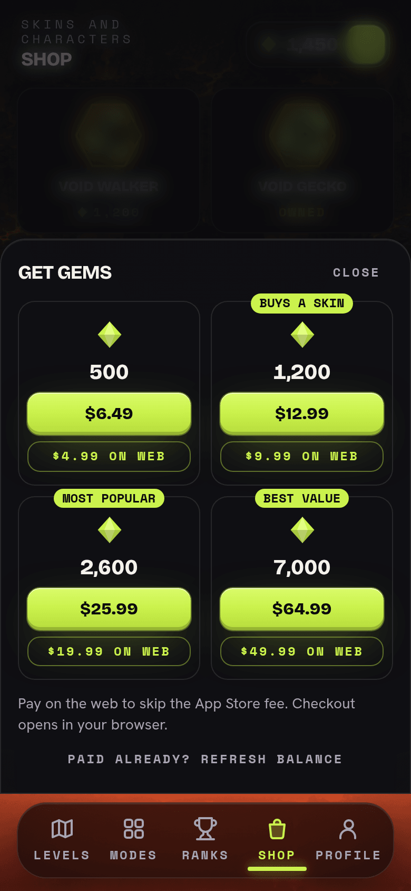

## Lives refill (#206)

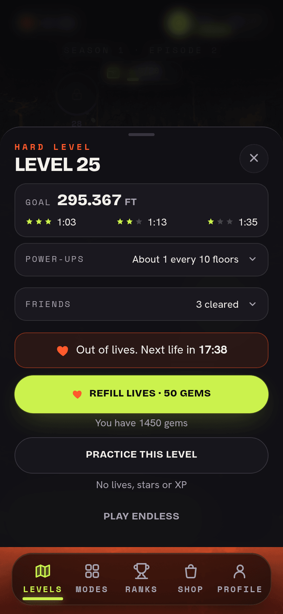 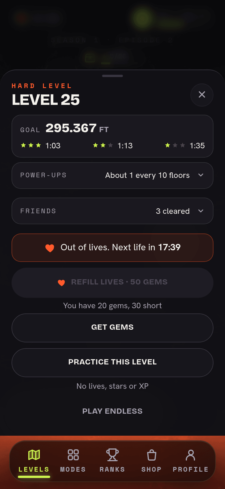 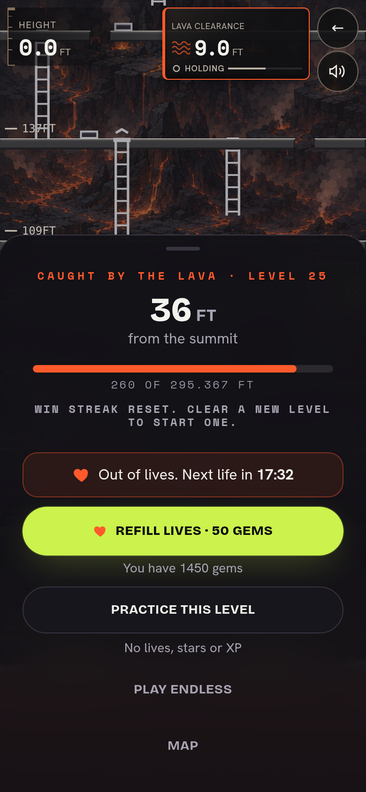

## Star chests (#209)

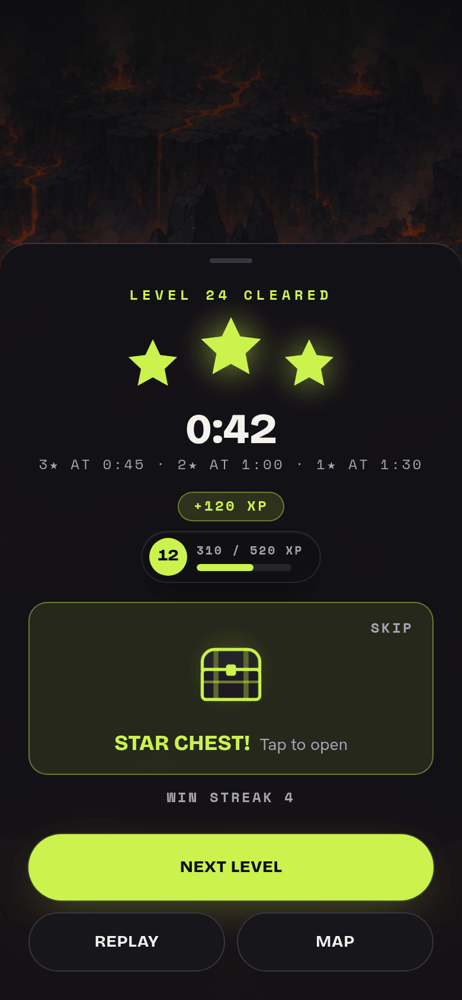 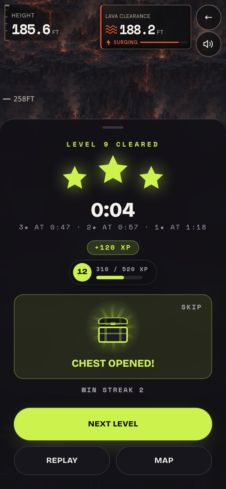 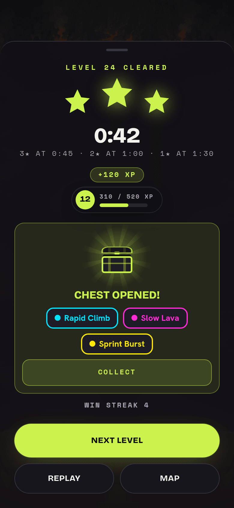 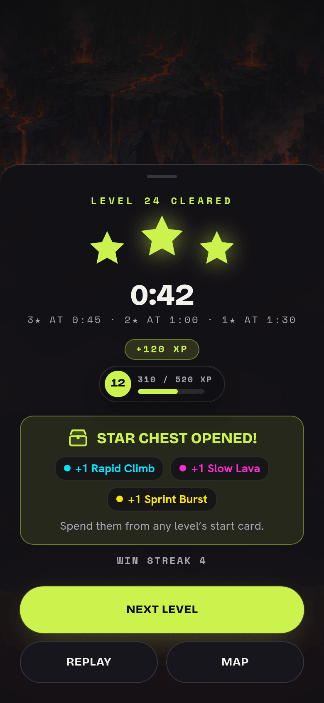

## Early-level start power-ups (#205)

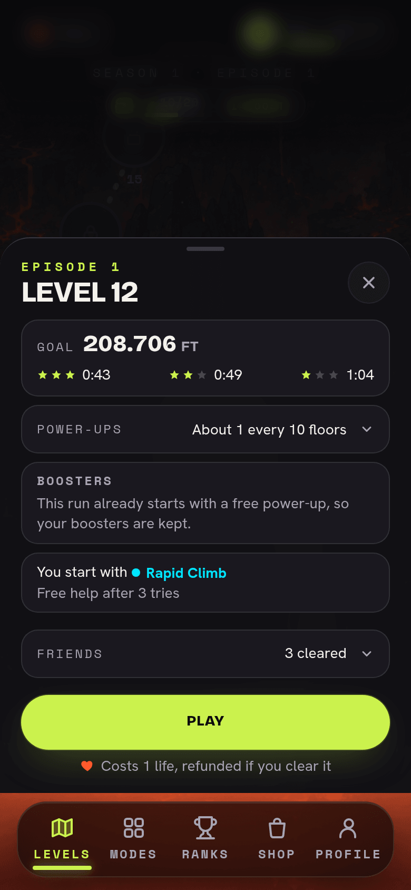 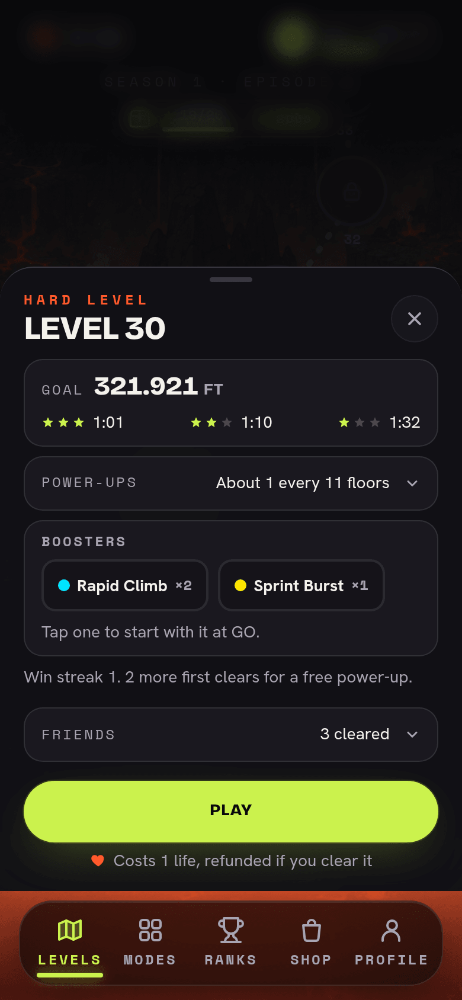

## Summit diamond level ending (#211)

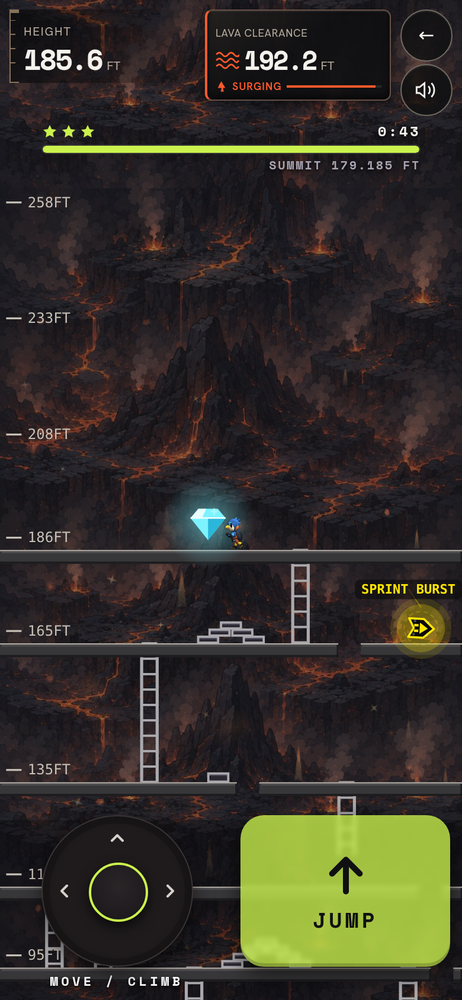 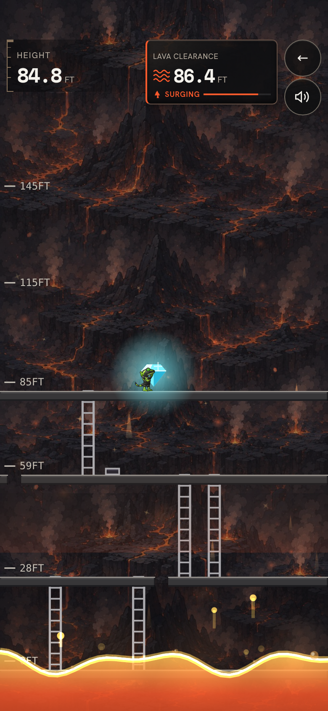

## Choose Character, before and after (#213)

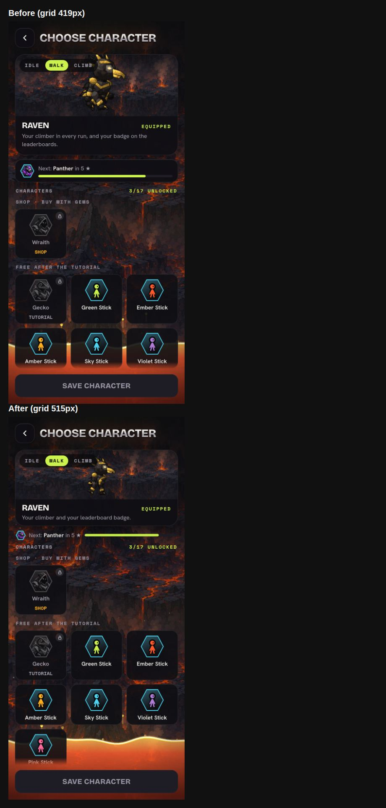

## New Doomstack logo (#214)

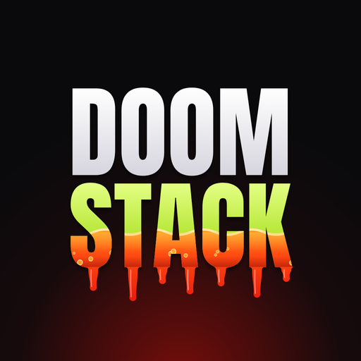 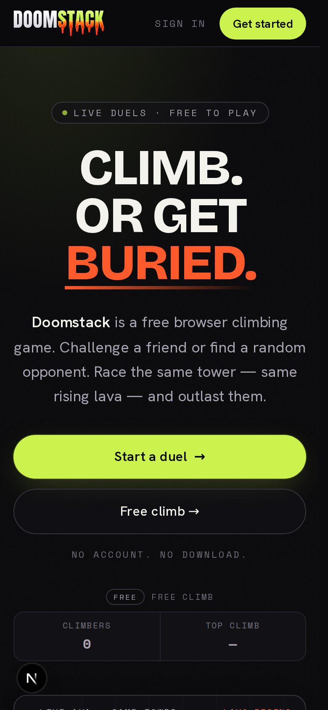 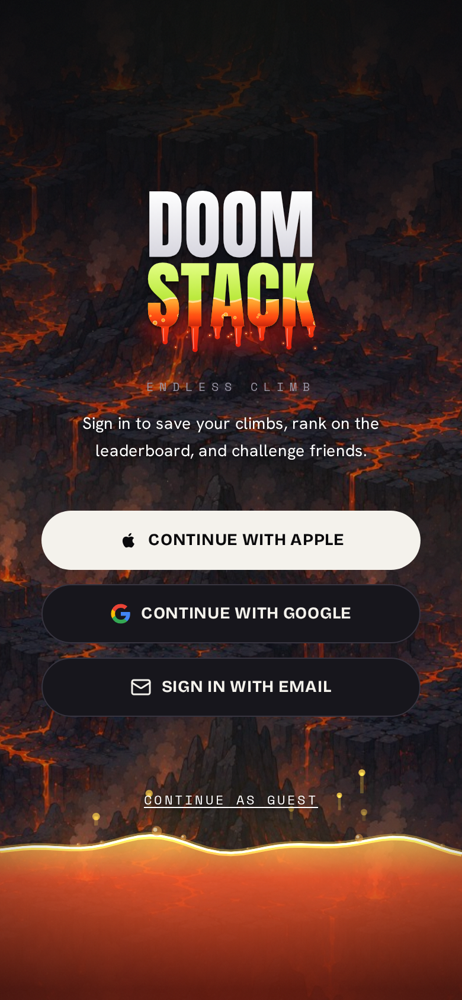
