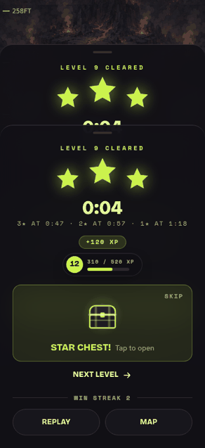
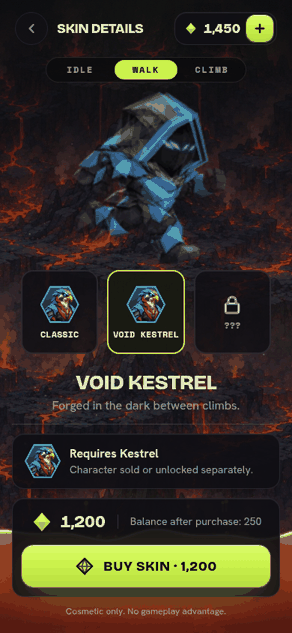
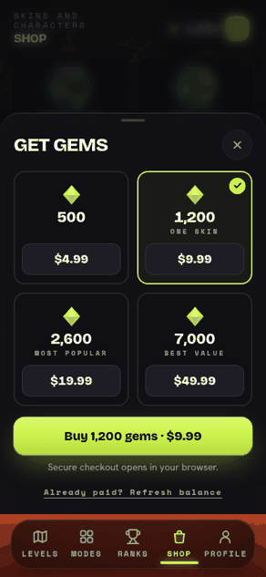
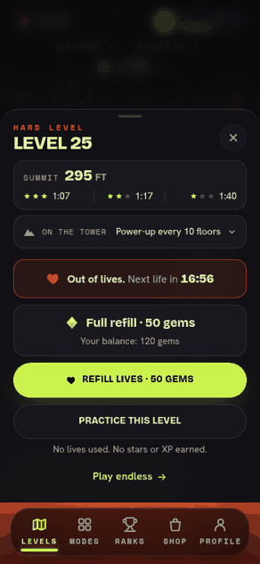

# 2.0 screens matched to the new mockups

Phone size (390x844 @2x), mocked API, branch `feature/mockup-screens`. Each
image is Before (the 2.0 gallery), Leeran's mockup, then After.

## Level start

## Level cleared with a star chest

## Out of lives

## Get Gems on iPhone

## Skin Details

## Choose Character

Scrolled down: the Wraith Shop row sits under your characters, then the locked ones.

## Reward animations

Each payoff now builds before it gives: three shakes that get harder (with a
stronger haptic each on iPhone), light gathering in, then a flash, a ring and
sparks. Recorded from the app with the API mocked; the GIFs run slower and
choppier than the real thing.

| Star chest | Buying a skin |
|--|--|
|  |  |

| Gems landing (Refresh balance after paying on the web) | Refilling lives with gems |
|--|--|
|  |  |
