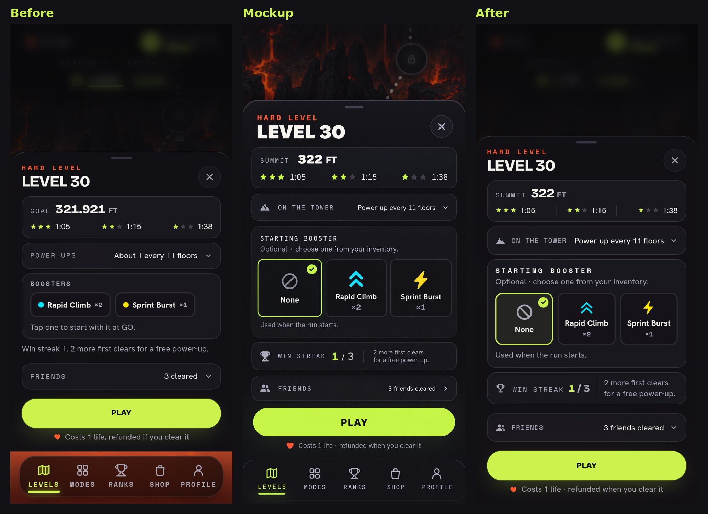
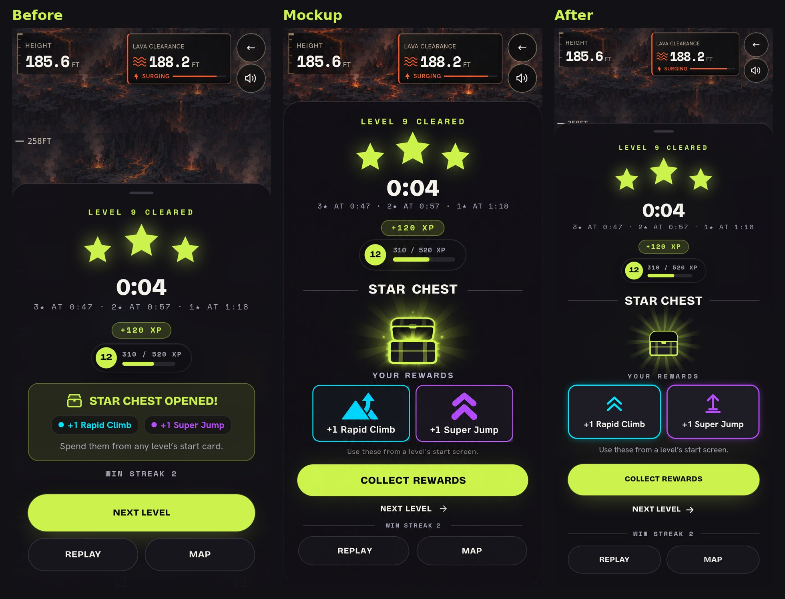
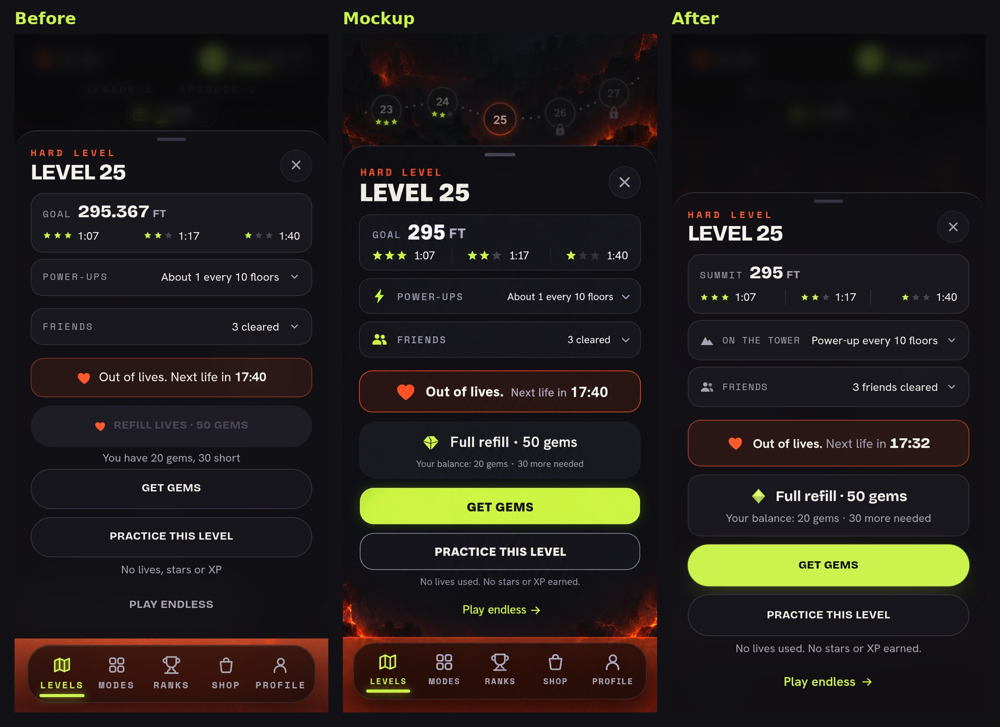
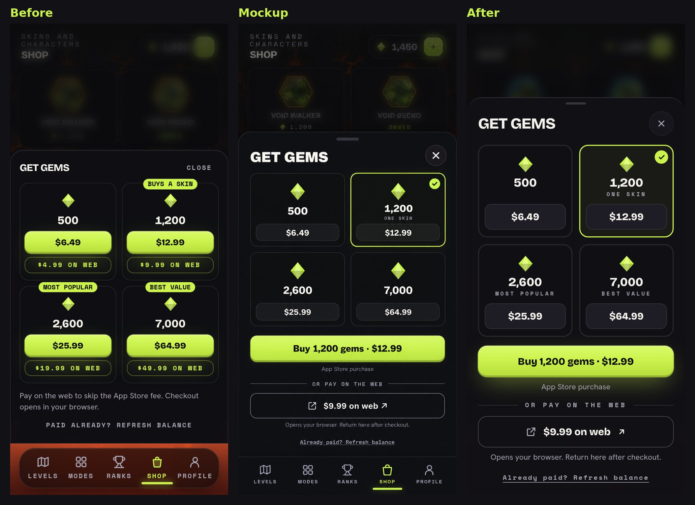
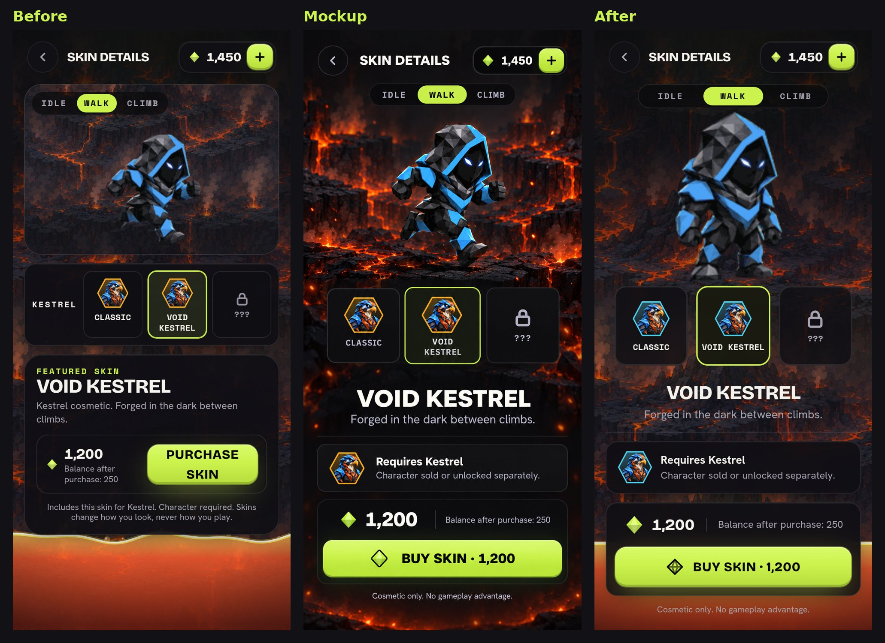
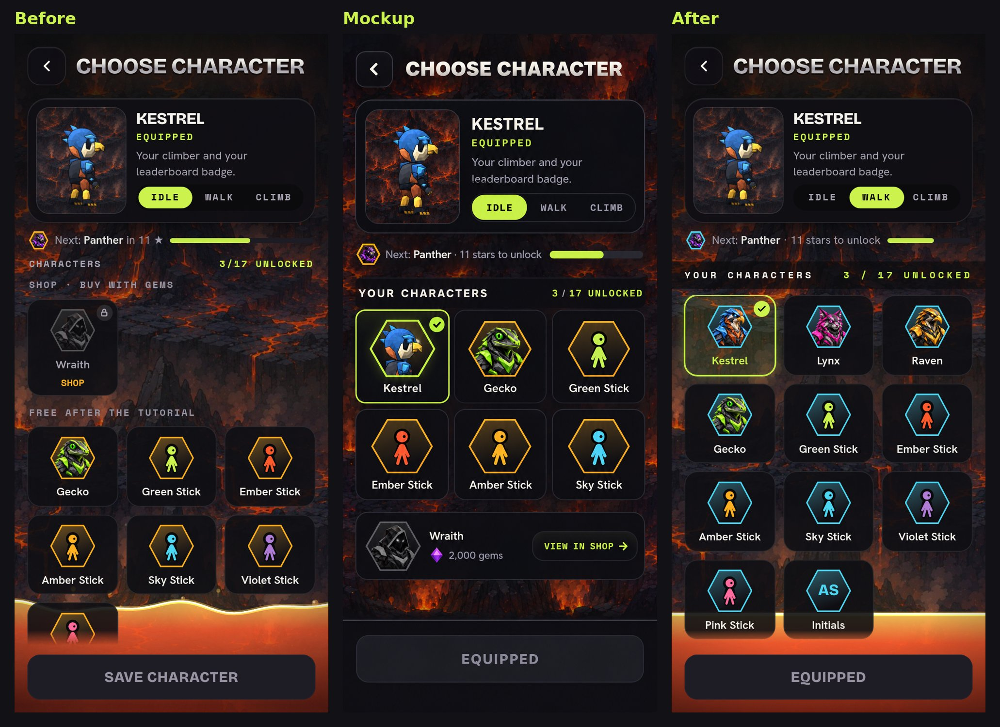
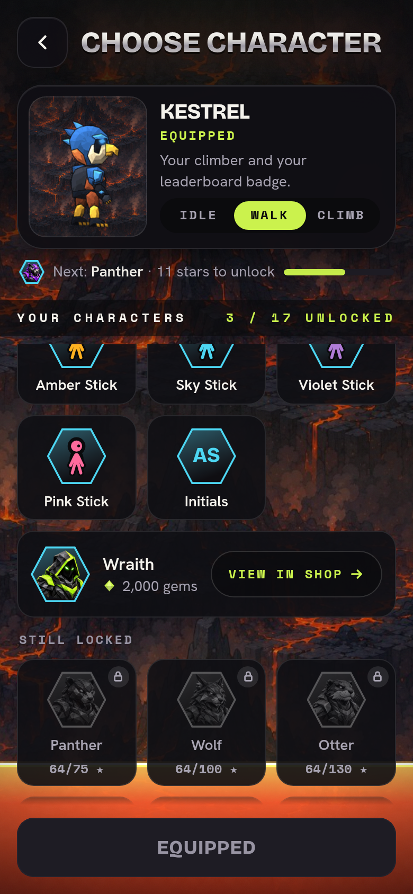

# 2.0 screens matched to the new mockups

Phone size (390x844 @2x), mocked API, branch `feature/mockup-screens`. Each
image is Before (the 2.0 gallery), Leeran's mockup, then After.

## Level start

## Level cleared with a star chest

## Out of lives

## Get Gems on iPhone

## Skin Details

## Choose Character

Scrolled down: the Wraith Shop row sits under your characters, then the locked ones.

