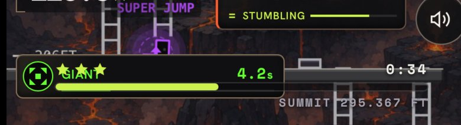
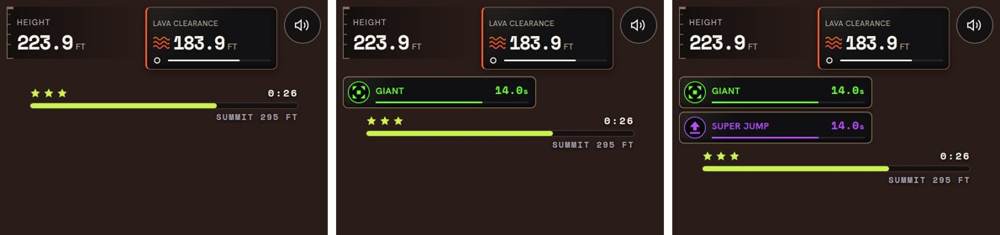

# Level result polish

Phone size (390x844 @2x), mocked API. "Before" for the stars and the unlock
line are Leeran's screenshots from the live 2.0 app.

## Stars on the level cleared card

The glow was a CSS drop-shadow on each star's svg, which WebKit clips to the
svg's box, so every new star sat in a square. It is now a round halo behind
the star.

| Before | After |
|--|--|
|  |  |

## A new character

Before, a plain pill. Now the character gets the full-screen reward reveal (the
one a purchase gets) once the stars land, one reveal per character, and the
card keeps a lime line naming them.

| Before | After: the reveal | After: the card |
|--|--|--|
|  |  |  |

## Fade above Save on Choose Character

The grid faded out over 18px just above Save, which read as a hard line across
the tiles over the lava. It now fades over 48px, and the grid's end padding is
never less than the fade, so the last row can still scroll fully into view.

| Before | After |
|--|--|
|  |  |

## Power-up timers over the goal bar

The goal bar sat at a fixed spot under the HUD, and an active power-up's timer
stacks into that same spot, so the stars landed on the timer. The bar now
measures the HUD and moves below it while timers are showing (none, one, two
below). The summit is also shown in whole feet (was "295.367").

