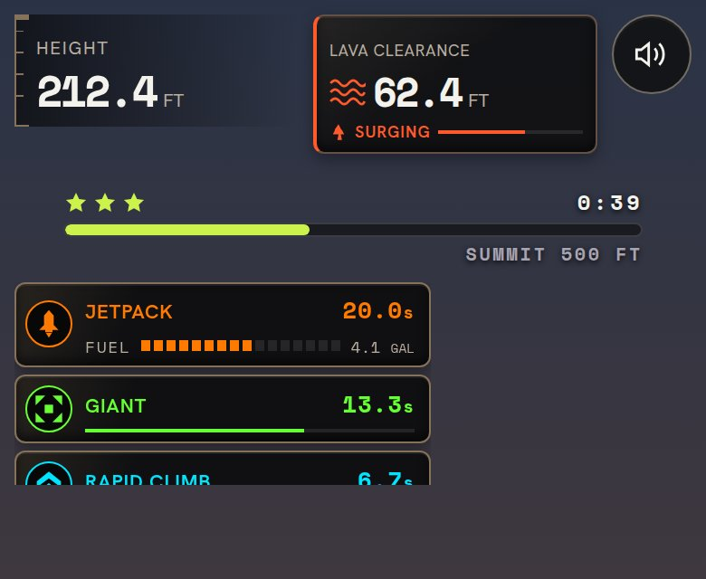
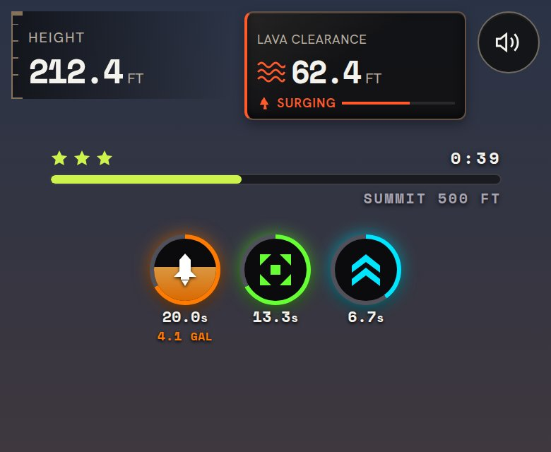
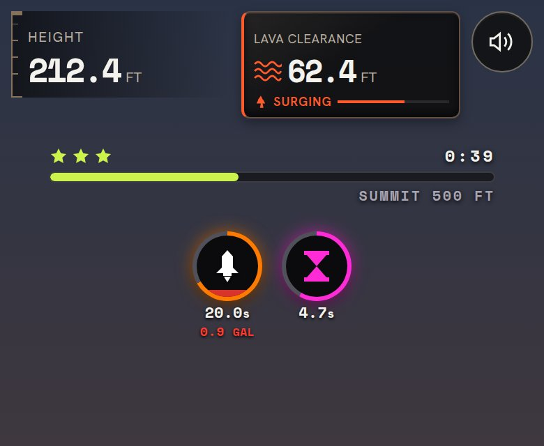
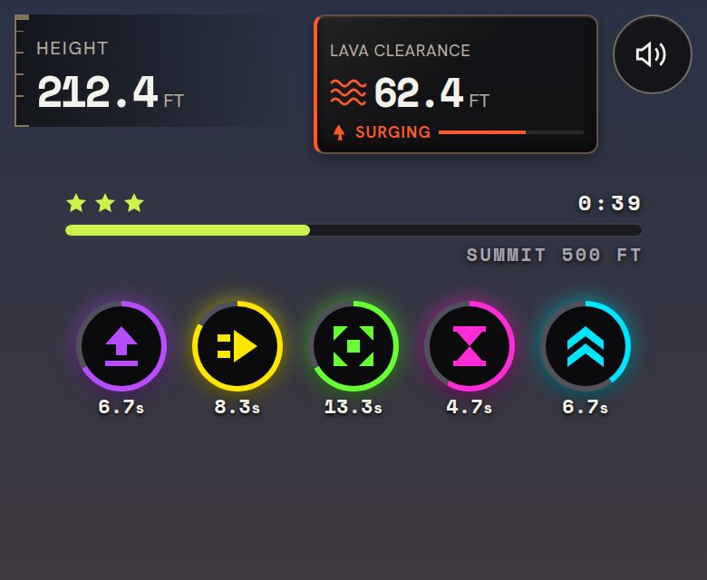
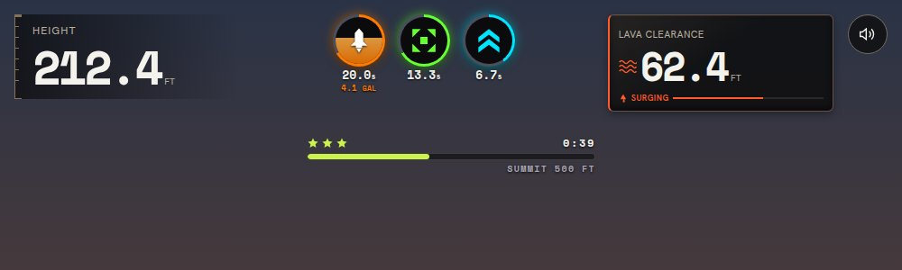

# Power-up icon chips

Active power-ups now show as round icon chips under the goal bar instead of stacked name cards. The ring around each chip drains with the time left. The Jetpack chip also fills its core with the fuel left and prints the gallons under the timer; below 20% fuel the tank and gallons turn red and blink.

| Before | After |
|---|---|
|  |  |

| Low fuel | Five powers at once | Wide screen |
|---|---|---|
|  |  |  |
