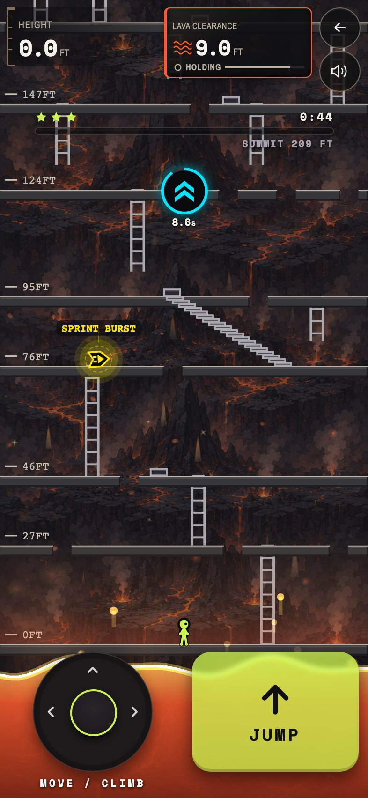
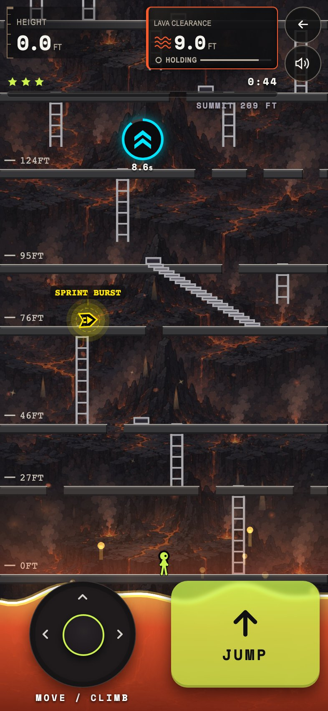

# Tighter climb HUD

Phone size (393x852 @2x), the real level run with a mocked API: level 12, three seconds after GO, Rapid Climb active.

The stars and progress bar sat 35px below the readouts, and the power-up chip floated another 18px below that, over the tower. Both now sit 8px under what is above them, and the bar lines up with the two readouts. Sizes, colours and order are unchanged.

| Before | After |
|--|--|
|  |  |

| | Before | After |
|--|--|--|
| Readouts to goal bar | 35px | 8px |
| Goal bar to chip | 18px | 8px |
| Bottom of the chip row | 243px from the top | 206px |

The "147FT" floor label that would sit under the stars is no longer drawn there.
