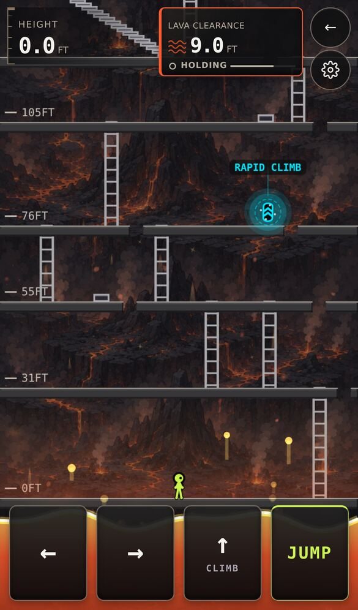
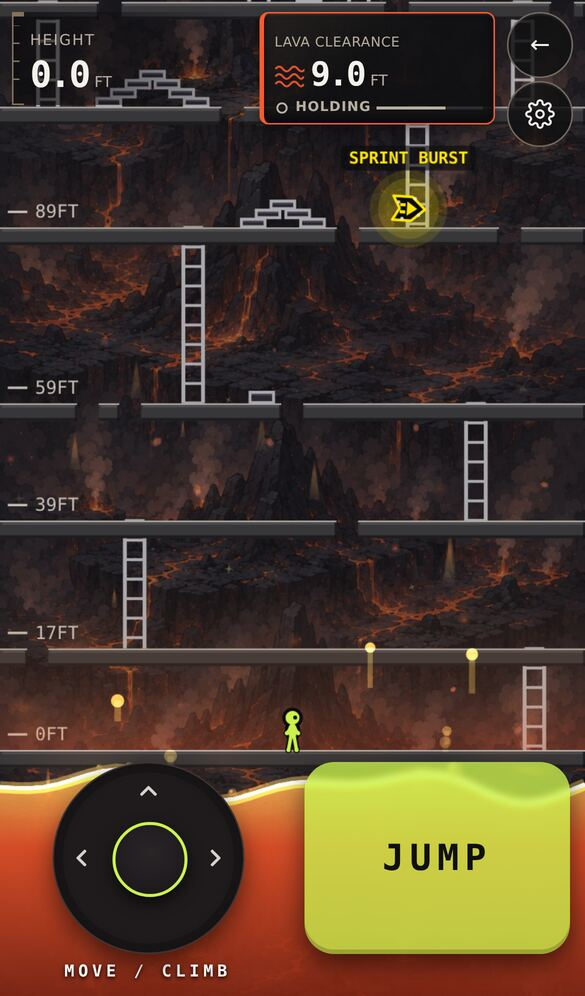
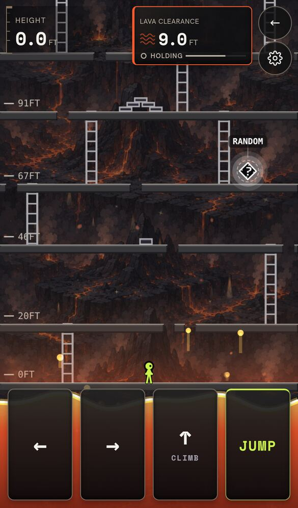
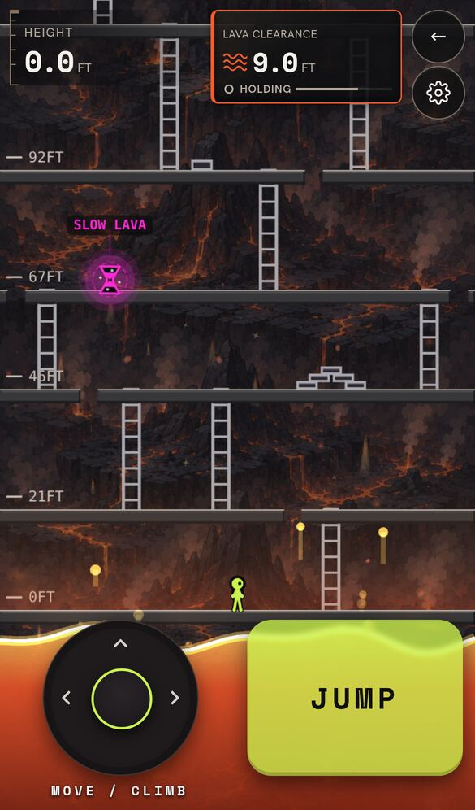

# Same game view in both control layouts

iPhone 13 size, mobile app, guest Endless climb. Before is `feature/app-flow` at c3121b9.

The button row was 104px tall and the joystick column 146px, so the camera kept a different clearance under each (122px vs 164px on screen) and the view jumped when switching. The button row is now as tall as the joystick column and both layouts share one clearance.

| Before: Buttons | Before: Joystick | After: Buttons | After: Joystick |
|--|--|--|--|
|  |  |  |  |
