# Controls: Buttons default, a pick in training, a settings cog

iPhone 13 size (390x844 @3x, saved at half size), the mobile app on Vite dev. Before is `feature/app-flow` at 7257fc4, after is PR #233. Endless runs a guest climb on a fresh device. Training signs in a stub account and uses the level API's local fallback.

## Endless climb on a fresh device

The default was the joystick, with an ↑ arrow on the jump pad and a mute button in the corner. Now the default is Buttons, jump reads "Jump", and the corner has a settings cog.

| Before | After |
|--|--|
| 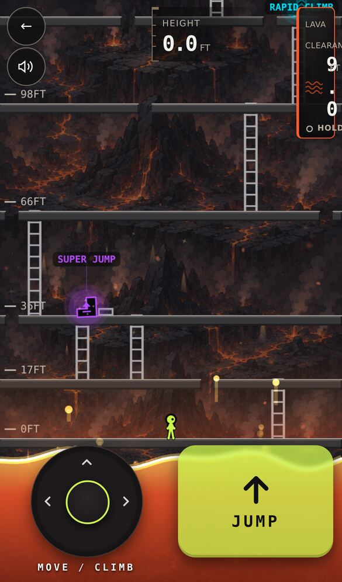 | 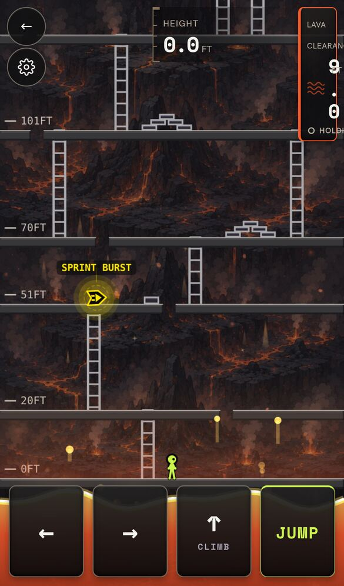 |

## The button layout's jump label

| Before | After |
|--|--|
| 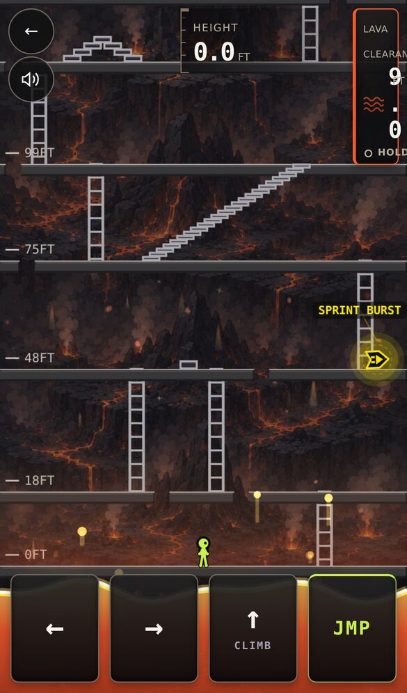 |  |

## The cog panel (new)

The panel has a Sound switch and, on touch devices, the layout picker. Picking Joystick swaps the controls immediately.

| Panel open | After picking Joystick |
|--|--|
| 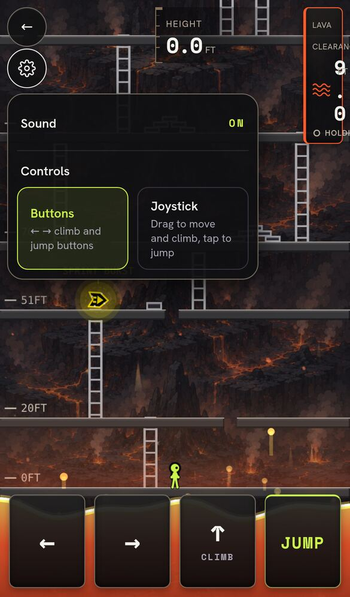 | 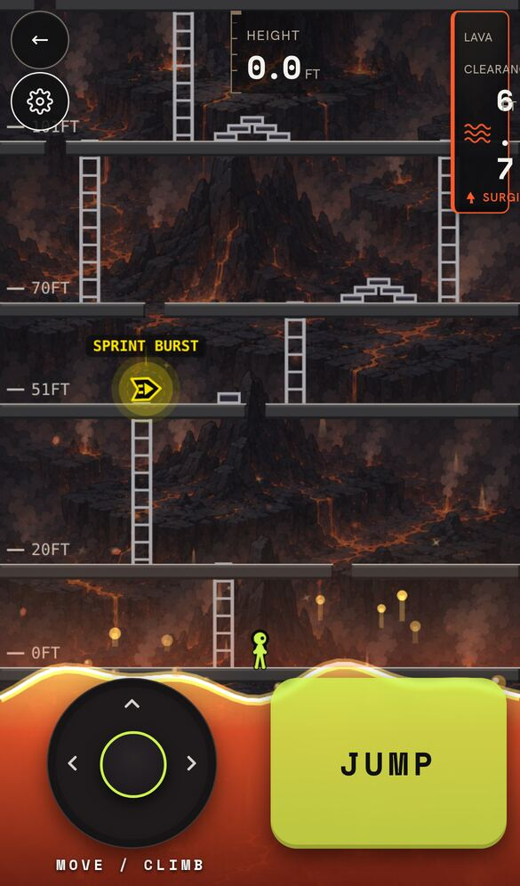 |

## Training

Before, the climb started on the joystick, and the copy mixed both layouts ("Hold ← or → (or push the stick)"). Now touch players pick a layout first, the copy matches the layout they picked, and a switch on the card lets them try the other one.

| Before | After: pick step (new) | After: first goal |
|--|--|--|
| 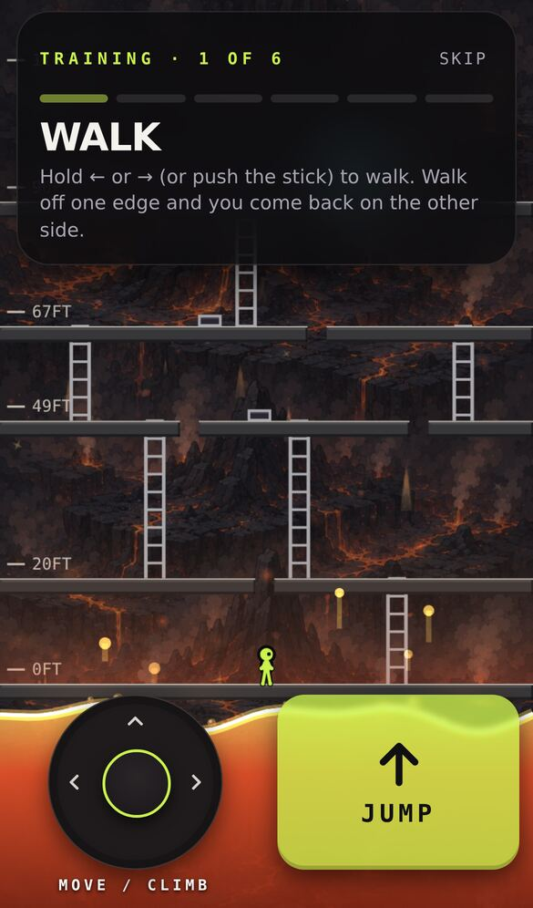 | 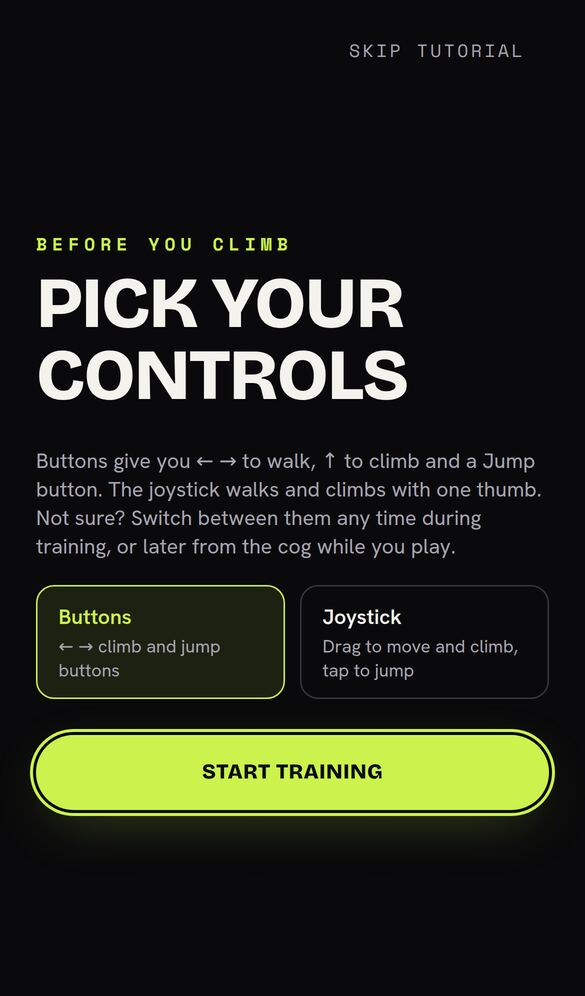 | 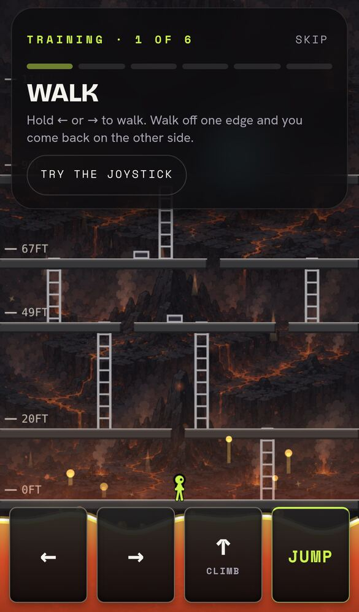 |

## Vibration switch in the cog

The mobile app's run screens add a Vibration switch, which uses the same saved haptics setting as Edit profile. The web game has no haptics, so it doesn't show the switch.

| Before | After | After: switched off |
|--|--|--|
|  | 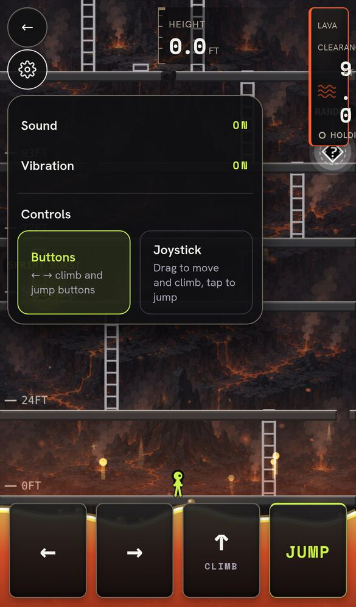 | 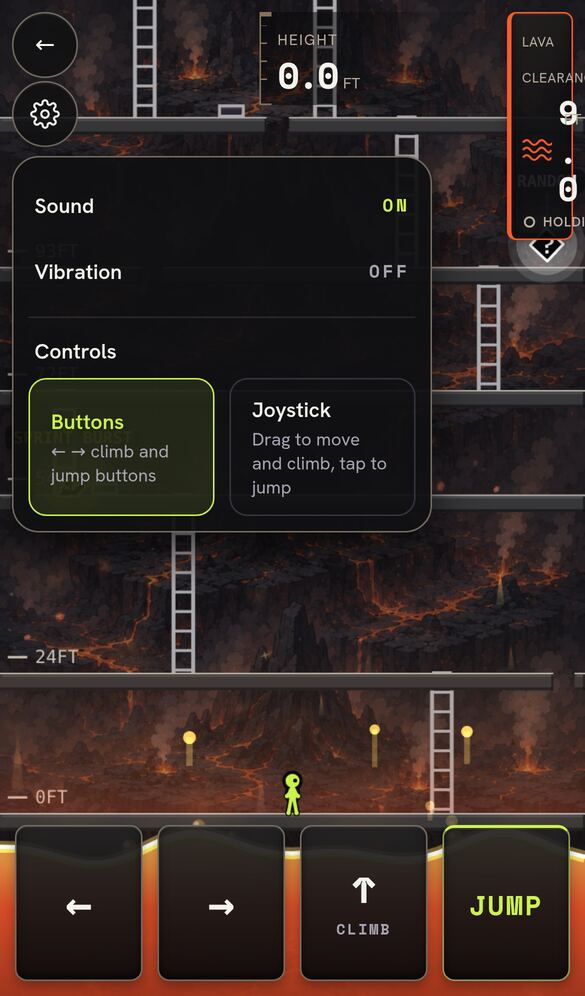 |

## Climb header on phones

In the Endless climb (no goal bar, no power-up active), the back and cog buttons took the first grid column and squeezed Lava Clearance into the narrow button column. Every item in the top row now has an explicit column. This is the same CSS as the HUD fix PR #230, ported here; it no-ops once the base carries it.

| Before | After | After: cog open |
|--|--|--|
| 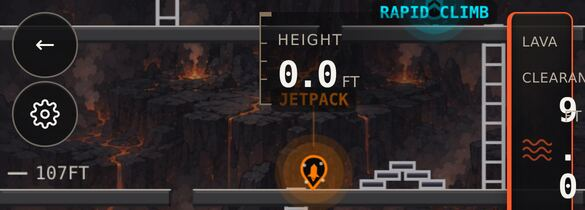 | 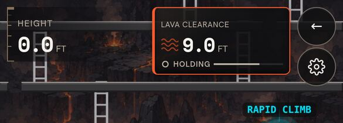 | 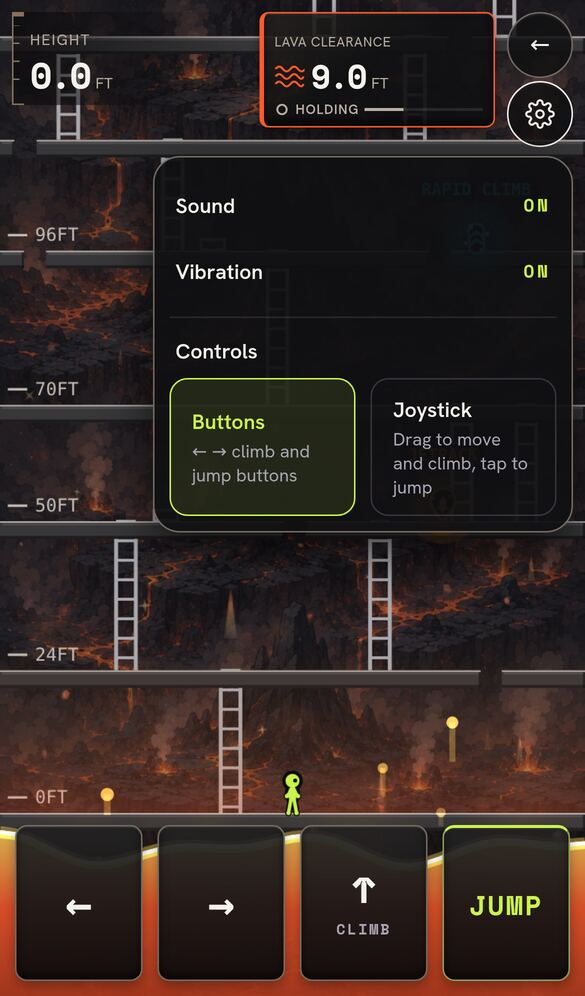 |
