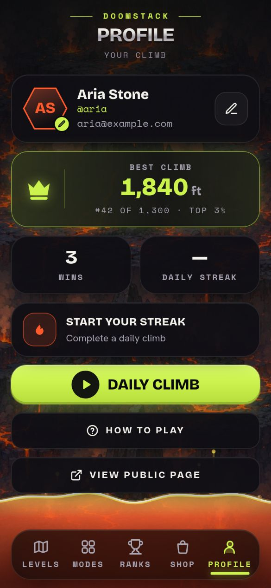
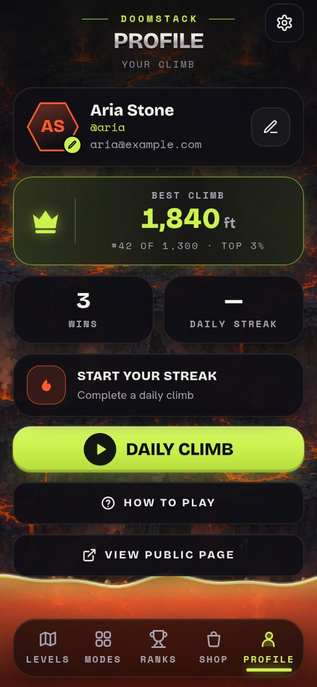
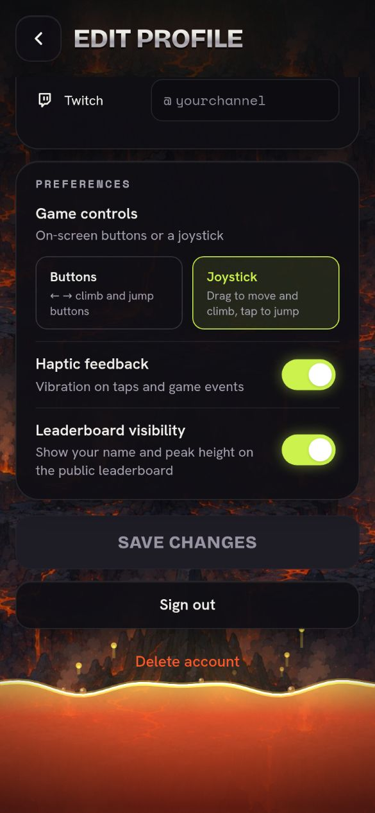
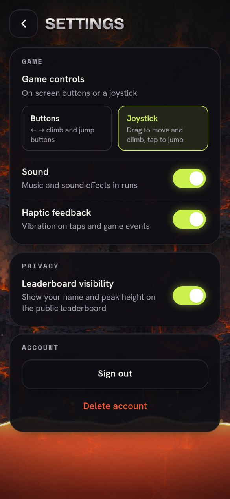
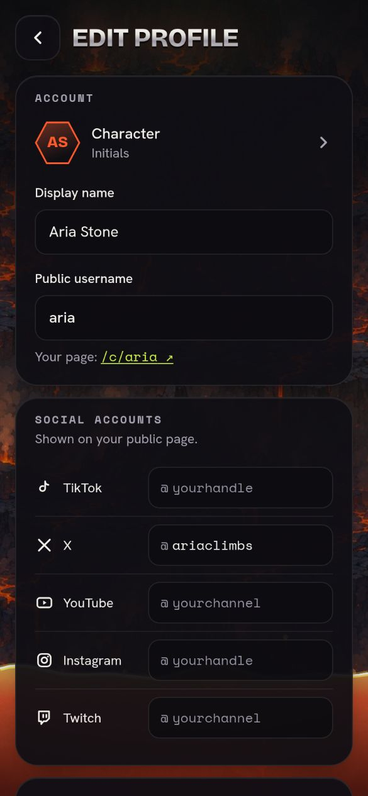
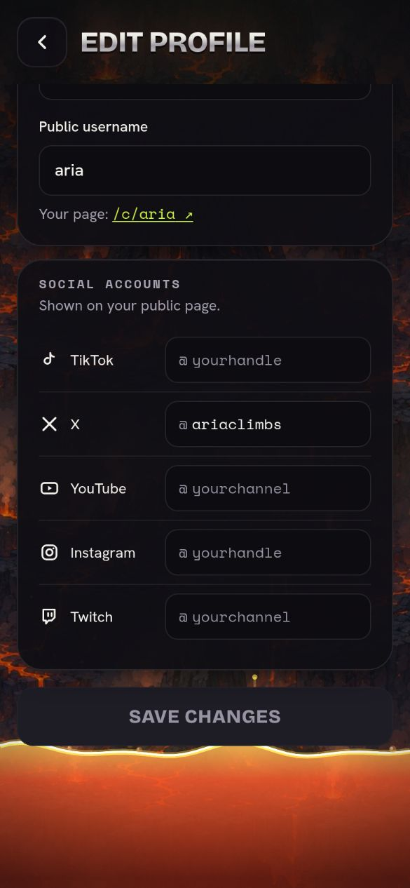

# Settings screen (PR #237)

Phone size (390x844), mocked API and a stubbed signed-in user. "Before" is
`feature/app-flow` at 7257fc4; "after" is this branch.

## Profile: a gear opens Settings

| Before | After |
|--|--|
|  |  |

## Settings vs. the old preferences on Edit Profile

| Before (bottom of Edit Profile) | After (Settings) |
|--|--|
|  |  |

## Edit Profile: identity and socials only

| Before | After |
|--|--|
|  |  |
