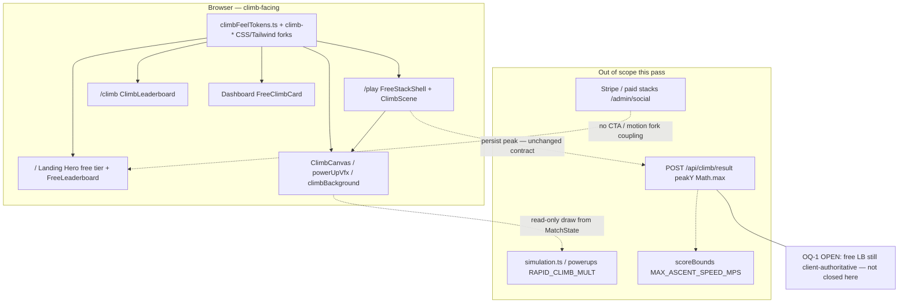

# Architecture: Climb Feel 1.2× (Identity Amplification Pass)

_Status: ready for design-ux token mapping · Goal iteration 1 · 2026-09-06_  
_Spec: `loop/spec.md` (18 ACs) · Prior handoff: `loop/handoffs/product-spec-2026-09-06T044130Z.json`_

## 1. Intent and boundaries

Amplify **presentation only** (~1.2×) on climb-facing surfaces. Simulation state, persist-path envelopes, anti-cheat numerics, paid checkout, and ASCENT token *identity* (hex palette / typefaces) stay frozen.

| Boundary | Rule for this pass |
| --- | --- |
| Trust (OQ-1) | **Open — deferred.** No server re-sim, no `climb/result` contract change, no cite of `scoreBounds` as closing free-leaderboard trust. |
| Physics (AC-15/16) | `RAPID_CLIMB_MULT`, `MAX_ASCENT_SPEED_MPS`, lava growth, archetype climb speeds — **untouched**. |
| Design system | No new hex colors or fonts. Magnitude forks of existing utilities only. |
| CTA | Net new primary filled climb CTAs on a surface: **0**. |

## 2. Stack confirmation

**Keep:** Next.js App Router (`app/`), React + Tailwind, existing Vitest suite, ASCENT tokens in `app/DESIGN.md` + `app/tailwind.config.ts` + `app/app/globals.css`.

**Not choosing:** New animation library, second design token set, CSS-in-JS, canvas framework rewrite, backend jobs for this pass.

## 3. OQ-3 decision (shared motion / atmosphere)

### Decision: **climb-scoped forks for motion; climb-scoped atmosphere overrides; leave shared ASCENT baselines**

| Token class | Strategy | Rationale |
| --- | --- | --- |
| `enter` keyframe + `.reveal` | **Fork** → `climbEnter` / `.climb-reveal` (or `[data-climb-chrome] .reveal` override that does **not** change global `.reveal`) | Blast radius includes **paid** surfaces: `Hero` paid pitch, `PostPaymentSetup`, `PendingBlockCard`, `CreatorProfile`, `AccountMenu`, `InlineTower`. Mutating shared `enter`/`reveal` fails R8 and risks R1. |
| `climb` keyframe / `animate-climb` | **Fork** → `climbPunch` / `animate-climbPunch` applied only on climb-facing nodes | Today used on Hero free-tier chips; forking keeps paid hero calm if class leaks and matches the climb namespace. |
| `groundRise` / `animate-groundRise` | **Fork** for climb chrome only | Shared with paid `GroundRow`, `BlockCard`, `RecordStats`. Do not shorten global 6s period on paid burial motifs. |
| `powerUpEnter` / `powerUpUrgent` | **Tune in place** (climb-only consumers: `PowerUpHud`) | No paid spillover. Stay within NFR-3 duration band. |
| `.grain` opacity / `.topo` alpha (AC-18) | **Climb-scoped CSS variable overrides** on `[data-climb-chrome]`; **do not** raise global `:root` baselines | Global `.grain` wraps `/`, settings, `AuthShell`; `.topo` wraps paid `TowerView` / auth / creator. Page-wide bump would amplify out-of-scope shells. Climb chrome sets `--grain-opacity` / `--topo-signal-alpha` into AC-18 bands. |
| Shared ASCENT colors / radii / shadows | **Unchanged identity**; optional ≤20% glow blur on climb cards only (NFR-4) | No new glow token names. |

**Recommendation to orchestrator:** Insert **design-ux** before implementer to name the fork classes, pick exact band points (e.g. grain `0.042`, topo `0.060`, type steps), and inventory CTA surfaces — architect has locked blast-radius policy above.

### Applied learnings

- Do **not** schedule server re-sim / climb result contract work (OQ-1 stays open).
- Prefer climb-scoped motion forks when shared enter/reveal would spill onto paid hero (OQ-3) — **accepted as required**.
- Physics freeze: import `RAPID_CLIMB_MULT` / `MAX_ASCENT_SPEED_MPS` in tests; never source-grep.

## 4. Mermaid — presentation data flow and trust boundaries



## 5. Data models / API contracts

**No schema, Prisma, Redis, or HTTP contract changes.**  
Existing `ClimberRank` / `peakY` persist path remains as today. Architect explicitly does **not** add re-sim fields, idempotency keys, or rate-limit changes for this goal.

Failure modes for external deps (unchanged):

| Dependency | Failure mode this pass |
| --- | --- |
| Postgres / `topFreeClimbers` | Keep `unavailable` vs empty split (AC-10); no new fallback that collapses them. |
| Firebase Auth | Untouched; guest play remains. |
| Stripe | Out of scope — do not restyle checkout CTAs as climb primary. |
| Upstash | Untouched. |

## 6. Presentation constants module (single source for AC math)

Add **`app/src/design/climbFeelTokens.ts`** (new; design-ux may refine names/values within bands):

| Export | Baseline | Target band | Consumers |
| --- | --- | --- | --- |
| `HUD_ALTITUDE_FONT_UI` | `13` | `15–16` | `ClimbCanvas` |
| `PICKUP_SHAKE_AMP_UI` | `2.2` | `2.53–2.75` | `powerUpVfx.pickupShakeOffset` |
| `CLIMB_ENTER_TRANSLATE_Y_PX` | `16` | `18–20` | Tailwind `climbEnter` |
| `CLIMB_ENTER_DURATION_S` | `0.7` | `0.56–0.61` (and ≥0.2) | Tailwind + `.climb-reveal` |
| `CLIMB_PUNCH_TRANSLATE_Y_PX` | `6` | `7–7.5` | Tailwind `climbPunch` |
| `CLIMB_PUNCH_DURATION_S` | `0.8` | `0.64–0.70` | Tailwind |
| `CLIMB_GRAIN_OPACITY` | `0.035` | `0.040–0.044` | `[data-climb-chrome]` CSS var |
| `CLIMB_TOPO_SIGNAL_ALPHA` | `0.05` | `0.055–0.065` | `[data-climb-chrome]` CSS var |
| `EMBER_MAX` | `88` | ≤ `105` (≤+20%) if ambience needs punch; else leave | `climbBackground` |

**ADR-1 (sync):** CSS custom properties under `[data-climb-chrome]` must match exported numbers; tests assert the **TS exports**. Comment in `globals.css` points at the module. Do not prove AC-18 by grepping CSS source.

**ADR-2 (physics freeze):** Any PR that edits numerics under `app/src/game/` for movement/lava/score envelopes fails AC-16; visual constants live only in presentation modules + `climbFeelTokens.ts`.

## 7. AC → file / constant impact map

| AC | Architectural need | Primary file(s) / constant | Test hook |
| --- | --- | --- | --- |
| **AC-1** | HUD altitude type ↑ ~1.2×; secondary lava text contrast | `ClimbCanvas.tsx` → `HUD_ALTITUDE_FONT_UI`; keep `TEXT_SECONDARY` for lava line | Import `HUD_ALTITUDE_FONT_UI`; assert ∈ [15,16]; assert lava fill ≠ `TEXT_MUTED` via exported HUD color constants or draw helper |
| **AC-2** | Shake amp ↑; reducedMotion → 0 | `powerUpVfx.ts` → `PICKUP_SHAKE_AMP_UI` | Extend `powerUpVfx.test.ts`: amp band at age 0; `{0,0}` when `reducedMotion` |
| **AC-3** | ≥2 atmosphere classes on play chrome; reduced-motion none | `FreeStackShell.tsx` (+ play children): add `data-climb-chrome`, ensure ≥2 of `.grain`/`.topo`/`.survey-grid`/`.ground-gradient`/`.altimeter`; `globals.css` reduced-motion block | Component render test or DOM contract test on FreeStackShell; CSS computed `animation: none` under matchMedia mock / existing globals contract |
| **AC-4** (−) | Sim peak identical | **No** `app/src/game/*` feel edits; reuse `simulation.test.ts` / powerups replay fixtures | Invoke existing seed+input log fixtures; assert `peakY` equality |
| **AC-5** | Free `/play` control: name contains `climb`, ≥44×44, not filled `bg-signal` | `LandingPage/Hero.tsx` free-tier link (today `"play →"` — fails name + target) | RTL/a11y: accessible name `/climb/i`, `min-h/min-w` ≥44, className excludes primary filled signal in hero CTA group |
| **AC-6** | FreeLeaderboard heading climb language + `.font-display`; empty copy + single `/play` | `LandingPage/FreeLeaderboard.tsx` | Render empty + non-empty; heading text; link count |
| **AC-7** (−) | No net +1 primary filled free-climb CTA on `/` | `Hero.tsx`, `FreeLeaderboard.tsx`, `Footer.tsx` (inventory only) | Inventory test: count `bg-signal` CTAs whose href is `/play` on landing composition ≤ baseline **0** (today free is secondary border; paid signup is signal) |
| **AC-8** | Title one DESIGN step up | `Climb/ClimbPanelIntro.tsx` (`text-2xl md:text-3xl` → e.g. `text-3xl md:text-4xl`); eyebrow stays mono+signal | Class/contract via exported title class string or RTL computed size band |
| **AC-9** | Rank numeral ~1.2×; mono tabular; signal border/shadow | `Dashboard/FreeClimbCard.tsx` | Class/size band; retain `shadow-signal` / signal border |
| **AC-10** | unavailable ≠ empty copy; climb language; contrast | `Climb/ClimbLeaderboard.tsx` (+ landing empty in FreeLeaderboard) | Branch tests for `unavailable` vs `length===0` |
| **AC-11** (−) | FreeClimbEmpty body not `text-muted`; 44×44 play | `FreeClimbCard.tsx` `FreeClimbEmpty` | Assert body uses secondary/primary token classes; control min 44 |
| **AC-12** | Reduced motion disables listed CSS + canvas ornamental | `globals.css`; wire-through `ClimbScene`/`ClimbCanvas`/`lava`/`powerUpVfx`/`climbBackground` | Existing reducedMotion unit tests + assert climb-fork classes included in reduced-motion block |
| **AC-13** | Contrast AA; no `#74707e` body on void/surface | Touched HUD/LB/dashboard copy sites | Prefer token-class assertions + known ratio table for ASCENT pairs (no contrast API required if tokens unchanged for body) |
| **AC-14** (−) | Preserve aria-live monotonic / ZWSP safeguard | `powerUpCues.ts`, `PowerUpHud.tsx`, `ClimbScene.tsx` | Import cue helper; assert repeated logical message still changes announced string |
| **AC-15** | Freeze RAPID_CLIMB_MULT + score envelopes | **Read-only** `powerups.ts`, `scoreBounds.ts` | **New** test imports exports; assert exact pre-pass numbers (record literals in test from today’s values) |
| **AC-16** (−) | No game-numeric diffs | PR review + verifier allowlist | Diff policy: presentation paths only; fail if movement multipliers change |
| **AC-17** | Motion intensity band via **climb forks** | `tailwind.config.ts` (`climbEnter`, `climbPunch`); `globals.css` (`.climb-reveal`); call sites on climb chrome only | Import duration/travel from `climbFeelTokens.ts` |
| **AC-18** | Grain/topo band on climb chrome | `globals.css` `[data-climb-chrome]` vars; wrappers on FreeStackShell, FreeLeaderboard, FreeClimbCard, Hero free band as needed | Import `CLIMB_GRAIN_OPACITY` / `CLIMB_TOPO_SIGNAL_ALPHA` |

### Impact map file count

**22 production/design files** in the touch set (including 1 new tokens module); **~8 test files** to extend/add. Unique production paths:

1. `app/src/design/climbFeelTokens.ts` *(new)*  
2. `app/src/components/Game/ClimbCanvas.tsx`  
3. `app/src/components/Game/powerUpVfx.ts`  
4. `app/src/components/Game/ClimbScene.tsx`  
5. `app/src/components/Game/climbBackground.ts` *(optional ember ≤+20%)*  
6. `app/src/components/Game/lava.ts` *(verify shimmer gate only)*  
7. `app/src/components/Game/PowerUpHud.tsx` *(optional urgent motion; preserve live region)*  
8. `app/src/components/Game/powerUpCues.ts` *(preserve AC-14)*  
9. `app/src/components/FreeStackShell.tsx`  
10. `app/src/components/Climb/ClimbPanelIntro.tsx`  
11. `app/src/components/Climb/ClimbLeaderboard.tsx`  
12. `app/src/components/Dashboard/FreeClimbCard.tsx`  
13. `app/src/components/LandingPage/Hero.tsx`  
14. `app/src/components/LandingPage/FreeLeaderboard.tsx`  
15. `app/src/components/LandingPage/Footer.tsx` *(microcopy/link inventory; no new primary CTA)*  
16. `app/src/components/Dashboard/ClimbReplaysSection.tsx` *(climb language check only if already pitching)*  
17. `app/app/globals.css`  
18. `app/tailwind.config.ts`  
19. `app/app/play/page.tsx` *(shell title/chrome only if needed)*  
20. `app/app/climb/page.tsx`  
21. `app/app/page.tsx` *(only if `data-climb-chrome` placement needs landing root — prefer section-scoped)*  
22. `app/DESIGN.md` *(documentation of climb fork names only if design-ux adds a short ASCENT subsection — optional)*  

**Frozen (explicit non-touch for numerics):** `app/src/game/powerups.ts`, `app/src/game/scoreBounds.ts`, `app/src/game/simulation.ts`, `app/src/game/antiCheat.ts`, `app/app/api/climb/result/route.ts`, Stripe/checkout, `/admin/social/*`.

## 8. Folder tree (ownership)

```
app/
  src/
    design/
      climbFeelTokens.ts          # design-ux + implementer; verifier imports
    components/
      FreeStackShell.tsx          # frontend — climb chrome host
      Climb/                      # frontend — LB + intro
      Dashboard/FreeClimbCard.tsx # frontend
      LandingPage/Hero|FreeLeaderboard|Footer.tsx
      Game/                       # frontend — canvas/VFX only
    game/                         # backend/game — DO NOT change feel numerics
  app/globals.css                 # design-ux + implementer — climb forks
  tailwind.config.ts              # design-ux + implementer
  tests/game|components/          # verifier + implementer
```

Specialist ownership: **design-ux** (token map, fork names, type steps) → **implementer/frontend** (wire classes, canvas constants) → **verifier** (import-based AC tests). No backend/data specialist required.

## 9. Non-goals

- Physics “feels faster” via `RAPID_CLIMB_MULT`, tick rate, gravity, lava speed, jetpack thrust/fuel.
- Anti-cheat threshold retune; server re-simulation of free peaks (OQ-1).
- Paid checkout, altitude purchase, `/stack/*` paid LB redesign, admin social.
- New primary CTAs / second “Play the climb” on a surface that already has one.
- New mandatory audio; full rebrand; category rainbow / paid tower accents.
- Resolving OQ-2 (power-up one-slot vs stacking) or unscoped `/api/tower` contract.

## 10. Failure modes and risk mitigations (shared CSS blast radius)

| Risk | Mitigation |
| --- | --- |
| R8 Shared `enter`/`reveal` punch paid hero | **OQ-3 forks**; grep call sites before edit; paid keeps baseline `.reveal` |
| R1 Free climb steals paid primary | AC-5/7: free control stays secondary border; paid `Enter the arena` sole filled signal in hero CTA group |
| R3 Implementer edits RAPID_CLIMB_MULT | AC-15/16 + frozen paths list; verifier import lock |
| R4 Shake under reduced motion | AC-2 unit; canvas props stay wired |
| R5 Duplicate CTAs | Inventory before edit; Footer stays plain nav links |
| Global grain/topo louder on Auth/Tower | Climb-scoped CSS vars only |
| 10× traffic / perf | No per-tick React state; ember ≤+20%; no unguarded canvas resize (NFR-6) |
| Mobile HUD overflow | Keep `ui = max(1, width/BASE_WIDTH)` floor (R7) |

## 11. Security / a11y / PII

- **Authn/authz:** unchanged; middleware remains presence-only.
- **PII:** leaderboards continue to show handles only (existing).
- **Secrets:** none introduced; no new env vars.
- **A11y:** WCAG AA; `prefers-reduced-motion`; 44×44; preserve PowerUp live-region monotonic marker (`ZERO_WIDTH_SPACE` / announceCount).

## 12. Hot paths / cache

- Climb rAF draw path: constants only — no new React publishes per tick.
- Landing ISR / `topFreeClimbers`: unchanged cache keys.
- No Redis key changes.

## 13. ADRs

### ADR-1 — Climb-scoped motion/atmosphere forks (closes OQ-3 for this pass)

**Context:** Shared `enter`/`reveal`/`groundRise`/`grain`/`topo` are used on paid and auth surfaces.  
**Decision:** Amplify via climb-named keyframes/classes and `[data-climb-chrome]` variable overrides.  
**Consequences:** Slightly more CSS surface; paid stays at ASCENT baseline intensity; design-ux must map class names once.

### ADR-2 — Presentation tokens module over source-grep proofs

**Context:** Kernel gate forbids source-text AC proofs.  
**Decision:** Export tunables from `climbFeelTokens.ts`; tests import them. CSS mirrors via documented custom properties.  
**Consequences:** Dual write TS↔CSS must stay in sync (comment + design-ux checklist).

### ADR-3 — OQ-1 remains open

**Context:** Free leaderboard is reputation-adjacent beside paid stacks; re-sim path missing.  
**Decision:** Feel pass does not accept or deny; no architecture work on `climb/result`.  
**Consequences:** Trust gap documented for a future goal.

### ADR-4 — design-ux insert before implementer

**Context:** Amplification spans CSS motion tokens, type scale steps, and canvas constants; DESIGN.md exists but fork naming is novel.  
**Decision:** `nextStage = design-ux` for token mapping; then implementer.  
**Consequences:** One optional stage; reduces wrong global token edits.

## 14. Test plan hooks (verifier)

| Suite focus | Mechanism |
| --- | --- |
| Physics freeze | `import { RAPID_CLIMB_MULT } from '.../powerups'`; `import { MAX_ASCENT_SPEED_MPS } from '.../scoreBounds'`; exact equality to recorded baselines |
| Shake / HUD | Import `pickupShakeOffset`, `PICKUP_SHAKE_AMP_UI`, `HUD_ALTITUDE_FONT_UI` |
| Sim identity | Existing seed+input log tests — must still pass unchanged |
| Motion tokens | Import climb feel duration/travel exports; assert band + floor 200ms |
| Atmosphere | Import grain/topo exports ∈ AC-18; optional DOM assert `data-climb-chrome` present on FreeStackShell |
| CTA / a11y | Component tests on Hero free control + FreeClimbEmpty |
| Live region | Import cue pipeline; repeat announcement still differs |
| **Reject** | Any test whose only assertion is `readFileSync` + `toContain` on source |

Coverage floor: **18 ACs** mapped above; negative ACs 4, 7, 11, 14, 16 required.

## 15. design-ux handoff checklist

1. Confirm fork class names (`climb-reveal`, `animate-climbEnter`, `animate-climbPunch`, `data-climb-chrome`).  
2. Pick exact values inside each AC band (not just band endpoints).  
3. Map DESIGN.md type steps for AC-8/AC-9.  
4. CTA inventory on `/` (baseline primary filled `/play` count = 0).  
5. Do not propose RAPID_CLIMB_MULT or scoreBounds changes.  
6. Return token table → implementer.

## 16. Open questions (status after architecture)

| ID | Status |
| --- | --- |
| OQ-1 | **Open** (deferred) |
| OQ-2 | Out of scope |
| OQ-3 | **Decided:** climb-scoped forks (ADR-1) |
| OQ-4 | Unchanged — free climb secondary only |
