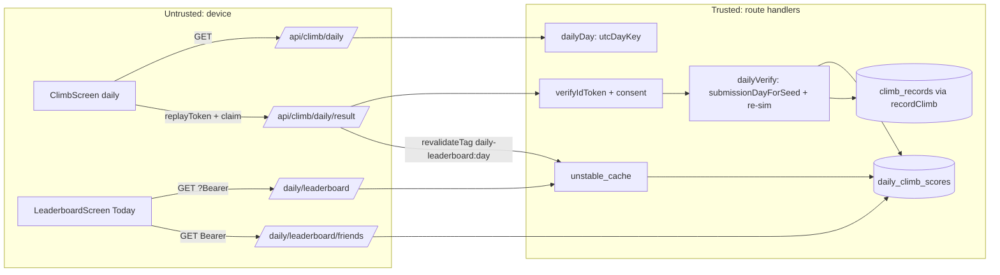

# Architecture: Daily Climb leaderboard (mobile)

**Spec:** `loop/spec-daily-leaderboard.md` (AC-1…AC-13) · **Stack:** existing
Next.js route handlers + Prisma/Postgres + Upstash rate limit + Capacitor SPA.
No new dependencies, ORM, HTTP client or test runner. **Not chosen:** a Redis
sorted-set board (it would add a second source of truth and consent filtering
would be hard), or client-supplied scores with bounds (that is the trust
boundary this change removes).

## Data flow

The trust boundary sits at `R`. The only height persisted is `V`'s
re-simulated peak. The day comes from the server clock.

## Model

`DailyClimbScore` → `daily_climb_scores`: `id` cuid, `userId` FK users
(Cascade), `day` text (UTC key), `peak_y` float (server), `ticks` int,
`replay_token` text?, `sim_version` int default 1, `attempts` int default 1,
`created_at`, `updated_at` (when the best was set; the tie-break).
Unique `(userId, day)`. Index `daily_climb_board_idx (day, peak_y DESC,
updated_at)`. Both are declared in schema.prisma. The migration only creates a
new empty table. Down: `DROP TABLE`.

## API

| Method | Path | Auth | Rate limit | Response |
|---|---|---|---|---|
| GET | /api/climb/daily | none | none (no DB) | `{day, seed, resetsAt}`, no-store; 503 `DAILY_UNAVAILABLE` without `DAILY_SEED_SECRET` |
| POST | /api/climb/daily/result | Bearer (soft) | IP `climb` (shared with /result) 60/min; user `climb:daily:<uid>:<day>` 20/5 min | see spec AC-1…6 |
| GET | /api/climb/daily/leaderboard?day= | optional Bearer (`me`) | IP `leaderboard:daily` 120/min | `{day, resetsAt, totalClimbers, climbers, me}` |
| GET | /api/climb/daily/leaderboard/friends?day= | Bearer (401) | uid `leaderboard:friends:daily` 60/min | `{day, resetsAt, climbers, hiddenCount, notClimbedCount}` |

The 4xx shape is `{error, code}`. POST is not idempotent by design:
`attempts` counts submissions, and a replayed request cannot lower the best.

POST order: IP limit → 503 without the seed secret → auth → envelope parse
(no inflate) → day from the HMAC seed (`DAY_CLOSED`) → per-user limit →
`simVersion` (409 `SIM_VERSION_MISMATCH`) → output-capped inflate
(`INVALID_REPLAY`) → consent → re-sim (`REPLAY_MISMATCH`) → claim the
canonical input hash in `daily_climb_replays` (409 `REPLAY_REUSED` when
another account holds it) → upsert.

`daily_climb_replays`: `id`, `day`, `input_hash` (SHA-256 of the re-packed
inputs up to the tick the run ended), `userId` (FK, cascade), `created_at`.
Unique `(day, input_hash)`, index `(userId)`, both declared in
schema.prisma. One row per distinct verified run, not only the best, so an
earlier run cannot be copied once its owner beats it.

## Write path (race-safe)

A single `INSERT … ON CONFLICT ("userId", day) DO UPDATE` sets `peak_y =
GREATEST`, `attempts + 1`, and moves ticks, replay, sim_version and updated_at
only when the new run is better. `improved` comes from a statement-start CTE
(cosmetic under a same-user race; the stored best is exact).

## Cache

`topDailyClimbers(day)` = `unstable_cache(key ["topDailyClimbers", day],
30 s, tags [daily-leaderboard:<day>, LEADERBOARD_CACHE_TAG])`. The save
expires the day tag immediately. Consent, name and avatar changes and account
deletion already expire `LEADERBOARD_CACHE_TAG`, so they reach daily boards
too. Cardinality is at most 8 live keys, because the route rejects other days.

## Folder ownership

- `src/lib/dailyDay.ts`: day arithmetic, ES2020-safe, shared by server, web
  and mobile.
- `src/lib/dailyBoardDay.ts`: `?day=` resolver.
- `src/lib/climbRateLimit.ts`: shared limiters.
- `src/lib/dailySeedServer.ts` (server-only, node:crypto): HMAC seed,
  `submissionDayForSeed`, fail closed without the secret.
- `src/game/simVersion.ts`: `DAILY_SIM_VERSION`, shared with clients.
- `src/game/runReplay.ts` / `runReplayServer.ts`: envelope parse without
  inflate; output-capped inflate (browser stream cap, zlib `maxOutputLength`).
- `src/game/dailyVerify.ts`: re-sim verdict and canonical input hash.
- `src/db/dailyClimb.ts`: persistence and reads. `src/db/climb.ts`:
  `friendCircle` extracted.
- `app/api/climb/daily/**`: the routes.
- `mobile/src/lib/dailyBoard.ts`: parsers and fetches.
  `mobile/src/hooks/useUtcDay.ts`: the clock.
  `AppDataContext`: day-keyed slices.

## Failure modes

- **Redis down:** limiters fail open (same as /result).
- **DB down:** POST returns 500 `persist_error` and the client shows "couldn't
  reach" with retry; GET returns 500 and the client shows RetryPanel.
- **Firebase verify fails:** POST returns 200 `invalid_token`; GET board omits
  `me`.
- **Server unreachable at run start:** the daily cannot start (the seed is
  server-only). Mobile and web show an offline state with Try again and
  "Play endless instead".
- **DAILY_SEED_SECRET missing or short:** both seed routes return 503
  `DAILY_UNAVAILABLE`. There is no fallback seed.

## ADRs

1. **UTC day, server-derived.** One board per day for everyone, and the server
   never trusts the client's clock or timezone. Cost: the reset moves off local
   midnight.
2. **Day from seed, not from the body.** `submissionDayForSeed` accepts
   today's seed, or yesterday's within 10 min. There is no client day field to
   validate.
3. **Consent checked before re-sim.** Anonymous or unconsented calls cost no
   CPU.
4. **The daily route also calls recordClimb.** One POST per daily run, and the
   all-time record gets the verified height.
5. **The all-time retro-save (sessionStorage) always uses /api/climb/result.**
   The stash may be past its day's grace window.

## Hot paths and N+1

Board read: one findMany plus one count on the index. `me`: one findUnique
plus one count. Friends: `friendCircle` (2 queries) plus one findMany. No
loops of queries.
