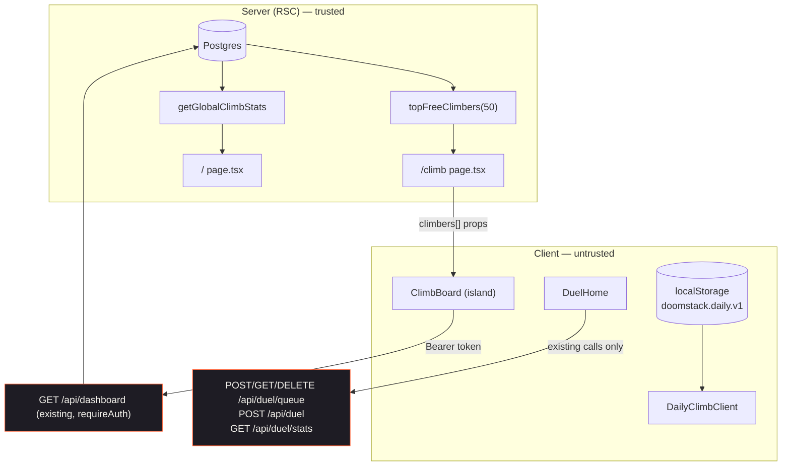

# Architecture: Doomstack layout pass

**Goal ID:** doomstack-layout-pass
**Spec:** `loop/spec-doomstack-layout.md`
**Date:** 2026-09-20

This is a presentation-layer change. No service, schema, or contract changes.
What follows is the composition contract the code phase implemented.

## Stack confirmation

Unchanged, per `context/profile.json`: Next.js App Router in `app/`, React +
Tailwind v4 (CSS-first `@theme` in `app/globals.css`), Prisma/Postgres behind
`src/db/*`, Firebase auth via `useAuth()` + `authedFetch`, `pnpm` in `app/`.

**Not chosen:** no CSS-in-JS, no headless-UI/tab library (the repo's segmented
controls are `aria-pressed` buttons, not `role="tab"` widgets — see
`DuelHome`'s existing comment), no new icon package (inline SVG only), no new
state library.

## AC → architectural need

| AC | Need | Where it lands |
|----|------|----------------|
| AC-1..AC-3 | Static composition | `Hero.tsx`, new `ChooseYourClimb.tsx`, `app/page.tsx` order |
| AC-4 | CTA inventory invariant | `DuelPromo.tsx` primary downgraded to a link |
| AC-6..AC-8 | Segmented tier state | `DuelHome` local `tier` state (replaces 4-way `mode`) |
| AC-9 | 1 Hz derived clock | `useElapsedSeconds` local hook in `DuelHome` |
| AC-10 | Untrusted string → id | pure `parseDuelInvite` in `src/lib/duelInvite.ts` |
| AC-13..AC-19 | Viewer identity on a server page | client island `ClimbBoard` + existing `GET /api/dashboard` |
| AC-21..AC-26 | Local history | pure `computeWeekDays` in `src/lib/daily.ts` |

## Data flow



Trust boundary (ember edges): every arrow crossing into a route handler keeps
its existing `requireAuth` + rate limiting. Nothing in this change derives a
write from a new client value. `localStorage` is already treated as untrusted
by `daily.ts`'s `read()` coercion; `computeWeekDays` consumes the coerced
shape only.

## Data models

No Prisma change. Two presentation types are added:

```ts
// src/lib/daily.ts
export interface DailyWeekDay {
  key: string;        // "YYYY-MM-DD", local calendar day
  label: string;      // "S" | "M" | "T" | "W" | "T" | "F" | "S"
  weekday: string;    // "Sunday" … — for aria-label, never truncated
  played: boolean;    // best[key] exists OR lastPlayedKey === key
  isToday: boolean;   // exactly one true per returned array
  isFuture: boolean;  // later this week — rendered inert, never "missed"
}
```

`computeWeekDays(best, lastPlayedKey, now)` is pure and total: 7 entries,
Sunday→Saturday, for the week containing `now`. Days outside the store's
14-day retention simply read `played: false` — the function never throws and
never writes.

```ts
// src/lib/duelInvite.ts
export function parseDuelInvite(raw: string): string | null;
```

Allow-list parser, per `.claude/rules/security.md`: returns `null` rather than
substituting a default. Accepts a bare id matching `^[A-Za-z0-9_-]{6,64}$`
(the `nanoid()` alphabet used by `POST /api/duel`), or an absolute/relative URL
whose path is exactly `/duel/<id>`. Any other scheme, host-relative trickery,
extra path segments, query-only input, or non-matching id → `null`. The caller
navigates with `router.push('/duel/' + id)` built from the **parsed id**, never
from the raw input, so no open redirect is reachable.

## API contracts

Unchanged. Consumed as-is:

| Method | Path | Auth | Used by | New? |
|--------|------|------|---------|------|
| GET | `/api/dashboard` | Bearer (requireAuth) | `ClimbBoard` viewer panel | new **call site**, existing route |
| GET | `/api/duel/stats` | Bearer | `DuelHome` record strip | existing |
| POST/GET/DELETE | `/api/duel/queue` | Bearer | `DuelHome` quick match | existing |
| POST | `/api/duel` | Bearer | `DuelHome` invite link | existing |

`ClimbBoard` reads only `freeClimb` from the `/api/dashboard` payload and
tolerates `null`/absent fields. Non-200 (including 401) → CTA-only fallback;
no redirect, because `/climb` is a public page.

## Folder tree

```
app/
  app/
    page.tsx                     # hub: section order
    climb/page.tsx               # passes climbers[] into ClimbBoard
    daily/page.tsx               # About prose de-duplicated
  src/
    components/
      LandingPage/
        Hero.tsx                 # sub-line; sign-in line moved out
        ChooseYourClimb.tsx      # NEW — 3 mode cards + sign-in line
        DuelPromo.tsx            # CTA downgraded to plain link
      Duel/
        DuelHome.tsx             # tier pills + 2-col cards + status bar
      Climb/
        ClimbBoard.tsx           # NEW — client island: filter + panel
        ClimbLeaderboard.tsx     # + highlightUserId / bar column
        ClimbPanelIntro.tsx      # CTA moved to the viewer panel
      Game/
        DailyClimbClient.tsx     # header strip, result panel, week strip
    lib/
      daily.ts                   # + computeWeekDays / dailyWeek
      duelInvite.ts              # NEW — pure parser
```

Ownership: all of it is software-engineer; `ClimbBoard`'s fetch path is the
only piece the security-reviewer needs to look at, and it is read-only.

## Failure modes

| Dependency | Failure | Behaviour |
|-----------|---------|-----------|
| `topFreeClimbers` (RSC) | throws | already caught in `app/climb/page.tsx` → `unavailable` ember panel (AC-20) |
| `getGlobalClimbStats` (RSC) | throws | already caught → `—` in the stat strip; cards unaffected |
| `GET /api/dashboard` | non-200 / network | viewer panel renders CTA-only; no error toast, table unaffected |
| `useAuth()` token | absent / still loading | panel renders the signed-out prompt; no fetch is issued |
| `localStorage` | unavailable / poisoned | `read()` already coerces; week strip renders 7 unplayed days |
| queue poll | network blip | unchanged: next tick recovers; elapsed timer keeps running |

## ADRs

**ADR-1 — The daily result is composed at page level, not in `ClimbScene`.**
`ClimbScene`'s result overlay is shared by `/play`, `/daily` and replay
playback. Mockup 3's result composition is therefore built in
`DailyClimbClient` below the stage, driven by the `onFinish` → `commitDailyRun`
result that already flows there. Consequence: share / replay controls stay in
the overlay and are deliberately **not** repeated in the page panel (AC-24).

**ADR-2 — `/climb`'s viewer panel is a client island over the existing
dashboard endpoint.** The page is an RSC and Firebase identity is client-only.
The alternatives were a new `/api/climb/me` route (out of scope) or shipping
nothing. Reusing `GET /api/dashboard` costs one over-fetch (replays + duel
stats come along) for zero new surface area. Revisit if a leaner endpoint
appears.

**ADR-3 — Tier pills replace the 4-way mode list on `/duel`.** The mockup's
information architecture is *tier* (Free / Ranked / Tournaments) × *entry*
(Quick Match / Challenge). The shipped code conflated both into one 4-item
menu, so Quick Match and Challenge were mutually exclusive. Splitting them
shows both free entries at once without changing a single request.

**ADR-4 — One filled CTA per destination per page wins over mockup fidelity.**
`app/DESIGN.md` is explicit. The hub gains three mode cards, so `DuelPromo`'s
filled "Start a duel" becomes a plain link and `/climb`'s single "Play the
climb" primary moves from the page header into the viewer panel (its canonical
home in the new composition) instead of being duplicated.

**ADR-5 — The duel record strip carries no leaderboard link.** Mockup 1 puts
"View duel leaderboard →" in the record strip, but `/duel`'s tab band already
links `/duel/leaderboard` on the same screen. Per `app/DESIGN.md` the existing
pointer is kept and the second one is dropped.

## Security boundaries

- Nothing here authenticates or authorizes. `requireAuth` stays server-side in
  the untouched route handlers.
- `parseDuelInvite` is an allow-list parser that returns `null` on rejection
  and is the only place raw user text becomes a route. Navigation is built
  from the parsed id, so a pasted `javascript:` or cross-origin URL cannot
  produce a navigation.
- No PII added to the DOM: the board keeps rendering `handle` pseudonyms from
  `climberDisplay()`; the viewer panel shows only the viewer's own values.
- No secret names, env vars, or outbound URLs introduced.

## Performance

- Hot path is `/` (ISR 60 s): the mode cards are static server markup, zero
  added JS.
- `/climb` search filters a ≤50-element array in render — no memo needed and
  none added (per `.claude/rules/architecture.md`, do not swap an O(1) form
  for a scan; this was never a closed form).
- No cache keys added, so no eviction question arises.
- The 1 Hz elapsed timer is a single `setInterval` cleared on unmount and on
  every terminal state; the existing 2 s queue poll is untouched.
