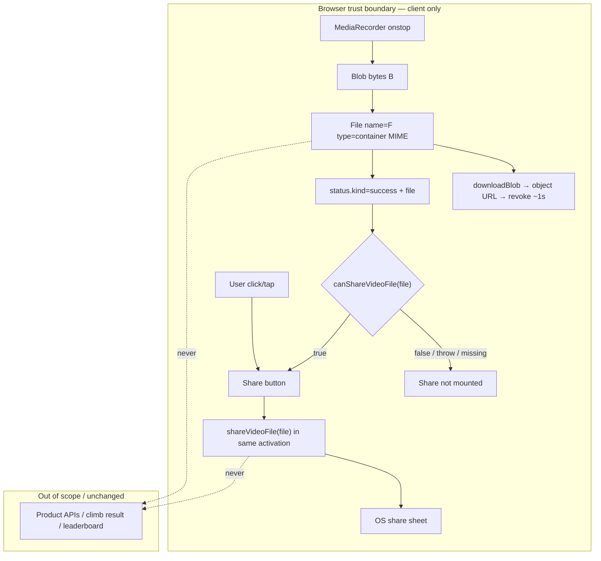

# Architecture delta: Native share of exported climb video

**Goal ID:** replay-native-video-share  
**Spec:** `loop/spec-native-share.md` (AC-NS-1…AC-NS-10)  
**Parent architecture:** `loop/architecture.md` (replay-transport-export)  
**Research:** `loop/research-native-video-share.md`  
**Stack:** existing Next.js App Router + React in `app/` — **no new runtime dependencies**, **no new server APIs**.  
**Date:** 2026-09-06  
**Design system:** ASCENT (`app/DESIGN.md`) — design-ux stage **not** required.

This document is a **scoped delta**. Parent transport/export contracts remain unless explicitly amended below.

---

## 1. AC → architectural need

| ACs | Need |
| --- | --- |
| AC-NS-1, AC-NS-3, AC-NS-8 | Gate Share on `canShare({ files })` with MIME-honest `File`; hide when unsupported / not success / live play |
| AC-NS-2, AC-NS-9, NFR-NS-3 | ASCENT Share control ≥44×44; `aria-live` with monotonic suffix on fulfilled share |
| AC-NS-4, NFR-NS-1, NFR-NS-2 | Fresh user activation only — Share `onClick` → `navigator.share`; never from `recorder.onstop` |
| AC-NS-5, AC-NS-6 | Classify share rejection: `AbortError` = quiet non-error; other errors → dismissible message |
| AC-NS-7, NFR-NS-8 | Retain one `File` past download URL revoke until Dismiss / new export / unmount |
| AC-NS-10, NFR-NS-4 | Keep existing download path; share is additive and client-only |

**Not in scope:** auto-share, share-only (no download), Capacitor/RN, CDN/upload URLs, encode pipeline changes, free-leaderboard trust boundary.

---

## 2. Stack choice

| Choose | Rationale |
| --- | --- |
| Web Share API Level 2 (`navigator.canShare` / `navigator.share` with `files`) | Opens iOS `UIActivityViewController` / Android system sheet without native bridges |
| Pure helper `app/src/game/shareVideoFile.ts` | Same pattern as `exportMime.ts` / `exportVisibility.ts` — injectable seams, unit-invokable |
| Extend `ReplayExportStatus` success + `useReplayExport` retention | File lifetime owned next to encode/download; UI stays dumb |
| ASCENT mono button beside “Downloaded …” | Matches existing success chrome; no second visual language |

**Not choosing:** server upload + link share; clipboard URL; custom destination picker; Capacitor share plugin; auto-share on encode complete; replacing download on mobile; forging `video/mp4` for WebM bytes.

---

## 3. Component boundaries (delta)

```
ClimbScene
  └─ useReplayExport
       ├─ pickExportMime / downloadBlob     # parent — unchanged timing for URL revoke
       ├─ buildExportFile(blob, name, mime) # NEW — File for download+share (ADR-NS-2)
       └─ retained success.file             # NEW — until dismiss / new export / unmount
  └─ ReplayTransportBar
       ├─ success chrome: Downloaded {label} | [Share?] | Dismiss
       └─ onShare click → shareVideoFile(file)  # gesture only; never on status transition
```

| Module | Owns | Must not |
| --- | --- | --- |
| `shareVideoFile.ts` | `canShareVideoFile`, `shareVideoFile`, AbortError classification, injectable navigator seams | Touch React; invent polyfills; POST bytes |
| `useReplayExport.ts` | Build/retain/clear `File` on success; still trigger download; clear on dismiss/start/unmount | Call `share()` from `onstop`; upload |
| `ReplayTransportBar.tsx` | Mount Share iff success + `canShareVideoFile(file)`; invoke share inside click; announce; show share error | Auto-share on effect; mount Share off success |
| `exportMime.ts` | Unchanged MIME negotiation order | Own share gating |
| Product APIs | — | Receive video bytes (NFR-NS-4) |

---

## 4. Data flow (trust boundaries)



**Trust notes:** share path is local `File` → OS sheet only. Free-leaderboard ledger item stays open and **out of scope** (product-spec exception). No new auth, secrets, or irreversible server writes.

---

## 5. Data model / status contracts

### `ReplayExportStatus` (amended)

```ts
export type ReplayExportStatus =
  | { kind: "idle" }
  | { kind: "running"; percent: number }
  | { kind: "paused_hidden"; percent: number }
  | {
      kind: "success";
      label: "MP4" | "WebM";
      /** Retained export file — same bytes/name/type as download (AC-NS-7). */
      file: File;
    }
  | { kind: "error"; message: string };
```

Enums exhaustive: no other `kind` values. `file` is **required** on success (implementer always constructs it before setting success).

### Share UI error (bar-local or hook-local)

Not a new `status.kind`. Prefer **bar-local** `shareError: string | null`:

- Set when `shareVideoFile` returns `{ ok: false, reason: "error", message }`
- Cleared on Dismiss, new Share attempt, or when success chrome unmounts
- Must **not** replace `status.kind === "success"` (AC-NS-5 / AC-NS-6)

### Retention / delete policy

| Event | Retained `File` | Object URL from download |
| --- | --- | --- |
| Encode success | Create & hold on `status.file` | Create, click `<a download>`, revoke after `BLOB_REVOKE_MS` (1 s) — **independent** of File |
| User Dismiss | Drop (set idle); allow GC | Already revoked |
| New `startExport` | Clear prior success before session | N/A |
| Hook unmount | Clear | N/A |
| Share AbortError | Keep | N/A |
| Share non-abort error | Keep (retry allowed) | N/A |
| Fulfilled share | Keep until Dismiss (no auto-dismiss — ADR-NS-4) | N/A |

**Critical:** Do not rely on the download object URL for share. Retain a `File` (or Blob + name + type) that owns the bytes after URL revoke (product-spec pitfall).

### Container MIME (normative for File.type)

| Label | Extension | `File.type` / download Blob.type for share honesty |
| --- | --- | --- |
| MP4 | `.mp4` | `video/mp4` |
| WebM | `.webm` | `video/webm` |

`MediaRecorder` still receives the full candidate string (e.g. `video/mp4;codecs=avc1.42E01E`). Assembled Blob/File for download + share uses **container MIME only** (ADR-NS-2). Filename rule unchanged: `climb-{peakMetres}m-{yyyyMMdd}.{ext}`.

---

## 6. Module contracts

### `app/src/game/shareVideoFile.ts` (NEW)

```ts
export type ShareVideoDeps = {
  canShare?: (data: ShareData) => boolean;
  share?: (data: ShareData) => Promise<void>;
};

export type ShareVideoOptions = {
  title?: string;
  text?: string;
  /** Test / SSR seam — defaults to navigator.* when available */
  deps?: ShareVideoDeps;
};

export type ShareVideoResult =
  | { ok: true }
  | { ok: false; reason: "unsupported" }
  | { ok: false; reason: "aborted" }           // AbortError — non-error for UI
  | { ok: false; reason: "error"; message: string };

/** Files-only probe. Missing/throwing canShare → false. */
export function canShareVideoFile(
  file: File,
  deps?: ShareVideoDeps
): boolean;

/**
 * Must be called from a user-gesture handler.
 * Payload always includes files: [file]. Optional title/text are share()-only
 * and MUST NOT be included in the canShare probe (spec constraint).
 */
export function shareVideoFile(
  file: File,
  options?: ShareVideoOptions
): Promise<ShareVideoResult>;
```

**Behavior norms:**

1. `canShareVideoFile`: if `deps.canShare` / `navigator.canShare` missing → `false`. Call with `{ files: [file] }` only. Catch throws → `false`.
2. `shareVideoFile`: if `!canShareVideoFile(file, deps)` → `{ ok: false, reason: "unsupported" }` without calling share.
3. Build `ShareData`: `{ files: [file] }`, plus `title` / `text` only if provided in options.
4. On reject: if `error.name === "AbortError"` → `{ ok: false, reason: "aborted" }`; else `{ ok: false, reason: "error", message }` with non-empty human string (fallback `"Share failed"`).
5. On fulfill → `{ ok: true }`.
6. Default title when bar invokes: `file.name` (optional; ADR-NS-3). Never required for gating.

### `useReplayExport` amendments

```ts
// onstop success path (conceptual):
const containerType = mime.label === "MP4" ? "video/mp4" : "video/webm";
const blob = new Blob(chunks, { type: containerType });
const file = new File([blob], filename, { type: containerType });
downloadBlob(file /* or blob */, filename); // URL revoke still ~1s
setStatus({ kind: "success", label: mime.label, file });
// DO NOT call shareVideoFile / navigator.share here

dismissStatus / startExport / unmount:
  setStatus({ kind: "idle" }); // drops File reference
```

Hook return surface stays `{ status, startExport, cancelExport, dismissStatus }` — **no** `share()` method required. Bar owns gesture → `shareVideoFile` so activation cannot be buried in an effect (AC-NS-4 negative is structural).

### `ReplayTransportBar` wiring

Success row (when `exportStatus.kind === "success"`):

1. Compute `showShare = canShareVideoFile(exportStatus.file)` once per render (pure; safe).
2. If `showShare`, render Share button: accessible name containing **“Share”** (default visible label `Share`), `min-h-[44px] min-w-[44px]`, ASCENT mono uppercase like Export/Dismiss.
3. `onClick` (async allowed, but invoke `shareVideoFile` **synchronously started** in the handler — do not `await` unrelated work first):

```ts
onClick={async () => {
  setShareError(null);
  const result = await shareVideoFile(exportStatus.file, { title: exportStatus.file.name });
  if (result.ok) speak("Share complete"); // or "Shared"; monotonic suffix via speak()
  else if (result.reason === "aborted") { /* quiet */ }
  else if (result.reason === "error") setShareError(result.message);
}}
```

4. Do **not** mount Share when `replaying === false` (bar already unmounted) or status ≠ success (AC-NS-3).
5. Share error: dismissible inline string (ember text + optional Dismiss-of-error, or reuse status Dismiss which clears whole success). Clearing success via existing Dismiss satisfies AC-NS-6.
6. Existing download announcement on success transition unchanged; share announce only after fulfilled share (AC-NS-9).

### ClimbScene

Pass-through only if new callbacks appear; preferred design needs **no** new props beyond existing export status carrying `file`. Type updates flow automatically.

---

## 7. API contracts

**No HTTP endpoints.** No request/response/rate-limit/idempotency surface.

Client “API” is the pure module above. Auth: none (NFR-NS-5). Secure context assumed in production (NFR-NS-7); unsupported → hide Share.

---

## 8. Folder tree (ownership)

```
app/src/game/
  shareVideoFile.ts          # implementer — NEW pure helper + seams
  exportMime.ts              # unchanged
  exportVisibility.ts        # unchanged
app/src/components/Game/
  useReplayExport.ts         # implementer — retain File on success; container MIME
  ReplayTransportBar.tsx     # frontend/implementer — Share button + announce + shareError
  ClimbScene.tsx             # types only if needed; no share auto-call
app/tests/game/
  shareVideoFile.test.ts     # verifier/implementer — invoke canShare/share fakes
  # extend export / bar tests as needed — no source-text greps for navigator.share
```

No new routes under `app/app/api/`. No Prisma / Redis / Stripe changes.

---

## 9. Failure modes

| Dependency | Failure | Handling |
| --- | --- | --- |
| `navigator.canShare` missing / throws / false | Desktop / Firefox | Hide Share (AC-NS-1 negative) |
| `navigator.share` missing after true probe | Rare UA skew | `shareVideoFile` → unsupported or error message (AC-NS-6) |
| User cancels sheet | `AbortError` | Quiet; keep success + Share (AC-NS-5) |
| `NotAllowedError` / `DataError` / `TypeError` | Gesture lost / bad file | Dismissible error; keep file (AC-NS-6) |
| WebM not shareable on UA | `canShare` false | Hide Share; download already done (AC-NS-8, AC-NS-10) |
| Early object URL revoke | Download helper | Irrelevant to share — File retains bytes (AC-NS-7) |
| Non-secure context | API unavailable | Hide Share; no polyfill |
| Memory pressure / huge replay | One File retained | Release on dismiss/new export (NFR-NS-8); 10× length = larger Blob only, still one at a time |

---

## 10. ADRs

### ADR-NS-1 — Second gesture required (no auto-share)

**Decision:** Never call `navigator.share` from `MediaRecorder.onstop`, success `useEffect`, or encode completion.  
**Why:** Async encode consumes user activation; auto-share throws `NotAllowedError` (research + AC-NS-4 negative).  
**Consequence:** Success UI retains `File` and waits for Share tap.

### ADR-NS-2 — Container MIME on assembled File/Blob

**Decision:** Assembled download/share `Blob`/`File` uses `video/mp4` or `video/webm` (no codec suffix). Recorder init still uses full negotiated mimeType.  
**Why:** MDN/share sheets expect container types; AC-NS-8 forbids forging MP4 for WebM; codec strings can confuse `canShare`.  
**Consequence:** Parent download Blob type may change from codec-qualified to container — still format-honest with label MP4/WebM.

### ADR-NS-3 — Files-only `canShare` probe; optional title on `share()`

**Decision:** Probe `{ files: [file] }` only. Bar may pass `title: file.name` into `share()` only.  
**Why:** Spec constraint — title/text in probe falsely fails some UAs.  
**Consequence:** Gating tests must assert files-only probe payloads.

### ADR-NS-4 — No auto-dismiss after fulfilled share

**Decision:** Success chrome remains until user Dismiss (or new export).  
**Why:** Spec open question default; Future may auto-dismiss.  
**Consequence:** File stays retained after Share complete so user can share again.

### ADR-NS-5 — Share invocation lives in the bar click handler

**Decision:** Bar calls `shareVideoFile` directly; hook does not expose `share()`.  
**Why:** Makes “user gesture only” enforceable in UI structure; avoids accidental hook/effect calls.  
**Consequence:** Tests inject deps into `shareVideoFile` / `canShareVideoFile`; bar tests pass fake file + fake deps if component-tested.

---

## 11. Security boundaries

| Concern | Policy |
| --- | --- |
| Authn / authz | None for share (NFR-NS-5) |
| PII | Local replay video only; no new server store |
| Secrets | None — no env vars for this delta |
| Upload | Forbidden — no `fetch`/`POST` of video bytes |
| Trust ledger | Free-leaderboard F-1 remains open; this delta does not close it |

---

## 12. Hot paths / memory / 10×

| Path | Cost |
| --- | --- |
| Live climb (`replaying === false`) | Zero — bar/export unmounted; no share retention (NFR-NS-6 / parent NFR-8) |
| Success idle with File | One Blob in memory (~bitrate × duration); not per-frame |
| Share click → `navigator.share` | ≤100 ms to call start (NFR-NS-2); OS sheet excluded |
| 10× replay length | 10× Blob size; still single File; dismiss releases |

No cache keys. No N+1. No Redis.

---

## 13. Test seams (normative for verifier)

| AC | Proof approach |
| --- | --- |
| AC-NS-1 | Invoke `canShareVideoFile` with fake `canShare` true/false/throw/missing; assert boolean. Bar: true → Share present; false → absent |
| AC-NS-2 | Layout/CSS min 44×44 on Share (browser or class contract already used by transport buttons) |
| AC-NS-3 | Success-only mount; live play has no bar |
| AC-NS-4 | `shareVideoFile` called from click path; success transition test asserts share fake **not** called |
| AC-NS-5 | Fake `share` rejects `{ name: "AbortError" }` → result `aborted`; UI shows no new error |
| AC-NS-6 | Fake rejects `NotAllowedError` → `reason: "error"` + non-empty message within 2 s |
| AC-NS-7 | After success builder, `file.size` / `file.type` / `file.name` match download inputs; dismiss clears |
| AC-NS-8 | WebM fixture: probe and share payloads use `type: "video/webm"` |
| AC-NS-9 | After `ok: true`, announce text matches `/Shared|Share complete/` + monotonic seq |
| AC-NS-10 | Download helper still invoked on success regardless of `canShare` |

**Forbidden:** `readFileSync` + `toContain("navigator.share")` as sole proof (kernel gates / standing rules).

---

## 14. Implementer checklist (ordered)

1. Add `app/src/game/shareVideoFile.ts` + `app/tests/game/shareVideoFile.test.ts`
2. Amend `ReplayExportStatus` success with `file: File`
3. In `useReplayExport` `onstop`: build container-MIME `File`, download, set success with file; clear file on dismiss/start/unmount; **never** share in `onstop`
4. Amend `ReplayTransportBar` success row: Share gate + click → `shareVideoFile`; Abort quiet; error banner; speak on success
5. Fix any TypeScript exhaustiveness at ClimbScene / tests for new success shape
6. Do not add API routes, env secrets, or auto-share effects

---

## 15. Parent architecture pointer

`loop/architecture.md` remains authoritative for transport + encode. This file owns native-share delta only. When merging docs later, add a one-line “see `architecture-native-share.md`” under the export section — optional; implementers should read **this** file for AC-NS-*.
