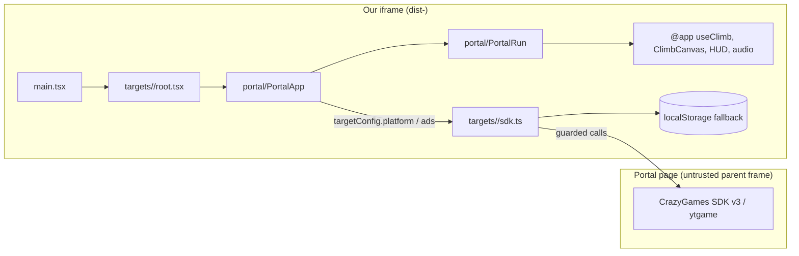

# Architecture: web-portal builds

Spec: `loop/spec-portals.md`. Stack unchanged: the Vite SPA in `app/mobile`
reusing the engine under `app/src` through `@app/*`. Not choosing: a new
bundler, an SDK npm package, or any HTTP client.

## Data flow

Trust boundary: everything the SDK returns (saved data, flags) is untrusted.
Saved best height is allow-list parsed (finite, >= 0) and rejected otherwise.
Nothing leaves the device but SDK calls; there is no server write.

## Modules

| Path | Role |
|---|---|
| `mobile/src/portal/PortalApp.tsx` | Takes a `TargetConfig` prop; boots the platform, loads best, subscribes to pause/audio |
| `mobile/src/portal/PortalRun.tsx` | Menu, run, pause, results, ad break; reuses engine components |
| `mobile/src/portal/bestHeight.ts` | `parseBest`, `settleRun` (pure) and platform load/save |
| `mobile/src/portal/adBreak.ts` | `requestBreak(ads, onStart)`: never throws, skips when ads are off |
| `mobile/src/portal/layout.ts` | `portalCanvasSize(vw, vh)`: full-bleed in tall portrait, 9:16 column otherwise |
| `mobile/src/portal/sdkGuard.ts` | `safely`, `withTimeout`, `loadScript` |
| `targets/crazygames/sdk.ts` | `createCrazyGamesRuntime(deps)` -> `{ platform, ads }` |
| `targets/youtube/sdk.ts` | `createYouTubePlatform(deps)` |
| `targets/youtube/head.html` | `<script src="https://www.youtube.com/game_api/v1">` |
| `scripts/packagePortal.ts` | build + `checkPortalDist` + zip |

## Contracts (adapter semantics)

- CrazyGames calls made before `SDK.init` resolves are queued in order and
  replayed once it does; dropped if the SDK never loads (script timeout 8 s,
  init timeout 8 s).
- `ads.midgame`: returns "unavailable" without a request while
  `now - createdAt < 180 000 ms`; otherwise one `requestAd("midgame")`.
  Resolves "finished" on `adFinished`, "error" on `adError`, a throw, a
  no-start timeout (15 s) or an overall cap (120 s). Late callbacks are ignored.
- `ads.rewarded` always "unavailable".
- YouTube `saveData`/`loadData` store one JSON object (`{ [key]: value }`)
  through `ytgame.game.saveData/loadData`, falling back to localStorage when
  the SDK is missing or rejects.
- Gameplay signals come from one boolean, `live = run in countdown/climb and
  not paused`: rising edge -> `gameplayStart`, falling edge -> `gameplayStop`.

## ADRs

- ADR-P1 PortalApp takes the config as a prop rather than importing
  `@target/config`, so tests inject fakes and vitest's `@target` alias (the app
  target) never leaks into portal tests.
- ADR-P2 Live pause is a `paused` option on `useClimb` (the loop holds its
  clock and drops held keys), not a portal copy of the hook. It does not
  change `stepMatch` output, so no sim version moves.
- ADR-P3 Host-forced silence is a `silenced` option on `usePowerUpFeedback`
  so it never overwrites the saved mute preference.
- ADR-P4 Landscape keeps the 9:16 column (vertical look-ahead) with the HUD
  spanning the full viewport width; tall portrait goes full-bleed.

## Failure modes

| Dependency | Failure | Behaviour |
|---|---|---|
| CrazyGames SDK script | blocked / timeout | no-op adapters, localStorage saves |
| `SDK.init` | throws / hangs | same |
| `requestAd` | throws, adError, never calls back | "error" (or timeout), run starts |
| ytgame | missing / throws / rejects | no-op, localStorage |
| localStorage | blocked | best not saved, game plays |

## Security

No auth, no PII, no secrets. The package check rejects the API origin and
Firebase hosts in built JS, so a stray import of `lib/api.ts` fails the build.
