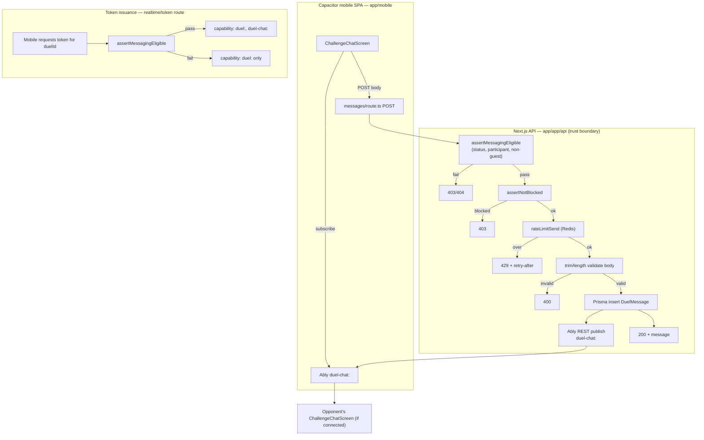

# Architecture: Post-challenge messaging (mobile only)

**Goal ID:** post-challenge-messaging
**Spec:** `loop/spec-post-challenge-messaging.md` (AC-1…AC-13)
**Stack:** existing Next.js App Router API (`app/`) + Prisma/Postgres +
Ably + Capacitor mobile SPA (`app/mobile`) — **no new runtime
dependencies, no new realtime provider**.
**Date:** 2026-09-16
**Design system:** ASCENT (`app/DESIGN.md`) — no second visual language.

---

## 1. AC → architectural need

| ACs | Need |
| --- | --- |
| AC-1, AC-2, AC-3 | Eligibility guard: `status === "completed"`, requester is `player1_id`/`player2_id`, neither id is a `guest:` string |
| AC-4, AC-6, AC-7 | Send = DB insert then server-side Ably publish (never client-to-client); history = paginated DB read |
| AC-5 | Server-side body validation (trim, non-empty, length cap) mirrored client-side |
| AC-8 | Redis-backed sliding-window rate limit on send, reusing the existing limiter pattern (`context/trust.md` #3) |
| AC-9, AC-10 | Block check on every send (`DuelMessageBlock`, symmetric lookup), independent of which duel |
| AC-11 | Report capture (`DuelMessageReport`), no admin surface required to succeed |
| AC-12, AC-13 | `requireAuth` on every route, no guest-token branch; `GET` is read-only, no `getOrCreate` |

**Not in scope:** web UI, push notifications, automated moderation, admin
triage UI, matchmaking changes.

---

## 2. Stack choice

| Choose | Rationale |
| --- | --- |
| New Prisma models (`DuelMessage`, `DuelMessageBlock`, `DuelMessageReport`) in the existing Postgres DB | Same trust/query model as `Duel`; no new datastore |
| Ably, new `duel-chat:<duelId>` channel + capability | Reuses provisioned Ably account and the existing participant-scoped token pattern (`app/app/api/realtime/token`) instead of a second realtime stack |
| Existing Upstash Redis for rate limiting | Matches `context/trust.md` #3 ("new token-authenticated routes get the same rate limiter as existing privileged routes") — implementer greps for the existing limiter helper rather than writing a new one |
| New mobile-only screens in `app/mobile/src/screens` + API client in `app/mobile/src/lib` | Matches confirmed mobile architecture: a separate Capacitor-bundled SPA with its own screen set (not a Next.js page, not React Native) |
| Shared Next.js API routes under `app/app/api/duel/[id]/messages` | Same backend already serves both web and the mobile `CapacitorHttp` client; keeping messaging server-side-only avoids duplicating eligibility/block logic |

**Not choosing:** a second realtime provider (Pusher/Supabase/custom WS);
client-to-client Ably publish for messages (would let a client fabricate
history without a server round trip — violates AC-4's server-of-record
requirement); a web chat UI in v1 (explicitly out of scope); automated
moderation service (out of scope, flagged as follow-up in the spec).

---

## 3. Component boundaries

```
Backend (app/app/api/duel/[id]/)
  ├─ messages/route.ts                 # GET (history), POST (send)
  │    ├─ assertMessagingEligible()    # NEW lib — status/participant/guest checks
  │    ├─ assertNotBlocked()           # NEW lib — DuelMessageBlock lookup
  │    ├─ rateLimitSend()              # reuse existing Redis limiter helper
  │    └─ publishDuelChatEvent()       # Ably server-side publish, post-insert
  ├─ messages/[messageId]/report/route.ts   # POST — DuelMessageReport insert
  └─ (existing) route.ts, rematch/route.ts, result/route.ts  # unchanged

app/app/api/messages/block/route.ts    # POST { blockedUserId } — global, not duel-scoped
app/app/api/realtime/token/route.ts    # EXTEND: grant duel-chat:<duelId> capability
                                        #   alongside duel:<duelId>, gated on the same
                                        #   eligibility check as the messages routes

Mobile (app/mobile/src/)
  screens/DuelRoomScreen.tsx           # EXTEND: "Message opponent" entry, gated on
                                        #   status===completed && both real users && not blocked
  screens/ChallengeChatScreen.tsx      # NEW
       ├─ lib/duelChat.ts              # NEW — fetch history, send, block, report (CapacitorHttp)
       ├─ lib/realtime (reuse app/src/net/realtime.ts pattern via @app alias)
       ├─ components/MessageList.tsx        # NEW — ASCENT bubbles
       ├─ components/MessageComposer.tsx    # NEW — input + send + rate-limit UI
       └─ components/ThreadOverflowMenu.tsx # NEW — Block / Report actions
```

| Module | Owns | Must not |
| --- | --- | --- |
| `assertMessagingEligible.ts` | Duel status + participant + guest-id checks (shared by GET/POST/report) | Touch Ably or Prisma writes for messages |
| `assertNotBlocked.ts` | Symmetric block lookup before any send | Read message bodies |
| `messages/route.ts` | Orchestrate eligibility → block → rate-limit → insert → publish (POST); paginated read (GET) | Trust an Ably payload as source of truth |
| `realtime/token/route.ts` | Grant `duel-chat:<duelId>` only when `assertMessagingEligible` passes | Grant the capability to a non-participant or guest |
| `ChallengeChatScreen.tsx` | Render history, subscribe to live events, render Block/Report | Publish directly to Ably; trust an unconfirmed send as delivered |
| `DuelRoomScreen.tsx` | Show/hide the entry point only | Implement chat logic inline |

---

## 4. Data flow (trust boundaries)



Never: client publishes chat messages directly to Ably (would bypass
eligibility, block, rate-limit, and persistence — the DB insert is always
first).

---

## 5. Data model (new)

```prisma
model DuelMessage {
  id          String   @id @default(cuid())
  duel_id     String
  sender_id   String
  body        String   @db.Text
  created_at  DateTime @default(now())
  hidden_for_sender Boolean @default(false) // "unsend for me" only

  duel   Duel @relation(fields: [duel_id], references: [id])
  sender User @relation(fields: [sender_id], references: [id])

  @@index([duel_id, created_at])
}

model DuelMessageBlock {
  id         String   @id @default(cuid())
  blocker_id String
  blocked_id String
  created_at DateTime @default(now())

  @@unique([blocker_id, blocked_id])
  @@index([blocked_id])
}

model DuelMessageReport {
  id          String   @id @default(cuid())
  message_id  String
  duel_id     String
  reporter_id String
  reason      String?
  created_at  DateTime @default(now())

  message DuelMessage @relation(fields: [message_id], references: [id])
}
```

New migration, e.g. `20260916_add_duel_messaging/`. `Duel` and `User` get
the inverse relations (`messages DuelMessage[]`, etc.) — additive only, no
change to existing columns, matching the "free paths untouched" pattern
already used for `is_chip_duel`/stake fields.

`@@unique([blocker_id, blocked_id])` on `DuelMessageBlock` gives `assertNotBlocked`
a single indexed lookup (`WHERE blocker_id = recipient AND blocked_id = sender`).

---

## 6. API contract

| Route | Method | Auth | Behavior |
| --- | --- | --- | --- |
| `/api/duel/:id/messages` | GET | `requireAuth`, participant only | Paginated history, oldest→newest, no side effects (AC-13) |
| `/api/duel/:id/messages` | POST | `requireAuth`, participant only | Eligibility → block → rate-limit → validate → insert → publish (AC-4, AC-5, AC-8, AC-9) |
| `/api/duel/:id/messages/:messageId/report` | POST | `requireAuth`, participant only | Insert `DuelMessageReport`; always 2xx once validated, independent of admin tooling (AC-11) |
| `/api/messages/block` | POST | `requireAuth`, any user | Upsert `DuelMessageBlock`; not duel-scoped (a block is global, per AC-9/AC-10) |
| `/api/realtime/token` (extend) | POST | `requireAuth` (existing) | When `assertMessagingEligible` passes for the requested `duelId`, add `duel-chat:<duelId>` to the granted `capability` map alongside the existing `duel:<duelId>` |

All error bodies follow the repo convention: structured `{ error, code }`,
never a raw Prisma/DB message (`context/conventions.md`).

---

## 7. Realtime contract (Ably)

- Channel: `duel-chat:<duelId>` (separate from the existing `duel:<duelId>`
  match-lifecycle channel — no event-type collision).
- Event: `"message"` — payload `{ id, sender_id, body, created_at }` (same
  shape as the DB row minus internal fields).
- Publish happens **server-side only**, in `messages/route.ts POST`, after
  the Prisma insert succeeds — mirrors the existing pattern where
  `rematch/route.ts` publishes a `"rematch"` event after its own DB write.
- Token capability is granted only when `assertMessagingEligible` passes —
  the same gate used for the REST routes, so a non-participant or guest
  duel never gets a subscribable/publishable chat channel token, closing
  the "Ably scoping leak" risk called out in the spec.

---

## 8. Rate limiting & abuse controls

- Reuse the existing Redis-backed limiter (implementer locates the current
  helper used for privileged/token-authenticated routes per
  `context/trust.md` #3, rather than introducing a second limiter).
- Suggested window (product to confirm per spec Open Question 5): e.g. 20
  messages / 60s per sender, keyed on `sender_id`.
- Body validation: server trims, rejects empty/whitespace, rejects over
  the configured length cap (spec assumes 1000 chars) — enforced
  server-side regardless of client-side validation (AC-5).
- Block enforcement is **always** server-side on the send path (AC-9); the
  mobile UI hiding the entry point is a UX nicety, not the control.

---

## 9. Folder tree (ownership)

```
app/prisma/schema.prisma                        # + 3 models, + inverse relations
app/prisma/migrations/20260916_add_duel_messaging/

app/src/lib/duelMessaging/
  assertMessagingEligible.ts   # status + participant + guest-id checks
  assertNotBlocked.ts          # DuelMessageBlock lookup
  validateMessageBody.ts       # trim/length

app/app/api/duel/[id]/messages/route.ts
app/app/api/duel/[id]/messages/[messageId]/report/route.ts
app/app/api/messages/block/route.ts
app/app/api/realtime/token/route.ts             # extend existing file

app/mobile/src/screens/ChallengeChatScreen.tsx  # NEW
app/mobile/src/screens/DuelRoomScreen.tsx       # extend: entry point only
app/mobile/src/components/Chat/MessageList.tsx
app/mobile/src/components/Chat/MessageComposer.tsx
app/mobile/src/components/Chat/ThreadOverflowMenu.tsx
app/mobile/src/lib/duelChat.ts                  # NEW — API client + realtime subscribe
```

---

## 10. Security boundaries

1. **No client-to-client trust.** A message a recipient renders always
   traces back to a `POST` that passed `assertMessagingEligible` +
   `assertNotBlocked` + rate limit + validation — the Ably event is a
   notification to re-render/refetch, not itself the record.
2. **Guest exclusion is enforced twice**: UI hides the entry point, and
   every server route independently checks for a `guest:` prefix on
   either participant id — never rely on the UI alone (`context/trust.md`
   #5 pattern: authorization in the route handler).
3. **Block is symmetric and duel-independent.** `assertNotBlocked` checks
   both directions before a send succeeds, and the realtime token route
   uses the same eligibility gate — a block takes effect immediately for
   both REST sends and any new Ably token issuance.
4. **No write-on-read.** `GET` history and the eligibility checks are
   pure reads; only `POST` routes ever insert rows (`context/trust.md`
   #6).
5. **Reports never depend on admin tooling to "succeed."** Storing a
   `DuelMessageReport` is the complete v1 contract — building the triage
   UI is explicitly future work, not a hidden dependency of AC-11.

---

## 11. ADRs

### ADR-1 — Server-side Ably publish, not client publish

Client-to-client publish would let either party forge history the other
side sees without ever passing eligibility/block/rate-limit checks.
Publishing from the API route after the DB insert keeps the DB as the
single source of truth; Ably is purely a low-latency notify layer, exactly
like the existing `"rematch"` event.

### ADR-2 — Block is a new, duel-independent table

A `DuelMessage`-scoped block would only stop messaging in one thread; the
spec (S4/AC-9/AC-10) requires blocking a *person*, not a thread. A
separate `DuelMessageBlock(blocker_id, blocked_id)` table, checked on
every send regardless of `duel_id`, is the minimal structure that
satisfies "never message me again, in this thread or a future one."

### ADR-3 — Reuse the existing Ably token route rather than a second one

`/api/realtime/token` already does the exact check this feature needs
(participant of `duelId`, not a stranger). Extending its capability grant
is less risk than a parallel token endpoint that could drift out of sync
on the eligibility rule.

### ADR-4 — No admin moderation UI in v1

Scoped out per the spec; `DuelMessageReport` rows are captured so nothing
is lost, and the gap is called out explicitly as an open question rather
than quietly deferred.

---

## 12. Test seams (verifier)

- `assertMessagingEligible`: unit-test all four gates (not completed, guest
  player1, guest player2, non-participant caller) independently — must
  reject each, and accept the valid case.
- `assertNotBlocked`: unit-test both directions (A blocked B, B blocked A)
  and the unblocked case.
- `messages/route.ts POST`: integration test hitting real Prisma
  (test DB) + a fake/mocked Ably publish — assert DB row exists and the
  publish was called with the right channel/payload; assert rate-limit
  429 path does **not** insert a row.
- `messages/route.ts GET`: assert pagination order and that calling it
  does not create any row (grep-proof: assert row count unchanged, not
  just that no error was thrown).
- `realtime/token/route.ts`: assert `duel-chat:<duelId>` capability is
  present only when eligibility passes, absent otherwise — this is the
  test that closes the "Ably scoping leak" risk.
- Mobile: component test for `DuelRoomScreen` entry-point visibility
  matrix (completed/not, guest/not, blocked/not) — invoking the real
  gating logic, not a snapshot of copy text.

---

## 13. Risks (architecture residual)

- The Redis rate-limiter helper's exact location/signature is assumed,
  not confirmed by name — implementer must grep for it before writing a
  new one (`context/trust.md` #3 explicitly requires reuse).
- This architecture does not resolve the spec's primary risk (stranger
  messaging safety) — Block/Report are the only v1 mitigations; the open
  question of restricting v1 to friend-invited duels only remains a
  product decision that would change scope (fewer eligibility branches,
  smaller blast radius) if answered "yes" before implementation starts.

---

## 14. Implementer checklist (module list)

1. Migration: `DuelMessage`, `DuelMessageBlock`, `DuelMessageReport` +
   relations.
2. `app/src/lib/duelMessaging/{assertMessagingEligible,assertNotBlocked,validateMessageBody}.ts`
3. `app/app/api/duel/[id]/messages/route.ts` (GET, POST)
4. `app/app/api/duel/[id]/messages/[messageId]/report/route.ts` (POST)
5. `app/app/api/messages/block/route.ts` (POST)
6. Extend `app/app/api/realtime/token/route.ts` capability grant
7. `app/mobile/src/lib/duelChat.ts` (fetch/send/block/report + Ably subscribe)
8. `app/mobile/src/components/Chat/*` (ASCENT bubbles, composer, overflow menu)
9. `app/mobile/src/screens/ChallengeChatScreen.tsx`
10. Extend `app/mobile/src/screens/DuelRoomScreen.tsx` entry point
11. Tests per §12; `pnpm lint && pnpm typecheck && pnpm test` in `app/`
    green before review (`context/gates.json`).
