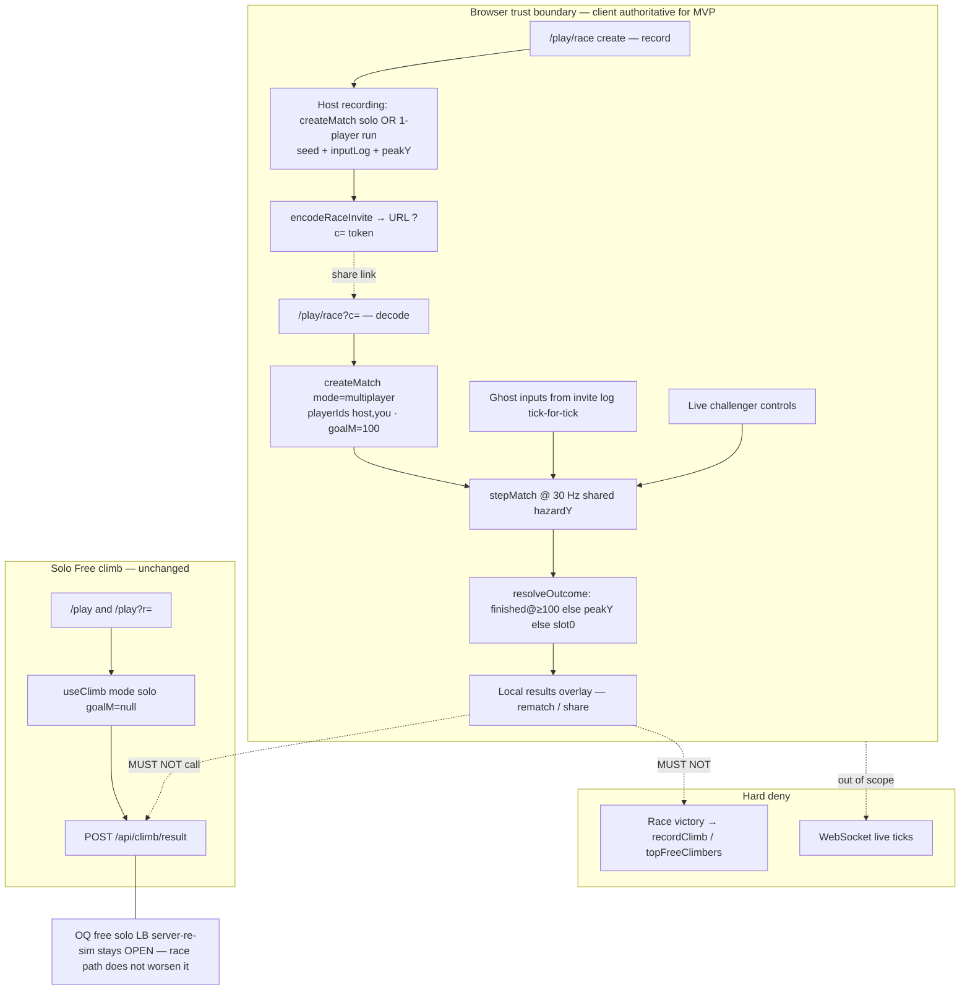

# Architecture: Two-player async ghost race (MVP)

**Goal ID:** two-player-race  
**Spec:** `loop/spec-two-player-race.md` (mirrored `loop/spec.md`) — AC-1…AC-21  
**Prior handoff:** `loop/handoffs/product-spec-2026-09-06T200214Z.json`  
**Stack:** existing Next.js App Router + React + Tailwind + Prisma/Redis/Firebase in `app/` — **no WebSocket / party / durable realtime**  
**Date:** 2026-09-06  
**Canonical path:** `loop/architecture-two-player-race.md` (`paths.architecture` → `loop/architecture.md` points here)

## Locked product decisions (do not reopen)

| Lock | Value |
| --- | --- |
| Mode | Async ghost race on one `MatchState` (`mode: "multiplayer"`) |
| Live realtime | **Out of scope** (Future; ghost is named fallback) |
| Win | First feet ≥ `RACE_GOAL_M = 100`; else higher `peakY`; equal peak → slot 0 (host) |
| Map | Shared `seed` → identical geometry / ladders / obstacles / power-ups |
| Lava | Shared lead-based (`climbingLeadM` / catch-up) — one `hazardY` |
| Lobby | Invite link only |
| Auth | Anonymous play OK; no persistent race ladder in MVP |
| Fairness | Race **never** writes free solo `peakY` / `topFreeClimbers` |
| Display units | Engine height units (historically “metres”); UI shows via `formatAltitude` / `ALTITUDE_UNIT` (`ft` 1:1). Goal threshold is **sim `y >= 100`**, copy may say “100 m / 100 ft” consistently with existing climb HUD — do not invent a unit conversion. |

---

## 1. AC → architectural need

| ACs | Need | Module / surface |
| --- | --- | --- |
| AC-1, AC-2, AC-3 | Playable race-create entry (rules + Start recording + Retry) | `/play/race` page + `RaceCreateClient` |
| AC-4 | Refresh discards in-progress host recording (no session restore mid-climb) | Client session: recording payload only after host run **ends** |
| AC-5, AC-6, AC-7, AC-8 | Invite encode/decode; empty log refuse; size budget; idempotent Copy | `raceInvite.ts` (+ reuse pack/deflate from `runReplay.ts`) |
| AC-9 | Two-player `createMatch` + ghost input feed + same seed tower | `useRaceClimb` / `simulation` + `RaceAcceptClient` |
| AC-10 | Shared lava already in `stepMatch` when both players share one match | No second hazard clock; verify via sim tests |
| AC-11, AC-12 | Finish-at-goal + peak fallback in outcome | `MatchState.goalM` + `resolveOutcome` extension |
| AC-13, AC-14 | Distinct accept URL; invalid recovery; never auto solo replay | Query `?c=` on `/play/race`; never overload `?r=` |
| AC-15 | Rematch = re-decode same URL token; restart countdown | Stateless invite; client restart only |
| AC-16, AC-17 | Results overlay (winner, peaks, goal vs peak reason); rematch; share outcome non-destructive | `RaceResultsOverlay` + optional outcome token (same invite or compact outcome) |
| AC-18, AC-19 | No race → solo LB; reject forged raceWin | Race UI skips `POST /api/climb/result`; harden route rejects `raceWin` |
| AC-20 | Paid stacks untouched | No Stripe / burial / paid rank calls from race paths |
| AC-21 | Solo endless unchanged (no 100 m finish) | `goalM = null` for solo `createMatch` / `useClimb` |
| NFR-1…7 | Token size, 30 Hz, anon, a11y, tick cap, determinism, no-stakes copy | Caps below; ASCENT chrome; `aria-live` + rematch counter |

**Not needed for MVP:** realtime infra, Redis race rooms, Prisma race tables, Firebase auth walls, matchmaking jobs, WebSocket hosts.

---

## 2. Stack choice

| Choose | One-sentence rationale |
| --- | --- |
| Extend existing climb sim (`createMatch` / `stepMatch` / `simulateFromInputs`) | Deterministic multiplayer stubs + shared lava already exist; race is goal + peak fallback, not a new physics engine |
| Client-only invite URL (deflate + base64url), mirroring `runReplay` | Fits Vercel serverless; no match store; same share pattern users know |
| Next.js App Router routes under `/play/race` | Stays in Free climb shell; ASCENT / `FreeStackShell` reuse |
| Vitest unit tests invoking production sim | Kernel gate: prove AC-11/12 with `simulateFromInputs`, not source greps |

**Not choosing:** WebSocket / Partykit / Ably / Supabase Realtime; second HTTP client or ORM; server FFmpeg; couch co-op; friend codes; persistent race ELO; overloading `/play?r=` as “you are racing.”

---

## 3. Mermaid — data flow & trust boundaries



**Trust summary:** MVP race outcomes are **local bragging only** (URL). No new irreversible prestige write. Solo `POST /api/climb/result` remains the only climb persist path and stays solo-only.

---

## 4. Data models

### 4.1 Constants (export from one module)

```ts
// app/src/game/raceConstants.ts (NEW)
export const RACE_GOAL_M = 100;           // sim y threshold (AC-11)
export const RACE_INVITE_VERSION = 1;
export const RACE_INVITE_TYPE = "race" as const;
export const MAX_RACE_TICKS = 18_000;     // === MAX_SHARE_TICKS
export const MAX_RACE_TOKEN_LENGTH = 32_768; // === MAX_REPLAY_TOKEN_LENGTH
export const HOST_PLAYER_ID = "host";
export const CHALLENGER_PLAYER_ID = "you";
```

### 4.2 `MatchState` extension

| Field | Type | Nullability | Notes |
| --- | --- | --- | --- |
| `goalM` | `number \| null` | **nullable** | `null` = endless (solo). Race sets `100`. |
| existing fields | unchanged | | `mode`, `players`, `hazardY`, `winnerId`, … |

**Enums (exhaustive):**

- `MatchMode`: `"solo" \| "multiplayer"` — race uses `"multiplayer"`.
- `PlayerStatus`: `"climbing" \| "finished" \| "eliminated"` — race may set `"finished"` when `y >= goalM`.
- `WinReason` (UI/result only, not on MatchState unless useful): `"goal" \| "peak"`.

**Relationships:** Invite token → immutable `{ seed, hostInputs, hostPeakY, goalM }`. No DB row. Delete policy: N/A (URL GC by users); refresh mid-race abandons ephemeral match only.

**Indexes:** none (no server store).

### 4.3 Race invite payload (wire format)

Inner JSON (then UTF-8 → base64url for query token), distinct from solo replay:

```ts
interface RaceInviteWire {
  v: 1;                 // RACE_INVITE_VERSION
  t: "race";            // discriminator — solo decodeRunReplay MUST reject if t === "race"
  s: string;            // seed, non-empty
  p: number;            // host peakY, finite, 1 decimal (Math.round(x*10)/10)
  g: number;            // must equal RACE_GOAL_M (100) on decode or reject
  i: string;            // base64url(deflate(packInputLog(hostInputs)))
}
```

| Constraint | Rule |
| --- | --- |
| Host inputs | length ∈ `[1, MAX_RACE_TICKS]` |
| Token length | ≤ `MAX_RACE_TOKEN_LENGTH` chars after outer encode |
| Encoding | Same pack/deflate/base64url primitives as `runReplay.ts` (share helpers; do not fork byte layout) |
| Optional name | **MVP omit** — UI labels “Host” / “Friend’s ghost” (ADR-4) |
| Outcome share | MVP: rematch = same invite URL. Optional outcome deep-link is Future; if encode fails, results stay visible (AC-17) |

### 4.4 Decoded invite (app type)

```ts
interface RaceInvite {
  version: 1;
  seed: string;
  hostPeakY: number;
  goalM: typeof RACE_GOAL_M;
  hostInputs: PlayerInput[];
}
```

### 4.5 Race result view-model (client)

```ts
interface RaceResultView {
  winnerId: PlayerId;           // never null when match resolved per AC-12
  winReason: "goal" | "peak";
  hostPeakY: number;
  challengerPeakY: number;
  hostFinishedTick: number | null;
  challengerFinishedTick: number | null;
}
```

Derive `winReason`: if any player `status === "finished"` → `"goal"`; else `"peak"`.

---

## 5. Simulation contracts

### 5.1 `createMatch`

```ts
createMatch({
  seed,
  mode: "multiplayer",
  tower: applyRunSeed(freeTower, seed),
  playerIds: [HOST_PLAYER_ID, CHALLENGER_PLAYER_ID], // slot 0 = host ghost, slot 1 = live
  goalM: RACE_GOAL_M,  // NEW optional param; default null for solo callers
})
```

Host **recording** run: keep today’s solo path (`mode: "solo"`, `goalM: null`) so recording UX stays simple; only the **challenge match** is multiplayer. Recording still stops on elimination (or optionally early stop when host reaches 100 — **allowed** for shorter invites: if host `y >= 100` during recording, end recording and treat as finished with peak ≥ 100). Implementer may end host recording when `peakY >= RACE_GOAL_M` without setting solo `status=finished` globally — prefer a race-host wrapper that stops the rAF loop at goal so solo endless rules stay untouched (AC-21).

### 5.2 Per-tick inputs (challenger match)

```ts
const ghost = hostInputs[climbTick] ?? NO_INPUT; // after log ends: idle
stepMatch(state, {
  [HOST_PLAYER_ID]: ghost,
  [CHALLENGER_PLAYER_ID]: liveInput,
}, cfg);
```

Countdown: existing 90-tick lock; do not consume host log during countdown (same as `simulateFromInputs` drain). Index ghost log by **climb** tick (`state.tick` after phase=`climb`), matching how solo `inputLog` is recorded today.

### 5.3 Finish-at-goal (inside `stepMatch`, climb phase)

After motion + death-line for each climbing player:

```
if (state.goalM !== null && p.status === "climbing" && p.y >= state.goalM) {
  p.status = "finished";
  p.finishedTick = state.tick;
}
```

**Solo:** `goalM === null` → never auto-finish (AC-21).

### 5.4 `resolveOutcome` (replace multiplayer elimination branch)

Keep existing “first finisher by earliest `finishedTick`, tie → lowest slot.”

When **no** finishers and **nobody** still climbing:

1. Sort players by `peakY` desc, then `slot` asc.
2. Set `winnerId` to the first player’s id (**not** `null`).
3. `phase = "finished"`.

Solo with one eliminated player: peak fallback still sets `winnerId` to that player — harmless; UI already treats solo as “caught by lava.” Alternatively gate peak fallback with `state.mode === "multiplayer"` so solo `winnerId` stays `null` as today — **prefer gating on `goalM !== null || mode === "multiplayer"`** to minimize solo golden-test churn: **ADR-5** — peak fallback runs only when `mode === "multiplayer"`.

### 5.5 Headless proof seam

```ts
simulateFromInputs(
  { seed, mode: "multiplayer", tower, playerIds: ["host","you"], goalM: 100 },
  log, // Record<PlayerId, PlayerInput>[]
  cfg
)
```

Verifier must assert `winnerId` / peaks via this API (product-spec learning).

---

## 6. Routes & query params

| Surface | Path | Params | Behavior |
| --- | --- | --- | --- |
| Free climb (unchanged) | `/play` | — | Solo endless |
| Solo replay (unchanged) | `/play` | `?r=<replayToken>` | Decode via `decodeRunReplay`; replay transport |
| Race create | `/play/race` | none | Rules + Start recording (F-1/F-2) |
| Race accept | `/play/race` | `?c=<raceInviteToken>` | Decode invite; Start race (F-3) |
| Invalid `c` | `/play/race?c=…` | bad token | Invalid message + Free climb / Create race — **do not** fall through to `?r=` or auto solo |

**Routing rules:**

- `/play` searchParams type stays `{ r?: string }` only — **do not** teach `/play` to read `c`.
- `/play/race` reads `c` only. If both somehow present, ignore `r`.
- `decodeRunReplay`: reject payloads with `t === "race"` (and ideally any unknown `t`) so a race token pasted into `?r=` fails closed as invalid replay (AC-14 adjacent).
- `decodeRaceInvite`: require `t === "race"`, `v === 1`, `g === RACE_GOAL_M`.

Nav / post-run CTA **“Race a friend”** → `href="/play/race"` (not `#free`, not `/play` alone).

---

## 7. API contracts

### MVP: **no new race HTTP APIs**

Invite persistence = URL only. Prefer zero new routes.

### Explicit: `POST /api/climb/result` remains solo-only

| | Contract |
| --- | --- |
| Method / path | `POST /api/climb/result` |
| Auth | Optional Bearer (unchanged) |
| Body (accepted) | `{ categorySlug?, peakY, finished?, finishedTick?, ticks?, seed, replayToken? }` |
| Race fields | If body contains `raceWin`, `raceResult`, `winnerId`, `opponentPeakY`, or `mode: "race"|"multiplayer"` → **`400`** `{ error, code: "RACE_RESULT_NOT_SUPPORTED" }` and **do not** call `recordClimb` |
| Success | Unchanged solo persist |
| Rate limit | Existing IP climb limiter |
| Idempotency | Existing monotonic `Math.max` peak (solo only) |

Race client paths (**host recording overlay, challenger results**) **must not** `fetch("/api/climb/result")`.

### Future (out of scope — document only)

`POST /api/climb/race-result` would require `requireAuth` + server `simulateFromInputs` of **both** logs + seed; reject mismatch; never trust client `winnerId`. Not shipping in MVP.

---

## 8. Folder tree (2–3 levels) & ownership

```
app/
  app/play/
    page.tsx                    # unchanged solo + ?r=
    race/page.tsx               # NEW — create + ?c= accept   [frontend]
  src/game/
    raceConstants.ts            # NEW — RACE_GOAL_M, ids, caps [backend/game]
    raceInvite.ts               # NEW — encode/decode/buildUrl [backend/game]
    runReplay.ts                # AMEND — reject t==="race"   [backend/game]
    simulation.ts               # AMEND — goalM, finish, peak fallback [backend/game]
    types.ts                    # AMEND — MatchState.goalM    [backend/game]
    useClimb.ts                 # unchanged solo hot path     [frontend]
    useRaceClimb.ts             # NEW — dual input rAF driver [frontend]
  src/components/Game/
    RaceCreateClient.tsx        # NEW — F-1/F-2               [frontend]
    RaceAcceptClient.tsx        # NEW — F-3 decode gate       [frontend]
    RaceScene.tsx               # NEW or ClimbScene mode prop [frontend]
    RaceResultsOverlay.tsx      # NEW — F-4                   [frontend]
    paintClimbFrame.ts          # AMEND — draw both players; cam follows live [frontend]
    ClimbScene.tsx              # AMEND — “Race a friend” CTA [frontend]
  app/api/climb/result/route.ts # AMEND — reject raceWin*    [backend]
  tests/game/
    raceInvite.test.ts          # NEW
    raceOutcome.test.ts         # NEW — AC-11/12 via simulateFromInputs
    runReplay.test.ts           # AMEND — race token rejected
  tests/api/
    climbResult.route.test.ts   # AMEND — AC-19 forged raceWin
```

**Specialist ownership:** game/sim + invite encode = implementer (game); UI chrome = frontend; route harden = backend; no data/Prisma migration; design-ux **not** required first (ASCENT exists).

---

## 9. Client session / persistence

| Phase | Persist what | Where |
| --- | --- | --- |
| Mid host recording | Nothing durable | Memory/refs only — refresh → back to create (AC-4) |
| Host finished, before copy | `{ seed, inputs, peakY }` | `sessionStorage` key `climb.race.recording.v1` optional restore for share UI after refresh **after finish only** |
| Invite | Full token in URL | Query `c` — source of truth for challenger |
| Mid challenger race | Nothing | Refresh → re-read `c`, lobby/countdown again (AC-15) |
| Results | Ephemeral React state | Rematch reuses decoded invite |

No cookies, no Redis, no Prisma for MVP.

---

## 10. Failure modes

| Dependency / risk | Failure | Mitigation |
| --- | --- | --- |
| Invite encode (size / empty) | `null` | AC-6/7 UI: Record again / shorter run; never substitute `?r=` |
| Invite decode | `null` | AC-13 recovery CTAs |
| `CompressionStream` missing | fall back raw bytes like `runReplay` | Same helper path; may hit size cap sooner — show encode failure |
| Sim desync | Should not occur if deterministic | Show error + Free climb; log seed locally |
| Clipboard / Web Share | Share fails | Keep results; retry (AC-17) |
| Redis / Prisma / Firebase | Unused by race | N/A |
| Token DoS (huge `c`) | Parse cost / memory | Reject if `c.length > MAX_RACE_TOKEN_LENGTH` **before** inflate |
| Contested pickups | Ghost takes orb | Intended; rules copy |
| Host banks slow-lava | Shared hazard swing | Locked product decision |
| paintClimbFrame only draws `players[0]` | Ghost invisible | Must draw all climbing/finished players; camera follows challenger (`players[1]` / id `you`) |
| ClimbScene auto-POST | Race poisons LB | Race surfaces never call `postRun` |

**10× envelope:** Link-based 1v1; no matchmaking QPS. Token CPU bound — cap ticks. Two players in one `stepMatch` ≈ 2× integrate cost; still fine at 30 Hz for N=2. Do not generalize to N=8 without profiling.

---

## 11. ADRs

### ADR-1 — Async ghost (not live)

**Decision:** Ship ghost race on shared `MatchState`.  
**Why:** Reuses deterministic sim + share encoding; Vercel serverless has no durable game socket. Live listed Future with ghost as fallback.  
**Rejected:** WebSocket live 1v1; phased peak-only duel as primary (not on-screen racing).

### ADR-2 — URL-only invite (no race API)

**Decision:** Encode challenge in `?c=` token; zero new persist APIs.  
**Why:** Anonymous play, no lobby DB, mirrors proven `?r=` pattern while staying distinct. Avoids irreversible prestige writes (trust.md).  
**Rejected:** Server match objects; friend codes.

### ADR-3 — `RACE_GOAL_M = 100`

**Decision:** First to sim height 100 wins.  
**Why:** Product lock — short enough for invite size, long enough to feel like a race. Solo endless unchanged (`goalM=null`).  
**Rejected:** Death-only race; summit floor index; variable goals in MVP.

### ADR-4 — Host label “Host” / “Friend’s ghost”

**Decision:** No typed names / PII in invite payload for MVP.  
**Why:** Avoid PII in shareable URLs; auth displayName optional Future.  
**Rejected:** Embedding email or Firebase uid in token.

### ADR-5 — Peak fallback only in `multiplayer`

**Decision:** When all eliminated with no `finished` players, set `winnerId` by peakY/slot only if `mode === "multiplayer"`.  
**Why:** Preserves solo tests that expect `winnerId === null` on lava death; race AC-12 still holds.  
**Rejected:** Changing solo winner semantics globally.

### ADR-6 — Route `/play/race` + `?c=` (not `/play?race=`)

**Decision:** Dedicated race page; challenge token query key `c`.  
**Why:** Hard separation from solo replay UX (`?r=`); clearer create vs accept; ClimbPlayClient stays replay-only.  
**Rejected:** Overloading `/play?r=` or a boolean `?race=1` that shares ClimbPlayClient decode path.

### ADR-7 — nextStage = implementer (skip design-ux first)

**Decision:** Proceed to implementer.  
**Why:** ASCENT + climb chrome (`app/DESIGN.md`, climb feel tokens) already cover overlays, CTAs, mono HUD. Race needs copy/rules chrome and dual-climber paint — not a new brand. design-ux may polish later if QA flags contrast/a11y.

---

## 12. Security boundaries

| Topic | Rule |
| --- | --- |
| Authn | Anonymous create/accept OK |
| Authz | No race prestige resource in MVP |
| Irreversible writes | **None new.** Do not call `recordClimb` from race. Solo LB trust OQ stays OPEN |
| `POST /api/climb/result` | Reject race-claim fields (AC-19); no defaulting |
| PII | No names/emails/uids in invite tokens |
| Secrets | No new env secrets (`INTERNAL_TOKEN` unused) |
| Token DoS | Length gate before inflate; tick cap after inflate |
| Paid stacks | No checkout / burial / rank mutation (AC-20) |
| Middleware | Presence-only — unchanged; no middleware “race auth” |

---

## 13. Hot paths, cache, N+1

| Path | Budget |
| --- | --- |
| Challenger rAF → `stepMatch` (2 players) | Keep fixed timestep `TICK_DT`; no React state per tick — refs + paint (existing climb pattern) |
| Ghost input index | O(1) array index per tick |
| Invite decode | Once per page load; cache decoded `RaceInvite` in React state |
| `seedCache` / power-up memo | Existing per-seed caches; race uses one seed — no cardinality spike |
| N+1 | N/A (no ORM lists) |
| Snapshot/export | Out of scope for race MVP (no requirement to export race video) |

**Invalidation:** none server-side. Client: new recording → new seed; rematch → same invite, new `runId`.

---

## 14. UI / chrome contracts (implementer; ASCENT)

- Race create first paint: brand/chrome within `FreeStackShell`; rules mention **same map**, **ghost**, **first to 100**; one primary **Start recording**.
- Challenger: label **Racing Host · same map · first to 100** — not “Replay”.
- Results: winner, both peaks (`toFixed(1)` or `formatAltitude`), `goal` vs `peak` reason, **Rematch**, **Create your own race**, **Free climb**.
- No-stakes copy (NFR-7): skill/bragging only; not paid stacks.
- A11y: controls ≥ 44×44; winner `aria-live` with monotonic rematch counter.
- Ghost paint: distinct from live (muted / lower alpha / outline); lava and orbs shared.

---

## 15. Test seams (for verifier — not source greps)

| AC | Test |
| --- | --- |
| AC-5/6/7 | `encodeRaceInvite` / `decodeRaceInvite` round-trip; empty → null; oversize → null |
| AC-9/10 | `simulateFromInputs` multiplayer: identical seed geometry; one `hazardY` |
| AC-11 | Scripted inputs drive challenger `y >= 100` → `winnerId === "you"`, status finished |
| AC-12 | Both eliminated below 100 with peaks 55 vs 42 → you; 40 vs 42 → host |
| AC-14/13 | Race token in `decodeRunReplay` → null; bad `c` UI path |
| AC-18/19 | ClimbScene/RaceScene: no result POST; route rejects `raceWin: true` without peak bump |
| AC-21 | Solo `createMatch` without goalM: climb to y≥100 still `climbing` until lava |

---

## 16. Implementer checklist

1. Add `goalM` to match create + finish-at-goal + multiplayer peak fallback; prove AC-11/12.
2. Add `raceConstants.ts` + `raceInvite.ts`; harden `decodeRunReplay`.
3. Add `/play/race` create + accept clients; wire nav CTA.
4. Implement `useRaceClimb` (or equivalent) dual-input driver; extend paint for 2 players.
5. Race results overlay; skip climb result POST.
6. Harden `POST /api/climb/result` against race-claim fields.
7. Tests listed in §15; run `pnpm test` / typecheck / lint per `context/gates.json`.

---

## Open questions (non-blocking)

1. Solo free LB server-re-sim — **OPEN**, pre-existing; race does not close.
2. Power-up one-slot vs stacking — **OPEN**, out of scope for this goal.
3. `/api/tower` unscoped aggregate — **OPEN**, out of scope.
4. Host early-stop at 100 during recording — recommended yes for invite size; implementer may ship death-only recording if encode budget still holds (prefer early-stop).
