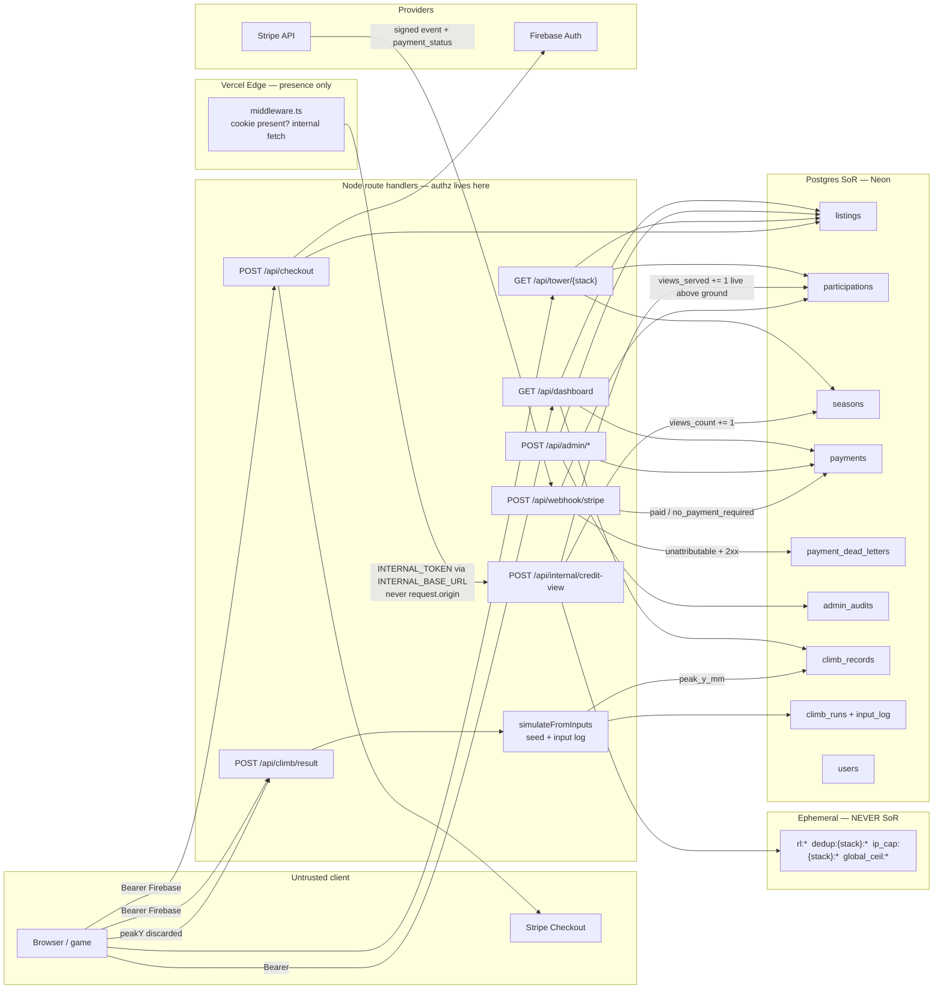

# Persistence architecture — The Climb / paid stacks

**Status:** spec-only. No application code, no `.prisma` edits, no migrations in this stage.  
**Spec:** `loop/spec.md` (Decisions table + AC-1–AC-57 are closed).  
**Stack:** match `context/profile.json`. Prisma **6.19.3** / `prisma-client-js` (`loop/package-upgrade.md` ADR-4).  
**Next specialist:** **data** (physical schema, expand-contract, CHECK, durable indexes).

This document is the system of record for *where* data lives, *how* it is accessed, and *what* breaks at 10×. Implementers and data must not guess load-bearing types, indexes, or trust boundaries.

---

## 0. Learnings applied (this stage)

| Source | Insight | How applied | Exception |
|--------|---------|-------------|-----------|
| product-spec handoff | Free board is a trust boundary; client `peakY` forbidden | Climb persist re-sims seed+log; `peak_y_mm` is server-only; duration envelope is not authz | — |
| product-spec handoff | Listing slug permanent; altitude per-season | Listing vs Participation split (ADR-A) | — |
| product-spec handoff | Ledger SoR; refund never lowers altitude; pending not public | ADR-G; `payment_state`; webhook gates on `payment_status` | — |
| product-spec handoff | Replay retention 30+PB/90d; no Category table | Replay **on the run row** (ADR-B); categories stay code seed | — |
| product-spec handoff | Unscoped `/api/tower` is not ranked | 404 `UNSCOPED_TOWER` (ADR-E) | — |
| product-spec metric | Do not reopen clicks / defaults / wins / client peakY | Clicks dropped; `finishes`; reject slugs | — |
| standing / kernel 8–9 | Reject, never default; write-on-read ≠ default removal | No `@default` on `stack_slug`; `getOrCreateActiveSeason` only on authenticated checkout + admin rollover | — |
| standing / kernel 10 | Monotonic write = trust boundary | Altitude and `peak_y_mm` server/provider-derived | — |
| standing / kernel 13–14 | Webhook 2xx+dead-letter; declare indexes ORM will not drop | ADR-F; `PaymentDeadLetter` unique session | — |
| standing / kernel 15–16 | Partition every gating key; no fake global aggregate | Dedup + IP cap include stack; global ceiling does **not**; unscoped tower not a board | — |
| ledger: dashboard `take: 500` | Rank via indexed COUNT, not `findMany` a stack | T3 access path | — |
| ledger: `simulateFromInputs` test-only | Re-sim must have a non-test caller | POST `/api/climb/result` **is** the production caller | — |
| ledger: power-up one-slot vs stacking | Gameplay | **Skipped** — spec Out of scope | Persistence does not model power-up slots |
| ledger: `floorHeight` O(n²) | Gameplay geometry | **Skipped** — not a SoR concern | — |
| trust.md #3–6 | Constant-time tokens; no secret-to-request-origin; presence-only middleware | §10 | — |
| `payments.ts` ADR-7 | Additive concurrent altitude | Preserved as **ADR-G companion**: integer `INCREMENT`, never SET | — |

---

## 1. AC → architectural need

Every AC maps to a storage/auth/job need. One row is enough; trust-boundary ACs are not skipped.

| AC | Need |
|----|------|
| **AC-1** | Indexed live-set query: active season ⋈ paid ⋈ `hidden_at IS NULL`, `ORDER BY altitude_mm DESC, first_credited_at ASC`, `take 100`. Rank = 1-based position in **that** list. `spend` absent from `ORDER BY`. |
| **AC-2** | Burial/amber **derived** at API from `views_k = views_count/1000` and engine; not stored. Buried rows still eligible for the cap-100 list. |
| **AC-3** | Allow-list parser `parsePaidStackSlug` → 404 `INVALID_CATEGORY`. Read-only: **no** season/listing insert. |
| **AC-4** | Unscoped `GET /api/tower` is **not** T1 (ADR-E). Must not mint seasons. |
| **AC-5** | `listings` never deleted. Record read: `payment_state='paid'` by slug, any hidden/buried/inactive-season. HTTP 200. |
| **AC-6** | Pending or missing slug → 404. Public read filters `payment_state='paid'`. |
| **AC-7** | T11 = `participations` for listing × named season. `seasons_appeared` = `COUNT(participations)` for that listing (each exists only after a credited payment). All-time metres = `SUM(payments.metres_added_mm)` including refunded. |
| **AC-8** | No `clicks` column. Net spend = `SUM(amount_cents) WHERE listing_id AND refunded_at IS NULL` (ledger). `views_served` from **current** participation (or 0). |
| **AC-9** | Dashboard: owned listings `take 100`; live rank via **indexed COUNT** (not `findMany` 500); competitor = one-row `findFirst` of the next-better live row; payments bulk `WHERE listing_id IN (...)`. |
| **AC-10** | Both surfaces use the same SQL SUM. No `spend_c` SoR. Optional cache forbidden to disagree (we **omit** `spend_c`). |
| **AC-11** | `requireAuth` on `GET /api/dashboard` → 401 `{ error, code: UNAUTHORIZED }`. |
| **AC-12** | Rank `null` unless listing is in the live set (paid, unhidden, participation in **active** season). |
| **AC-13** | Authenticated checkout may insert `payment_state='pending'` listing; omitted from T1 (`paid` predicate). |
| **AC-14** | Abandoned/unpaid: still `pending`, no participation, T1 miss, `/b/{slug}` 404. |
| **AC-15** | Webhook credit: `pending→paid`, insert participation, additive `altitude_mm`, record page 200. |
| **AC-16** | Checkout `type=new` without token → 401, no listing row. |
| **AC-17** | Unique `payments.stripe_session_id`; metres from `computeMetres` at **live** `views_count`; ignore client rate/metres/growth (400 if present). |
| **AC-18** | Insert payment **first** (unique is the lock); duplicate → no second increment. |
| **AC-19** | `payment_status=unpaid` → 2xx, no payment row, no dead-letter. |
| **AC-20** | Unattributable captured → `PaymentDeadLetter` upsert + HTTP 2xx. |
| **AC-21** | Admin replay by session id: credit once, audit, mark dead-letter `replayed`. |
| **AC-22** | Replay when payment exists → already credited, altitude unchanged. |
| **AC-23** | `hidden_at=now()`; T1 omits; `/b/{slug}` 200 `hidden: true`; `AdminAudit` `hide`. |
| **AC-24** | Admin bearer constant-time; 401/403; no write. Same rate-limiter family as other privileged routes. |
| **AC-25** | Hide ≠ delete; listing row remains. |
| **AC-26** | Set `refunded_at` on open payments; Stripe refund with idempotency key; hide; **altitude_mm unchanged**; audit cents attempted. |
| **AC-27** | Second refund: skip rows with `refunded_at`; no extra Stripe refund; not 500. |
| **AC-28** | Checkout session `submit_message` / custom text: altitude permanent, no consumer refunds. |
| **AC-29** | No product path `SET`/`decrement` on `altitude_mm`. Refund/hide/delete-owner do not touch it. |
| **AC-30** | Rollover: deactivate Z (freeze `views_count` + participations), insert Z' `views_count=0`, `ends_at≈now+90d`; live set empty; listings persist; audit `rollover`. |
| **AC-31** | `ends_at > now` without `force` → 409 `SEASON_NOT_ENDED`. Missing/unknown stack → reject, **no** `tech` substitution. |
| **AC-32** | `force=true` + admin + allow-listed stack → AC-30 + audit `force: true`. |
| **AC-33** | Rollover `idempotency_key` unique in `admin_audits`; replay of K is a no-op. |
| **AC-34** | Qualified view: `views_count += 1` on that stack’s **existing** active season only. Homepage/climb / unknown stack / no season → skip, **no create**. |
| **AC-35** | Redis dedup key **includes stack**. Same session, other stack, may credit. |
| **AC-36** | One SQL `UPDATE participations … WHERE live AND altitude_mm >= ground_mm`. Buried/hidden skipped. Season increment still happens if all buried. |
| **AC-37** | Redis `global_ceil:{hour}` (unpartitioned, 40 000). IP cap **per stack** 20/hour. |
| **AC-38** | POST climb/result: decode log, **production** `simulateFromInputs`, persist `peak_y_mm` from re-sim. Client `peakY` discarded (not a column, not a write). |
| **AC-39** | Non-improving run: record unchanged (`peak_achieved_at` stays); run row stored. |
| **AC-40** | Missing/invalid log or re-sim fail → no record mutation; 4xx or `saved: false` with stable `code` (not `saved: true`). |
| **AC-41** | No token / no email → 200 `{ saved: false, code: NOT_SAVED_ANON }`, zero SoR writes. |
| **AC-42** | Client `peakY` (incl. duration-envelope ceiling) **never** wins over re-sim. Envelope is not verification. |
| **AC-43** | One global board: `climb_records` `ORDER BY peak_y_mm DESC, peak_achieved_at ASC`, `take N`. Ignore `categorySlug`. |
| **AC-44** | Tie-break earlier `peak_achieved_at`. Non-improving persist does not update that timestamp. |
| **AC-45** | Standing: `peak_y` (metres), rank via COUNT, `finishes`, handle ≠ email (`display_name` or pseudonym). |
| **AC-46** | `finishes += 1` when persisted `finished=true`, even if not #1. |
| **AC-47** | Dashboard replays: `climb_runs` `WHERE user_id ORDER BY created_at DESC take 30`. |
| **AC-48** | `climb_records.pb_run_id` → run whose `input_log` is exempt from 90-day expiry. |
| **AC-49** | `/play?r=` client-only (no SoR). Persist token length > 32 768 → reject (AC-40). |
| **AC-50** | Retention job: NULL `input_log` for non-PB, not in newest 30, older than 90 days. Metadata remains. |
| **AC-51** | `owner_email` from verified token / `users.email`. Client `owner_email` ignored. Top-up of `paid` may be unauthenticated; must not change owner fields. |
| **AC-52** | No SoR `emailVerified`. Auth UI/token `email_verified` only. |
| **AC-53** | Account delete: `users` CASCADE saved URLs + climb rows; listings `user_id=NULL`; payments remain; `owner_email` retained. |
| **AC-54** | Orphaned paid unhidden listing still in T1. |
| **AC-55** | Every write of `stack_slug` goes through allow-list; reject otherwise. No DB default. |
| **AC-56** | SoR in Postgres. Redis flush must not drop listings/seasons/payments/peaks/participations/audits. |
| **AC-57** | New code-seed slug: T1 200 empty list (or empty live set), never 500, no Category table. |

---

## 2. Stack confirmation

**Chosen (unchanged):** Next.js App Router in `app/`, Prisma 6.19.3 + `prisma-client-js` + Postgres (Neon pooled `DATABASE_URL`, migrate `DIRECT_URL`), Upstash Redis (`@upstash/redis`), Firebase Auth (`requireAuth` in handlers; middleware presence-only), Stripe Checkout + webhooks (`constructEvent`, API version `2023-10-16`), Vercel (Fluid Compute for climb persist).

**Rationale:** this is the live product stack; the spec forbids a database/ORM/cache choice and does not require a change.

**Explicitly not choosing**

| Not | Why |
|-----|-----|
| Category table | Spec Decision 13 / AC-57; 74 stacks are a code seed. |
| Warehouse / analytics DB as SoR | T27–T29 Future; ledger + seasons stay in Postgres. |
| Second ORM, second Redis client, Prisma Accelerate, driver adapter, `prisma-client` generator | Standing convention + package-upgrade ADR-4. |
| Vercel Blob (or any object store) **in this generation** | ADR-B. |
| Prisma `Decimal` for metres/views | ADR-C (integers). |
| `checkout_intents` table | ADR-D (pending column on `listings`). |
| Stored current rank | Spec; optional `peak_rank` cache only. |
| `emailVerified` column | Decision 9. |
| `clicks` column | Decision 1. |
| `prisma db push` in any env | ADR-F (drops partial uniques). |

**Storage class added?** None. Replay stays on the Postgres row. Object storage is a **documented 10× trigger**, not a now-dependency.

---

## 3. Data flow (trust boundaries)



**Trust boundaries (thick):**

1. **Climb persist:** client `peakY` is not an input to SoR. Authorization for `peak_y_mm` is **successful re-sim**, plus a provisioned user with email. Firebase token only authorizes *who* owns the row.
2. **Stripe webhook:** signature verified on the **raw body once**; credit iff crediting event type **and** `payment_status ∈ {paid, no_payment_required}`. Unattributable captured → dead-letter + 2xx (never 4xx).
3. **Redis vs Postgres:** flush may double-count views until TTLs would have expired. Altitude, `views_count`, payments, peaks, audits, listings **must** still be in Postgres (AC-56).
4. **Middleware** is not authz. `INTERNAL_TOKEN` is forwarded only to `INTERNAL_BASE_URL` / `BASE_URL` from **env**, never `request.nextUrl.origin`.

---

## 4. Long-term storage placement

Scale envelope from spec NFRs: 10⁵ users, 10⁵ listings, 10⁶ payments, 10⁵ climb persists/day, ~100 GiB replay **if retention ignored**.

| Entity / field | Store | Why | 10× |
|----------------|-------|-----|-----|
| User, SavedUrl | Postgres | Identity SoR; tiny | Fine |
| Stack taxonomy | **Code seed only** | AC-57 | Fine |
| Season (`views_count`, window, `is_active`) | Postgres | Engine input must survive Redis flush | Fine (74 × seasons/year) |
| Listing identity, `hidden_at`, `payment_state` | Postgres | Permanent URLs | 10⁶ listings still small |
| Participation altitude, `views_served`, `peak_rank`, `first_credited_at` | Postgres | Competitive SoR per season | 10⁷ participations: indexes in §6 |
| Payment ledger | Postgres | Money SoR | 10⁷ rows + `listing_id` index |
| PaymentDeadLetter | Postgres | Replay queue | ≪ payments |
| AdminAudit | Postgres **table** (not logs) | Spec: durable privileged writes | Append-only; index `created_at` |
| ClimbRecord | Postgres | One row per user | 10⁶ rows; board index |
| ClimbRun metadata | Postgres | T17/T20 | 10⁸ metadata rows: `user_id, created_at DESC` |
| **Replay input log** | **Postgres `TEXT` on `climb_runs`** | ADR-B | 1 TiB at 10⁶ users × cap → Blob hybrid trigger |
| Current rank | **Not stored** | Spec | — |
| `spend_c` | **Not stored** | Ledger SUM; kills R13 | Aggregate by `listing_id` |
| `clicks` | **Not stored** | Decision 1 | — |
| `emailVerified` | **Not stored** | Decision 9 | — |
| Rate limit / dedup / IP cap / hourly ceiling | **Redis + TTL** | Spec ephemeral | Cardinality: TTL eviction required (already) |
| Tower payload | HTTP CDN `s-maxage=3` | Partitioned by stack slug | Fine |
| Share-link `/play?r=` | **Not stored** | Client URL | — |
| Stripe Checkout session | Provider | Provider-owned | — |
| Raw view logs | **Not stored** | Future T28/forensics | — |
| Checkout attempts | **Not stored** | T27 Future | Pending listing is enough for `listing_id` |
| Season snapshot table | **Not stored now** | T13 Future; reconstruct T11 from frozen participations | Later hides affect a Future public standings page only |

### 4.1 Replay logs — decision (user question 1)

**Choice: all retained logs as `climb_runs.input_log TEXT` (the existing deflate+base64url token). No BYTEA. No Vercel Blob now.**

| Option | Persist (re-sim in-request) | Dashboard 30 | T20 PB | 90-day eviction | 32 KiB cap | Serverless |
|--------|---------------------------|--------------|--------|-----------------|------------|------------|
| TEXT/BYTEA on row | Log already in body; INSERT same txn | One `findMany take 30` | `pb_run_id` row | `UPDATE … SET input_log=NULL` | `CHECK char_length <= 32768` | No extra RTT on the 2 s budget |
| Vercel Blob keyed by run id | Extra PUT; two-phase failure (orphan blobs) | 30 GETs per dashboard (N+1) | Depends on pointer | Lifecycle rules | Still need SoR pointer | Competes with re-sim CPU |
| Hybrid PB-in-SoR / rest Blob | Still need in-memory log for re-sim | Mixed | Good | Split policy | Same cap | Extra client + IAM |

**Why not Blob now:** persist is already CPU-bound (≤18 000 ticks, fail closed at 2 s). A Blob PUT is a second failure domain and does not help re-sim (the log is in the POST body). Dashboard T17 would become 30 sequential/parallel HTTPS reads on Fluid Compute. Worst-case 100 GiB is the *ignored-retention* ceiling; with 30+PB+90d typical bytes are far smaller.

**BYTEA vs TEXT:** the product already speaks a **character** replay token (`MAX_REPLAY_TOKEN_LENGTH = 32768`). TEXT matches; BYTEA would transcode without benefit.

**10× trigger (not now):** if retained `pg_column_size(input_log)` exceeds **50 GiB** or Neon storage cost exceeds Blob+complexity, move **non-PB** logs to object storage with `input_log_url` + keep PB `input_log` on the row. Do not add the column until that trigger. Cost agent: Neon GiB vs Blob GB vs re-sim CPU.

### 4.2 Metres / money / views — decision (user question 2)

**Choice: integer millimetres and integer views. Money stays integer cents. Climb peak is integer millimetres. No Prisma `Decimal`.**

| Quantity | Column | Unit | API JSON (product language) |
|---------|--------|------|------------------------------|
| Participation altitude | `altitude_mm INT NOT NULL` | millimetres | `altitude` = `altitude_mm / 1000` |
| Metres granted | `payments.metres_added_mm INT NOT NULL` | millimetres | `metres_added` metres |
| Season views | `views_count INT NOT NULL` | 1 qualified view | `views_k` = `views_count / 1000` |
| Listing impressions | `participations.views_served INT` | 1 impression | `views_served` |
| Money | `amount_cents INT` | cents | `amount_cents` / net spend |
| Climb peak | `peak_y_mm INT NOT NULL` | millimetres | `peak_y` metres |

**Why not Float:** `views_k += 0.001` and additive `altitude += metres` are IEEE-accumulating counters under concurrency (today’s ADR-7). Kernel-scale 86 M views/season at the global ceiling is enough for visible drift. Rank/burial/price all read these counters.

**Why not Decimal:** Prisma `Decimal` is stringly typed; `{ increment }` is clumsy; cents/mm already have exact integers. Engine formulas stay float **at the boundary**: `V = views_count / 1000`, `metres_added_mm = round(computeMetres(dollars, V) * 1000)`, `ground_mm = round(computeGround(V) * 1000)`.

**Climb:** `peak_y_mm` is **not** additively incremented; it is `GREATEST(prior, re-sim)`. Integer mm is for rank stability and a single numeric convention. Re-sim metres → `Math.round(m * 1000)` (never ceil — would inflate the board).

### 4.3 Naming — decision (user question 3)

**Going forward: `snake_case` for every Prisma *scalar field* and Postgres column. PascalCase models. camelCase relation fields only (`user`, `payments`, `listing`).**

JSON API stays the product names already shipped (`display_name`, `views_k`, `spend_c` omitted, `block_id` accepted as **deprecated alias** of `listing_id` for one expand-contract release).

Expand-contract (data owns the sequence):

| Live today | Target |
|------------|--------|
| `users.createdAt` | `created_at` |
| `users.emailVerified` | **drop** (stop write, then drop column) |
| `SavedUrl.userId` | `user_id` |
| `blocks` | new `listings` + backfill + dual-read + drop |
| `blocks.category` / `@default("tech")` | `listings.stack_slug` **no default** |
| `blocks.altitude` Float | `participations.altitude_mm` |
| `blocks.season_id` as membership | `participations(listing_id, season_id)` |
| `blocks.clicks` | drop |
| `blocks.spend_c` | drop (SUM ledger) |
| `season_state.category` / default | `stack_slug` no default; keep `@@map("season_state")` until a rename migration |
| `season_state.views_k` Float | `views_count`; stop incrementing float |
| `ClimbRecord.category_slug` + unique (user, category) | **unique `user_id` only**; backfill `max(peak_y)` per user |
| `ClimbRecord.wins` | `finishes` |
| `ClimbRun.userId` nullable | `user_id NOT NULL` |
| `ClimbRun.replay_token` | `input_log` |
| `payments.block_id` | `listing_id` (add column, backfill, switch, drop) |
| `payments.metres_added` Float | `metres_added_mm` |

Do not mix `userId` and `user_id` on **new** models.

### 4.4 Redis — NEVER vs MUST (user question 4)

**NEVER in Redis (SoR):** listings, participations, `altitude_mm`, `views_count`, `views_served`, payments, dead letters, admin audits, climb records/runs/logs, user emails, `hidden_at`, seasons.

**MUST in Redis (TTL windows):**

| Key | Partition | TTL | Fail mode |
|-----|----------|-----|-----------|
| `rl:{namespace}:{id}` | uid or IP | window (60 s typical) | checkout/climb **open**; admin/internal **closed** |
| `dedup:{stack}:{tid}:{30min_bucket}` | **stack** | 35 min | view pipeline: treat Redis error as **no credit** (fail closed on the write, not 500) |
| `ip_cap:{stack}:{ip}:{hour_bucket}` | **stack** (AC-37; kernel 15) | 70 min | same |
| `global_ceil:{hour_bucket}` | **global only** (kernel 16) | 70 min | same |

Live code’s `ip_cap:{ip}:{hour}` **without stack** is a defect under AC-37; architecture requires the stack in the key.

HTTP `s-maxage=3` is CDN, not Redis.

### 4.5 AdminAudit — table vs logs (user question 5)

**New table `admin_audits`, append-only.** Structured logs (`console.log` JSON) are **not** the SoR: Vercel log drains are not replayable for AC-23/26/30/21. Logs may duplicate the row for ops.

### 4.6 PaymentDeadLetter uniqueness / replay pointer (user question 6)

- **`UNIQUE (stripe_session_id)`** — one row per session. Second unattributable event **updates** `reason`, `event_type`, `last_seen_at`, `event_json` (no duplicate open rows).
- **Replay pointer:** `status` `open | replayed`, `replayed_at`, `replayed_payment_id` (FK `payments.id` ON DELETE RESTRICT, nullable).
- `event_json JSONB` stores enough to replay without a Stripe retrieve; Stripe retrieve is fallback.
- After `replayed`: keep ≥ 90 days. If still `open`: ≥ 2 years. Purge job uses those floors; do not delete `open` rows.

### 4.7 Rank storage (user question 7)

- **Current rank: never a column.**
- **`participations.peak_rank INT NULL`:** best (lowest) 1-based live rank **observed** on a path that already computed rank (T1 write-behind or dashboard). Update only when newRank < stored (strict). Stale-worse is allowed; never invent a better rank. Not used in `ORDER BY`.

### 4.8 Pending listings vs intent table (user question 8)

**Same `listings` table, `payment_state` `pending | paid`.** ADR-D. Checkout metadata `listing_id` (alias `block_id` during expand-contract) exists before Stripe success (R3). Abandoned checkout does not publish (T1/`/b` predicates).

**Abuse cap (not an AC, architectural):** max **10** `pending` listings per `user_id` → 409 `PENDING_LIMIT`. Purge `pending` with **zero** payments and `created_at < now()-7 days` via cron (INTERNAL_TOKEN). Do not purge if a payment row exists.

---

## 5. Data models

Prisma 6.19.3 **cannot** express these CHECKs / partial uniques as first-class schema that `db push` preserves. Data puts CHECKs + partials in **migrate SQL**; Prisma models the rest. Types below are the physical contract.

Conventions: no `@default` on `stack_slug` / `category`. Enums exhaustive as listed. Audit columns: `created_at timestamptz NOT NULL DEFAULT now()` unless noted.

### 5.1 `User` → `users`

| Field | Type | Null | Notes |
|-------|-------|------|-------|
| `id` | TEXT PK | no | Firebase UID |
| `email` | TEXT | no | UNIQUE while row exists |
| `display_name` | TEXT | yes | Handle source; not email |
| `created_at` | timestamptz | no | |

**Delete:** CASCADE `saved_urls`, `climb_records`, `climb_runs`. Listings `user_id` SET NULL. Payments: no FK to user.

**Not present:** `emailVerified`.

### 5.2 `SavedUrl` → `saved_urls`

| Field | Type | Null |
|-------|------|------|
| `id` | TEXT PK | no |
| `user_id` | TEXT FK → users | no |
| `url` | TEXT | no |
| `created_at` | timestamptz | no |

`UNIQUE (user_id, url)`. `ON DELETE CASCADE`.

### 5.3 Stack

Not a table. `parsePaidStackSlug` / `isGameCategory` in `app/src/game/categories.ts`.

### 5.4 `Season` → `@@map("season_state")`

| Field | Type | Null | Default |
|-------|------|------|---------|
| `id` | TEXT PK | no | cuid |
| `stack_slug` | TEXT | no | **none** |
| `views_count` | INT | no | 0 |
| `starts_at` | timestamptz | no | — |
| `ends_at` | timestamptz | no | — |
| `is_active` | BOOLEAN | no | false |

CHECKS: `views_count >= 0`; `ends_at > starts_at`.  
**Partial unique:** `season_one_active_per_category` on `(stack_slug) WHERE is_active` (ADR-F).  
Inactive seasons **never deleted** (T11).

`views_k` is **not stored**. Readers compute `views_count / 1000`.

### 5.5 `Listing` → `listings`

| Field | Type | Null | Default |
|-------|------|------|---------|
| `id` | TEXT PK | no | cuid |
| `slug` | TEXT | no | unique, never recycled |
| `url` | TEXT | no | |
| `display_name` | TEXT | no | sanitised |
| `owner_email` | TEXT | no | from token; retained after delete |
| `stack_slug` | TEXT | no | **no default**; allow-list on write |
| `payment_state` | ENUM(`pending`,`paid`) | no | **must be set explicitly** |
| `hidden_at` | timestamptz | yes | NULL = not hidden |
| `user_id` | TEXT FK → users | yes | ON DELETE SET NULL |
| `created_at` | timestamptz | no | now() |

**Never deleted** (including hidden). No altitude, season, clicks, spend, views, rank.

Public identity: `slug`. Checkout/webhook identity: `id`.

### 5.6 `Participation` → `participations`

| Field | Type | Null | Default |
|-------|------|------|---------|
| `id` | TEXT PK | no | cuid |
| `listing_id` | TEXT FK → listings | no | ON DELETE RESTRICT (listings never deleted) |
| `season_id` | TEXT FK → seasons | no | ON DELETE RESTRICT |
| `altitude_mm` | INT | no | 0 |
| `views_served` | INT | no | 0 |
| `peak_rank` | INT | yes | NULL until observed |
| `first_credited_at` | timestamptz | no | set on insert (first credit) |
| `created_at` | timestamptz | no | now() |

`UNIQUE (listing_id, season_id)`.  
CHECKS: `altitude_mm >= 0`, `views_served >= 0`, `peak_rank IS NULL OR peak_rank >= 1`.  
**No current-rank column. No spend_c.**

Created **only** on first credited payment for that (listing, season). Pending listings have **zero** participations.

**Live tower set** for stack S:  
`seasons.is_active AND seasons.stack_slug = S`  
⋈ `participations.season_id`  
⋈ `listings.payment_state = 'paid' AND hidden_at IS NULL`.

After rollover, old participations remain frozen (no later payment updates them). New season live set is empty until a new credit creates a new participation.

### 5.7 `Payment` → `payments`

| Field | Type | Null | Notes |
|-------|-------|------|-------|
| `id` | TEXT PK | no | |
| `listing_id` | TEXT FK → listings RESTRICT | no | |
| `participation_id` | TEXT FK → participations | no | season that received metres (T12) |
| `stripe_session_id` | TEXT | no | **UNIQUE** idempotency |
| `amount_cents` | INT | no | CHECK `>= 0` (`no_payment_required` may be 0) |
| `metres_added_mm` | INT | no | CHECK `>= 0`; settlement; never rewritten |
| `views_count_at_settlement` | INT | no | audit of V used |
| `refunded_at` | timestamptz | yes | compensating flag; not a delete |
| `stripe_refund_id` | TEXT | yes | |
| `created_at` | timestamptz | no | |

**Never deleted.** Refund does not change `metres_added_mm` or altitude.

### 5.8 `PaymentDeadLetter` → `payment_dead_letters`

| Field | Type | Null |
|-------|------|------|
| `id` | TEXT PK | no |
| `stripe_session_id` | TEXT UNIQUE | no |
| `event_type` | TEXT | no |
| `amount_cents` | INT | no |
| `reason` | TEXT | no |
| `event_json` | JSONB | yes |
| `status` | ENUM(`open`,`replayed`) | no, default `open` |
| `replayed_at` | timestamptz | yes |
| `replayed_payment_id` | TEXT FK payments | yes |
| `created_at` | timestamptz | no |
| `last_seen_at` | timestamptz | no |

### 5.9 `AdminAudit` → `admin_audits`

| Field | Type | Null |
|-------|------|------|
| `id` | TEXT PK | no |
| `actor` | TEXT | no | `"admin"` (bearer class; no user PII required) |
| `action` | ENUM(`hide`,`refund`,`rollover`,`dead_letter_replay`) | no |
| `listing_id` | TEXT | yes |
| `season_id` | TEXT | yes |
| `payment_id` | TEXT | yes |
| `stripe_session_id` | TEXT | yes |
| `idempotency_key` | TEXT | yes | **UNIQUE** when non-null |
| `payload` | JSONB | no | `{ force, cents_attempted, stack_slug, … }` |
| `created_at` | timestamptz | no |

Append-only: no UPDATE/DELETE from product paths. Unique `idempotency_key` implements AC-33 (partial unique `WHERE idempotency_key IS NOT NULL` in SQL — ADR-F).

### 5.10 `ClimbRecord` → `climb_records`

| Field | Type | Null |
|-------|------|------|
| `id` | TEXT PK | no |
| `user_id` | TEXT FK CASCADE | no | **UNIQUE** (one global board; **no** `category_slug`) |
| `peak_y_mm` | INT | no | monotonic; CHECK `>= 0` |
| `peak_achieved_at` | timestamptz | no | moves only when `peak_y_mm` increases |
| `finishes` | INT | no | default 0; CHECK `>= 0` |
| `pb_run_id` | TEXT FK → climb_runs | yes | ON DELETE RESTRICT (delete user cascades runs then record — delete order: record first or SET NULL then cascade; **data:** `ON DELETE SET NULL` on `pb_run_id` and delete record before runs, or delete user with a txn that nulls then cascades) |
| `updated_at` | timestamptz | no | |

**Delete policy with user:** transaction: delete `climb_records` (clears `pb_run_id`), then `climb_runs`, then `users` (or rely on CASCADE from user to both if `pb_run_id` is SET NULL). Data must pick one cycle-free FK graph: **`pb_run_id ON DELETE SET NULL` + `user_id ON DELETE CASCADE` on both** is the load-bearing choice.

### 5.11 `ClimbRun` → `climb_runs`

| Field | Type | Null |
|-------|------|------|
| `id` | TEXT PK | no |
| `user_id` | TEXT FK CASCADE | **no** | persisted runs only |
| `peak_y_mm` | INT | no | **re-sim only** |
| `finished` | BOOLEAN | no | default false |
| `finished_tick` | INT | yes | |
| `ticks` | INT | yes | ticks executed server-side |
| `seed` | TEXT | no | |
| `input_log` | TEXT | yes | NULL after eviction; CHECK `char_length(input_log) <= 32768` |
| `created_at` | timestamptz | no | |

**Not present:** `category_slug`, client `peakY`, nullable `userId`.

Anonymous POST: **no row**.

---

## 6. Indexes (and how they survive `db push`)

### 6.1 Prisma-declared (safe under migrate and push)

These have no `WHERE` predicate. Put them on the models.

| Name | Table | Columns | Purpose |
|------|-------|---------|---------|
| `listings_slug_key` | listings | `slug` UNIQUE | T2 |
| `listings_user_id_idx` | listings | `user_id` | T3, T24 |
| `listings_stack_state_idx` | listings | `stack_slug, payment_state, hidden_at` | join filter |
| `participations_listing_season_key` | participations | `(listing_id, season_id)` UNIQUE | T11 |
| `participations_listing_id_idx` | participations | `listing_id` | T2, T7 |
| `participations_season_altitude_idx` | participations | `season_id, altitude_mm DESC, first_credited_at ASC` | T1 ORDER BY + T3 COUNT |
| `seasons_stack_idx` | seasons | `stack_slug` | lookup |
| `payments_listing_id_idx` | payments | `listing_id` | T4, AC-10 SUM, refund |
| `payments_stripe_session_id_key` | payments | `stripe_session_id` UNIQUE | T5, AC-18 |
| `payments_participation_id_idx` | payments | `participation_id` | T12 |
| `dead_letters_stripe_session_id_key` | payment_dead_letters | `stripe_session_id` UNIQUE | T6 |
| `dead_letters_status_created_idx` | payment_dead_letters | `status, created_at` | T26 |
| `admin_audits_created_at_idx` | admin_audits | `created_at DESC` | ops |
| `admin_audits_listing_id_idx` | admin_audits | `listing_id` | T7–T9 |
| `climb_records_user_id_key` | climb_records | `user_id` UNIQUE | T16 |
| `climb_records_board_idx` | climb_records | `peak_y_mm DESC, peak_achieved_at ASC` | T15 |
| `climb_runs_user_created_idx` | climb_runs | `user_id, created_at DESC` | T17 take 30 |
| `saved_urls_user_url_key` | saved_urls | `(user_id, url)` UNIQUE | T23 |
| `saved_urls_user_id_idx` | saved_urls | `user_id` | T23 |

Every FK above gets an index (listed). `take` on every `findMany`.

### 6.2 SQL-only partials (ADR-F) — **do not** also declare a same-named non-partial in Prisma

```sql
-- One active season per stack (P2002 race guard for checkout/rollover)
CREATE UNIQUE INDEX season_one_active_per_category
  ON season_state (stack_slug) WHERE (is_active = true);

-- Rollover idempotency
CREATE UNIQUE INDEX admin_audits_idempotency_key
  ON admin_audits (idempotency_key) WHERE (idempotency_key IS NOT NULL);

-- Optional live-listing partial (does not replace the participation sort index)
CREATE INDEX listings_live_idx
  ON listings (stack_slug)
  WHERE payment_state = 'paid' AND hidden_at IS NULL;
```

**Do not** reintroduce Prisma `@@index([altitude], name: "blocks_rank_idx")` without `WHERE` — that is how `db push` replaced the partial in 0002.

**Survival policy (load-bearing):**

1. **Never run `prisma db push`** in CI, Vercel, `package.json` scripts, or docs. Only `prisma migrate dev` / `migrate deploy`.
2. Schema comments quote the exact SQL and names.
3. Verifier/data: integration test (not a source grep) `SELECT indexdef FROM pg_indexes WHERE indexname IN (...)` asserts the `WHERE` predicates still exist after migrate.
4. If someone runs `db push` in a cloud branch DB, the test fails; restore from the durable migration.

Live-tower **sort** does not need a partial on altitude: `participations_season_altitude_idx` is prefix-`season_id` and is sufficient at 10× (see §12).

---

## 7. Information traversal (T1–T29)

Access paths assume `select` of only listed columns. **take on every findMany.**

| T | Tables | Access path | Index | take/select | Cache | 10× break |
|---|--------|-------------|-------|-------------|-------|-----------|
| **T1** | seasons, participations, listings | `getActiveSeason(stack)` (null → empty list, **no create**). `findMany` participations `where season_id, listing.payment_state=paid, listing.hidden_at=null` `orderBy altitude_mm DESC, first_credited_at ASC` `take 100`. Derive rank/buried/amber. | `season_one_active…`; `participations_season_altitude_idx` | take **100**; select listing public fields + `altitude_mm`, `first_credited_at`, `peak_rank`, `views_served` | `Cache-Control: s-maxage=3, stale-while-revalidate` **per stack URL** | Product still caps 100. 10× **live rows scanned** still `take 100` (index). Join 10k paid unhidden: still limited. |
| **T2** | listings, participations, payments, seasons | `findUnique slug`. 404 if missing or `pending`. 200 if `paid` (hidden OK). All-time mm = SUM payments `metres_added_mm`. Net spend = SUM `amount_cents` where `refunded_at IS NULL`. Current participation = active season join (null after rollover until new pay). | `listings_slug`; `payments_listing_id`; `participations_listing_id` | single row + aggregates | optional 3 s | Fine |
| **T3** | listings, participations, seasons, payments | Auth user listings `where user_id take 100`. Rank: `1 + count` live rows strictly better (same predicates as T1 + `(altitude_mm > me OR (eq AND first_credited_at < me))`). Competitor: `findFirst` next-better `take 1`. Payments: `where listing_id IN ids`. Replays: T17. **Forbidden:** `findMany` a whole stack of 500 then `findIndex`. | `listings_user_id`; `participations_season_altitude_idx`; `payments_listing_id` | listings take 100; payments unbounded per those ids (typical ≪100) | no | 10× owned listings: cap 100 in response + `has_more`. 10× live stack: COUNT still O(log n). |
| **T4** | payments | `where listing_id orderBy created_at take 500` | `payments_listing_id` | take 500 | no | Fine |
| **T5** | payments | `findUnique stripe_session_id` | unique | 1 | no | Fine |
| **T6** | payment_dead_letters | `findUnique session` or `findMany status=open orderBy created_at take 100` | unique; status+created | take 100 | no | Fine |
| **T7** | listings, admin_audits | UPDATE `hidden_at`; insert audit | PK | 1 | purge T1 CDN by waiting 3 s | Fine |
| **T8** | payments, listings, admin_audits | UPDATE payments `refunded_at`; hide; **no altitude write**; Stripe refunds | `payments_listing_id` | all open payments for listing | no | Fine |
| **T9** | seasons, admin_audits | txn: insert audit (idempotency), deactivate Z, insert Z' | partial unique active; idempotency unique | 1+1 | T1 empty immediately | Fine |
| **T10** | Redis, seasons, participations | Redis gates then `UPDATE season_state SET views_count = views_count + 1 WHERE is_active AND stack_slug RETURNING`. Then one `UPDATE participations SET views_served = views_served + 1 FROM listings WHERE … altitude_mm >= $ground_mm`. | active partial; season_id on participations | set-based, **no per-row loop** | n/a | **Break:** 10× live above-ground rows per stack (~10k) × 40k views/h = huge UPDATE volume. Stay set-based; if p95 > 300 ms, batch `views_served` in-process per invocation still one SQL. Last resort (cost/perf): raise budget — do **not** drop accuracy by only updating top 100 (violates AC-36). |
| **T11** | participations, seasons | `findUnique (listing_id, season_id)` or by season `starts_at`/`id` | unique pair | 1 | no | Fine |
| **T12** | payments, dead_letters, participations, listings | By `stripe_session_id`: payment or dead-letter; join participation | unique session | 1 | no | Fine |
| **T13** | participations + frozen `views_count` | **Now:** same as T11 + `ORDER BY altitude_mm DESC` for season Z (`is_active=false`). **No snapshot table.** Later `hidden_at` is **not** frozen (Future page may need a snapshot). | `participations_season_altitude_idx` | take 100 for a Future page | no | Fine |
| **T14** | — | **Not stored** | — | — | — | — |
| **T15** | climb_records, users | `findMany orderBy peak_y_mm DESC, peak_achieved_at ASC take N` (N=50 landing). Join `display_name`. Same query for landing and stack pages. | `climb_records_board_idx` | take 50; **do not** `categorySlug` filter | `revalidate` ~60 s OK | 10× users: index + take 50 still p95. |
| **T16** | climb_records | Record by `user_id`. Rank = `1 + COUNT` where better peak or same peak earlier `peak_achieved_at`. | unique user; board index | counts | no | Fine (same as T15 COUNT) |
| **T17** | climb_runs | `where user_id orderBy created_at DESC take 30` include `input_log` | `climb_runs_user_created_idx` | take **30** | no | Fine |
| **T18** | none | Client decodes `r=` | — | — | — | — |
| **T19** | climb_runs, climb_records | In-request decode + `simulateFromInputs` (production import). Persist in one txn: insert run, conditional record update. | unique user | 1+1 | no | **Break:** 10× persist/day = 10⁶ re-sims/day. CPU on Fluid, not disk. Fail closed at 2 s; do not skip re-sim. |
| **T20** | climb_records, climb_runs | `pb_run_id` → seed + `input_log` | PK | 1 | no | Fine |
| **T21** | — | **Future** — do not revive `category_slug` | — | — | — | — |
| **T22** | users | `findUnique id` / email | PK, email unique | 1 | no | Fine |
| **T23** | saved_urls | `where user_id take 100` | user+url unique | take 100 | no | Fine |
| **T24** | users, listings, payments, climbs | txn delete user-scoped rows; listings SET NULL | FKs | — | no | Fine |
| **T25** | users, listings, payments | PII inventory query | — | — | no | Fine |
| **T26** | payment_dead_letters | `GROUP BY date_trunc('day', created_at), reason` `where created_at > now()-30d` | created_at | — | no | Fine |
| **T27** | — | **Future** checkout-attempt rows | — | — | — | — |
| **T28** | — | **Future** warehouse | — | — | — | — |
| **T29** | — | **Future** gauges; retention caps bytes now | — | — | — | — |

**Unscoped `GET /api/tower` is not T1.** See ADR-E.

---

## 8. API contracts

**Error shape (all 4xx/5xx JSON):** `{ "error": string, "code": string, "field"?: string }`. Never stack traces, never raw Prisma/Stripe bodies.

**Idempotency:** Stripe session unique; rollover `idempotency_key`; refund Stripe `Idempotency-Key: refund:{payment.id}`; dead-letter upsert by session.

### 8.1 `POST /api/checkout`

- **Auth:** `type=new` → `requireAuth` + provisioned `users` row with email. `type=topup` of **paid** listing → auth optional; rate-limit 30 / 60 s / uid-or-ip, **fail-open**.
- **Body:** `{ type, url?, display_name?, amount_usd, stack_slug | category, listing_id? }`. Reject if `rate`/`metres`/`growth` present (400 `CLIENT_ENGINE_FORBIDDEN`). `owner_email` in body **ignored**.
- **Stack:** `parsePaidStackSlug` only; else 400 `INVALID_CATEGORY`.
- **New:** may insert `listings` `payment_state=pending` bound to `user_id`, `owner_email=users.email`. If no active season, **create** 90-day active season here (authenticated write only). Pending cap 10 → 409 `PENDING_LIMIT`. **Do not** insert participation.
- **Top-up:** listing must be `paid`; do not change `user_id`/`owner_email`.
- **Stripe:** Checkout session; metadata `listing_id` (+ `block_id` copy during expand-contract); customer-visible copy AC-28; success/cancel URLs from `resolveBaseUrl()` / `BASE_URL` **env**, never `Host`.
- **2xx:** `{ checkout_url, listing_id, slug }`. Pending slug **not** in T1.
- **401** new without auth. **429** if limiter (fail-open never 429).

### 8.2 `POST /api/webhook/stripe`

- **Auth:** Stripe-Signature via `constructEvent(rawBody)` — buffer **once**.
- **Rate limit:** none (Stripe); signature is the gate.
- **Ignore** unknown types → 200 `{ received: true }`.
- **Unpaid** crediting type → 200 `{ received, credited: false }` no SoR money write.
- **Dead-letter** → upsert DL, 200.
- **Paid:** txn: `INSERT payment` (P2002 → 200 already); create participation if needed (`altitude_mm=0`, `first_credited_at=now()`); `UPDATE participations SET altitude_mm = altitude_mm + :mm` (**increment only**); `listings.payment_state='paid'`; optional `peak_rank` update if rank computed. Metres from live `views_count`, not metadata.
- **1 s** p95 excluding Stripe RTT.

### 8.3 `POST /api/climb/result`

- **Auth:** optional. No token / no email → 200 `{ saved: false, code: "NOT_SAVED_ANON" }`, **zero** writes.
- **Rate:** 60 / 60 s / IP, **fail-open**.
- **Body:** `seed` required; `replayToken`/`inputLog` required to save; `finished`, `finishedTick`, `ticks` optional; **`peakY` ignored**; **`categorySlug` ignored**.
- **Reject:** token length > 32768 → 400 `REPLAY_TOO_LONG`. Decode/re-sim fail → 400 `RESIM_FAILED` (`saved: false`). Re-sim > 2 s or > 18 000 ticks → 400/503 `RESIM_TIMEOUT`, not saved.
- **Success signed-in:** `{ saved: true, peak_y, rank, finishes, handle, improved }` with **re-sim** peak.
- **Production caller** of `simulateFromInputs` is this route (not a comment, not tests only).

### 8.4 `GET /api/tower/[category]` (T1)

- **Auth:** none.
- **Param:** allow-listed paid stack; else 404 `INVALID_CATEGORY`.
- **No getOrCreate.** Missing season → 200 `{ category, season: null, engine: { growth, rate, ground } at V=0, listings: [], cost_of_rank1_usd }` (AC-57 empty, not 500).
- **Body:** no `clicks`; listings ≤100; `rank` 1-based in this list; `spend_c` **absent** from ordering (may omit field entirely — prefer omit).
- **Cache:** `s-maxage=3, stale-while-revalidate` keyed by path (stack slug).

JSON field `listings` (new) with deprecated alias `blocks` during expand-contract so TowerView can switch in one PR.

### 8.5 `GET /api/tower` (unscoped)

- **404** `{ error: "Unscoped tower is not a ranked contract", code: "UNSCOPED_TOWER" }`.
- **Must not** return `season` / `engine` / `cost_of_rank1_usd` / a global `blocks[]` with `rank`.
- **Must not** mint seasons.
- **Callers:** `layout.tsx` OG must stop using this as T1. Replacement: `GET /api/stacks` (below) or a featured stack’s T1. `TowerView` default `pollUrl` must be a **scoped** URL (frontend).

### 8.6 `GET /api/stacks` (directory, not a leaderboard)

- **Auth:** none. **No create.**
- **200:** `{ stacks: [{ slug, live_count }] }` for code-seed slugs (counts from paid+unhidden+current participation, **not** a rank). `live_count` via `GROUP BY` / count, not N× T1.
- **Cache:** `s-maxage=3` or 60.

### 8.7 `GET /api/dashboard`

- **Auth:** `requireAuth` 401 `UNAUTHORIZED`.
- **Rate:** optional 60/60s uid fail-open.
- **200:** `{ user: { id, email }, listings: [...], freeClimb, replays }`. Each listing: live `rank` or **null** (AC-12), `rank_above_altitude`, `competitor_cost_usd`, `burial_risk_days`, `payments[]` (ledger, include `refunded_at`), `altitude`, `views_served`, `hidden`, `payment_state`, no clicks.
- **Net spend:** SUM in process from `refunded_at IS NULL` (same as T2).
- **Replays:** min(R,30) newest; include `input_log` when present.
- **p95 ≤ 800 ms** for ≤20 listings; `take 100` hard cap.

### 8.8 Record page `GET /b/[slug]` (+ optional `GET /api/listings/[slug]`)

- **Auth:** none.
- **404** unknown or `pending`.
- **200** paid: altitude current season (or 0 / null if no current participation), all-time metres, T11 past seasons list (`season_id`, `starts_at`, `altitude`, `peak_rank`, `views_served`), net spend, refunded cents if gross≠net, `views_served`, `hidden`, **no clicks**.
- **p95 ≤ 500 ms**.

### 8.9 Admin (all: Bearer `ADMIN_TOKEN`, constant-time helper, **fail-closed** rate limiter same family)

| Method | Path | Body | Success | Errors |
|--------|------|------|---------|--------|
| POST | `/api/admin/hide` | `{ listing_id }` (`block_id` alias) | `{ hidden_at }` + audit | 401/403, 404 |
| POST | `/api/admin/refund` | `{ listing_id }` | `{ refunded_count, cents_attempted, hidden_at }` altitude omitted or equal | 401, 404, 200 if already refunded |
| POST | `/api/admin/season-rollover` | `{ category, idempotency_key, force?: boolean }` | `{ season_id, stack_slug, starts_at, ends_at }` | 400 `INVALID_CATEGORY`, 409 `SEASON_NOT_ENDED`, 409 `ROLLOVER_IDEM` (same K, include existing season) |
| POST | `/api/admin/dead-letter/replay` | `{ stripe_session_id }` | `{ credited: true, payment_id }` or `{ credited: false, code: ALREADY_CREDITED }` | 404 `DEAD_LETTER_NOT_FOUND`, 401 |

Admin routes: structured `{ error, code }`.

### 8.10 `POST /api/internal/credit-view`

- **Auth:** `x-internal-token` vs `INTERNAL_TOKEN`, **constant-time** (not `!==`). Rate limiter same family as admin, fail-closed.
- **Caller:** middleware using `INTERNAL_BASE_URL` or `BASE_URL` from env.
- **Body:** `{ sessionId, ip, ua, ts, category?, listingSlug? }`. Resolve stack via allow-list only; homepage/climb → skip.
- **No season create.**
- **200:** `{ credited, views_k_new, skipped }` (`views_k_new` from `views_count/1000`).

### 8.11 `DELETE /api/account`

- **Auth:** `requireAuth`.
- **Effect:** AC-53/54. 204 or `{ deleted: true }`.

### 8.12 `POST /api/internal/retention`

- **Auth:** INTERNAL_TOKEN constant-time + fail-closed RL.
- **Jobs:** (1) NULL non-PB `input_log` older than 90d outside newest 30 per user; (2) delete pending listings older than 7d with zero payments; (3) optional DL purge past retention floors.
- **Vercel cron** daily.

### 8.13 `POST /api/auth/sync` / `GET|PUT /api/settings`

Unchanged purpose: provision user from token; saved URLs. Do not write `emailVerified`. Settings fail-open RL as today.

---

## 9. Folder tree (2–3 levels) and ownership

```
app/
  prisma/                         data
    schema.prisma
    migrations/                   data (CHECK + partial uniques here)
    seed.ts                       data
  app/
    api/
      checkout/route.ts           backend
      webhook/stripe/route.ts    backend
      tower/route.ts              backend (404 unscoped)
      tower/[category]/route.ts   backend
      stacks/route.ts            backend
      dashboard/route.ts          backend
      listings/[slug]/route.ts   backend (optional)
      climb/result/route.ts      backend (re-sim caller)
      admin/hide|refund|season-rollover|dead-letter/replay
                                  backend
      internal/credit-view/      backend
      internal/retention/        backend
      account/route.ts           backend
      auth/sync/                 backend
      settings/                  backend
    b/[slug]/                     frontend (RSC)
    stack/[category]/              frontend
    dashboard/                    frontend
  src/
    db/                           data (Prisma access; take+select)
    engine/                       backend (pure; mm adapter at boundary)
    views/                        backend (Redis keys partitioned)
    api/stripe.ts stripeCredit.ts backend
    api/middleware/requireAdmin.ts backend
    lib/requireAuth.ts redis.ts rateLimit.ts
                                  backend
    game/simulation.ts            backend+frontend; persist imports this
    game/categories.ts            backend+frontend (code seed)
    components/                   frontend
  middleware.ts                   backend (presence + internal view credit)
```

**data** owns `schema.prisma`, migrations, `src/db/*`.  
**backend** owns routes, webhooks, view pipeline, Stripe.  
**frontend** owns TowerView poll URLs (must be scoped), record/dashboard rendering, `/play?r=`.  
**cost** owns Neon/Redis/Blob/Fluid budgets (read this doc).  
**security-reviewer** owns trust.md compliance of this model.

No second HTTP client (`fetch` stays). No second test runner (vitest in `app/`).

---

## 10. Security

### Authn vs authz

| Gate | Authn | Authz |
|------|-------|-------|
| Public T1/T2/T15/T18 | none | allow-listed slug; pending hidden from public |
| Dashboard / account / new checkout / settings | Firebase `verifyIdToken` | own `user_id` only |
| Climb persist | optional Firebase | **re-sim** authorizes `peak_y_mm`; token binds `user_id` |
| Top-up paid listing | none | listing must be `paid`; cannot change owner; RL |
| Admin | `ADMIN_TOKEN` constant-time | all privileged writes + audit |
| Internal view/retention | `INTERNAL_TOKEN` constant-time | not browser-callable |
| Webhook | Stripe signature | `payment_status` for money |

Middleware: **presence-only**. Never treat it as authz.

### PII (T25)

| Data | Where | On account delete |
|------|-------|-------------------|
| `users.email`, `display_name` | users | **gone** |
| Saved URLs | saved_urls | **gone** |
| Climb handle/peaks/runs | climb_* | **gone** |
| `listings.owner_email`, `url`, `display_name` | listings | **retained** (billing/support) |
| `payments.*` | payments | **retained** |
| Admin actor | `"admin"` only | n/a |

Do not put email on the free board (AC-45).

Pending listings: authenticated, rate-limited, cap 10, 7-day purge — spam surface for unique slugs / Neon rows. Security-reviewer: treat as abuse, not a public directory.

### Secret names (do not rename)

| Name | Role |
|------|------|
| `DATABASE_URL` | Neon **pooled** Prisma runtime |
| `DIRECT_URL` | Neon **direct** migrate |
| `UPSTASH_REDIS_REST_URL` | Redis (`REDIS_URL` is **not** used by `getRedis`) |
| `UPSTASH_REDIS_REST_TOKEN` | Redis |
| `STRIPE_SECRET_KEY` | Checkout + refunds |
| `STRIPE_WEBHOOK_SECRET` | `constructEvent` |
| `NEXT_PUBLIC_STRIPE_PUBLISHABLE_KEY` | public; unused JS SDK OK |
| `FIREBASE_PROJECT_ID` `FIREBASE_CLIENT_EMAIL` `FIREBASE_PRIVATE_KEY` | admin `verifyIdToken` |
| Public Firebase in `src/config/public.ts` | client SDK |
| `ADMIN_TOKEN` | admin bearer |
| `INTERNAL_TOKEN` | credit-view + retention |
| `BASE_URL` / `INTERNAL_BASE_URL` | outbound URLs; **never** from `Host` / `origin` |
| `CURSOR_API_KEY` | orchestrator only |

Do not enable `experimental.trustHostHeader`. Do not add Accelerate URLs.

---

## 11. Failure modes (external dependencies)

| Dependency | Failure | User sees | Data at risk | Recovery |
|------------|---------|-----------|--------------|----------|
| **Neon** (pooled) | timeout / exhaust | 5xx on T1/checkout/webhook | Webhook: Stripe retries 5xx — OK. 4xx would drop money — never 4xx on DB blip after capture | Vercel retry; webhook 500 until insert. Connection cap: pooled URL only in runtime |
| **Neon** (direct) | migrate fail | deploy blocked | none | fix migration; never `db push` |
| **Upstash** | down | checkout/climb **fail-open**; admin/internal **fail-closed**; views **not credited** | ephemeral windows reset (accepted R6) | SoR untouched |
| **Stripe** API | Checkout create fail | 502/500, no pending? Prefer: do not insert pending until session created **or** insert pending then fail (orphan pending, 7d purge) — **create Stripe first, then pending, or pending then session and mark**; load-bearing: **insert pending, then session; if Stripe fails, leave pending for purge** | pending row | user retries |
| **Stripe** webhook | invalid signature | 400 (correct — Stripe retries) | none | — |
| **Stripe** refund | refund API fail after `refunded_at` set | admin 200 with partial `stripe_errors` in audit | net spend already dropped; altitude unchanged | retry with idempotency key |
| **Firebase** | verify fail | 401 | no write | user reauth |
| **Blob** | n/a | — | — | not in this generation |
| **Vercel Fluid** | re-sim > 2 s | persist not saved | peak unchanged (fail closed) | client retry; do not async the trust boundary |
| **CDN cache** | stale 3 s | briefly stale T1 | none | TTL |

Webhook: if listing id missing after capture → dead-letter 2xx, never 400.

---

## 12. Hot paths, cache, N+1

| Path | Budget | Pattern |
|------|--------|---------|
| T1 cache hit | p95 ≤ 200 ms | CDN |
| T1 miss | p95 ≤ 500 ms | 2 queries (season + take 100 join) |
| T2 | p95 ≤ 500 ms | slug + 2 aggregates |
| Dashboard | p95 ≤ 800 ms | 1 listings + 1 payments IN + **2 counts/competitor queries per live listing** (≤20 typical) — still cheaper than 500-row findMany; if owned live > 20, batch counts with a window/`COUNT FILTER` per `season_id` |
| View credit | p95 ≤ 300 ms after Redis | 3 Redis + 2 SQL |
| Webhook | p95 ≤ 1 s excl Stripe | 1 txn |
| Climb persist | p95 ≤ 2 s incl re-sim | CPU bound |

**Cache keys**

- HTTP: `/api/tower/{stack_slug}` only. **Never** a global tower key.
- Climb landing: Next `revalidate` ~60 on the RSC fetch of T15, not Redis.
- Invalidation: 3 s TTL is the invalidation. Optional `revalidatePath` after webhook is nicety, not required.

**N+1 forbidden**

- Dashboard must not `findMany` per stack of 500 (current code).
- `views_served` must not `getRankedBlocks()` then per-id update.
- Webhook must not `getRankedBlocks` to compute peak_rank if it needs rank — use COUNT or skip peak_rank on that path.
- Dashboard payments: one `IN` query.
- T15: one query, not per category page.

---

## 13. ADRs

### ADR-A — Listing vs Participation

**Options:** (1) Keep `blocks.season_id` as “current” membership + globally unique slug. (2) Unique `(slug, season_id)` many rows per public URL. (3) **Permanent `listings` + `participations (listing, season)`.**

**Choice:** 3.

**Reason:** (1) cannot answer T11 without mutating the only altitude. (2) breaks `/b/{slug}` uniqueness. Spec Decision 3: live board is current participation; record page is all-time SUM + frozen rows. Rollover must empty the live set without deleting listings.

**Consequence:** `getOrCreateActiveSeason` must not attach leftover altitude. Payments increment the participation for the **active** season at settlement. Data expand-contracts `blocks` → two tables.

### ADR-B — Replay placement

**Options:** BYTEA/TEXT on run; Vercel Blob; hybrid.

**Choice:** TEXT on `climb_runs.input_log` for all **retained** blobs; NULL on eviction. No Blob now.

**Reason:** §4.1. Re-sim uses the request body; dashboard needs 30 logs in one query; PB via `pb_run_id`; 32 KiB × 31 ≪ Neon row limits; eviction is SQL.

**Trigger to reopen:** retained blob bytes > 50 GiB or cost says Blob wins. Then hybrid: PB stays on row; non-PB → object URL.

### ADR-C — Integer millimetres / views

**Options:** Float (status quo); Prisma Decimal; integer mm / view counts.

**Choice:** integers in SoR; float only inside `src/engine` at the conversion boundary.

**Reason:** additive concurrent increments (existing ADR-7) plus `+ 0.001` views are drift. Cents already integer. Engine stays unchanged formulas.

**Rounding:** `round` half away from zero via `Math.round` at the boundary. Comparisons for burial use `altitude_mm >= ground_mm` with `ground_mm = round(computeGround(V)*1000)`.

### ADR-D — Pending row vs checkout_intents

**Options:** status on listings; separate intents table; no row until paid.

**Choice:** `listings.payment_state`.

**Reason:** Stripe metadata needs a stable `listing_id` before capture (R3). A second table requires a merge on credit (two identities, slug races). No row until paid makes unattributable success harder to repair. Public predicates (`paid` + participation) keep pending off T1 and 404 `/b`.

### ADR-E — Unscoped `/api/tower`

**Options:** keep aggregate shape; scope it; 404.

**Choice:** **404 `UNSCOPED_TOWER`**. Directory → `GET /api/stacks`. Ranked reads → `GET /api/tower/[stack]`.

**Reason:** kernel 16 + spec AC-4. Preserving `{ season, engine, cost_of_rank1_usd, blocks[].rank }` from a representative #1 is a lying contract. Landing OG that wants a headline altitude should query a featured stack’s T1 or omit rank-1.

**Consequence:** `layout.tsx`, `TowerView` default `pollUrl`, e2e poll tests, and source-grep “contract tests” of `/api/tower` must change — those greps were never a gate (kernel 2).

### ADR-F — Index durability under Prisma 6.19.3

**Options:** (1) Express partials in `schema.prisma` (not actually supported as push-safe). (2) Duplicate non-partial `@@index` with the same name (this **drops** the partial on push). (3) **Migrate-only SQL + ban `db push` + `pg_indexes` test.**

**Choice:** 3.

**Reason:** Prisma 6.19.3 `prisma-client-js` still cannot model `CREATE UNIQUE INDEX … WHERE is_active` as first-class schema that `db push` preserves. Kernel 14: indexes the app depends on must not vanish. The P2002 guard for one-active-season and rollover containment **are** those indexes.

**Consequence:** data never emits a Prisma `@@index`/`@@unique` whose **name** collides with a partial (`season_one_active_per_category`, `admin_audits_idempotency_key`, `listings_live_idx`). `blocks_rank_idx` is **retired** with `blocks`; replacement is `participations_season_altitude_idx` (non-partial, Prisma-safe).

### ADR-G — Refund never lowers altitude (and additive credits)

**Options:** decrement altitude on refund; SET altitude to ledger-derived net; increment-only forever.

**Choice:** **increment-only `altitude_mm`**. Refund sets `refunded_at` + hide. Credits use SQL/`{ increment }`, never SET. Companion to today’s ADR-7, now on `participations.altitude_mm` integers.

**Reason:** AC-26/29; “altitude is permanent”; consumer copy has no refunds. Hide removes the listing from T1 so refunded metres do not keep a public #1 without a paid listing visibility.

**Consequence:** `spend` on the record page is ledger net, **not** a function of altitude. `metres_added_mm` stays as granted (including refunded) for all-time metres.

---

## 14. Expand-contract sequence (for data; no migrations in this stage)

1. Add new tables/columns/enums/CHECKs/partials via `migrate dev` (never push).
2. Backfill: listings from blocks; one participation per block using `season_id` + `round(altitude*1000)`; `views_count = round(views_k*1000)` (one-shot conversion, then integer increments only); climb records collapsed to `max(peak_y)` per user; `finishes = wins`.
3. Dual-read period: APIs read new tables; keep old columns unread.
4. Switch webhook/checkout writes.
5. Drop `blocks`, `clicks`, float columns, `emailVerified`, `category_slug` unique.

Public GET remains create-free the entire time.

---

## 15. What 10× breaks (summary)

| Axis | 10× | Breaks | Mitigation already in this design |
|------|------|--------|-------------------------------------|
| Listings per stack | ~10k live | T1 still `take 100`. T10 `views_served` UPDATE width | Set-based SQL; watch p95 |
| Climb persists | 10⁶/day | Re-sim CPU / Fluid | Fail closed; no skip; cost/horizontal instances |
| Replay bytes | ~1 TiB if everyone at cap | Neon storage | Retention; 50 GiB Blob trigger |
| Redis dedup cardinality | ~10⁷ keys | Memory | TTL already; do not persist dedup |
| Dashboard stacks of 500 | already wrong at 1× | Fake ranks | COUNT / window only |
| Unscoped aggregate | already wrong at 1× | Lying engine | 404 |

---

## 16. Out of scope (do not implement from this doc)

Gameplay power-up stacking; engine constant retune; landing featured-grid cardinality; warehouse; automatic rollover scheduler (manual + cron later); anonymous persisted climbs; Category table; Blob; Prisma 7 adapter; `db push`.
