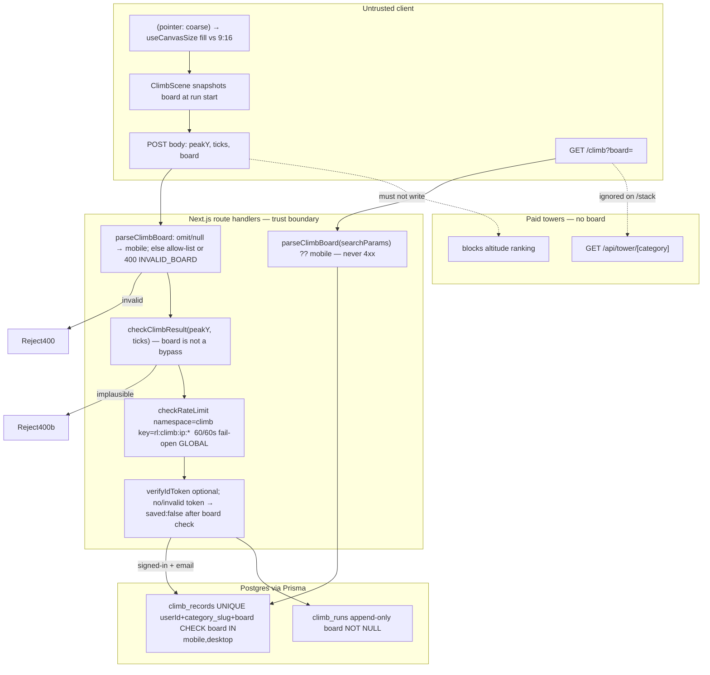

# Architecture — split free-climb leaderboard (mobile / desktop)

Scoped revision of the draft on `cursor/leaderboard-device-split-715e` (PR #49).
The branch is **not** the contract. `loop/spec.md` AC-1–AC-27 is. This document
tells the implementer what to keep, what to rewrite, and which invariants the
draft conflated.

**Stance:** keep the play-surface classifier, allow-list parser, omit→mobile
writes, per-board uniqueness/rank, paid towers unsplit, `/climb` default mobile,
landing/dashboard mobile-first, client-declared board on this non-payout ranking.
**Revise** historical cutover (D-1), hero Top climb (D-2), landing teaser
unavailable vs empty (D-3), and the AC-17 empty-Mobile control.

This is not a greenfield app. No second ORM, HTTP client, test runner, or design
system.

---

## 1. Stack (confirm, do not replace)

| Layer | Choice | Rationale | Not choosing |
| --- | --- | --- | --- |
| App | Next.js App Router in `app/` | Already the product (`context/profile.json`) | Pages Router, a new Next app |
| DB | Prisma + Postgres (Neon) | Already maps `ClimbRecord` / `ClimbRun`; kernel: declare indexes in `schema.prisma` | Drizzle, raw-only, a second ORM |
| Package manager | `pnpm` in `app/` | Existing lockfile | yarn/npm inside `app/` |
| Cache | Upstash Redis | Existing persist rate limiter | Per-board Redis standings cache |
| Auth | Firebase Auth, `requireAuth` in handlers | Middleware is presence-only (`context/trust.md`) | New authn |
| UI | React + Tailwind, ASCENT (`app/DESIGN.md`) | Tabs, 44×44, tokens already exist | Novel design system / design-ux stage |

UI is a tabbed leaderboard on an existing page, not a novel surface. **nextStage
is implementer**, not design-ux.

---

## 2. AC → architectural need

| ACs | Need | Contract (this doc) |
| --- | --- | --- |
| AC-1, AC-3, AC-6 | Default **view** | `GET /climb` searchParams; unknown → Mobile, HTTP 200 |
| AC-2, AC-5 | Desktop view + deep link | `?board=desktop`; Mobile tab href = `/climb` (no query) |
| AC-4, AC-19 | Failed read ≠ empty | Per-board `{ ok \| unavailable }`; never `.catch(() => [])` |
| AC-7, AC-12 | Isolation | `WHERE board = $board` on every list, rank, and `totalClimbers` |
| AC-8, AC-9, NFR-9 | Classifier | Play surface (coarse + fill vs fine + 9:16), snapshotted at run start |
| AC-10 | Default **write** | Omit / JSON `null` → persist `mobile`. **Not** history policy |
| AC-11 | Reject, never coerce | `400 { error, code: "INVALID_BOARD" }` before auth/anon short-circuit |
| AC-13, AC-14, AC-16 | Independent peaks | Unique `(userId, category_slug, board)`; `nextPeak` per row only |
| AC-15 | Historical cutover | Existing untagged rows → **Desktop**. Column default for **new** inserts → mobile |
| AC-17 | Empty featured board | When Mobile has 0 and Desktop has ≥1 (or Desktop read failed), empty Mobile offers a Desktop control |
| AC-18 | Landing teaser | Both boards, Mobile selected, tab switch stays on `/` |
| AC-20 | Hero Climbers | `COUNT(DISTINCT userId)` across both boards |
| AC-21 | Hero Top climb | `MAX(peak_y)` **Mobile only**; empty Mobile → `null` → `—` |
| AC-22–AC-24 | Dashboard | `freeClimb.boards[]` existing rows only, Mobile first |
| AC-25–AC-27 | Paid isolation | No `board` on Block / `/stack` / paid hero stats |
| NFR-1 | Auth | Persist optional after board validation; dashboard Bearer |
| NFR-2 | Privacy | Handles only on both boards |
| NFR-3 | Envelope | `scoreBounds` still 400 `IMPLAUSIBLE_RESULT` regardless of board |
| NFR-4 | Rate limit | **Global** `60 / 60s / IP`, namespace `climb` — **not** per board |
| NFR-5 | Freshness | `/climb` `force-dynamic`; persist `revalidatePath` `/` and `/climb` |
| NFR-6 | Latency | One board of 50 on `/climb`; two teaser reads **concurrent**; dashboard ≤2 extra standing queries vs pre-split |
| NFR-7 | Scale | Top 50 / teaser 8; design for 10k rows **per board** |
| NFR-8 | A11y | Existing `tablist`; empty-state control ≥44×44, not `text-muted` only |
| F-1 | Out of scope | Do not add re-sim; do not mark F-1 closed |

---

## 3. Data flow and trust boundary



**Trust boundary.** `board` is client-declared and **spoofable in the same class
as `peakY`**. Allow-list + 400 is the control, not User-Agent and not viewport
width. Both values are irreversible once written (`Math.max` per board). This
change **does not** close F-1. `scoreBounds` still runs on every persist,
including omit→mobile and explicit desktop. Splitting boards **doubles**
irreversible write targets; that is accepted for this non-payout ranking.

---

## 4. Data model

### 4.1 Enum (application, exhaustive)

```ts
type ClimbBoard = "mobile" | "desktop";
// Order for display: mobile first, then desktop.
CLIMB_BOARD_ORDER = ["mobile", "desktop"] as const
DEFAULT_CLIMB_BOARD = "mobile"  // view + omit-POST only
```

No `"legacy"`, no `"tablet"`, no case variants. Postgres CHECK matches the
allow-list. Prisma cannot express CHECK; keep it in migration SQL (same pattern
as `peak_y >= 0` in `0005`) **and** mention it in the `schema.prisma` comment so
`db push` readers know it exists. Declare **indexes** in `schema.prisma` so
`db push` cannot drop them (kernel).

### 4.2 `ClimbRecord` (`climb_records`)

| Field | Type | Null | Notes |
| --- | --- | --- | --- |
| `id` | String cuid | NOT NULL | PK |
| `userId` | String | NOT NULL | Firebase UID; FK → `users.id` **ON DELETE CASCADE** |
| `category_slug` | String | NOT NULL | Always `FREE_STACK_SLUG` (`"free"`). Paid slugs never land here |
| `board` | String | NOT NULL | `mobile` \| `desktop`. **Prisma `@default("mobile")` = insert default for NEW rows** |
| `peak_y` | Float | NOT NULL, default 0 | CHECK `>= 0`. Monotonic **per (user, slug, board)** via `nextPeak` |
| `wins` | Int | NOT NULL, default 0 | Per board |
| `updated_at` | DateTime | NOT NULL | `@updatedAt`. Tie-break: earlier first |

**Unique key:** `@@unique([userId, category_slug, board], name: "climb_record_user_category_board")`.
One account **may** hold two rows (one per board). A phone PB cannot overwrite a
keyboard PB.

**Indexes (declare in schema):**

- Unique: `climb_record_user_category_board` on `(userId, category_slug, board)`.
- Leaderboard: `climb_record_leaderboard_idx` on
  `(category_slug, board, peak_y DESC, updated_at ASC)`.
  The draft index omitted `updated_at`. Include it so NFR-7 ties
  (`peak desc, earlier update first, per board`) do not sort 10k rows in memory.

**CHECK (migration SQL):** `board IN ('mobile', 'desktop')` as
`climb_records_board_valid`.

**Delete policy:** user delete cascades records on **both** boards. No endpoint
deletes a single board. No copy/max across boards. Runs are not deleted with the
user (`ClimbRun.userId` SET NULL) — existing policy; `board` stays on the run
row for audit.

### 4.3 `ClimbRun` (`climb_runs`)

Same `board` column: NOT NULL, Prisma `@default("mobile")` for new inserts,
CHECK `climb_runs_board_valid`. Append-only. No unique on board. Existing
indexes stay (`category_slug, created_at`, `userId, created_at DESC`). Do not
partition replay lists in this change (spec out of scope).

### 4.4 Paid models

`Block`, `Season`, `Payment` — **no `board` column**. Skill `board` must not
appear on altitude writes or tower queries (AC-25–AC-27).

### 4.5 Column default vs cutover (do not conflate)

| Event | `board` value | Why |
| --- | --- | --- |
| Pre-split row (no column existed) | **desktop** after cutover | AC-15. Original contract was locked 9:16 |
| New INSERT that omits `board` | **mobile** | AC-10. Prisma / Postgres default |
| New INSERT with `board='desktop'` | desktop | AC-9 |
| New INSERT with `board='mobile'` | mobile | AC-8 |

Prisma `@default("mobile")` is **only** the insert default. It must not be
documented or used as “existing rows land on mobile”. The draft schema comment
and CHANGELOG line are wrong.

---

## 5. Cutover plan

Production (`development` / `main`) **does not have** `board` yet. PR #49’s
`0010_climb_board_split` uses `ADD COLUMN ... DEFAULT 'mobile'`, which backfills
every historical row onto the featured board (D-1 / AC-15). Revise that.

### 5.1 Rewrite `0010` (fresh apply — the production path)

Postgres `ADD COLUMN ... DEFAULT x` backfills existing rows with `x`.
`ALTER COLUMN ... SET DEFAULT y` changes **future** inserts only and does not
rewrite rows.

```sql
-- Existing rows → desktop (AC-15). New inserts without a value → mobile (AC-10).
ALTER TABLE "climb_records" ADD COLUMN "board" TEXT NOT NULL DEFAULT 'desktop';
ALTER TABLE "climb_runs"    ADD COLUMN "board" TEXT NOT NULL DEFAULT 'desktop';

ALTER TABLE "climb_records" ALTER COLUMN "board" SET DEFAULT 'mobile';
ALTER TABLE "climb_runs"    ALTER COLUMN "board" SET DEFAULT 'mobile';

ALTER TABLE "climb_records" ADD CONSTRAINT "climb_records_board_valid"
  CHECK ("board" IN ('mobile', 'desktop'));
ALTER TABLE "climb_runs" ADD CONSTRAINT "climb_runs_board_valid"
  CHECK ("board" IN ('mobile', 'desktop'));

DROP INDEX IF EXISTS "climb_record_user_category";
CREATE UNIQUE INDEX "climb_record_user_category_board"
  ON "climb_records"("userId", "category_slug", "board");

DROP INDEX IF EXISTS "climb_record_leaderboard_idx";
CREATE INDEX "climb_record_leaderboard_idx"
  ON "climb_records"("category_slug", "board", "peak_y" DESC, "updated_at" ASC);
```

`ADD COLUMN` does **not** bump `updated_at`. That fact is load-bearing for §5.2.

After this migration on a database that never had `board`, every pre-split
record is Desktop, uniqueness is still one row per user, and omit-POST writes
use DEFAULT mobile / explicit client `board`.

### 5.2 Add `0011_climb_board_history_to_desktop` (repair + idempotent)

Preview/local DBs may already have applied the **wrong** `0010` (all rows
`mobile`). Do not blanket `UPDATE ... SET board='desktop' WHERE board='mobile'`
— that would also move legitimate post-split omit-POST Mobile writes.

`0011` re-homes only rows whose timestamps predate `0010`’s
`_prisma_migrations.finished_at`:

1. **Historical `climb_records`:** `board='mobile' AND updated_at < 0010.finished_at`
   → set `desktop`.
2. **Collision (preview only):** a user who already has a `desktop` row (explicit
   POST after the wrong `0010`) plus a historical `mobile` row would violate
   `climb_record_user_category_board`. Before step 1, for those users:
   `desktop.peak_y = GREATEST(desktop.peak_y, historical_mobile.peak_y)` (and
   `wins = desktop.wins + historical_mobile.wins` is acceptable; do not drop
   wins), then `DELETE` the historical mobile row. Production first-apply of
   rewritten `0010` never hits this (one row per user, already desktop).
3. **Historical `climb_runs`:** `board='mobile' AND created_at < 0010.finished_at`
   → set `desktop`. No unique key; no merge.
4. `ALTER COLUMN SET DEFAULT 'mobile'` (idempotent if already mobile).

If `_prisma_migrations` has no `0010` finished_at, skip the UPDATEs (rewritten
`0010` already did the right backfill).

If rewritten `0010` checksums fail on a long-lived preview that applied the old
file: **do not** `migrate resolve --rolled-back`. Leave `0010` applied and rely
on `0011`. Fresh `development`/`main` will run corrected `0010` then no-op
`0011`.

### 5.3 After cutover: empty Mobile is expected

Featured `/climb` and the landing Mobile tab may list 0 climbers while Desktop
holds the mixed-era history. That is AC-15 succeeding, not a wipe. **AC-17 is
the product control** — see §7.3. Do not secretly copy Desktop peaks onto Mobile.

### 5.4 Docs the draft got wrong

- `schema.prisma` comments: insert default mobile; historical cutover desktop.
- `CHANGELOG.md`: “Existing records land on mobile” → Desktop.
- `context/trust.md`: keep omit→mobile / invalid→400; add one sentence that
  **untagged historical rows cut over to desktop**. Do not imply DEFAULT mobile
  is the history rule (D-5).
- `src/game/climbBoard.ts` header: view + omit-write default only.

---

## 6. API contracts

Error shape at HTTP boundaries: `{ error: string, code: string }`. No stacks, no
raw Prisma messages (`context/conventions.md`).

### 6.1 `POST /api/climb/result`

| | |
| --- | --- |
| Auth | Optional Firebase Bearer. Absence/invalid/no-email → `200 { saved: false, reason }` **after** board validation |
| Rate limit | `namespace: "climb"`, `identifier: "ip:" + clientIp`, **60 / 60s**, fail-open. Key `rl:climb:ip:<ip>`. **Not** `rl:climb:<board>:...` |
| Idempotency | None. Each POST inserts a `ClimbRun`. Abuse budget is the global cap |
| Revalidation | On `saved: true`: `revalidatePath("/climb")` and `revalidatePath("/")` (covers `?board=desktop`) |

**Request JSON** (relevant fields):

| Field | Required | Rules |
| --- | --- | --- |
| `peakY` | yes | finite number |
| `seed` | yes | string |
| `ticks` / `finishedTick` | for envelope | existing `scoreBounds` path |
| `board` | no | omit or JSON `null` → `"mobile"`; exact `"mobile"` \| `"desktop"`; **anything else** → 400 |
| `categorySlug` | no | **Ignored for placement.** Persist always uses `FREE_STACK_SLUG`. Paid slug must not write Block altitude (AC-26) |

**Allow-list (write path).** `parseClimbBoard` returns `null` on unknown.
`parseBoardField`: `undefined` \| `null` → `"mobile"`; else `parseClimbBoard(raw) ?? "invalid"`. Invalid includes `"Mobile"`, `"tablet"`, `1`, `{}`, `""`, `" desktop"`. Reject, never substitute (kernel). Omitted is a **documented product default**, not coercion of an unknown string.

**Handler order (load-bearing for AC-11):**

1. Parse JSON (400 invalid JSON).
2. Shape-check `peakY` / `seed` (existing 400 `"Invalid climb result"`).
3. **Parse `board`. If invalid → `400 { error: "Invalid climb board", code: "INVALID_BOARD" }` with no `ClimbRun` and no `ClimbRecord` write.** This runs **before** auth, anonymous short-circuit, and `recordClimb`.
4. `checkClimbResult` → `400 { error: "Implausible climb result", code: "IMPLAUSIBLE_RESULT" }` regardless of board (NFR-3).
5. Rate limit → `429 { error: "Too many requests", code: "RATE_LIMITED" }`.
6. Auth optional → persist or `saved: false`.

**200 `saved: true`:**

```json
{
  "saved": true,
  "peakY": 12.5,
  "improved": true,
  "rank": 4,
  "totalClimbers": 40,
  "handle": "…",
  "board": "mobile"
}
```

`rank` and `totalClimbers` are **scoped to `board` only** (COUNT of rows with
that `category_slug` + `board`). `board` in the JSON is the board written, so
the client “view leaderboard” link uses `climbBoardPath(result.board)`.

**4xx:**

| Status | code | When |
| --- | --- | --- |
| 400 | *(none required)* | Invalid JSON / missing peakY or seed |
| 400 | `INVALID_BOARD` | board not in allow-list and not omit/null |
| 400 | `IMPLAUSIBLE_RESULT` | envelope fail |
| 429 | `RATE_LIMITED` | global cap |

Anonymous invalid board must **not** return `200 { saved: false, reason: "anonymous" }`.

### 6.2 `GET /api/dashboard`

| | |
| --- | --- |
| Auth | Required Firebase Bearer (`requireAuth`). 401 existing shape |
| `freeClimb` | `null` if the user has **no** free-climb rows (either board) |

**`freeClimb` 200 fragment:**

```json
{
  "freeClimb": {
    "handle": "…",
    "boards": [
      { "board": "mobile", "peakY": 12, "rank": 3, "totalClimbers": 10, "wins": 0 },
      { "board": "desktop", "peakY": 40, "rank": 1, "totalClimbers": 80, "wins": 2 }
    ]
  }
}
```

Rules:

- Include **only boards the user has a row on** (AC-23: Desktop-only → one
  element, not a fake Mobile at peak 0).
- Sort with `CLIMB_BOARD_ORDER` (Mobile first) (AC-22).
- `rank` / `totalClimbers` counted **inside that board**.
- Empty → `freeClimb: null` → `FreeClimbEmpty`, no invented rank (AC-24).
- Each row links to `climbBoardPath(board)` (S7).

Query budget (NFR-6): at most **one** `findMany` of the user’s free records plus
**at most two** per-board standing queries (rank count + total, batched). Do not
await per-row. At 10k/board, rank is `COUNT(*) WHERE board=X AND peak_y > mine`,
not `findMany` + `findIndex`.

### 6.3 Paid APIs

`GET /api/tower`, `GET /api/tower/[category]`, checkout, webhooks — **no
`board`**. `?board=` on `/stack/[category]` is ignored (AC-25). POST climb
result never writes `blocks.altitude` (AC-26).

---

## 7. Page contracts

### 7.1 `GET /climb`

`export const dynamic = "force-dynamic"` stays (NFR-5). Do not ISR this page.

**searchParams.board**

| Input | Selected board | HTTP |
| --- | --- | --- |
| missing | mobile | 200 |
| `mobile` | mobile | 200 |
| `desktop` | desktop | 200 |
| `tablet`, `Mobile`, `1`, `""`, other | **mobile** (not merged, not desktop) | 200, not 4xx |

Parser: `parseClimbBoard(sp.board) ?? DEFAULT_CLIMB_BOARD`. Same allow-list as
POST, **different failure**: GET never 400s (AC-3).

Tabs: `hrefFor` defaults to `climbBoardPath` — Mobile → `/climb`, Desktop →
`/climb?board=desktop` (AC-5, AC-6). List: `topFreeClimbers(50, selected)` only
(AC-1, AC-2, AC-7).

**Unavailable vs empty (AC-4).** Failed `topFreeClimbers` → `unavailable: true`,
not `[]`. Keep the draft `/climb` pattern (`catch` → `null`). Do **not** copy
the landing teaser’s `.catch(() => [])`.

### 7.2 Landing `#free` teaser (AC-18, AC-19)

Replace independent swallowed reads with a **per-board result**:

```ts
type BoardRead =
  | { status: "ok"; climbers: ClimberRank[] }      // may be length 0
  | { status: "unavailable" };

// Two reads in Promise.all (NFR-6). Each catch → { status: "unavailable" }, never [].
```

`FreeLeaderboardBoard` props: `{ mobile: BoardRead; desktop: BoardRead }`.
Client state defaults to Mobile. Tab switch does not navigate off `/`. “Full
leaderboard” uses `climbBoardPath(selected)`.

Render:

| Read | UI |
| --- | --- |
| `unavailable` | same standings-unavailable copy as `/climb` (AC-4/AC-19) |
| `ok` + length 0 | empty-board copy, plus AC-17 control when applicable |
| `ok` + rows | list of 8 |

If Mobile teaser fails and Desktop succeeds: Mobile tab shows unavailable;
Desktop tab still lists. Symmetric. **Do not** let one failure empty both.

### 7.3 AC-17 — empty Mobile control

**When:** the visitor is on the **Mobile** surface (`/climb` with selected
mobile, or landing Mobile tab) **and** Mobile standings are a successful empty
list (not unavailable).

**Desktop populated?**

| Desktop read | Show control? |
| --- | --- |
| ok, ≥1 climber | **Yes** |
| ok, 0 climbers | No (both empty — nothing to recover) |
| unavailable / error | **Yes** (fail open toward “looks like a wipe” after cutover) |

**`/climb` extra read:** when selected board is mobile **and** the mobile list
is `ok` + empty, run a cheap existence probe (`count` or `findFirst({ select: { id } })`
on desktop). Do **not** fetch a second top-50. If the probe throws, treat as
unavailable → still show the control.

**Control:** a real control (link or button), min **44×44**, accessible name
includes “Desktop”. Not `text-muted` as the only text.

| Surface | Activation |
| --- | --- |
| `/climb` | navigates to `/climb?board=desktop` |
| Landing Mobile tab | selects the Desktop tab (stay on `/`). A link to `/climb?board=desktop` is also valid |

Do not invent a Desktop-empty → Mobile control. Do not show the control on
unavailable Mobile (AC-4/AC-19 win).

### 7.4 Hero (`getGlobalClimbStats`)

One round-trip (raw SQL or equivalent Prisma). **Do not** `MAX(peak_y)` over all
free rows.

```sql
SELECT
  COUNT(DISTINCT "userId")::int AS climbers,
  MAX(peak_y) FILTER (WHERE board = 'mobile') AS top
FROM climb_records
WHERE category_slug = $free_stack_slug
```

(`MAX(CASE WHEN board = 'mobile' THEN peak_y END)` is equivalent.)

| Output | Meaning |
| --- | --- |
| `climberCount` | Distinct users with a row on **either** board (user on both counts once) — AC-20 |
| `topPeak` | Mobile max metres, or `null` if Mobile has no rows — AC-21 |

Hero already maps `topPeak == null` → `—`. After cutover, Desktop can hold the
global max while Top climb shows `—` until someone posts a Mobile run. That is
correct.

Landing `getGlobalClimbStats().catch(() => ({ climberCount: 0, topPeak: null }))`
is pre-existing hero degrade. **Do not** change it in this PR unless a test
already covers it; AC-20/21 are about the successful aggregate.

Paid hero stats (`totalBlocks`, `minEntryUsd`) stay paid-only (AC-27).

### 7.5 Classifier (client)

`useCoarsePointer` (`(pointer: coarse)`) drives `useCanvasSize({ fill })`.
`climbBoardFromPointer(coarse)` → mobile / desktop. **Not** `innerWidth`, **not**
User-Agent, **not** `navigator.maxTouchPoints` alone.

**Snapshot at run start** (NFR-9): persist the board that matched **that run’s
canvas**, not a pointer change after Start and not after persist. Hybrid laptops
follow the canvas they actually used. `buildRun()` must not re-read a live
pointer if it can flip mid-run.

Viewport width ≥1024 with coarse pointer still posts **mobile** (AC-8). Width
≤390 with fine pointer still posts **desktop** (AC-9).

---

## 8. Folder tree (2–3 levels) and ownership

```
app/
  prisma/
    schema.prisma                          # data — comments, default, indexes
    migrations/0010_climb_board_split/     # data — rewrite DEFAULT split
    migrations/0011_climb_board_history_to_desktop/  # data — repair cutover
  app/
    page.tsx                               # frontend — hero stats + teaser
    climb/page.tsx                         # frontend — searchParams, AC-17 probe
    dashboard/page.tsx                     # frontend — boards vs empty card
    stack/[category]/page.tsx              # frontend — ignore ?board= (paid)
    api/climb/result/route.ts              # backend — allow-list, envelope, RL
    api/dashboard/route.ts                 # backend — freeClimb.boards shape
  src/
    db/climb.ts                            # data/backend — recordClimb, stats, rank
    game/climbBoard.ts                     # shared — allow-list, paths, order
    game/scoreBounds.ts                    # backend — unchanged caller
    game/freeStack.ts                      # shared — FREE_STACK_SLUG
    hooks/useCoarsePointer.ts              # frontend — classifier input
    hooks/useCanvasSize.ts                 # frontend — fill vs 9:16
    components/Climb/                      # frontend — tabs, list, empty+AC-17
    components/LandingPage/FreeLeaderboard*.tsx  # frontend — BoardRead
    components/Dashboard/FreeClimbCard.tsx # frontend
    components/Game/ClimbScene.tsx         # frontend — snapshot + POST board
    lib/rateLimit.ts                       # backend — keep global key
    lib/revalidateClimbLeaderboard.ts      # backend
    lib/handle.ts                          # privacy — unchanged
  tests/
    db/climb.test.ts                       # invoke recordClimb / stats / isolation
    db/fakePrisma.ts                       # $queryRaw or aggregate for stats
    api/climbResult.route.test.ts          # INVALID_BOARD before anon; omit→mobile
    game/climbBoard.test.ts                # parser + pointer map
```

Specialists: **data** owns 0010/0011 + schema; **backend** owns persist/stats;
**frontend** owns `/climb`, teaser, AC-17, snapshot; **security-reviewer** owns
allow-list + F-1 non-closure + global RL. Verifier invokes production functions;
no `readFileSync` + `toContain` as proof of AC-4/AC-19 (the existing
`renderingMode.test.ts` greps are **not** the AC-19 gate).

---

## 9. Failure modes (external + product)

| Dependency / case | Failure | Behaviour |
| --- | --- | --- |
| Postgres / Neon | `topFreeClimbers` throws | That board: unavailable copy. Other board (landing): still lists if its read succeeded |
| Postgres | `recordClimb` throws | `500 { saved: false, reason: "persist_error" }`. No partial rank JSON |
| Postgres | `getGlobalClimbStats` throws | Existing hero degrade `0` / `null` (`—`) |
| Redis | rate limiter down | Fail **open** (existing). Do not skip `scoreBounds` |
| Firebase | bad/missing token | `saved: false` **after** valid board parse |
| Cutover | `0010` not applied | Do not ship UI that filters `board=` against a missing column — same deploy |
| Cutover | empty Mobile, populated Desktop | AC-17 control; do not copy peaks |
| Cutover | empty Mobile, Desktop read fails | Show Desktop control (fail open) |
| Client spoofs `board` | keyboard peak on Mobile | Accepted; same class as spoofed `peakY`. Not a payout board |
| Old client omits `board` | fill **or** 9:16 peak lands on Mobile | Spec risk; short-lived if client+API ship together. Invalid strings still 400 |
| Hybrid pointer change mid-run | without snapshot, persist board ≠ canvas | Snapshot at Start (NFR-9) |
| 10× (10k / board) | unindexed sort / `findIndex` rank | Use declared index + `COUNT` / `take: 50` |
| Rate limit partitioned by board | 120 writes / 60s | **Forbidden** (NFR-4). Ranking is partitioned; abuse budget is not |
| Paid `?board=` | none | Ignore; single altitude list |

---

## 10. ADRs

### ADR-1 — Historical untagged rows cut over to Desktop

**Decision:** Pre-split skill rows become `board='desktop'`. Prisma/Postgres
**insert** default remains `'mobile'`.

**Why:** “Mobile is default” means default **view** and **omit-POST write**
(AC-10), not the home for mixed-era scores. Fill-stage is ~2 days old vs ~4 days
of 9:16-only play. Dumping history onto featured Mobile recreates the unfair
ranking this split exists to remove. A third legacy board is out of scope.

**Rejected:** Draft `DEFAULT 'mobile'` backfill; copying historical peaks onto
Mobile; leaving `board` nullable.

**Reversible:** Spec allows a human to redirect AC-15 to Mobile if production
evidence says almost all pre-split play was fill-stage. Until then, Desktop.

### ADR-2 — Hero Top climb is Mobile-only; Climbers stay global distinct

**Decision:** `climberCount = COUNT(DISTINCT userId)` across both boards.
`topPeak = MAX(peak_y)` **where board = mobile** (null → `—`).

**Why:** Kernel: a partitioned resource cannot keep the old global scalar.
`MAX` across boards is `max(mobile, desktop)` and would feature a 9:16 peak as
the site-wide Top climb after cutover. Distinct **people** is a headcount, not a
ranking, and stays global (AC-20).

**Rejected:** Draft `MAX(peak_y)` over all `climb_records`; two hero numbers per
board; showing Desktop max when Mobile is empty.

### ADR-3 — Classifier is play surface, not UA / viewport

**Decision:** Board of a run = the canvas path for that run: coarse pointer +
`useCanvasSize({ fill: true })` → Mobile; fine pointer + locked 9:16 → Desktop.
Server allow-lists the client-declared value. Snapshot at run start.

**Why:** Visible tower metres scale with aspect. Viewport width and User-Agent
do not choose fill vs 9:16 today (`ClimbScene` already uses `useCoarsePointer`).
Landing tab is **not** auto-selected from the visitor’s pointer (spec).

**Rejected:** `innerWidth < 768`; `sec-ch-ua-mobile`; server-side UA parse.

### ADR-4 — Persist rate limit stays global (exception to “partition the keys”)

**Decision:** Keep `rl:climb:ip:*` at 60/60s. Do **not** add `board` to the Redis
key.

**Why:** Kernel 15 says when a **counter** is partitioned, every key that gates
writes to it must gain the partition. Here the **ranking** is partitioned, not
the abuse counter. NFR-4 forbids doubling the write budget. Score envelope is
unchanged per request.

**Rejected:** 60 per board per IP.

### ADR-5 — Client `board` is accepted; F-1 stays open

**Decision:** Allow-listed client `board` on this non-payout ranking. Invalid →
400. Do not add server re-simulation of `peakY`. Do not claim F-1 closed because
board is allow-listed.

**Why:** Product-spec explicit exception. Free climb remains reputation-adjacent
(landing, next to paid stacks) and still monotonic. Security-reviewer ping
stands as an **open product question**, not a blocker for this PR.

---

## 11. Security boundaries

| Topic | Rule |
| --- | --- |
| Authn | POST persist optional; dashboard `requireAuth`. Middleware is not access control |
| Authz | A user can only upsert their own `userId` from the verified token. No admin board-rewrite API in this change |
| PII | Boards show `climberDisplay` (handle / moderated name). Email never on `/climb` or teaser. Dashboard `user.email` is the caller only |
| Secrets | No new names. Existing: `DATABASE_URL`, `DIRECT_URL`, `UPSTASH_REDIS_REST_URL`, `UPSTASH_REDIS_REST_TOKEN`, Firebase admin, `INTERNAL_TOKEN` (unused here) |
| Irreversible writes | `peakY` and `board` together choose a ranking cell that only rises. Treat both as untrusted |
| Allow-list | Single `parseClimbBoard` in `src/game/climbBoard.ts`. `Object.hasOwn` on the allow-list. Write path 400s; GET path defaults to mobile |
| Paid isolation | Skill persist must not touch `blocks` |

---

## 12. Hot paths, cache, N+1

| Path | Budget | Notes |
| --- | --- | --- |
| `GET /climb` | 1 × `findMany` take 50 on `climb_record_leaderboard_idx`; +1 count/findFirst **only** on empty Mobile for AC-17 | `force-dynamic`. p95 TTFB ≤ 1.0s |
| Landing teasers | 2 × `findMany` take 8, **concurrent** | Combined wall ≤ 1.5× one read. ISR ≤ 60s + `revalidatePath("/")` |
| `getGlobalClimbStats` | 1 aggregate query | Do not load all rows into Node |
| `POST /api/climb/result` | insert run + findUnique + upsert + 2 counts | Rank via COUNT, not load-all |
| Dashboard free-climb | 1 findMany user rows + ≤2 standing queries | NFR-6. `groupBy`/`COUNT` not per-row await |
| Redis | `rl:climb:ip:<ip>` TTL 60s | Eviction = TTL. Cardinality = unique IPs in the window, not unbounded Map |

**Cache keys:** none for standings besides Next ISR on `/` (`revalidate = 60`)
and on-demand `revalidatePath`. Do not add a Redis leaderboard cache in this PR.

**Invalidation:** persist success → `/` and `/climb`. Do not require a
per-board path; App Router `revalidatePath("/climb")` covers searchParams.

**N+1 risks:** `getUserFreeClimbRecords` looping `Promise.all` of counts **per
board** is OK at N=2 if the loop is over `CLIMB_BOARD_ORDER` (fixed). Do not
loop users. `topFreeClimbers` already `take` + `select`. FakePrisma must grow
`$queryRaw` **or** `aggregate`/`distinct` so `getGlobalClimbStats` tests invoke
the production function (no SQL greps; no reimplemented MAX in the test).

---

## 13. What the draft already got right (keep)

- `parseClimbBoard` allow-list + POST omit/null → mobile + invalid 400.
- Unique `(userId, category_slug, board)` and `boardWhere` on list/rank.
- Rank on both; independent `nextPeak`.
- Paid towers unsplit; `recordClimb` forces `FREE_STACK_SLUG`.
- `/climb` default mobile; unknown query → mobile 200.
- Landing + dashboard Mobile first (`CLIMB_BOARD_ORDER`).
- `/climb` unavailable vs empty (do not regress).
- Client-declared board; coarse-pointer classifier; `climbBoardPath`.
- Global 60/60s rate limit; `scoreBounds` before persist.
- `force-dynamic` on `/climb`; revalidate `/` + `/climb`.

---

## 14. Implementer revision checklist

Do not rubber-stamp PR #49. Treat the branch as a draft. Proof is invoking
production units / routes, not grepping source.

### D-1 CRITICAL — historical cutover (AC-15, AC-16, AC-17)

- [ ] Rewrite `0010` so **existing** rows backfill **desktop**, then
      `ALTER COLUMN SET DEFAULT 'mobile'` for **new** inserts.
- [ ] Add `0011` timestamp-based re-home + unique-key merge (§5.2). No blanket
      `UPDATE mobile → desktop`.
- [ ] Prisma `@default("mobile")` stays for inserts; comments must not say
      “existing rows default to mobile”.
- [ ] CHANGELOG: historical → Desktop.
- [ ] `context/trust.md`: history sentence Desktop; POST allow-list unchanged.
- [ ] AC-16: a later Mobile persist uses `nextPeak` on the **mobile** row only
      (new row at P, historical Desktop H unchanged). No cross-board `max`.
- [ ] Do not add a third board. Do not copy Desktop onto Mobile to avoid an
      empty featured list.

### D-2 — hero aggregates (AC-20, AC-21)

- [ ] `getGlobalClimbStats`: `climberCount` = `COUNT(DISTINCT userId)` across
      both boards.
- [ ] `topPeak` = `MAX(peak_y)` **Mobile only**; no Mobile rows → `null` →
      hero `—` even when Desktop max is non-null.
- [ ] Test invokes `getGlobalClimbStats` with mixed boards (not a SQL string
      grep). Fixture: Desktop 999 + Mobile 10 → Top climb 10; Desktop only →
      `topPeak === null`; same user on both → climberCount 1.

### D-3 — landing teaser unavailable (AC-19)

- [ ] Delete `.catch(() => [])` on both teaser reads.
- [ ] Per-board `BoardRead` (`ok` \| `unavailable`).
- [ ] Fail Mobile, succeed Desktop: Mobile tab unavailable copy; Desktop tab
      still lists. Symmetric.
- [ ] Unavailable copy is the existing standings-unavailable UI, not
      `[ no climbers yet ]`.
- [ ] Verifier: drive the teaser module/page; do not `toContain("catch(() => [])")`
      as the AC-19 proof.

### AC-17 — empty Mobile control

- [ ] `/climb` default Mobile, 0 mobile rows, ≥1 desktop (or desktop probe
      failed): empty state includes a Desktop control → `/climb?board=desktop`.
- [ ] Landing Mobile tab, same occupancy: control selects Desktop (stay on `/`)
      or links to the Desktop `/climb`.
- [ ] Both boards empty (successful reads): **no** history-recovery control.
- [ ] Unavailable Mobile: AC-4/AC-19, not empty + control.
- [ ] Control ≥44×44; accessible name mentions Desktop; not `text-muted` only.
- [ ] Cheap probe only (count/findFirst), never a second top-50 on `/climb`.

### Keep (D-4) — do not “fix”

Allow-list + omit→mobile + invalid 400; rank on both; paid unsplit; `/climb`
default mobile; classifier = play surface; client board on non-payout ranking;
global 60/60s; do not close F-1; `scoreBounds` on every persist.

### Snapshot + tests

- [ ] Snapshot board at run Start; POST that value (NFR-9).
- [ ] AC-11: unauthenticated POST with `board: "tablet"` → 400 `INVALID_BOARD`,
      `recordClimb` not called.
- [ ] AC-8/AC-9: client sends board from snapshot, not width.
- [ ] FakePrisma: support the stats query path so tests call production
      `getGlobalClimbStats`.

---

## 15. Open questions (none blocking)

F-1 / server-derived `peakY` remains a product-level open question. This
architecture records the exception and does not schedule re-sim.

Power-up stacking vs one-slot, and unscoped `GET /api/tower` scalars, are
unrelated ledger items — **not** this change.
