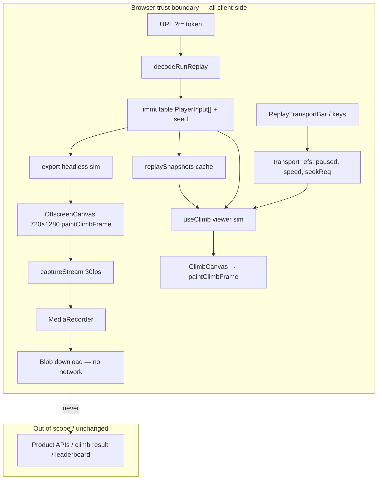

# Architecture: Climb replay transport + client video export

**Goal ID:** replay-transport-export  
**Spec:** `loop/spec.md` (AC-1…AC-20)  
**Stack:** existing Next.js App Router + React + canvas sim in `app/` — **no new runtime dependencies**.  
**Date:** 2026-09-06

## 1. AC → architectural need

| ACs | Need |
| --- | --- |
| AC-1, AC-2, AC-11, AC-12 | Replay-only transport + export chrome; ASCENT tokens; 44×44 targets; reduced-motion does not disable controls |
| AC-3, AC-20 | Separate replay key predicate mirroring `shouldCaptureGameKey` / `isInteractiveTarget`; live Space/jump unchanged |
| AC-4, AC-5, AC-9, AC-10 | Playback controller: pause gate + discrete rate `{1,2,4}` on fixed-timestep accumulator |
| AC-6, AC-7, AC-8, NFR-1, NFR-2 | Deterministic seek via `stepMatch` + snapshot cache (≤500 ms paint) |
| AC-13–AC-19, NFR-3, NFR-6 | Client-only `MediaRecorder` export session; MIME negotiation; progress/cancel; visibility policy |
| NFR-8 | Transport/export code paths idle when `replaying === false` — no new per-frame React work on live play |

**Not in scope:** server APIs, auth, payments, Redis, Prisma, share-token format, audio mux.

## 2. Stack choice

| Choose | Rationale |
| --- | --- |
| Extend `useClimb` + new pure modules under `app/src/game/` | Same fixed-timestep `stepMatch` path already drives replay; keeps one sim |
| Offscreen / detached canvas + `MediaRecorder` + `canvas.captureStream(30)` | Meets client-only MP4/WebM without upload (NFR-6) |
| ASCENT tokens from `app/DESIGN.md` | Spec forbids a second visual language; design-ux stage **not** required first |

**Not choosing:** server FFmpeg/render farm; WebCodecs-only path (weaker Safari story); third-party recorder libs; mutating `encodeRunReplay` / `MAX_SHARE_TICKS`; remounting live `TouchControls` during replay.

## 3. Component boundaries

```
ClimbPlayClient
  └─ ClimbScene (replaying === Boolean(replay))
       ├─ useClimb                    # sim + live input OR replay feed
       │    └─ ReplayTransportController (refs; only active if replaying)
       ├─ ClimbCanvas                 # on-screen paint (calls shared painter)
       ├─ ReplayTransportBar          # pause/rewind/ff/seek/export UI (replay only)
       ├─ ReplayStatusBadge           # Playing / Paused / Finished
       ├─ Finished overlay (+ Restart, Export when replaying)
       └─ useReplayExport             # separate sim+canvas; never mutates viewer tick
            └─ pickExportMime / downloadBlob
```

| Module | Owns | Must not |
| --- | --- | --- |
| `useClimb` | Fixed-timestep rAF, live keys, replay input indexing, apply transport refs when replaying | Own DOM chrome; run export encode |
| `replayTransport.ts` | Constants, speed cycle, rewind math, seek ratio→tick, key predicate | Touch React or canvas |
| `replaySnapshots.ts` | Interval snapshots, seek-to-tick via clone+step | Live-play path |
| `cloneMatch.ts` | Deep clone of `MatchState` for snapshots / export | Share mutable refs with viewer |
| `paintClimbFrame.ts` | Pure draw of tower/climber/lava/(optional HUD) | Draw transport DOM |
| `exportMime.ts` | MIME candidate order + extension + success label | Assume MP4 always |
| `useReplayExport.ts` | Export lifecycle, progress, cancel, visibility | Upload bytes; change viewer tick |
| `ReplayTransportBar.tsx` | ASCENT chrome, a11y, announcements | Drive sim except via controller API |

## 4. Data flow (trust boundaries)



**Trust notes (this feature):** no new server writes; export never POSTs video; free-leaderboard trust-boundary ledger item stays open and **out of scope** (product-spec exception).

## 5. Seek / snapshot strategy (NFR-2)

### Tick model (normative)

- Share log length `N = replay.inputs.length` (`1…MAX_SHARE_TICKS`).
- **Climb tick** `t ∈ [0, N−1]` is `MatchState.tick` while `phase === "countdown" | "climb"` after countdown reset semantics today: countdown drains with `NO_INPUT`, then climb applies `inputs[t]` when stepping from climb tick `t` (same as `useClimb.inputForTick`).
- **Seek target:** `clamp(round(r × (N − 1)), 0, N − 1)` (AC-7).
- **Rewind:** `max(0, t − REWIND_STEP_TICKS)` with `REWIND_STEP_TICKS = 150` (AC-6).
- **Parity oracle:** after seek, `player.y` and `peakY` equal a fresh headless loop: `createMatch` → drain countdown via `stepMatch` → apply `inputs[0]…inputs[target−1]` (zero climb steps ⇒ tick 0). Float compare: absolute equality of the doubles the sim already stores (NFR-1).

### Snapshot cache

| Parameter | Value | ADR |
| --- | --- | --- |
| `SNAPSHOT_INTERVAL_TICKS` | **120** (4.0 s @ 30 Hz) | ADR-1 |
| Keys | Climb ticks `0, 120, 240, …` plus final finished state optional | |
| Value | `structuredClone`-equivalent deep `MatchState` **after** countdown + `k` climb steps | |
| Eviction | Cap = `ceil(MAX_SHARE_TICKS / INTERVAL) + 1` (~151). Fixed cardinality — not unbounded (kernel rule 19). | |
| Build | Lazy on first rewind/seek; fill missing boundaries while seeking; optional `requestIdleCallback` warm-up after decode | |

**Seek algorithm**

1. If `target === current` → no-op paint.
2. If `target > current` and `target - current ≤ SNAPSHOT_INTERVAL_TICKS` → step forward in place (no clone).
3. Else let `base = floor(target / INTERVAL) * INTERVAL`; clone snapshot at `base` (build on miss by stepping from previous snapshot or from 0); step `target - base` times on the clone; install as viewer state; clear accumulator; preserve prior paused/playing flag (AC-7 seek commit).
4. Never mutate a stored snapshot in place — always clone before stepping.

**Budget:** worst case ≤119 `stepMatch` calls after a hit; cold miss at tick ~18 000 builds along the interval chain once, then subsequent seeks stay ≤119 steps. Target paint ≤500 ms mid-tier Chromium (NFR-2). At **10×** `MAX_SHARE_TICKS`, keep the same interval (memory ~linear) or raise interval to 240 — product cap stays 18 000 for v1.

**Delete policy:** cache lives only for the mounted replay session; dropped on unmount / new `runId` restart.

## 6. Playback rate model

```
SPEEDS = [1, 2, 4] as const
default speed = 1
default playing = true (preserve autoStart)
```

When `replaying === true` and not paused and phase in `{countdown, climb}`:

```
accumulator += wallDtSeconds * speed
while accumulator >= TICK_DT:
  accumulator -= TICK_DT
  stepMatch(...)
```

- Pause: skip accumulator integration; tick frozen (AC-4). Speed changes while paused update `speed` only (AC-9 / S3 failure).
- Finished: stop auto-advance; Pause disabled/no-op; Restart → tick 0, speed 1, playing (AC-8, AC-11).
- When `replaying === false`: **identical** to today’s loop (`accumulator += dt` only) — do not read speed/pause refs (NFR-8).

Wall-clock windows for AC-10 assume foreground tab; existing `dt` clamp `0.25` remains for background playback (edge case 8).

## 7. Export pipeline

### Session

1. User activates Export (transport or finished overlay) while a decoded replay is loaded.
2. If export already active → ignore (AC-14 negative).
3. `pickExportMime()`; if none → error within 2 s (AC-17).
4. Create **detached** `MatchState` + OffscreenCanvas or HTMLCanvasElement **720×1280** (devicePixelRatio forced to 1 for stable encode size).
5. `stream = canvas.captureStream(30)`; `recorder = new MediaRecorder(stream, { mimeType, videoBitsPerSecond: 2_500_000 })`.
6. Drive ticks on a **timer/`rAF` export loop** at 1× into the encoder (ignore viewer scrub/speed) (AC-13):
   - drain countdown without capturing (or capture countdown — **decision: skip countdown frames**; encode climb ticks `0…N−1` only so duration ≈ `N/30` s) — ADR-2.
   - each climb step: `stepMatch` → `paintClimbFrame` (HUD allowed; **no** transport DOM) → one frame cadence ~33.3 ms wall toward recorder.
7. Progress `floor(100 * climbTick / max(1, N - 1))` at least every 15 ticks or 250 ms (AC-16).
8. Cancel: `recorder.stop()` / abandon; **do not** invoke download (AC-16).
9. On `stop`: build `Blob`, download via temporary `<a download>`, revokeObjectURL; success copy format-honest (AC-15).
10. Viewer transport state **unchanged** after success/cancel (edge 6).

### MIME negotiation order (normative)

Probe with `MediaRecorder.isTypeSupported` in order; first hit wins:

1. `video/mp4;codecs=avc1.42E01E` — H.264 Baseline (Safari / some Chromium)
2. `video/mp4;codecs=avc1.4D401E` — H.264 Main
3. `video/mp4` — container-only fallback
4. `video/webm;codecs=vp9` — silent VP9
5. `video/webm;codecs=vp8` — silent VP8
6. `video/webm` — generic WebM

No audio tracks / no audio codec strings (v1 silent).

| Selected prefix | Extension | Success UI |
| --- | --- | --- |
| `video/mp4` | `.mp4` | `Downloaded MP4` |
| `video/webm` | `.webm` | `Downloaded WebM` |

Filename: `climb-{peakMetres}m-{yyyyMMdd}{ext}` with `peakMetres = round(replay.peakY)`, `yyyyMMdd` = UTC date at export **start**.

### Visibility (AC-18)

**Policy (b):** if `document.visibilityState === "hidden"` for ≥3 s during export → pause encode loop, show “Return to this tab to finish exporting”, resume on `visible`. Do not finish with an empty blob. (Background `rAF`/capture is unreliable; do not claim silent continue.)

### Failure (AC-19)

Any `MediaRecorder` `error`, security/`tainted` canvas, or OOM → dismissible reason string; restore idle within 2 s; transport remains usable.

## 8. Public APIs / hooks (contracts)

### Constants — `app/src/game/replayTransport.ts`

```ts
export const REWIND_STEP_TICKS = 150;
export const REPLAY_SPEEDS = [1, 2, 4] as const;
export type ReplaySpeed = (typeof REPLAY_SPEEDS)[number];
export const SNAPSHOT_INTERVAL_TICKS = 120;

export function cycleReplaySpeed(current: ReplaySpeed): ReplaySpeed;
export function rewindTargetTick(tick: number): number; // max(0, tick - 150)
export function tickFromSeekRatio(r: number, n: number): number; // AC-7
export function formatReplayClock(tick: number): string; // mm:ss from tick/30

export function shouldCaptureReplayKey(
  key: string,
  replaying: boolean,
  targetIsInteractive: boolean
): boolean;
// true only when replaying && !interactive && key in
// Space, k/K, j/J, l/L, ., Home, 0
```

Hold-repeat for rewind: ≤1 fire / 200 ms (spec table).

### Snapshot — `app/src/game/replaySnapshots.ts`

```ts
export function cloneMatchState(state: MatchState): MatchState;

export class ReplaySnapshotCache {
  constructor(args: {
    tower: TowerSpec;
    seed: string;
    inputs: readonly PlayerInput[];
    cfg?: SimConfig;
    intervalTicks?: number; // default 120
  });
  /** Climb tick after seek; state is a fresh clone installed by caller. */
  seek(targetClimbTick: number): MatchState;
  invalidate(): void;
}
```

### `useClimb` extensions (replay-only surface)

```ts
// Additions to UseClimbResult — safe no-ops / stable defaults when !replaying:
transport: {
  paused: boolean;
  speed: ReplaySpeed;
  climbTick: number;
  totalTicks: number; // N
  phaseLabel: "playing" | "paused" | "finished";
} | null; // null when !replaying  // preferred for NFR-8

pause(): void;
play(): void;
togglePlayPause(): void;
cycleSpeed(): void;
rewind(): void;
seekToTick(tick: number): void;
restartReplay(): void; // tick 0, speed 1, playing — AC-8
```

Implementation constraint: `paused` / `speed` / pending seek live in **refs** read inside the existing rAF loop; React `transport` updates on control changes and when the match view updates — **gate all of this behind `replaying`** so live play does not allocate transport state each frame (NFR-8).

### Export — `app/src/game/exportMime.ts` + `useReplayExport`

```ts
export type ExportMimeChoice = {
  mimeType: string;
  extension: "mp4" | "webm";
  label: "MP4" | "WebM";
};

export function pickExportMime(
  isTypeSupported?: (mime: string) => boolean
): ExportMimeChoice | null;

export type ReplayExportStatus =
  | { kind: "idle" }
  | { kind: "running"; percent: number }
  | { kind: "paused_hidden"; percent: number }
  | { kind: "success"; label: "MP4" | "WebM" }
  | { kind: "error"; message: string };

// useReplayExport({ replay, tower, enabled: replaying })
// -> { status, startExport, cancelExport }
```

### Painter — `app/src/components/Game/paintClimbFrame.ts`

```ts
export type PaintClimbFrameOptions = {
  width: number;
  height: number;
  reducedMotion?: boolean;
  bottomInset?: number;
  hudInsetTop?: number;
  /** Export: true → still draw world HUD; never receives transport chrome. */
  includeHud?: boolean; // default true
};

export function paintClimbFrame(
  ctx: CanvasRenderingContext2D | OffscreenCanvasRenderingContext2D,
  state: MatchState,
  opts: PaintClimbFrameOptions
): void;
```

`ClimbCanvas` becomes a thin React wrapper that resizes backing store then calls `paintClimbFrame`.

### UI

- `ReplayTransportBar` — mounted iff `replaying && phase !== "lobby"` (show on finished too for Export, or rely on overlay actions — **both** Export entry points required by AC-1/AC-13).
- Replace “Watching replay” with mono badge reflecting `phaseLabel`.
- Finished overlay: Restart + Export; keep “Play yourself →”.
- `aria-live` announcements with monotonic suffix for pause/play/speed/export (NFR-4).
- Interactive controls use existing `isInteractiveTarget` exemption; optional `data-climb-capture-keys` unchanged for any control that must not steal keys.

## 9. Folder tree (ownership)

```
app/src/game/
  useClimb.ts              # implementer — transport refs gated by replaying
  replayTransport.ts       # implementer — pure helpers + key predicate
  replaySnapshots.ts       # implementer — cache + seek
  cloneMatch.ts            # implementer — deep clone (or fold into snapshots)
  exportMime.ts            # implementer — MIME order
  runReplay.ts             # unchanged contract
  simulation.ts            # unchanged stepMatch; may export small seek helper if needed
app/src/components/Game/
  ClimbScene.tsx           # frontend — mount bar, badge, overlay actions
  ClimbCanvas.tsx          # frontend — delegate to paintClimbFrame
  paintClimbFrame.ts       # frontend — extracted painter
  ReplayTransportBar.tsx   # frontend — ASCENT chrome
  useReplayExport.ts       # frontend/implementer — export session hook
app/tests/game/
  replayTransport.test.ts
  replaySnapshots.test.ts
  exportMime.test.ts
  useClimb.replayTransport.test.ts  # or harness invoking controllers
```

No new routes under `app/app/api/`.

## 10. Failure modes (dependencies)

| Dependency | Failure | Handling |
| --- | --- | --- |
| `MediaRecorder` missing | AC-17 | Error string; no download |
| No supported MIME | AC-17 | Same |
| Tab hidden ≥3 s mid-export | Throttled capture | Pause + message; resume (AC-18) |
| Canvas security error | Encode throws | AC-19 message |
| Long seek cold cache | jank | Snapshots ADR-1; still ≤500 ms after warm |
| `decodeRunReplay` null | Existing invalid UI | No transport/export mount |
| Prefers-reduced-motion | — | Controls still work; chrome transitions only (AC-12) |

## 11. ADRs

### ADR-1 — Snapshot every 120 climb ticks

**Decision:** Interval 120, lazy fill, clone-before-step.  
**Alternatives considered:** (a) full resim from 0 every seek — fails NFR-2 at 18 k; (b) snapshot every tick — memory blowup; (c) interval 300 — fewer clones but longer worst-case step tail.  
**Consequence:** Implementers must not seek by replaying from 0 when a nearer snapshot exists.

### ADR-2 — Export encodes climb timeline only (skip countdown frames)

**Decision:** Media duration ≈ `N / 30` s; countdown is simulated for determinism but not muxed as frames.  
**Reason:** Spec duration envelope is `N/30` (AC-14); including 3 s countdown would violate ±1 s for short runs.  
**Consequence:** First exported frame is climb tick 0 state.

### ADR-3 — Extract `paintClimbFrame` rather than `html2canvas` DOM capture

**Decision:** Shared painter; export draws world only.  
**Reason:** Transport chrome must not appear; DOM capture is brittle and would include overlays.

### ADR-4 — Visibility policy (b) for export

**Decision:** Pause with explicit UI when hidden ≥3 s.  
**Reason:** Claiming background continue with `rAF`/`captureStream` is false on Chromium/Safari.

### ADR-5 — No design-ux stage before implementer

**Decision:** `nextStage = implementer`. Tokens in `DESIGN.md` suffice per product-spec.

### ADR-6 — Free leaderboard trust boundary unchanged

**Decision:** Explicit non-resolution; no architecture work on `climb/result`. Matches product-spec exception learning.

## 12. Security boundaries

| Concern | Stance |
| --- | --- |
| Authn / authz | None required to watch/export (NFR-5) |
| PII | Replay token already in URL; export stays local |
| Secrets | No new env vars |
| Upload | Forbidden in v1 |
| Leaderboard writes | Untouched |

## 13. Hot paths / cache / N+1

| Path | Rule |
| --- | --- |
| Live `useClimb` rAF | No transport React state; no snapshot; no export | 
| Replay rAF | Read pause/speed refs; step `speed` ticks worth of time |
| Seek | O(interval) steps after cache hit; build chain amortised |
| Export | Separate sim; 30 paints/s @ 720×1280; do not dual-paint viewer at export resolution |
| Snapshot map | Key = climb tick; TTL = session; cardinality bounded |

**N+1:** do not clone all snapshots up front on low-memory mobile if idle warm-up is heavy — lazy is required; idle warm-up is best-effort.

## 14. Test seams (verifier)

| AC | Invoke |
| --- | --- |
| AC-3 | `shouldCaptureReplayKey` + `isInteractiveTarget` fixtures (positive interactive exemption) |
| AC-6/7 | `ReplaySnapshotCache.seek` vs headless `stepMatch` oracle for y/peakY |
| AC-9 | `cycleReplaySpeed` exhausts `1→2→4→1` |
| AC-10 | Hook/harness with fake clock injecting `dt` (not source grep) |
| AC-15/17 | `pickExportMime` with injected `isTypeSupported` tables |
| AC-20 | Live `shouldCaptureGameKey` existing tests still pass; transport predicate false when `!replaying` |
| NFR-8 | Assert live mount does not subscribe transport null≠updating every frame — prefer behavioral: no transport controls rendered |

Reject source-text greps as proof (kernel gates).

## 15. Risks (architecture residual)

| Risk | Mitigation |
| --- | --- |
| MP4 rare on desktop Chrome | Honest WebM label + MIME order |
| Snapshot clone misses a nested field | Round-trip parity tests; prefer `structuredClone` |
| Export + viewer both stepping | Separate state; cancel cleans recorder |
| Space stolen by transport | Predicate + interactive exemption (prior incident) |

## 16. Implementer checklist (module list)

1. `app/src/game/replayTransport.ts`
2. `app/src/game/replaySnapshots.ts` (+ clone helper)
3. `app/src/game/exportMime.ts`
4. `app/src/game/useClimb.ts` — gated transport API
5. `app/src/components/Game/paintClimbFrame.ts` — extract from `ClimbCanvas.tsx`
6. `app/src/components/Game/ClimbCanvas.tsx` — thin wrapper
7. `app/src/components/Game/useReplayExport.ts`
8. `app/src/components/Game/ReplayTransportBar.tsx`
9. `app/src/components/Game/ClimbScene.tsx` — wire bar, badge, Restart/Export
10. Tests under `app/tests/game/` for transport, snapshots, MIME

**Out of bounds:** `runReplay` encode/decode, live touch controls, API routes, audio mux.
