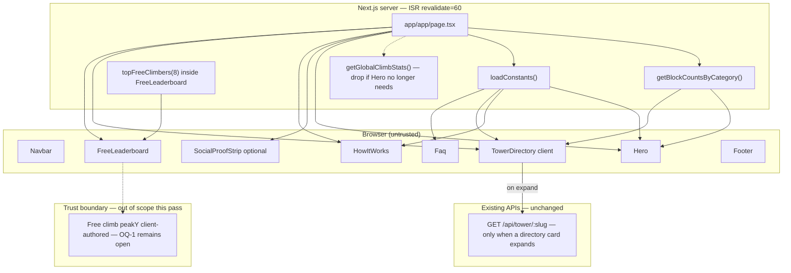

# Architecture — Doomstack landing POP visual pass

**Product:** Doomstack (ASCENT) · surface `/`  
**Spec:** `loop/spec.md` (AC-1–AC-18)  
**Design SoT:** `app/DESIGN.md` + `app/tailwind.config.ts` + `app/app/globals.css`  
**Prior handoff:** `loop/handoffs/product-spec-2026-09-06T03-12-37Z.json`  
**Status:** Ready for **design-ux** (composition / motion / full-bleed within ASCENT) → implementer

---

## 1. AC → architectural need

| ACs | Need | Mechanism |
| --- | --- | --- |
| AC-1, AC-5 | Brand-first Hero | Hero DOM owns display-scale `DOOMSTACK`; nav-independent |
| AC-2, AC-3, AC-10, AC-18 | Hero budget / declutter | Strip season chip, Paid/Free strips, free metrics, sign-in pitch, card grids from Hero |
| AC-4 | Full-bleed product visual | Rebuild `ElevationProfile` as edge-to-edge plane (not `rounded-2xl`+border+`bg-surface` card) |
| AC-6, NFR-7 | Token integrity | ASCENT only — no new theme / light-mode parallel |
| AC-7, AC-8, AC-9 | Section order + HowItWorks | Keep `page.tsx` order; SocialProof never inside Hero; `ol` stays 3 steps |
| AC-11–AC-13 | Empty arena presentation | Client/props branching only — **no** seeding, Stripe, or new APIs |
| AC-14, AC-15, NFR-1, NFR-5 | Motion budget | 2–3 named CSS/Tailwind moments; all `prefers-reduced-motion` gated |
| AC-16, AC-17, NFR-4, NFR-6 | Mobile / a11y envelope | 375px overflow; CTA ≥44×44; contrast; no `text-muted` body ≤11px |
| NFR-2, NFR-3, NFR-8 | ISR + no backend creep | Keep `revalidate = 60`; touch **0** `app/app/api/**`; no extra DB fan-out |
| NFR-9 | CTA discipline | Hero primary pitch ≠ Navbar (“Enter the arena” vs “Get started”) |

**Not chosen for this pass:** realtime websockets, auth changes, payments, jobs, canvas/WebGL hero, Lottie, Framer Motion, second design-token file.

---

## 2. Stack confirmation

| Layer | Choice | Rationale |
| --- | --- | --- |
| App | Next.js App Router (`app/`) | Already hosts ISR landing |
| UI | React + Tailwind + ASCENT utilities | Match `context/profile.json`; design-ux must not invent tokens |
| Data (existing) | Prisma reads via `getBlockCountsByCategory` / climb helpers | Presentation-only; no schema change |
| Package manager | `pnpm` in `app/` | Do not rewrite lockfiles outside `app/` |

**Explicitly not choosing:** new animation/3D libraries, second HTTP client, second component library, light-mode token fork, new routes.

---

## 3. Data-flow & trust boundaries



**Trust notes (apply product-spec learning):**

- Do **not** close free-leaderboard trust OQ-1. Visual chrome is not a control.
- No new write paths, webhooks, or score verification.
- Paid block counts remain server-derived reads (already trusted for display).

---

## 4. Component structure (`/`)

### Target DOM order inside `#main-content`

1. `Navbar` (unchanged behavior; may still show `DOOMSTACK` + “Get started”)
2. **`Hero`** — rebuilt composition
3. **`SocialProofStrip`** (optional) — **after** Hero only; empty-safe copy (AC-12 / OQ-3). Removal also acceptable.
4. **`HowItWorks`** — polish only; exactly 3 `ol > li`
5. **`TowerDirectory`** `#towers` — interactive cards stay; empty already uses `—` / “Claim #1”
6. **`FreeLeaderboard`** `#free` — stays after paid; empty-state copy polish OK
7. **`Faq`** — light rhythm/consistency
8. **`Footer`** — light polish; keep brand pairing

### Hero rebuild — what moves / stays / dies

| Element (current) | Disposition |
| --- | --- |
| Season chip (“Season 01 · 74 stacks live”) | **Remove** from Hero (budget / clutter) |
| `h1` “CLIMB. OR GET BURIED.” | **Keep as sole `h1`** (wording may refine per OQ-2) |
| Support paragraph | **Keep** exactly one primary pitch `p` |
| CTA group: Enter the arena → `/auth/signup`; Browse stacks → `/#towers` | **Keep** as the single primary CTA group |
| Paid/Free dual stat strips + `/play` chip | **Remove** from Hero (AC-3, AC-8, AC-10) |
| “Already climbing? Sign in” | **Remove** from Hero (budget); sign-in remains in Navbar |
| Live `totalBlocks.toLocaleString()` as dominant number | **Remove**; never show live `0` as hero headline stat (AC-11) |
| `ElevationProfile` inset card | **Rebuild** as full-bleed / ≥90% visual plane (AC-4, AC-18) |
| Illustrative `DEMO_BLOCKS` stack | **Keep** as decorative visual content (empty-arena friendly) |
| **New:** hero-level `DOOMSTACK` wordmark | **Add** `.font-display`, ≥40px at ≥1024px (AC-1) |
| Atmosphere `.topo` + radial signal/ember washes | **Keep / intensify** via existing ASCENT utilities |

**Composition rule (for design-ux):** first viewport = brand `DOOMSTACK` + one headline + one support + one CTA group + one full-bleed product visual. No cards in Hero. No floating marketing badges on the visual plane (instrument chrome that is part of the plane’s own edges is OK if not a sticker overlay).

### Suggested Hero subtree (stable QA hooks)

```
section[aria-label="Hero"][data-testid="landing-hero"]
  ├── brand wordmark text "DOOMSTACK" (.font-display)
  ├── h1 (exactly one)
  ├── p (primary pitch)
  ├── div[data-testid="landing-hero-cta"]  (primary + optional secondary)
  └── div[data-testid="landing-hero-visual"][aria-hidden="true"]
        └── full-bleed ElevationProfile plane
```

---

## 5. Data contracts (existing — no new backends)

### `app/app/page.tsx` (server)

Current fetches (keep shape; may drop unused):

| Source | Returns | Consumers today | After this pass |
| --- | --- | --- | --- |
| `getBlockCountsByCategory()` | `Record<string, number>` (slug → count); `{}` on catch | Hero `totalBlocks`, TowerDirectory `counts`, SocialProof | TowerDirectory + SocialProof; Hero only if needed for empty-branch (prefer **not** showing the number) |
| `getGlobalClimbStats()` | `{ climberCount: number; topPeak: number \| null }` | Hero free stats only | **Drop from page** if Hero no longer consumes (FreeLeaderboard self-fetches) |
| `loadConstants()` | `{ MIN_ENTRY_USD, MIN_SPEND_USD, … }` | Hero, HowItWorks, TowerDirectory, Faq | Unchanged |
| `topFreeClimbers(8)` | inside `FreeLeaderboard` | FreeLeaderboard | Unchanged |
| `GET /api/tower/:slug` | Tower payload on card expand | `InlineTower` | Unchanged — no N-fetch on load |

Retain `export const revalidate = 60`.

### `Hero` props

**Current:**

```ts
export interface HeroStats {
  totalBlocks: number;
  minEntryUsd: number;
  climberCount: number;
  topPeak: number | null;
}
```

**Target (presentation contract):**

```ts
export interface HeroStats {
  /** Live paid total — used only for empty-branch logic; never rendered as dominant "0". */
  totalBlocks: number;
  /** Pricing floor copy e.g. "from $X" — non-zero-safe. */
  minEntryUsd: number;
}
```

- When `totalBlocks === 0`: show illustrative stack + invitation / pricing-floor copy; **no** “0 blocks” / live zero headline (AC-11, AC-12).
- When `totalBlocks > 0`: still do **not** restore dual Free/Paid instrument grids in Hero; optional below-hero SocialProof may show the live count.
- `climberCount` / `topPeak` leave the Hero contract (live in `#free` only).

### `TowerDirectory` props — **unchanged**

```ts
export interface TowerDirectoryProps {
  counts: Record<string, number>;
  minEntryUsd: number;
}
```

Empty card behavior already satisfies AC-13 (`count === 0` → `—` + “Claim #1” · `from $N`; aria-label “claim #1”). Polish may adjust typography/spacing only — do not reintroduce a visible `0` live count.

Section intro currently interpolates `{totalLive} blocks climbing` — if `totalLive === 0`, implementer/design-ux must use non-numeric or invitational copy (align with AC-12 spirit for below-hero surfaces; directory cards remain Claim #1).

### `FreeLeaderboard` — **no props**

- Server component; `topFreeClimbers(8).catch(() => [])`.
- Empty: existing “[ no climbers yet ]” + play CTA — keep vibe; no live `0` hero number.
- Landmarks: `id="free"`, `aria-label="Free climb leaderboard"`.

### `HowItWorks` / `Faq`

```ts
{ minEntryUsd?: number; minSpendUsd?: number }
```

Unchanged contracts; visual polish only. HowItWorks: exactly 3 steps (`id="how-it-works"`).

### Empty-arena presentation strategy (no seeding)

| Surface | `totalBlocks === 0` / `count === 0` |
| --- | --- |
| Hero | Demo `DEMO_BLOCKS` visual + invitation / `from $minEntryUsd`; never primary live `0` |
| SocialProofStrip | Non-numeric fallback (“Join the leaderboard” / “Claim #1”) **or** omit strip |
| TowerDirectory cards | Existing `—` + Claim #1 (AC-13) |
| FreeLeaderboard | Existing empty card; optional copy polish |

---

## 6. Motion approach (AC-14, AC-15)

**Budget: exactly three named moments** (document in design-ux; implementer ships ≤3):

| ID | Moment | Mechanism | Reduced motion |
| --- | --- | --- | --- |
| M1 | **Staggered hero reveal** | Existing `.reveal` + inline `animationDelay` on brand / h1 / pitch / CTA | Already `animation: none` under `prefers-reduced-motion` in `globals.css` |
| M2 | **Ground rise** | Existing `.ground-gradient` + `animate-groundRise` on the full-bleed visual base | Same media query disables `animate-groundRise` / ground transform |
| M3 | **One accent** | Prefer **CTA hover** (`brightness` / `translate-x` already on primary) **or** a single visual `animate-climb` stagger on demo bars — **not both new layers** | Gate any new class the same way as `.reveal` |

**Rules:**

- CSS / Tailwind / existing `globals.css` + `tailwind.config.ts` keyframes only.
- **0** new animation/3D libraries (NFR-1).
- Do **not** add marquee/particle/noise layers beyond this budget (AC-14).
- Any new utility class **must** be listed in the `prefers-reduced-motion: reduce` block beside `.reveal`.

---

## 7. File touch list (`app/`)

| Path | Owner | Change |
| --- | --- | --- |
| `app/app/page.tsx` | implementer | Hero props slim; SocialProof empty-safe or remove; drop unused climb-stats fetch; **keep** section order + `revalidate` |
| `app/src/components/LandingPage/Hero.tsx` | design-ux → implementer | Full rebuild per AC-1–6, 11–12, 14–18 |
| `app/src/components/LandingPage/HowItWorks.tsx` | design-ux → implementer | Rhythm/hierarchy polish; keep 3 steps |
| `app/src/components/LandingPage/TowerDirectory.tsx` | design-ux → implementer | Presentation polish; empty copy; no API change |
| `app/src/components/LandingPage/FreeLeaderboard.tsx` | design-ux → implementer | Below-fold polish / empty vibe |
| `app/src/components/LandingPage/Faq.tsx` | implementer | Light consistency |
| `app/src/components/LandingPage/Footer.tsx` | implementer | Light consistency |
| `app/app/globals.css` | implementer | Only if a new motion utility needs reduced-motion gate |
| `app/tailwind.config.ts` | implementer | **Avoid** unless a named keyframe is required; no new color tokens |
| `app/DESIGN.md` | **do not fork** | Read-only SoT |
| Tests under `app/tests/**` | verifier / implementer | Prefer DOM/runtime checks vs source greps; add landing AC tests if missing |

**Do not touch:** `app/app/api/**`, Prisma schema/migrations, Stripe, Redis, climb physics, `GameOverlay.tsx` (still unimported — R-8), auth routes.

---

## 8. Folder tree (ownership)

```
app/
├── app/
│   ├── page.tsx                 # implementer — composition shell
│   ├── globals.css              # implementer — motion gates only if needed
│   └── api/**                   # OUT — no files added
├── src/components/
│   ├── LandingPage/             # design-ux + implementer / frontend
│   │   ├── Hero.tsx             # primary rebuild
│   │   ├── HowItWorks.tsx
│   │   ├── TowerDirectory.tsx
│   │   ├── InlineTower.tsx      # leave API behavior
│   │   ├── FreeLeaderboard.tsx
│   │   ├── Faq.tsx
│   │   ├── Footer.tsx
│   │   └── GameOverlay.tsx      # dead — do not treat as landing work
│   ├── Navbar.tsx               # leave CTA copy (“Get started”)
│   └── Brand/                   # optional StackMark reuse — no new brand system
├── DESIGN.md                    # design-ux reads; no parallel tokens
└── tailwind.config.ts           # ASCENT theme only
```

---

## 9. Failure modes (external / existing deps)

| Dependency | Failure | Landing behavior |
| --- | --- | --- |
| Postgres / `getBlockCountsByCategory` | throw | `page.tsx` already `.catch(() => {})` → empty counts → empty-arena presentation |
| `getGlobalClimbStats` | throw | N/A after drop; if kept, catch to zeros but **do not** show in Hero |
| `topFreeClimbers` | throw | FreeLeaderboard `.catch(() => [])` → empty state |
| `GET /api/tower/:slug` | non-OK | InlineTower error UI + link to full stack (unchanged) |
| Constants / env | missing | `loadConstants()` defaults (`MIN_ENTRY_USD=5`, etc.) |

At 10× traffic: ISR `revalidate=60` absorbs load; do not add per-request fan-out. Expanding many directory cards still N-fetches on open only — unchanged.

---

## 10. ADRs

### ADR-1 — Presentation-only empty arena (no seeding)

**Decision:** Handle cold start with demo visual + copy branches on existing props.  
**Why:** Spec OUT + NFR-3; seeding payments is a different product initiative.  
**Consequence:** Hero must not bind its primary number to `totalBlocks` when zero.

### ADR-2 — Slim `HeroStats`; free metrics leave Hero

**Decision:** Remove `climberCount` / `topPeak` from Hero; drop page-level `getGlobalClimbStats` if unused.  
**Why:** AC-3 / AC-8 / AC-10; free climb stays below `#towers`.  
**Consequence:** Slightly less data on `/` fetch — aligns with NFR-8.

### ADR-3 — CSS motion only; reuse ASCENT keyframes

**Decision:** M1–M3 via `.reveal` / `groundRise` / one accent; no Framer/Lottie/Three.  
**Why:** NFR-1 + existing reduced-motion gates.  
**Consequence:** design-ux specifies timing/delays within those primitives.

### ADR-4 — SocialProofStrip optional below Hero

**Decision:** Keep strip **after** Hero with non-numeric cold copy, or remove entirely (OQ-3).  
**Why:** AC-3 forbids it inside Hero; AC-12 requires zero-safe below-hero proof.  
**Assumption:** Default recommendation = keep with fallback copy (less churn); design-ux may remove.

### ADR-5 — design-ux inserts before implementer

**Decision:** `nextStage: design-ux` (orchestrator `optionalInsert`).  
**Why:** Novel hero composition + motion moments; ASCENT exists but layout is net-new.  
**Consequence:** design-ux produces composition/motion notes against AC-1–AC-18 without a second token system; implementer consumes both architecture + design-ux.

### ADR-6 — Open questions stay open

| OQ | This pass |
| --- | --- |
| OQ-1 free peakY trust | Deferred — no API/score work |
| OQ-2 exact slogan string | design-ux/implementer may refine; single `h1` holds |
| OQ-3 SocialProof keep/remove | Either OK if AC-12 satisfied |
| Power-up slot vs stack; unscoped `/api/tower` | Unrelated — leave open |

---

## 11. Security boundaries

| Concern | Stance |
| --- | --- |
| Authn / authz | Unchanged; landing remains public ISR |
| PII | Free leaderboard handles already public; no new fields |
| Secrets | None added; do not introduce client env for demo data |
| Payments / Stripe | OUT |
| Score trust | OQ-1 open; do not claim closed |

Secret **names** touched: **none**.

---

## 12. Hot paths / cache

| Path | Cache | Notes |
| --- | --- | --- |
| `GET /` | ISR 60s | Hot path; keep |
| Block counts | Same request as page | One `groupBy`; no N+1 |
| Free climbers | Inside FreeLeaderboard, same ISR page | `take: 8` |
| Inline tower poll | Client fetch on expand only | Avoid opening all cards in tests as perf noise |

**N+1 risk:** Do not prefetch all `/api/tower/:slug` on landing load.  
**Invalidation:** Existing payment → block write → next ISR window; no new tags required.

---

## 13. QA targeting (mechanical ACs)

Prefer Playwright / DOM / computed style — **never** source-text greps as sole proof (kernel testing rule).

| AC | Selector / check |
| --- | --- |
| AC-1 | `section[aria-label="Hero"]` or `[data-testid="landing-hero"]` contains text `DOOMSTACK` with `.font-display` / font-family includes `Bricolage`; font-size ≥40px at vw≥1024; remove Navbar node → wordmark remains |
| AC-2 | Exactly one `h1`; one pitch `p`; one CTA group; one `[data-testid="landing-hero-visual"]` |
| AC-3 / AC-10 / AC-18 | Hero query: no Free/Paid paired pills; no `#free` / `#towers`; no `rounded-2xl`+border+`bg-surface` content cards; no free metrics |
| AC-4 | Visual plane: not inset card combo; width ≥90% of hero content box or full viewport at ≥1024 |
| AC-5 | After Navbar removal: DOOMSTACK + signal `rgb(203, 242, 77)` + ember `rgb(255, 90, 44)` in Hero |
| AC-6 | Diff: no cream/purple parallel tokens; `bg-void` / `#0a0a0c` |
| AC-7 | `#main-content` landmark order: Hero → HowItWorks → `#towers` → `#free` → Faq → Footer |
| AC-8 | `#towers` precedes `#free`; Hero primary CTA not `/play` |
| AC-9 | HowItWorks `ol > li` length === 3 |
| AC-11–12 | Fixture/prop `totalBlocks: 0`: no dominant visible `0` blocks claim in Hero |
| AC-13 | Directory card `count===0`: no live `0` character; Claim #1 / — |
| AC-14 | Architecture names M1–M3; count ≤3 intentional moments |
| AC-15 | Emulate `prefers-reduced-motion: reduce`; `.reveal` / new classes `animation: none` |
| AC-16 | Viewport 375×812: `scrollWidth <= clientWidth` |
| AC-17 | Primary CTA contrast ≥4.5:1; hit box ≥44×44; no `text-muted` ≤11px body |

**Stable anchors to preserve / add:**

- Keep: `aria-label="Hero"`, `#towers`, `#free`, `#how-it-works`, HowItWorks `ol`, Footer
- Add (recommended): `data-testid="landing-hero"`, `landing-hero-visual`, `landing-hero-cta`

---

## 14. Explicit non-goals

- No Stripe / Checkout / webhook changes  
- No seeding real paid blocks or campaign admin  
- No new routes (`app/app/api/**` diff = 0; no new pages)  
- No Prisma / Redis / Firebase auth changes  
- No climb physics, power-ups, score re-sim, closing OQ-1  
- No second design-token system; ASCENT stays  
- No light-mode redesign; no purple/cream/broadsheet aesthetics  
- No GameOverlay resurrection unless separately wired  

---

## 15. Exit criteria for this stage

- [x] AC-1–AC-18 mapped to structure / contracts / motion / QA  
- [x] Stack confirmed; non-choices listed  
- [x] Data contracts for Hero / TowerDirectory / FreeLeaderboard documented  
- [x] Empty arena without new backends  
- [x] File touch list under `app/`  
- [x] `nextStage`: **design-ux** before implementer  
