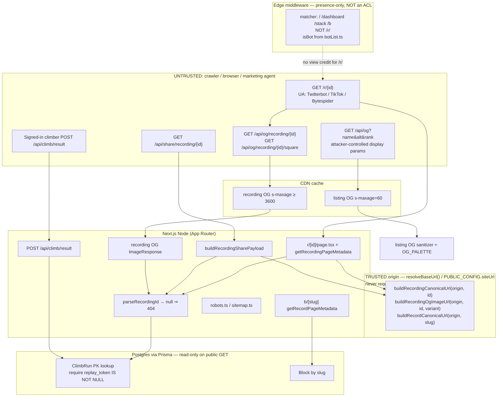

# Architecture: Climb-recording share SEO

**Product:** The Climb / Doomstack (`app/`).
**Goal:** Unique, crawler-unfurlable `/r/{id}` links plus a standalone share payload for X / TikTok / YouTube.
**Status:** implementable. `nextStage`: implementer. `app/DESIGN.md` already covers share UI — do not insert design-ux.
**Canonical production origin:** `https://www.doomstack.lol` via `resolveBaseUrl()` / `PUBLIC_CONFIG.siteUrl`.

This document maps **AC-1–AC-40** to named production units. Implementers must not guess paths, field names, or 4xx shapes. Do not write a second stack. Do not require PR #11. Do not close F-1. Do not add MP4, oEmbed, player cards, Instagram, or 9:16 OG.

---

## 0. Pings from product-spec (applied)

| Ping | Architecture decision |
| --- | --- |
| Standalone share-payload builder; no PR #11 Prisma/social imports; mirror field names + JS `.length`; `VALIDATION_ERROR` not slice; X = twitter/x intent; TikTok/YouTube `compose.mode = UNSUPPORTED_BY_PLATFORM` | New `app/src/share/*` with a local `ShareToolResult` (not `app/src/social/*`). Limits copied as numbers. |
| Additive `runId` on `recordClimb` + `saved: true` JSON; canonical builders use `resolveBaseUrl()` / `PUBLIC_CONFIG.siteUrl`; never request `Host`; never `window.location.origin` for marketing canonicals | `ClimbRecordResult.runId?: string`. URL helpers take explicit `origin: string`. Client share code calls those helpers with `resolveBaseUrl()`. |
| Canonical/OG/share URL builders take explicit origin; sanitize OG display params; 404 unknown ids; omit `replay_token` / `seed` / email; do not sitemap `/r/` | Allow-list DTOs. `listSitemapBlockSlugs` never returns recordings. |
| One `isBot`; middleware calls it | Delete `BOT_PATTERNS` / `isBotUa` from `middleware.ts`. |
| Do not attach server-derived peaks (F-1 stays open) | Cards display persisted `peak_y`. No re-sim. |
| Do not widen to MP4, oEmbed, player cards, Instagram, F-1 re-sim | Out of folder tree. JSON-LD `@type` is `WebPage` only. |

Standing rules applied: reject-never-default for recording id and block slug; no `getOrCreate` on public GET; no unbounded `Map` keyed by recording id; every new helper has a non-test caller; tests invoke production units (named below).

---

## 1. AC → architectural need → production unit

Every AC has a **named export** (or route handler) the verifier will import. Grepping source is not proof.

| AC | Need | Production unit | File (create unless noted) |
| --- | --- | --- | --- |
| **AC-1** | Additive save JSON | `POST` handler | **extend** `app/app/api/climb/result/route.ts` (spreads `recordClimb` result; `runId` rides along) |
| **AC-2** | Short canonical URL | `buildRecordingCanonicalUrl(origin, recordingId)` | `app/src/share/urls.ts` |
| **AC-3** | Additive `recordClimb` | `recordClimb` return includes existing keys + optional `runId` | **extend** `app/src/db/climb.ts` (`ClimbRecordResult`) |
| **AC-4** | Anonymous unchanged | `POST` with no `Authorization` → `{ saved: false, reason: "anonymous" }` and **no** own property `runId` | **extend** `app/app/api/climb/result/route.ts` (do not add `runId` on this branch) |
| **AC-5** | Unknown id → 404, not homepage card | `getRecordingPageMetadata`, `GET` recording OG handlers, `buildRecordingSharePayload` / share GET | `app/src/seo/recordingMetadata.ts`; `app/app/api/og/recording/[id]/route.tsx`; `app/app/api/og/recording/[id]/square/route.tsx`; `app/src/share/payload.ts`; `app/app/api/share/recording/[id]/route.ts` |
| **AC-6** | `replay_token == null` → 404 | `getShareableClimbRun(id)` returns `null` when token is null; all AC-5 units 404/`NOT_FOUND` | **extend** `app/src/db/climb.ts` |
| **AC-7** | Invalid id → 404, never demo, never 500 | `parseRecordingId(raw)` returns `null`; callers 404 | `app/src/share/parseRecordingId.ts` |
| **AC-8** | Unique OG url/image; peak metres in title+description | `getRecordingPageMetadata(id, origin)` | `app/src/seo/recordingMetadata.ts` |
| **AC-9** | `twitter.card = summary_large_image`; not homepage title; `openGraph.url` = AC-2 | same helper | same |
| **AC-10** | `/play` generic metadata; do not decode `?r=` | `getPlayPageMetadata()` — **no** token arg, **must not** import `decodeRunReplay` | `app/src/seo/playMetadata.ts`; **extend** `app/app/play/page.tsx` to export it as `metadata` / `generateMetadata` |
| **AC-11** | Unknown recording metadata is 404, not listing `/api/og?...` | `getRecordingPageMetadata` → `{ ok: false, reason: "NOT_FOUND" }` | `app/src/seo/recordingMetadata.ts` |
| **AC-12** | Share payload shape | `buildRecordingSharePayload(recording, origin)` | `app/src/share/payload.ts` + types in `app/src/share/types.ts` |
| **AC-13** | Redaction | payload mapper allow-list only; `shareHandle` never email / never `/@/` | `app/src/share/handle.ts` |
| **AC-14** | Compose modes | `buildRecordingSharePayload` sets `compose` | `app/src/share/payload.ts` |
| **AC-15** | Unknown id payload | builder `{ ok: false, reason: "NOT_FOUND" }`; HTTP 404 `{ error, code: "NOT_FOUND" }` | `payload.ts` + share route |
| **AC-16** | X caption ≤ 280 and includes canonical URL | builder + `validateShareFieldLength` | `app/src/share/limits.ts`, `payload.ts` |
| **AC-17** | Over-limit ⇒ invalid, **no sliced string** | `validateShareFieldLength(text, limit)` → `{ valid, length, limit }` only | `app/src/share/limits.ts` |
| **AC-18** | TikTok ≤ 2200 + URL; YT title ≤ 100; YT description ≤ 5000 + URL | builder | `payload.ts` |
| **AC-19** | Limit table numbers | `SHARE_FIELD_LIMITS` | `app/src/share/limits.ts` |
| **AC-20** | Recording landscape 1200×630 | `recordingOgImageOptions("landscape")` used by landscape route | `app/src/og/sizes.ts`; `app/app/api/og/recording/[id]/route.tsx` |
| **AC-21** | Square 1080×1080 | `recordingOgImageOptions("square")` | same + `.../square/route.tsx` |
| **AC-22** | ASCENT palette; listing OG uses it; listing still 1200×630 | `OG_PALETTE`; `listingOgImageOptions()`; `buildListingOgModel` | `app/src/og/palette.ts`; **extend** `app/app/api/og/route.tsx` |
| **AC-23** | Junk listing params 200 or 400, never 500, no `<script`/`<img`; recording missing id 404 | `sanitizeOgText`; listing route uses model; recording routes 404 | `app/src/og/sanitize.ts` |
| **AC-24** | `resolveBaseUrl()` in prod; builders emit that origin | **existing** `resolveBaseUrl`; builders take `origin` | **existing** `app/src/config/public.ts`; `app/src/share/urls.ts` |
| **AC-25** | Origin arg wins; never `Host` | builders accept only `origin` (no request); tests pass fixture | `urls.ts` |
| **AC-26** | X action href = `platforms.X.compose.url` | `buildShareActions(payload)` | `app/src/share/actions.ts`; **extend** `ShareRun.tsx` |
| **AC-27** | TikTok copy + `UNSUPPORTED_BY_PLATFORM` | `buildShareActions` | `actions.ts` |
| **AC-28** | YouTube copy `title + "\n\n" + description` | `buildShareActions` | `actions.ts` |
| **AC-29** | Dashboard copy URL is `/r/{id}` not `/play?r=` | `buildDashboardShareUrl(origin, replay)` | `app/src/share/dashboard.ts`; **extend** `ClimbReplaysSection.tsx` |
| **AC-30** | `replayToken: null` → no platform share, no `/r/{id}` copy | `buildDashboardShareActions(replay, origin)` | `dashboard.ts` |
| **AC-31** | 44×44 named controls | `SHARE_CONTROL_LAYOUT` consumed by `ShareRun` / dashboard | `app/src/share/controlLayout.ts` |
| **AC-32** | Record page OG/Twitter | `getRecordPageMetadata(slug, origin)` | `app/src/seo/recordMetadata.ts`; **extend** `app/app/b/[slug]/page.tsx` |
| **AC-33** | Record OG 1200×630 + same palette | `GET /api/og/b/[slug]`; `recordOgImageOptions()` | `app/app/api/og/b/[slug]/route.tsx` |
| **AC-34** | Unknown slug → `notFound`, not homepage title | `getRecordPageMetadata` → `NOT_FOUND`; page `generateMetadata` calls `notFound()` | `recordMetadata.ts` (today’s metadata returns `"Block not found — Stack"` **without** `notFound()` — that is the bug to fix) |
| **AC-35** | robots allows marketing + `/r/` + `/api/og`; does not Disallow `/r/` | `getRobotsConfig(origin)` | `app/src/seo/robotsConfig.ts`; `app/app/robots.ts` |
| **AC-36** | sitemap has `/`, `/play`, `/climb`, `/b/{slug}`; **zero** `/r/` | `buildSitemapEntries(origin, slugs)` | `app/src/seo/sitemapEntries.ts`; `app/app/sitemap.ts`; `listSitemapBlockSlugs` in `blocks.ts` |
| **AC-37** | JSON-LD `WebPage`, not `VideoObject`, no MP4 `contentUrl` | `buildWebPageJsonLd({ url, name, description })` | `app/src/share/jsonLd.ts`; recording + record pages |
| **AC-38** | `isBot` fixtures including tiktok / bytespider / bytedance | `isBot` | **extend** `app/src/views/botList.ts` |
| **AC-39** | view pipeline credits 0 for those UAs | **existing** `runViewPipeline` (already calls `isBot`) | **existing** `app/src/views/pipeline.ts` — no second list |
| **AC-40** | Bot GET of `/r/{id}` is 200, not 401/403 | recording `page.tsx` public; **do not** add `/r/` to middleware view-credit matcher | `app/app/r/[id]/page.tsx`; **extend** `app/middleware.ts` (import `isBot` only; matcher unchanged) |

Non-AC but required wiring (non-test callers):

| Caller | Uses |
| --- | --- |
| `app/app/r/[id]/page.tsx` | `parseRecordingId`, `getShareableClimbRun`, `getRecordingPageMetadata`, `buildWebPageJsonLd`, `ClimbPlayClient` with server-loaded token |
| `ClimbScene` / `ClimbPlayClient` | `buildRecordingCanonicalUrl` after `saved && runId`; `buildShareActions`; `resolveBaseUrl()` as origin |
| `ShareRun` | `buildShareActions` + `SHARE_CONTROL_LAYOUT` |
| `ClimbReplaysSection` | `buildDashboardShareUrl` / `buildDashboardShareActions` |
| Listing `GET /api/og` | `OG_PALETTE`, `buildListingOgModel`, `listingOgImageOptions` |
| `recordClimb` | returns `runId: created.id` |

---

## 2. Stack (confirm, do not change)

Match `context/profile.json` and the live `app/` tree.

| Layer | Choice | One-sentence rationale |
| --- | --- | --- |
| App | Next.js App Router in `app/` (Next **15.5.24**, already in `app/package.json`) | Recording pages, `generateMetadata`, `robots.ts`, `sitemap.ts`, and route handlers already live here. |
| UI | React + Tailwind + `app/DESIGN.md` tokens | Share controls restyle in place; no second component library. |
| DB | Prisma + Postgres (`ClimbRun.id` cuid already) | PK lookup is O(1); **zero migration**. |
| Cache | Vercel CDN `Cache-Control` on OG responses; existing Upstash Redis only for optional share-JSON rate limit | Recording ids are unbounded — do not add a process-local `Map`. |
| Auth | Existing Firebase; public GET; POST save unchanged | Middleware remains presence-only (`context/trust.md` #5). |
| OG | Existing `@vercel/og` `ImageResponse` | Listing already uses it; do not switch to `next/og` or Satori 1.x. |
| Tests | vitest in `app/` (`pnpm test`) | Do not add Jest. |
| Package manager | `pnpm` in `app/` | Do not touch root/orchestrator `yarn.lock`. |

**Not choosing:** new ORM; new HTTP client; Jest; PR #11 social Prisma / OAuth / `app/src/social/*`; Redis as a recording store; hashids/nanoid extra column; `window.location.origin` canonicals; Host-header canonicals; MP4 / oEmbed / Twitter player cards / Instagram compose; server re-sim of `peakY` (F-1); design-ux stage / second token set; Edge Prisma; `getOrCreate` on GET `/r/{id}`.

---

## 3. Data flow (trust boundaries)



**Trust notes**

- Recording **id** is capability-by-id (enumerable cuid). Parser **rejects** (returns `null`); it never substitutes a demo id.
- OG **query params** (`name`, `alt`, `rank`) are display-only and attacker-controlled. Sanitize; listing may default missing params (A-12). Recording OG identity is the path id, not query text.
- **Origin** for every absolute marketing URL is an explicit function argument filled with `resolveBaseUrl()`. Builders have no `Request` parameter.
- Public GET does not credit `views_k`. `/r/` is **outside** the middleware matcher so unfurls cannot trigger `INTERNAL_TOKEN` forwarding (do not copy `request.nextUrl.origin` + `INTERNAL_TOKEN`).
- `peak_y` on cards is **untrusted display text** (A-8 / F-1 open).

---

## 4. Data model

### 4.1 No schema change (zero migration)

`ClimbRun` already:

| Field | Type | Null | Notes |
| --- | --- | --- | --- |
| `id` | `String @id @default(cuid())` | no | **This is `{recordingId}`.** Public path `/r/{id}`. |
| `userId` | `String?` | yes | `onDelete: SetNull`. Do not select `User.email`. |
| `category_slug` | `String` | no | unused by share SEO |
| `peak_y` | `Float` | no | Display with `Math.round`; not authenticated |
| `finished` | `Boolean` | no | unused by share SEO |
| `finished_tick` | `Int?` | yes | unused |
| `seed` | `String` | no | **Never** in payload/metadata/OG alt text |
| `replay_token` | `String?` | yes | Required **non-null** for shareable recording; **never** in share JSON |
| `created_at` | `DateTime` | no | unused by cards |

Indexes already: PK on `id`; `climb_run_category_idx`; `climb_run_user_idx`. PK is sufficient for `findUnique({ where: { id } })`. Do not add a slug/hashid column.

**Delete policy:** unchanged. User delete sets `userId` null; row remains. If `replay_token` is still set, `/r/{id}` stays 200 with `handle: null`. Do not cascade-delete runs in this change.

### 4.2 Public DTO (allow-list — never spread the Prisma row)

```ts
// conceptual — implementer writes the real types in app/src/share/types.ts
interface ShareableRecording {
  id: string;          // = ClimbRun.id
  peakY: number;       // persisted peak_y
  handle: string | null; // shareHandle(...); never email; never matches /@/
}
```

`getShareableClimbRun(id: string): Promise<ShareableRecording | null>`

1. `parseRecordingId(id)` → if null, return null (do not hit DB with junk).
2. `findUnique` **select**: `id`, `peak_y`, `replay_token`, `userId`, `user: { select: { display_name: true } }` — **not** `seed`, **not** `email`.
3. If missing **or** `replay_token == null`, return `null`.
4. Map handle via `shareHandle(userId, display_name)` (`climberDisplay`, then if `/@/.test(handle)` fall back to `climberHandle(userId)`). If `userId` is null, `handle` is `null`.

Playback token loader (page body only, **not** imported by share JSON or metadata):

`getClimbRunReplayToken(id: string): Promise<string | null>` — same row via `react.cache` so metadata + page + player are **one** query per request, not an N+1 and not a process-global Map.

### 4.3 `recordClimb` return (additive)

```ts
export interface ClimbRecordResult extends PeakDecision {
  rank: number;
  totalClimbers: number;
  handle: string;
  runId?: string; // set to prisma.climbRun.create().id whenever create succeeds
}
```

Capture the create result (`const created = await prisma.climbRun.create(...)`) and set `runId: created.id`. Do not remove or rename `peakY`, `improved`, `rank`, `totalClimbers`, `handle`.

Anonymous POST still does not call `recordClimb` and must not invent `runId`.

### 4.4 Enums (exhaustive for this feature)

| Enum | Values |
| --- | --- |
| `SharePlatform` | `X` \| `TIKTOK` \| `YOUTUBE` |
| `ShareContentType` | `X_POST` \| `TIKTOK_VIDEO` \| `YOUTUBE_SHORT` (no `X_THREAD`, no `YOUTUBE_LONGFORM`) |
| `ComposeMode` | `web_intent` \| `UNSUPPORTED_BY_PLATFORM` |
| `ShareFailReason` | `NOT_FOUND` \| `VALIDATION_ERROR` |
| `OgVariant` | `landscape` \| `square` |

Local result type (mirror PR #11 **shape**, do not import it):

```ts
type ShareToolResult<T> =
  | { ok: true; data: T }
  | { ok: false; reason: "NOT_FOUND"; detail: string }
  | { ok: false; reason: "VALIDATION_ERROR"; detail: string };
```

### 4.5 Sitemap blocks

New `listSitemapBlockSlugs(): Promise<string[]>` in `app/src/db/blocks.ts`:

- `prisma.block.findMany({ select: { slug: true }, take: 10_000, orderBy: { created_at: "asc" } })`
- Include hidden/buried (those pages already 200).
- **take** is mandatory (kernel). Cap 10_000 is an ADR; recordings are never included.

---

## 5. API contracts

**4xx shape (JSON routes):** `{ error: string, code: string }` matching existing handlers (`NOT_FOUND`, `RATE_LIMITED`, `INTERNAL_ERROR`, `VALIDATION_ERROR`). Never leak stack traces or raw Prisma messages.

**Auth:** all GET below are **unauthenticated**. POST save keeps the existing optional Bearer path.

**Idempotency:** GETs are naturally idempotent. POST `/api/climb/result` is unchanged (not newly idempotent).

### 5.1 `GET /r/[id]` — HTML recording page

| | |
| --- | --- |
| Auth | public |
| Runtime | Node; `export const dynamic = "force-dynamic"` (unbounded ids — do not prerender; do not `generateStaticParams`) |
| Success | **200** HTML. Unique `generateMetadata` from `getRecordingPageMetadata`. JSON-LD `WebPage`. Human player: server passes replay token into `ClimbPlayClient` (same as `/play`). Canonical path stays `/r/{id}` — **do not 302** to `/play?r=` (crawlers would unfurl generic play metadata). |
| 404 | `parseRecordingId` fails, row missing, or `replay_token == null` → `notFound()`. Metadata helper returns `{ ok: false, reason: "NOT_FOUND" }` and **must not** return homepage `og:title` `Doomstack — Altitude is permanent`. |
| Rate limit | none required |
| View credit | none. Do not add `/r/:path*` to `middleware.ts` `config.matcher`. |

Metadata helper return (testable, no `notFound()` inside the helper):

```ts
type RecordingMetadataResult =
  | { ok: true; metadata: Metadata }
  | { ok: false; reason: "NOT_FOUND" };
```

`metadata.openGraph.url` === `buildRecordingCanonicalUrl(origin, id)`.
`metadata.openGraph.images[0]` = landscape OG URL, `width: 1200`, `height: 630`.
`metadata.twitter.card` === `"summary_large_image"`.
Title and description each contain `String(Math.round(peakY))`.

### 5.2 Recording OG images

**Landscape:** `GET /api/og/recording/[id]`  
**Square:** `GET /api/og/recording/[id]/square`

| | |
| --- | --- |
| Auth | public |
| Runtime | **nodejs** (Prisma lookup). Listing `/api/og` stays **edge**. |
| Success | **200** `image/png` (ImageResponse). Landscape **1200×630**. Square **1080×1080**. Palette `OG_PALETTE`. Cache-Control: `public, s-maxage=3600, stale-while-revalidate=86400` (**s-maxage ≥ 3600**). |
| 404 | invalid / unknown / no token → **404** `{ error: "Recording not found", code: "NOT_FOUND" }` — **not** a 200 listing card. |
| 500 | Satori/render throw → `{ error: "Failed to generate OG image", code: "OG_RENDER_FAILED" }` (or plain text 500 like listing). **Never** fall back to homepage listing art. |
| Rate limit | none (CDN) |
| Query params | none required for identity. Ignore junk query; do not 500. |

Absolute URLs:

- landscape: `{origin}/api/og/recording/{id}`
- square: `{origin}/api/og/recording/{id}/square`

Helpers: `buildRecordingOgImageUrl(origin, id, "landscape" | "square")`.

### 5.3 Listing OG (restyle, same path)

`GET /api/og?name&alt&rank&v=`

| | |
| --- | --- |
| Auth | public |
| Runtime | edge (unchanged) |
| Defaults | A-12: missing `name` → `"Stack"`, `alt` → `"0"`, `rank` → `"1"` **after** sanitize of provided values |
| Success | 200, 1200×630, `OG_PALETTE` (void `#0a0a0c`, signal `#cbf24d`, ember `#ff5a2c`, text-primary `#f4f2ec`) |
| Junk | 200 sanitized **or** 400; **never 500**. Sanitized name must not contain `<script` or `<img`. |
| Cache | keep `s-maxage=60, stale-while-revalidate=300` |

### 5.4 Record (listing) OG

`GET /api/og/b/[slug]`

| | |
| --- | --- |
| Auth | public |
| Runtime | nodejs (getBlockBySlug) |
| Success | 200, 1200×630, same `OG_PALETTE`, display_name + altitude |
| 404 | slug fail parse or `getBlockBySlug` null → `{ error, code: "NOT_FOUND" }` |
| Cache | `s-maxage=3600, stale-while-revalidate=86400` |

Page metadata `openGraph.images[0].url` = `{origin}/api/og/b/{slug}`.
`openGraph.url` = `buildRecordCanonicalUrl(origin, slug)` → `{origin}/b/{slug}` (no trailing slash).

Slug allow-list: reuse `parseSeasonSlug` (same `^[a-z0-9][a-z0-9-]{0,63}$` + proto-key reject) **before** DB. Reject never default.

### 5.5 Share JSON

`GET /api/share/recording/[id]`

| | |
| --- | --- |
| Auth | public |
| Runtime | nodejs |
| Success 200 | `{ ok: true, data: SharePayload }` — same object the pure builder returns. `Cache-Control: public, s-maxage=3600, stale-while-revalidate=86400` |
| 404 | `{ error: "Recording not found", code: "NOT_FOUND" }` when parser fails, row missing, or no token |
| 422 | `{ error, code: "VALIDATION_ERROR" }` only if builder returns `VALIDATION_ERROR` (production templates must not hit this) |
| 429 | optional: `{ error: "Too many requests", code: "RATE_LIMITED" }` using existing `checkRateLimit({ namespace: "share-recording", identifier: ip, max: 60, windowSeconds: 60, failMode: "open" })`. Not required to pass ACs; recommended for enumeration (R-1). |
| 500 | `{ error: "Internal server error", code: "INTERNAL_ERROR" }` |

Pure builder is the AC-12/15 unit. HTTP is the non-test caller.

**SharePayload (AC-12) — load-bearing fields, no TBD:**

```ts
interface SharePayload {
  recordingId: string;
  canonicalUrl: string;      // buildRecordingCanonicalUrl
  imageUrl: string;          // landscape OG absolute URL
  imageUrlSquare: string;    // square OG absolute URL
  peakY: number;             // finite, persisted
  handle: string | null;
  platforms: {
    X: PlatformShare;
    TIKTOK: PlatformShare;
    YOUTUBE: PlatformShare;
  };
}

interface PlatformShare {
  platform: "X" | "TIKTOK" | "YOUTUBE";
  contentType: "X_POST" | "TIKTOK_VIDEO" | "YOUTUBE_SHORT"; // matching platform
  title: string;
  caption: string;
  description: string;
  hashtags: string[];        // without leading '#'
  cta: string;               // contains canonicalUrl
  canonicalUrl: string;
  imageUrl: string;          // X and YOUTUBE: landscape; TIKTOK: square
  compose:
    | { mode: "web_intent"; url: string }           // X only
    | { mode: "UNSUPPORTED_BY_PLATFORM"; detail: string }; // TikTok + YouTube; no url
}
```

**X compose.url:** starts with `https://twitter.com/intent/tweet?` (existing `ShareRun` already uses this; `https://x.com/intent/tweet?` is also AC-legal but implement **twitter.com** for one contract). Decoded `text` query param **equals** `platforms.X.caption`.

TikTok / YouTube `compose` **must not** include a `url` the UI would treat as a web intent.

**Deterministic copy (English, integer metres).** Templates are designed to fit limits so production `ok: true` does not slice. If a future handle/origin would overflow, builder returns `VALIDATION_ERROR` and **does not** include a truncated caption.

Let `peakM = Math.round(recording.peakY)`, `url = canonicalUrl`.

| Field | Value |
| --- | --- |
| X title | `Climbed ${peakM}m on Doomstack` |
| X caption | `I climbed ${peakM}m on Doomstack. Watch the replay: ${url}` |
| X description | same as caption |
| TikTok title | same as X title |
| TikTok caption | `I climbed ${peakM}m on Doomstack. Watch the replay: ${url}` (do **not** interpolate unbounded handle into X; TikTok may append ` as ${handle}` **only if** `validateShareFieldLength` still passes 2200, else omit handle — never slice the final caption) |
| TikTok description | same as caption |
| YouTube title | `Climbed ${peakM}m on Doomstack` (must be ≤ 100 without `.slice`) |
| YouTube description | `Watch this ${peakM}m climb on Doomstack.\n\n${url}` |
| hashtags (all) | `["doomstack", "theclimb"]` — **not** appended to X caption (A-6) |
| cta (all) | `Watch the replay: ${url}` |

`JSON.stringify(data)` must not contain `replay_token`, `replayToken`, a `seed` key, or `INTERNAL_TOKEN`. `handle` must not match `/@/`.

### 5.6 `POST /api/climb/result` (additive)

Unchanged except success body when `saved === true` **may** include `runId: string` (non-empty, the cuid). Existing keys stay.

Anonymous / invalid_token / no email: **200** `{ saved: false, reason: "anonymous" | "invalid_token" }` with **no** `runId` own property.

Existing 400/429 codes unchanged (`IMPLAUSIBLE_RESULT`, `RATE_LIMITED`).

Client (`ClimbScene`): after `saved === true` and `typeof runId === "string" && runId.length > 0`, set share URL to `buildRecordingCanonicalUrl(resolveBaseUrl(), runId)`. Do not first publish a token URL then swap (avoids Maya tweeting `/play?r=`). If save fails but a token exists, pass that URL through `buildShareActionsFromTokenUrl` so X is **disabled** when caption `.length > 280` rather than truncated.

### 5.7 `GET /robots.txt` via `app/app/robots.ts`

`getRobotsConfig(origin)` returns a `MetadataRoute.Robots` equivalent:

- `allow`: `/`, `/play`, `/climb`, `/b/`, `/r/`, `/api/og` (prefix `/api/og` covers recording + record OG).
- **Must not** set `disallow: "/r/"` or `Disallow: /r/`.
- `sitemap`: `{origin}/sitemap.xml` with origin = `resolveBaseUrl()`.

### 5.8 `GET /sitemap.xml` via `app/app/sitemap.ts`

`buildSitemapEntries(origin, slugs: string[])` returns URL objects for:

- `{origin}/`
- `{origin}/play`
- `{origin}/climb`
- `{origin}/b/{slug}` for each slug from `listSitemapBlockSlugs()`

**Invariant:** no entry `url` pathname starts with `/r/`.

On Prisma failure: still emit the three static marketing URLs (home, play, climb) so the sitemap is not empty of required paths. Log the error. Do not throw an empty 500 that hides `/play`.

`export const dynamic = "force-dynamic"` on sitemap (DB). `take: 10000` on the query.

### 5.9 Play metadata

`getPlayPageMetadata(): Metadata` — constant title/description (today’s copy). `generateMetadata` on `/play` may receive `searchParams` but **must ignore `r`** and must not call `decodeRunReplay`. Token playback stays a client path in `ClimbPlayClient`.

---

## 6. Folder tree (2–3 levels) and ownership

```
app/
  middleware.ts                         # backend: import isBot; delete BOT_PATTERNS
  app/
    r/[id]/page.tsx                     # backend metadata + frontend player shell
    robots.ts                           # backend
    sitemap.ts                          # backend + data
    play/page.tsx                       # frontend: use getPlayPageMetadata
    b/[slug]/page.tsx                   # backend: getRecordPageMetadata + JSON-LD
    layout.tsx                          # unchanged homepage generateMetadata (listing OG URL)
    api/
      og/route.tsx                      # backend: listing restyle (edge)
      og/recording/[id]/route.tsx       # backend: landscape
      og/recording/[id]/square/route.tsx
      og/b/[slug]/route.tsx             # backend: record card
      share/recording/[id]/route.ts     # backend: JSON
      climb/result/route.ts             # backend: additive runId
  src/
    share/
      types.ts                          # backend (contract)
      parseRecordingId.ts               # backend
      urls.ts                           # backend + frontend (pure)
      limits.ts                         # backend + frontend (pure)
      payload.ts                        # backend (pure given DTO)
      actions.ts                        # frontend (pure)
      dashboard.ts                      # frontend (pure)
      handle.ts                         # backend
      jsonLd.ts                         # backend (pure)
      copy.ts                           # backend (templates used by payload.ts)
      controlLayout.ts                  # frontend
    seo/
      recordingMetadata.ts              # backend
      playMetadata.ts                   # frontend/backend
      recordMetadata.ts                 # backend
      robotsConfig.ts                   # backend
      sitemapEntries.ts                 # backend
    og/
      palette.ts                        # backend (edge-safe)
      sanitize.ts                       # backend (edge-safe)
      sizes.ts                          # backend
      listingModel.ts                   # backend: buildListingOgModel
    db/climb.ts                         # data: runId, getShareableClimbRun, token loader
    db/blocks.ts                        # data: listSitemapBlockSlugs
    views/botList.ts                    # backend: +tiktok, bytespider, bytedance
    config/public.ts                    # unchanged
    components/Game/ShareRun.tsx        # frontend
    components/Game/ClimbScene.tsx      # frontend: runId → canonical URL
    components/Game/ClimbPlayClient.tsx # frontend: origin + token from server
    components/Dashboard/ClimbReplaysSection.tsx  # frontend
    lib/handle.ts                       # existing climberDisplay
  tests/                                # verifier (not this stage)
    share/*.test.ts
    seo/*.test.ts
    og/*.test.ts
```

**Specialists (implementer delegates, does not skip):**

| Specialist | Owns |
| --- | --- |
| **data** | `recordClimb` `runId`; `getShareableClimbRun`; `getClimbRunReplayToken`; `listSitemapBlockSlugs`; **no migration** |
| **backend** | parsers, payload builder, metadata helpers, OG routes, share JSON, robots/sitemap, `isBot` unify, POST additive field |
| **frontend** | `ShareRun`, dashboard share, ClimbScene canonical after save, `SHARE_CONTROL_LAYOUT` (44×44, `text-primary` / `text-void` on `signal`, not `text-muted` on void), labels from AC-31 |

Do not add `app/src/social/` (that is PR #11).

---

## 7. Failure modes (external + identified)

| Dependency / fault | Failure mode | Behaviour |
| --- | --- | --- |
| Prisma down | page/OG/share/sitemap cannot load | Recording HTML/OG/share: 500 `INTERNAL_ERROR` / `OG_RENDER_FAILED`, **not** homepage OG. Sitemap: static `/`, `/play`, `/climb` only. |
| `ImageResponse` / Satori throw | listing or recording render | Listing: keep today’s catch → 500 text, never throw uncaught. Recording: 500, never listing fallback. Sanitize so junk params do not cause the throw (AC-23). |
| Missing / unknown block slug in sitemap query | one slug 404s as a page | Sitemap skips nothing if the row exists; if `getBlockBySlug` later 404s, that is a separate page. Query is `findMany` slugs — no per-row await (no N+1). |
| Invalid recording id | traversal, empty, proto | `parseRecordingId` → `null` → 404 `NOT_FOUND`. Never 500. Never demo id. |
| `replay_token` null | row exists but not shareable | same 404 as unknown (AC-6). Dashboard: no share actions (AC-30). |
| Anonymous POST | no persist | `{ saved: false, reason: "anonymous" }`, no `runId`. Share UI uses token URL + length validator (X disabled if > 280). |
| Over-limit composition | Atlas / tests 281-char fixture | `validateShareFieldLength` → `valid: false`; **no** `sliced` / truncated field on the result object. |
| Spoofed `Host` | attacker wants evil canonical | Builders do not read headers. Passing `Host` into a wrapper must not change URLs if `origin` is the production fixture (AC-25). |
| Bot UA | TikTok unfurl | `isBot` true → `runViewPipeline` `credited === 0`. `/r/{id}` still 200 because matcher excludes `/r/` and bots are not 401’d. |
| Redis down | optional share rate limit | `failMode: "open"` — serve JSON. Same as climb POST. |
| Handle is an email-like `display_name` | AC-13 `/@/` | `shareHandle` falls back to `climberHandle(userId)`. Never select `email`. |
| 10× recordings | PK lookups + CDN | Sitemap size unchanged (0 `/r/`). Do not cache rows in a module-level Map (kernel 19). |
| 10× blocks | sitemap O(blocks) | `take: 10000`. Past cap, extra listings are omitted from sitemap only (pages still 200). |
| Homepage OG restyle | old sky-blue in caches | Listing TTL already 60s (R-10). |

---

## 8. ADRs

### ADR-1 — Public path `/r/{id}` not `/play/r/{id}`

**Decision:** `https://www.doomstack.lol/r/{cuid}`.

**Why:** Spec A-1 fixes the prefix at `/r/`. Shorter for X’s 280. A nested `/play/r/{id}` would merge with generic play metadata and still look like a game route. `/play?r={token}` remains the anonymous playback URL only (A-2).

**Not:** extra slug column, vanity names, or 302 from `/r/{id}` → `/play?r=`.

### ADR-2 — Token vs short URL

**Decision:** Short URL **is** `ClimbRun.id` (cuid). Token stays in DB for playback. Marketing never puts the token in canonical/OG/share JSON.

**Why:** Cuid already exists; zero migration. Token URLs were unguessable; short ids are enumerable — accepted (A-7) with no sitemap and redacted payload.

**Not:** hashids, nanoid column, or encoding peak into the path.

### ADR-3 — Listing OG defaults vs recording 404

**Decision:** `GET /api/og` keeps A-12 defaults (homepage always needs a card). Recording OG/metadata/share **404** on unknown/invalid/no-token ids. They must not render listing art or homepage title `Doomstack — Altitude is permanent`.

### ADR-4 — Single `isBot`

**Decision:** `app/src/views/botList.ts` is the only pattern list. Add `"tiktok"`, `"bytespider"`, `"bytedance"` (explicit; do not rely on `bot/` or generic `spider`). `middleware.ts` imports `isBot` and deletes `BOT_PATTERNS` / `isBotUa`. `runViewPipeline` already calls `isBot` — AC-38 and AC-39 cannot diverge.

`botList.ts` is Edge-safe (no Node APIs). Empty UA remains bot (`true`) — existing behaviour; Chrome UA remains `false`.

### ADR-5 — Share JSON path `GET /api/share/recording/[id]`

**Decision:** JSON lives under `/api/share/recording/[id]`, not `/r/{id}/share` and not `/r/{id}.json`.

**Why:** Crawlers fetching `/r/{id}` must receive HTML+OG, not JSON. Atlas fetches programmatically; `/api/` matches this repo. A nested `/r/{id}/share` would be easier to accidentally sitemap/index.

**Not:** requiring PR #11 to consume it. Atlas can `fetch` this JSON **or** later import `buildRecordingSharePayload`.

### ADR-6 — Recording OG is Node, listing OG stays Edge

Recording OG must 404 via Prisma. Edge has no Prisma client here. Do **not** fetch an internal URL with `INTERNAL_TOKEN` from the OG route (trust.md #4 / R-5). Listing OG stays Edge with query-param display text + sanitizer.

### ADR-7 — `react.cache` per request, not a module Map

`getClimbRunRow` wrapped in `cache()` from `react` so generateMetadata + page + JSON-LD share one query. Eviction is request-scoped. A module-level `Map` keyed by recording id is forbidden (unbounded cardinality).

### ADR-8 — F-1 remains open

Share cards print persisted `peak_y`. No server-derived peak, no AC-17 re-sim, no claim of verified height in copy (`Watch the replay` is allowed; `verified` / `certified` is not). Security-reviewer: cite A-8 if a finding claims this authenticates scores.

### ADR-9 — Sitemap cap 10_000 block slugs

Kernel requires `take` on `findMany`. 10k ≫ current listing count; 10× blocks still fit. Recordings stay at 0 rows in the sitemap regardless of cap.

### ADR-10 — Skip design-ux

`app/DESIGN.md` already defines void/signal/ember/text-primary, 44px targets, and button recipes. Share UI extends `ShareRun` / dashboard. `nextStage` is implementer.

---

## 9. Security boundaries

| Topic | Rule |
| --- | --- |
| Authn vs authz | GET page/OG/share/robots/sitemap: no auth. POST save: existing optional Firebase. Middleware is **not** ACL. `/r/` is not a paid-stack view surface. |
| Identity parsers | `parseRecordingId`: allow-list `^[a-z0-9][a-z0-9_-]{0,31}$` (case-insensitive input lowercased), reject empty, whitespace, `/`, `.` (so `..`), `%`, proto keys (`constructor`, `__proto__`, …). **Reject never default.** `parseSeasonSlug` for block slugs. |
| OG sanitizer | `sanitizeOgText(raw, maxLen)`: strip tags (`<...>`), strip controls/bidi (may reuse the same code-point rules as `sanitizeDisplayName`), cap length, never throw. Listing name max 80; rank max 8; alt coerced to finite number or default `"0"`. |
| Origin | `buildRecordingCanonicalUrl(origin, id)` etc. **only** take `origin: string`. Callers pass `resolveBaseUrl()`. Production `NODE_ENV=production` and no `BASE_URL` → `https://www.doomstack.lol` (already true). Client bundles may not see `BASE_URL`; then `PUBLIC_CONFIG.siteUrl` applies in production — desired for marketing. **Never** `window.location.origin` for canonical/copy/share. **Never** `request.headers.get("host")`. |
| Payload redaction | Allow-list DTO. Share route `JSON.stringify` of `data` only. Do not pass Prisma objects to the client. Playback token may appear in the recording page RSC payload (capability-by-id) but **not** in share JSON or OG alt. |
| PII | `climberDisplay` / `shareHandle`. Never `User.email`. Dashboard user email is an existing dashboard concern, not this JSON. |
| Secrets | Do not reference `INTERNAL_TOKEN`, Firebase admin, or Stripe on these GET routes. Do not forward secrets to Host-derived URLs. |
| Bots vs views | `isBot` skip in `runViewPipeline`. Do not add `/r/` to the view-credit matcher. Bots still receive HTML (A-13). |
| XSS | OG text sanitized. JSON-LD via `JSON.stringify` into a script tag (no raw HTML interpolation of handle). |
| Enumeration | No directory, no sitemap `/r/`, optional fail-open rate limit on share JSON. 404 for misses (no oracle beyond existence). |

---

## 10. Hot paths, cache, N+1

| Path | Cost | Cache | Invalidation |
| --- | --- | --- | --- |
| `GET /r/{id}` metadata | 1 PK lookup (cached per request via `react.cache`) | page `force-dynamic`; do not ISR a hole of ids | none; run row immutable except handle change (accepted at OG TTL) |
| Recording OG | 1 PK + ImageResponse | `s-maxage ≥ 3600` | none (peak/handle treated stable per NFR-2) |
| Listing OG | no DB | `s-maxage=60` | `?v={top_block_id}` already |
| Share JSON | 1 PK + pure builder (< 50 ms given row, NFR-1) | `s-maxage=3600` | none |
| Sitemap | 1 `findMany` slugs `take 10000` | dynamic | new listings appear on next request |
| `isBot` | substring scan | none | NFR-7 < 1 ms per AC-38 fixture |
| POST result | existing persist + now returns id | n/a | n/a |

**N+1:** forbidden `getShareableClimbRun` inside a map of ids (there is no list endpoint). Record page metadata must not decode `replay_token` (NFR-3). Homepage `generateMetadata` may keep fetching `/api/tower` for listing `?v=` (out of scope to change `/api/tower`).

**Hot path:** uncached recording OG must stay a single DB read + ImageResponse with **system-ui** (no Google font fetch that can 500). p95 < 2000 ms (NFR-2).

**Builder given a loaded row:** string concat only; no network; p95 < 50 ms (NFR-1).

---

## 11. Share actions + a11y (frontend contract)

`buildShareActions(payload: SharePayload): ShareAction[]`

| Action | type | fields |
| --- | --- | --- |
| X | `intent` | `href === payload.platforms.X.compose.url`; label `Share on X` |
| TikTok | `copy` | `text === platforms.TIKTOK.caption`; `unsupportedReason === "UNSUPPORTED_BY_PLATFORM"`; label `Copy TikTok caption` |
| YouTube | `copy` | `text === title + "\n\n" + description`; `unsupportedReason === "UNSUPPORTED_BY_PLATFORM"`; label `Copy YouTube title and description` |
| Copy link | `copy` | `text === payload.canonicalUrl`; label `Copy link` |

`SHARE_CONTROL_LAYOUT`: `minHeightPx: 44`, `minWidthPx: 44`, class includes `min-h-[44px] min-w-[44px] inline-flex items-center justify-center`. Labels as above. Native `<a>` / `<button>` (or component that renders one). No `tabIndex={-1}`, no `pointer-events: none` on the control. Share labels: `text-primary` (`#f4f2ec`) or `text-void` on `signal` — **not** `text-muted` on void.

Dashboard: if `replayToken` is null, `buildDashboardShareActions` returns `[]` (no X/TikTok/YouTube, no canonical copy). Watch link may be `/r/{id}` (preferred — token stays out of the href) or keep in-app playback; copy/share **must** be `buildRecordingCanonicalUrl(origin, id)`.

`SharePost` on `/b/[slug]` stays X + copy-text (A-9). Only metadata + OG image change on record pages.

---

## 12. Client origin wiring

| Surface | Origin argument |
| --- | --- |
| Server metadata, OG absolute URLs, share JSON, robots, sitemap | `resolveBaseUrl()` |
| `ClimbScene` after save | `resolveBaseUrl()` (imported from `public.ts`; prod client → `PUBLIC_CONFIG.siteUrl`) |
| `ClimbReplaysSection` copy/share | same |
| Playback `Watch` | relative `/r/{id}` or `/play?r=` for humans; **copy** is always absolute canonical |

Remove `buildReplayUrl(token, window.location.origin)` from dashboard copy. Keep `buildReplayUrl` in `runReplay.ts` for anonymous token links and tests; marketing paths must not call it.

---

## 13. Out of scope (do not implement)

- PR #11 merge, `SocialBrandProfile` avoid-terms, `prepare_video_upload`
- MP4, oEmbed, Twitter player cards, 9:16 OG, Instagram/LinkedIn compose
- Server-derived `peakY` / F-1 / ranked re-sim
- Sitemap of `/r/`
- Unique OG for `/play?r=`
- Landing grid AC-27 / page background `#0a0a0f` rewrite (OG uses void `#0a0a0c` only)
- Unscoped `/api/tower` redesign
- Power-up one-slot vs stacking
- New view-credit for `/r/{id}`

---

## 14. Implementation order (for implementer)

1. Pure: `parseRecordingId`, `urls.ts`, `limits.ts`, `OG_PALETTE`, `sanitizeOgText`, `jsonLd`, `SHARE_CONTROL_LAYOUT`, `isBot` extras + middleware import.
2. Data: `recordClimb` `runId`; `getShareableClimbRun`; `listSitemapBlockSlugs`.
3. Payload + actions builders; POST already spreads result.
4. Routes: `/r/[id]`, OG recording + square, share JSON, listing OG restyle, record OG, robots, sitemap.
5. Metadata helpers wired to pages (`notFound` on record unknown slug).
6. Frontend: ShareRun, dashboard, ClimbScene canonical after `runId`.

Verifier invokes the symbols in §1; do not grep `route.tsx` for `#0ea5e9` or DESIGN hexes. Prove AC-17 with a **281-character** (and 2201 / 101) fixture that is not sliced.
