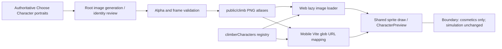

# Portrait-faithful character assets
Keep the existing Next/React/Capacitor canvas sprite architecture: it already shares the renderer and loads static sheets by id. No new renderer or image dependency.

```mermaid
flowchart LR
  P[Authoritative Choose Character portraits] --> G[Root image generation / identity review]
  G --> V[Alpha and frame validation]
  V --> A[public/climb PNG atlases]
  A --> W[Web lazy image loader]
  A --> M[Mobile Vite glob URL mapping]
  R[climberCharacters registry] --> W
  R --> M
  W --> D[Shared sprite draw / CharacterPreview]
  M --> D
  D --- B[Boundary: cosmetics only; simulation unchanged]
```

## Contracts and AC mapping
AC-1: reference stem `app/mobile/src/assets/avatars/<id>.webp` for each of kestrel, lynx, raven, panther, wolf, otter, heron, yak, mantis, cobra, badger, falcon, marmot, bison, ibex, sentinel, viking, gecko. Paid id is exactly `<id>-void`. `avatarSrc()` already falls back to the base portrait, so preserve that exact source instead of creating redesigned busts. Base registry sheets exist for all 18 and are outside this correction scope.
AC-2: no changes to avatar catalog, purchase checks, saved selection, fallback renderer, animation cadence or simulation.
AC-3: source pack cell 512; output cell 192. Poses cells in row order: idle, run-a, run-b, reach-a, reach-b, falling, celebrate, down. Climb is six back-facing traveling hand-over-hand frames. Root anchor `(96,172.5)` defaults; measured `headTop` in output-cell pixels excludes horns/ears/crests. `refH=rootY-headTop`. Scale stays constant across poses. Alpha PNG format must remain type 3 or 6 at bit depth 8 to satisfy existing decoder gate. Inspect gutters/key spill and foot anchoring before copy. Grounding helper exists at tools/climber-art/grounding.py; no existing chroma-key extraction script found. Root owns masters; scripts/climber-art/process_paid.py performs deterministic key/geometry compilation into output assets. It accepts 4x2 poses, 6x1 climbs or 3x2 climb-grid masters; aspect mismatch is rejected, never stretched.
AC-4: `app/mobile/src/lib/climberSheets.ts` currently captures ids with `[a-z0-9]+`, rejecting every new hyphenated skin id. Extend to validated internal hyphens and keep anchoring; existing registry setter still ignores unknown ids. Vite automatically imports matching public files. `avatarImages.ts` already accepts hyphenated portrait names.

## Minimal ownership/file map
- Root: paid-characters/art, generation references and prompts.
- Engineer after validated handoff: app/public/climb/<id>-void-poses-192.png and -climb-192.png; app/src/components/Game/climberCharacters.ts (18 measured VOID_SKIN_SHEETS entries); app/mobile/src/lib/climberSheets.ts (id parser); relevant public/climb documentation.
- Preserve app/mobile/src/assets/avatars/*.webp; new paid busts unnecessary when exact base images are required.
- Verifier: app/tests/game/climberSheetFiles.test.ts, climberCharacters.test.ts and mobile bundle mapping tests as appropriate.

## Failure modes / performance / security
Missing web sheet retains current vector/load fallback then Wraith error fallback; a failed climb strip uses own reach frames. Mobile resolves local bundle URLs without a server. Avoid registering absent assets and run production bundle checks so missing filename mappings cannot silently ship. At runtime retain lazy loading and existing bounded catalogue image cache; no additional per-frame work. No API/model/schema/index/auth/PII/secrets changes. Client rendering only; physics imports remain untouched under the existing lint boundary.

## ADRs
1. Latest user correction governs all visual design; original pack hood and single-accent text is obsolete reference data.
2. Preserve exact portrait files/fallback, not regenerated approximate busts.
3. Register only validated complete assets; do not claim a generic recolor meets identity requirements.

## Validation
Run app lint/typecheck/test after implementation; verifier adds meaningful coverage of all 18 registrations and native hyphenated ids. Existing sheet tests prove dimensions, transparent image decoding, >1000 pairwise frame-difference pixels, and sole rows 170–175. Visual QA must compare all 18 portraits with each animation, both previews and gameplay; tests cannot establish anatomy/style identity. Root/parent performs repo-required remaining gates and handoffs. Discovery has made no runtime changes and has not run implementation gates.

## Implemented compiler normalization
Standing pose indices0,1,2,3,4,6,7 plan vertical translations to sole172 (<=24px); airborne falling index5 stays authored. One whole-climb Y offset aligns the maximum sole to172, preserving relative frame motion. Both sheets then share one factor about(96,172.5), derived from all14 frame extents and11px target gutters. Every standing-pose shift and the climb shift are fused with the shared scale in one affine transform; no per-frame resize or intermediate clipping. Minimum allowed factor0.65. Reports distinguish sharedScale, scaleAnchor, wholeSheetShiftY and individual groundingShift. Seven Python fixtures cover actual decoding/keying/geometry and failure paths; runtime tests also cover native hyphenated ids. Compilation does not imply visual identity approval.
