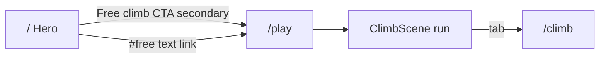
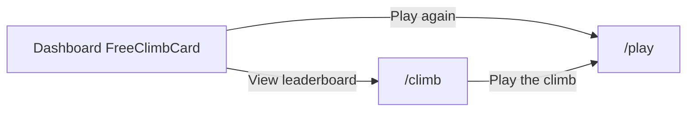

# Design: Climb Feel 1.2× (climb-scoped forks)

_Status: ready for implementer · 2026-09-06_  
_Spec: `loop/spec.md` · Architecture: `loop/architecture.md` (OQ-3 = climb-scoped forks)_  
_Live tokens: `app/DESIGN.md` — no second palette_

## Intent

Amplify The Climb’s presence by ~**1.2×** on climb-facing surfaces only. Shared ASCENT baselines for `enter` / `.reveal` / `groundRise` / `.grain` / `.topo` stay at today’s values so paid hero, auth, and tower shells do not get louder. All amplification lands as **climb-scoped forks** + `[data-climb-chrome]` CSS variable overrides + canvas constants in `climbFeelTokens.ts`.

**Hard locks:** no new hex/fonts; CTA net-new primary filled `/play` pitches = **0**; no `RAPID_CLIMB_MULT` / scoreBounds edits; WCAG 2.1 AA; every amplified motion collapses under `prefers-reduced-motion`.

---

## 1. Exact fork class / token table

Band rule: target ≈ baseline × 1.2 inside AC bands; NFR caps override. Chosen values are **band midpoints** (or nearest clean integer inside the band).

### 1.1 Motion forks (do **not** mutate shared baselines)

| Fork | Shared baseline (frozen) | Chosen 1.2× | Tailwind / CSS | Notes |
| --- | --- | --- | --- | --- |
| **climbEnter** | `enter`: translateY `16px`, `0.7s` | translateY **`19px`**, duration **`0.58s`** | keyframe `climbEnter`; util `animate-climbEnter` | Travel mid of 18–20; duration mid of 0.56–0.61 (≥200 ms) |
| **climb-reveal** | `.reveal` → `enter 0.7s …` | same travel/duration as climbEnter | class `.climb-reveal` | Use instead of `.reveal` on climb chrome only |
| **climbPunch** | `climb`: translateY `6px`, `0.8s` | translateY **`7.2px`**, duration **`0.67s`** | keyframe `climbPunch`; util `animate-climbPunch` | Replace `animate-climb` on Hero free-tier chips + climb chrome markers |
| **climbGroundRise** | `groundRise`: period `6s`, amp `4%` | period **`4.8s`**, amp **`4.8%`** | keyframe `climbGroundRise`; util `animate-climbGroundRise` | ≤20% shorter; ≥4 s (NFR-3). Paid `GroundRow` keeps `animate-groundRise` |

**Keyframe sketches (implementer):**

```css
@keyframes climbEnter {
  0%   { transform: translateY(19px); opacity: 0; }
  100% { transform: translateY(0);    opacity: 1; }
}
.climb-reveal {
  animation: climbEnter 0.58s cubic-bezier(0.16, 1, 0.3, 1) both;
}
@keyframes climbPunch {
  0%   { transform: translateY(7.2px); opacity: 0.4; }
  100% { transform: translateY(0);     opacity: 1; }
}
@keyframes climbGroundRise {
  0%, 100% { transform: translateY(4.8%); opacity: 0.85; }
  50%      { transform: translateY(0);    opacity: 1; }
}
```

### 1.2 Atmosphere — `[data-climb-chrome]` CSS vars

Do **not** raise global `.grain` / `.topo` authored numbers. Wire utilities to vars with **baseline fallbacks**, then override only under climb chrome:

| CSS custom property | `:root` / fallback | Chosen under `[data-climb-chrome]` | Cap |
| --- | --- | --- | --- |
| `--climb-grain-opacity` | `0.035` | **`0.042`** | ≤ 0.05 (NFR-4); band 0.040–0.044 |
| `--climb-topo-signal-alpha` | `0.05` | **`0.060`** | ≤ 0.08 (NFR-4); band 0.055–0.065 |

```css
.grain::before {
  opacity: var(--climb-grain-opacity, 0.035);
}
.topo {
  /* repeating-radial-gradient stops use: */
  /* rgb(var(--signal-rgb) / var(--climb-topo-signal-alpha, 0.05)) */
}
[data-climb-chrome] {
  --climb-grain-opacity: 0.042;
  --climb-topo-signal-alpha: 0.060;
}
```

**Hosts that must set `data-climb-chrome`:** `FreeStackShell` root `<main>`, landing free band (Hero free-tier wrapper + `FreeLeaderboard` `<section>`), `FreeClimbCard` / `FreeClimbEmpty` section roots. Prefer section-scoped on `/` — do not put `data-climb-chrome` on the whole landing document.

**Play chrome atmosphere (AC-3):** on `/play` FreeStackShell, ensure ≥2 of `{.grain, .topo, .survey-grid, .ground-gradient, .altimeter}`. Recommended pair: `.grain` + `.topo` (vars amplify them); keep `.survey-grid` / `.altimeter` where already used on LB/dashboard.

### 1.3 Canvas / HUD / VFX constants

| Constant | Baseline | Band | **Chosen** |
| --- | --- | --- | --- |
| `HUD_ALTITUDE_FONT_UI` | `13` | 15–16 | **`16`** |
| Lava/hazard HUD fill | `TEXT_SECONDARY` `#a8a4b2` | must not use `TEXT_MUTED` | **keep `TEXT_SECONDARY`** (or `LAVA_SLOWED` when slowed) |
| `PICKUP_SHAKE_AMP_UI` | `2.2` | 2.53–2.75 | **`2.64`** |
| `EMBER_MAX` | `88` | ≤105 (+20%) | **`105`** |

Altitude readout paint stays `#f4f2ec` (`text-primary`) on HUD `SURFACE` `#17161c` @ 0.92 alpha.

### 1.4 Power-up HUD motion (tune in place — climb-only consumers)

| Token | Baseline | Chosen (~1.2× punch) | Floor |
| --- | --- | --- | --- |
| `POWER_UP_ENTER_DURATION_S` | `0.45` | **`0.375`** | ≥ 0.2 |
| `POWER_UP_ENTER_SCALE_FROM` | `0.82` | **`0.784`** | — |
| `POWER_UP_ENTER_SCALE_PEAK` | `1.06` | **`1.072`** | — |
| `POWER_UP_URGENT_DURATION_S` | `0.75` | **`0.625`** | one-shot/infinite OK; keep in NFR band |
| `POWER_UP_URGENT_SCALE_PEAK` | `1.04` | **`1.048`** | — |

### 1.5 Typography steps (DESIGN.md scale only)

| Surface | Baseline classes | Chosen | Computed Δ @ default 16px root |
| --- | --- | --- | --- |
| `ClimbPanelIntro` `<h1>` | `text-2xl md:text-3xl` (24→30) | **`font-display text-3xl md:text-4xl`** (30→36) | md **1.20×** |
| `FreeLeaderboard` `<h2>` | `font-display text-2xl md:text-3xl` | **`font-display text-3xl md:text-4xl`** | md **1.20×**; keep climb language |
| `FreeClimbCard` rank | `text-4xl` (36px / 2.25rem) | **`text-[2.7rem]`** (= 43.2px) | **1.20×**; stay inside h2 36–48; `text-5xl` (48) is **1.33× — out of band — do not use** |
| Eyebrows | mono + `text-signal` / muted | unchanged role | muted OK for labels only |

---

## 2. Export list → `app/src/design/climbFeelTokens.ts`

Implementer copies these **exact export names** (values = chosen above). Tests import these — never grep CSS.

```ts
/** Climb Feel 1.2× — presentation only. Mirror in [data-climb-chrome] CSS vars. */

// HUD / VFX
export const HUD_ALTITUDE_FONT_UI = 16;
export const PICKUP_SHAKE_AMP_UI = 2.64;
export const EMBER_MAX = 105; // climbBackground — was 88

// Motion forks (AC-17) — shared enter/climb/groundRise baselines untouched
export const CLIMB_ENTER_TRANSLATE_Y_PX = 19;
export const CLIMB_ENTER_DURATION_S = 0.58;
export const CLIMB_PUNCH_TRANSLATE_Y_PX = 7.2;
export const CLIMB_PUNCH_DURATION_S = 0.67;
export const CLIMB_GROUND_RISE_DURATION_S = 4.8;
export const CLIMB_GROUND_RISE_AMP_PERCENT = 4.8;

// Atmosphere (AC-18) — CSS: --climb-grain-opacity / --climb-topo-signal-alpha
export const CLIMB_GRAIN_OPACITY = 0.042;
export const CLIMB_TOPO_SIGNAL_ALPHA = 0.06;

// Power-up HUD (tune in place)
export const POWER_UP_ENTER_DURATION_S = 0.375;
export const POWER_UP_ENTER_SCALE_FROM = 0.784;
export const POWER_UP_ENTER_SCALE_PEAK = 1.072;
export const POWER_UP_URGENT_DURATION_S = 0.625;
export const POWER_UP_URGENT_SCALE_PEAK = 1.048;

// Type class contracts (AC-8 / AC-9)
export const CLIMB_PANEL_INTRO_TITLE_CLASS =
  "font-display text-3xl md:text-4xl font-bold text-text-primary tracking-tight";
export const FREE_LEADERBOARD_HEADING_CLASS =
  "font-display text-3xl md:text-4xl text-text-secondary mt-3";
export const FREE_CLIMB_RANK_CLASS =
  "font-mono text-[2.7rem] font-bold text-text-primary tabular-nums";

/** Frozen physics — re-export or document in tests; do not change numerics. */
// RAPID_CLIMB_MULT, MAX_ASCENT_SPEED_MPS — import from game modules only
```

**CSS sync comment** (required in `globals.css` near climb forks):  
`/* Mirrors app/src/design/climbFeelTokens.ts — CLIMB_GRAIN_OPACITY, CLIMB_TOPO_SIGNAL_ALPHA, climbEnter/Punch/GroundRise */`

**Token count (presentation exports):** **18** numeric/motion/atmosphere exports + **3** class-string exports = **21** named climb-feel contracts.

---

## 3. CTA inventory — zero net-new primary climb pitches

Rule (DESIGN.md + AC-7 / NFR-8): one pitch per destination; net new **primary filled** free-climb (`bg-signal` → `/play`) on a surface = **0**.

### 3.1 Landing `/` — free-climb destinations

| Surface | Control | href | Style today | Accessible name today | Action this pass |
| --- | --- | --- | --- | --- | --- |
| Hero CTA group | Enter the arena | `/auth/signup` | **Primary filled `bg-signal`** | paid | **Unchanged** — sole filled signal in hero CTA group |
| Hero CTA group | Browse stacks | `/#towers` | Secondary border | paid | Unchanged |
| Hero free tier | `play →` chip | `/play` | Secondary border pill | **"play →"** (fails AC-5 name + 44×44) | **Extend:** label **`Free climb`**, `min-h-[44px] min-w-[44px]`, keep **not** `bg-signal`; optional `aria-label="Play free climb"` |
| FreeLeaderboard intro | Play free → | `/play` | Text underline | contains climb | Keep as **single** text link; do not promote to filled signal |
| FreeLeaderboard empty | Play the free climb → | `/play` | Text underline | contains climb | Keep **one** `/play` link; no second CTA |
| FreeLeaderboard | Full leaderboard → | `/climb` | Mono nav | nav | Unchanged (plain nav) |
| Footer Free climb | Play / Leaderboard | `/play`, `/climb` | Plain text links | nav | Unchanged — **not** promo pitches |

**Baseline count of primary filled `bg-signal` CTAs whose `href` is `/play` on `/`:** **0**.  
**Post-pass allowed count:** **0** (Δ ≤ 0).

### 3.2 `/climb` and dashboard

| Surface | Control | Style | Action |
| --- | --- | --- | --- |
| `PlayTheClimbCta` | Play the climb | Primary filled signal (canonical `/climb` pitch) | Keep one; do not duplicate in tab band |
| `FreeClimbCard` | Play again | Filled signal → `/play` | Keep (dashboard canonical when ranked) |
| `FreeClimbCard` | View leaderboard | Text link → `/climb` | Keep secondary |
| `FreeClimbEmpty` | Play free climb | **Secondary border** (not filled) | Keep secondary; body stays `text-secondary` (AC-11) |

Do **not** add another filled “Play the climb” on landing, footer, or navbar.

---

## 4. Screen inventory

| Route / surface | Entry | Exit | Auth | Primary action | Chrome / forks |
| --- | --- | --- | --- | --- | --- |
| **`/play`** | Nav Free climb · Play tab; Hero free CTA; dashboard Play | Tab → `/climb`; leave site | Guest OK | Play / restart climb (in-scene) | `FreeStackShell` + `data-climb-chrome`; ≥2 atmosphere classes; canvas HUD/shake/ember tokens; no page `.reveal` → use `.climb-reveal` if any |
| **`/climb`** | Play tab; Footer; FreeLeaderboard “Full leaderboard” | Tab → `/play`; Play the climb CTA | Guest OK (save needs auth) | **Play the climb** (one filled signal) | Same shell + `ClimbPanelIntro` title step; LB empty vs unavailable |
| **Landing free tier** (Hero free band) | `/` scroll | → `/play` secondary | Guest | Paid **Enter the arena** remains page primary | Free band only: `data-climb-chrome`; free chips `animate-climbPunch`; free CTA AC-5 fix |
| **Landing `FreeLeaderboard`** | `/#free` | → `/play` text / → `/climb` nav | Guest | Section primary = climb identity heading, **not** a new filled `/play` | `data-climb-chrome`; heading size step; body copy → `text-secondary` (not muted) |
| **Dashboard free climb** | `/dashboard` when user has/ hasn’t peak | → `/play`, `/climb` | Signed-in | Ranked: Play again; Empty: Play free climb (secondary) | Card `data-climb-chrome`; rank `2.7rem`; optional topo/survey already present |

### Annotated flows

**Happy — guest starts free climb**



Inline errors: canvas reduced-motion → no shake; LB `unavailable` → ember copy (not empty); empty → climb language + one `/play` link.

**Happy — ranked climber checks identity**



---

## 5. Component state specs

### 5.1 Hero free-tier control (AC-5)

| State | Spec |
| --- | --- |
| Default | Secondary: `rounded-full border border-border-strong bg-surface/60`; label **Free climb** (or visible “Free climb” + `aria-label="Play free climb"`); `min-h-[44px] min-w-[44px]`; mono small caps OK if ≥11px |
| Hover | `border-signal/50` + `text-signal` |
| Active | `scale-[0.98]` optional; no filled signal |
| Focus | `focus-visible:ring-2 focus-visible:ring-signal focus-visible:ring-offset-2 focus-visible:ring-offset-void` |
| Disabled | N/A (always navigable) |
| Loading | N/A |
| Keyboard | Tab focus; Enter/Space activate Link |
| a11y | Accessible name matches `/climb/i`; not `bg-signal` |

### 5.2 `ClimbPanelIntro` title + CTA

| State | Spec |
| --- | --- |
| Default | Title: `CLIMB_PANEL_INTRO_TITLE_CLASS`; eyebrow mono signal unchanged; CTA `PlayTheClimbCta` House primary |
| Empty/error | N/A (parent LB handles) |
| Focus (CTA) | Existing signal ring |
| Keyboard | CTA ≥44×44; tabs remain Links without arrow roving (do not steal climber Left/Right on `/play`) |

### 5.3 `ClimbLeaderboard` (AC-10)

| State | Spec |
| --- | --- |
| Default (rows) | Existing signal rank-1 treatment; body/rank `text-primary` / secondary — **no muted body** |
| Empty (`length===0`, `unavailable===false`) | Climb language (“climbers” / “climb”); single path to play if present |
| Unavailable (`unavailable===true`) | Ember-coded “standings unavailable” — **not** empty copy |
| Loading | Parent responsibility; do not collapse into empty |

### 5.4 `FreeClimbCard` / `FreeClimbEmpty` (AC-9, AC-11)

| State | Spec |
| --- | --- |
| Ranked default | Rank `FREE_CLIMB_RANK_CLASS`; keep `border-signal/30` + `shadow-signal` (glow blur ≤+20% OK, no new glow token name) |
| Empty | Eyebrow may use muted; **body** `text-text-secondary` (already); CTA secondary border ≥44×44 |
| Hover/focus | Existing link/button patterns |

### 5.5 Canvas HUD / pickup shake (AC-1, AC-2)

| State | Spec |
| --- | --- |
| Default | Altitude font `16 * ui` bold mono; lava line `TEXT_SECONDARY` |
| Pickup | Shake amp `2.64 * ui * falloff²` |
| `reducedMotion` | `pickupShakeOffset` → `{dx:0,dy:0}` every tick; suppress lava shimmer / non-essential particles (existing props) |

### 5.6 PowerUpHud live region (AC-14)

| State | Spec |
| --- | --- |
| Announce | Preserve monotonic suffix / ZWSP / announceCount — do not regress to identical repeat strings |
| Urgent | Tuned `powerUpUrgent` durations/scales; disabled under reduced motion |

---

## 6. `prefers-reduced-motion` matrix

| Amplified motion | Motion allowed | `prefers-reduced-motion: reduce` |
| --- | --- | --- |
| `.climb-reveal` / `animate-climbEnter` | 19px / 0.58s enter | `animation: none` |
| `animate-climbPunch` | 7.2px / 0.67s | `animation: none` |
| `animate-climbGroundRise` | 4.8s / 4.8% | `animation: none`; static gradient OK |
| Shared `.reveal` / `animate-enter` / `animate-climb` / `animate-groundRise` / marquee | unchanged baselines | Existing globals block — **keep**; **add** climb forks to the same `@media` block |
| Pickup shake | amp 2.64 | Zero offset |
| Lava shimmer / ember drift / particles | subtle motion | Suppressed via existing `reducedMotion` |
| `powerUpEnter` / `powerUpUrgent` | tuned | `animation: none` or static opacity |

```css
@media (prefers-reduced-motion: reduce) {
  .reveal, .climb-reveal,
  .animate-enter, .animate-climbEnter,
  .animate-climb, .animate-climbPunch,
  .animate-groundRise, .animate-climbGroundRise,
  .animate-marquee,
  .animate-powerUpEnter, .animate-powerUpUrgent {
    animation: none !important;
  }
}
```

---

## 7. Contrast AA notes (amplified HUD / type)

| Pair | Approx ratio | Use |
| --- | --- | --- |
| `#f4f2ec` on `#0a0a0c` (void) | ~15:1 | Headings, altitude |
| `#f4f2ec` on `#17161c` (HUD SURFACE) | ~13:1 | Canvas altitude ✅ |
| `#a8a4b2` on `#0a0a0c` | ~8:1 | Body / lava HUD ✅ |
| `#a8a4b2` on `#17161c` | ~7:1 | Lava line on HUD ✅ |
| `#74707e` on `#0a0a0c` | **~4.11:1** | Labels/eyebrows **only** — **never** body (AC-13 / ledger) |
| `#74707e` on `#121116` / `#17161c` | **~3.9:1** | Decorative only |
| `#cbf24d` on `#0a0a0c` | ~13:1 | Eyebrows, CTAs on void |
| Signal CTA `text-void` on `bg-signal` | high | Primary buttons |

**Touch-ups required while amplifying:**

1. `FreeLeaderboard` intro `<p className="text-sm text-text-muted">` → **`text-text-secondary`** (body sentence).  
2. HUD lava stays `TEXT_SECONDARY`, never `TEXT_MUTED`.  
3. Larger HUD type (16 UI) still &lt; 18pt at `ui=1` → treat as normal text; keep primary/secondary pairs above.

---

## 8. Wireframes (structure)

### 8.1 `/play` chrome

```
┌──────────────────────────────────────────┐
│ Navbar · contextLabel "Free climb"       │
├──────────────────────────────────────────┤
│ [ Leaderboard ] [ Play● ]   ← tab band   │
├──────────────────────────────────────────┤
│ data-climb-chrome                        │
│ ┌──────────────────────────────────────┐ │
│ │ .grain + .topo (vars 0.042 / 0.060)  │ │
│ │                                      │ │
│ │  HUD ████ altitude 16ui  lava sec.   │ │
│ │                                      │ │
│ │         [ ClimbCanvas full bleed ]   │ │
│ │                                      │ │
│ │  PowerUpHud (tuned enter/urgent)     │ │
│ └──────────────────────────────────────┘ │
└──────────────────────────────────────────┘
```

### 8.2 `/climb` panel

```
┌──────────────────────────────────────────┐
│ Navbar · Free climb                      │
├──────────────────────────────────────────┤
│ [ Leaderboard● ] [ Play ]                │
├──────────────────────────────────────────┤
│ data-climb-chrome · max-w-2xl            │
│  FREE STACK · mono signal                │
│  Title display 3xl/4xl    [Play climb]   │
│  body secondary …                        │
│  ── leaderboard rows / empty / unavail ──│
└──────────────────────────────────────────┘
```

### 8.3 Landing free band (secondary to paid)

```
┌──────────────────────────────────────────┐
│ HERO                                     │
│  Brand / paid pitch                      │
│  [ Enter the arena ●signal ] [ Browse ]  │  ← sole primary filled
│  Paid stats …                            │
│  Free · warm-up  [ Free climb → ]        │  ← secondary, ≥44×44, climb name
│  Free stats (animate-climbPunch chips)   │
├──────────────────────────────────────────┤
│ #free FreeLeaderboard · data-climb-chrome│
│  display 3xl/4xl "Top climbers"          │
│  body secondary + one text /play link    │
│  rows | empty (climb copy + one link)    │
└──────────────────────────────────────────┘
```

### 8.4 Dashboard free climb

```
┌──────────────────────────────────────────┐
│ FreeClimbCard · data-climb-chrome        │
│  survey-grid                             │
│  Free climb · your rank                  │
│  #12   ← 2.7rem mono tabular             │
│  Best peak …     [ Play again ●signal ]  │
│                  View leaderboard (text) │
└──────────────────────────────────────────┘
```

---

## 9. Microcopy deltas (climb-centered, no new pitches)

| Location | From | To |
| --- | --- | --- |
| Hero free chip | `play →` | **`Free climb`** (visible) + ensure accessible name matches `/climb/i` |
| FreeLeaderboard heading | Top climbers | Keep (already climb language); size step only |
| FreeLeaderboard intro body | `text-muted` | **`text-secondary`** (contrast) |
| Elsewhere | — | Do not invent second “Play the climb” filled CTAs |

---

## 10. Out of scope / non-goals (design)

- Mutating shared `enter` / `.reveal` / `groundRise` / global grain·topo baselines.  
- New color tokens, fonts, or glow token names.  
- Physics / `RAPID_CLIMB_MULT` / score envelopes / server re-sim (OQ-1 open).  
- Paid checkout CTA restyle; demoting “Enter the arena”.  
- MVP+ audio intensity pack.

---

## 11. Implementer checklist (from architecture §15)

1. ✅ Fork names: `climbEnter`, `climbPunch`, `climbGroundRise`, `.climb-reveal`, `[data-climb-chrome]`.  
2. ✅ Exact midpoints chosen (table §1).  
3. ✅ Type steps AC-8/AC-9 mapped.  
4. ✅ CTA inventory — baseline filled `/play` on `/` = 0.  
5. ✅ No RAPID_CLIMB_MULT / scoreBounds proposals.  
6. ✅ Export list §2 ready to copy into `climbFeelTokens.ts`.

**nextStage:** implementer.
