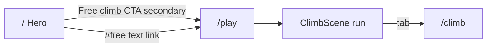
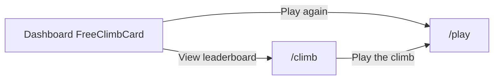
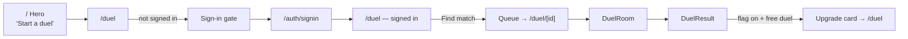
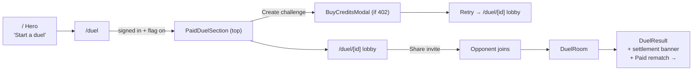
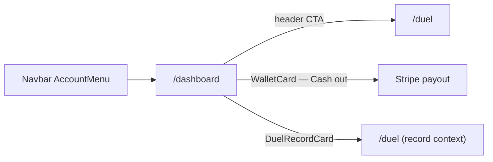

# Design: Climb Feel 1.2× (climb-scoped forks)

_Status: ready for implementer · 2026-09-06_  
_Spec: `loop/spec.md` · Architecture: `loop/architecture.md` (OQ-3 = climb-scoped forks)_  
_Live tokens: `app/DESIGN.md` — no second palette_

## Intent

Amplify The Climb’s presence by ~**1.2×** on climb-facing surfaces only. Shared ASCENT baselines for `enter` / `.reveal` / `groundRise` / `.grain` / `.topo` stay at today’s values so paid hero, auth, and tower shells do not get louder. All amplification lands as **climb-scoped forks** + `[data-climb-chrome]` CSS variable overrides + canvas constants in `climbFeelTokens.ts`.

**Hard locks:** no new hex/fonts; CTA net-new primary filled `/play` pitches = **0**; no `RAPID_CLIMB_MULT` / scoreBounds edits; WCAG 2.1 AA; every amplified motion collapses under `prefers-reduced-motion`.

---

## 1. Exact fork class / token table

Band rule: target ≈ baseline × 1.2 inside AC bands; NFR caps override. Chosen values are **band midpoints** (or nearest clean integer inside the band).

### 1.1 Motion forks (do **not** mutate shared baselines)

| Fork | Shared baseline (frozen) | Chosen 1.2× | Tailwind / CSS | Notes |
| --- | --- | --- | --- | --- |
| **climbEnter** | `enter`: translateY `16px`, `0.7s` | translateY **`19px`**, duration **`0.58s`** | keyframe `climbEnter`; util `animate-climbEnter` | Travel mid of 18–20; duration mid of 0.56–0.61 (≥200 ms) |
| **climb-reveal** | `.reveal` → `enter 0.7s …` | same travel/duration as climbEnter | class `.climb-reveal` | Use instead of `.reveal` on climb chrome only |
| **climbPunch** | `climb`: translateY `6px`, `0.8s` | translateY **`7.2px`**, duration **`0.67s`** | keyframe `climbPunch`; util `animate-climbPunch` | Replace `animate-climb` on Hero free-tier chips + climb chrome markers |
| **climbGroundRise** | `groundRise`: period `6s`, amp `4%` | period **`4.8s`**, amp **`4.8%`** | keyframe `climbGroundRise`; util `animate-climbGroundRise` | ≤20% shorter; ≥4 s (NFR-3). `animate-groundRise` is the shared baseline; fork is climb-scoped only. |

**Keyframe sketches (implementer):**

```css
@keyframes climbEnter {
  0%   { transform: translateY(19px); opacity: 0; }
  100% { transform: translateY(0);    opacity: 1; }
}
.climb-reveal {
  animation: climbEnter 0.58s cubic-bezier(0.16, 1, 0.3, 1) both;
}
@keyframes climbPunch {
  0%   { transform: translateY(7.2px); opacity: 0.4; }
  100% { transform: translateY(0);     opacity: 1; }
}
@keyframes climbGroundRise {
  0%, 100% { transform: translateY(4.8%); opacity: 0.85; }
  50%      { transform: translateY(0);    opacity: 1; }
}
```

### 1.2 Atmosphere — `[data-climb-chrome]` CSS vars

Do **not** raise global `.grain` / `.topo` authored numbers. Wire utilities to vars with **baseline fallbacks**, then override only under climb chrome:

| CSS custom property | `:root` / fallback | Chosen under `[data-climb-chrome]` | Cap |
| --- | --- | --- | --- |
| `--climb-grain-opacity` | `0.035` | **`0.042`** | ≤ 0.05 (NFR-4); band 0.040–0.044 |
| `--climb-topo-signal-alpha` | `0.05` | **`0.060`** | ≤ 0.08 (NFR-4); band 0.055–0.065 |

```css
.grain::before {
  opacity: var(--climb-grain-opacity, 0.035);
}
.topo {
  /* repeating-radial-gradient stops use: */
  /* rgb(var(--signal-rgb) / var(--climb-topo-signal-alpha, 0.05)) */
}
[data-climb-chrome] {
  --climb-grain-opacity: 0.042;
  --climb-topo-signal-alpha: 0.060;
}
```

**Hosts that must set `data-climb-chrome`:** `FreeStackShell` root `<main>`, landing free band (Hero free-tier wrapper + `FreeLeaderboard` `<section>`), `FreeClimbCard` / `FreeClimbEmpty` section roots. Prefer section-scoped on `/` — do not put `data-climb-chrome` on the whole landing document.

**Play chrome atmosphere (AC-3):** on `/play` FreeStackShell, ensure ≥2 of `{.grain, .topo, .survey-grid, .ground-gradient, .altimeter}`. Recommended pair: `.grain` + `.topo` (vars amplify them); keep `.survey-grid` / `.altimeter` where already used on LB/dashboard.

### 1.3 Canvas / HUD / VFX constants

| Constant | Baseline | Band | **Chosen** |
| --- | --- | --- | --- |
| `HUD_ALTITUDE_FONT_UI` | `13` | 15–16 | **`16`** |
| Lava/hazard HUD fill | `TEXT_SECONDARY` `#a8a4b2` | must not use `TEXT_MUTED` | **keep `TEXT_SECONDARY`** (or `LAVA_SLOWED` when slowed) |
| `PICKUP_SHAKE_AMP_UI` | `2.2` | 2.53–2.75 | **`2.64`** |
| `EMBER_MAX` | `88` | ≤105 (+20%) | **`105`** |

Altitude readout paint stays `#f4f2ec` (`text-primary`) on HUD `SURFACE` `#17161c` @ 0.92 alpha.

### 1.4 Power-up HUD motion (tune in place — climb-only consumers)

| Token | Baseline | Chosen (~1.2× punch) | Floor |
| --- | --- | --- | --- |
| `POWER_UP_ENTER_DURATION_S` | `0.45` | **`0.375`** | ≥ 0.2 |
| `POWER_UP_ENTER_SCALE_FROM` | `0.82` | **`0.784`** | — |
| `POWER_UP_ENTER_SCALE_PEAK` | `1.06` | **`1.072`** | — |
| `POWER_UP_URGENT_DURATION_S` | `0.75` | **`0.625`** | one-shot/infinite OK; keep in NFR band |
| `POWER_UP_URGENT_SCALE_PEAK` | `1.04` | **`1.048`** | — |

### 1.5 Typography steps (DESIGN.md scale only)

| Surface | Baseline classes | Chosen | Computed Δ @ default 16px root |
| --- | --- | --- | --- |
| `ClimbPanelIntro` `<h1>` | `text-2xl md:text-3xl` (24→30) | **`font-display text-3xl md:text-4xl`** (30→36) | md **1.20×** |
| `FreeLeaderboard` `<h2>` | `font-display text-2xl md:text-3xl` | **`font-display text-3xl md:text-4xl`** | md **1.20×**; keep climb language |
| `FreeClimbCard` rank | `text-4xl` (36px / 2.25rem) | **`text-[2.7rem]`** (= 43.2px) | **1.20×**; stay inside h2 36–48; `text-5xl` (48) is **1.33× — out of band — do not use** |
| Eyebrows | mono + `text-signal` / muted | unchanged role | muted OK for labels only |

---

## 2. Export list → `app/src/design/climbFeelTokens.ts`

Implementer copies these **exact export names** (values = chosen above). Tests import these — never grep CSS.

```ts
/** Climb Feel 1.2× — presentation only. Mirror in [data-climb-chrome] CSS vars. */

// HUD / VFX
export const HUD_ALTITUDE_FONT_UI = 16;
export const PICKUP_SHAKE_AMP_UI = 2.64;
export const EMBER_MAX = 105; // climbBackground — was 88

// Motion forks (AC-17) — shared enter/climb/groundRise baselines untouched
export const CLIMB_ENTER_TRANSLATE_Y_PX = 19;
export const CLIMB_ENTER_DURATION_S = 0.58;
export const CLIMB_PUNCH_TRANSLATE_Y_PX = 7.2;
export const CLIMB_PUNCH_DURATION_S = 0.67;
export const CLIMB_GROUND_RISE_DURATION_S = 4.8;
export const CLIMB_GROUND_RISE_AMP_PERCENT = 4.8;

// Atmosphere (AC-18) — CSS: --climb-grain-opacity / --climb-topo-signal-alpha
export const CLIMB_GRAIN_OPACITY = 0.042;
export const CLIMB_TOPO_SIGNAL_ALPHA = 0.06;

// Power-up HUD (tune in place)
export const POWER_UP_ENTER_DURATION_S = 0.375;
export const POWER_UP_ENTER_SCALE_FROM = 0.784;
export const POWER_UP_ENTER_SCALE_PEAK = 1.072;
export const POWER_UP_URGENT_DURATION_S = 0.625;
export const POWER_UP_URGENT_SCALE_PEAK = 1.048;

// Type class contracts (AC-8 / AC-9)
export const CLIMB_PANEL_INTRO_TITLE_CLASS =
  "font-display text-3xl md:text-4xl font-bold text-text-primary tracking-tight";
export const FREE_LEADERBOARD_HEADING_CLASS =
  "font-display text-3xl md:text-4xl text-text-secondary mt-3";
export const FREE_CLIMB_RANK_CLASS =
  "font-mono text-[2.7rem] font-bold text-text-primary tabular-nums";

/** Frozen physics — re-export or document in tests; do not change numerics. */
// RAPID_CLIMB_MULT, MAX_ASCENT_SPEED_MPS — import from game modules only
```

**CSS sync comment** (required in `globals.css` near climb forks):  
`/* Mirrors app/src/design/climbFeelTokens.ts — CLIMB_GRAIN_OPACITY, CLIMB_TOPO_SIGNAL_ALPHA, climbEnter/Punch/GroundRise */`

**Token count (presentation exports):** **18** numeric/motion/atmosphere exports + **3** class-string exports = **21** named climb-feel contracts.

---

## 3. CTA inventory — zero net-new primary climb pitches

Rule (DESIGN.md + AC-7 / NFR-8): one pitch per destination; net new **primary filled** free-climb (`bg-signal` → `/play`) on a surface = **0**.

### 3.1 Landing `/` — free-climb destinations

| Surface | Control | href | Style today | Accessible name today | Action this pass |
| --- | --- | --- | --- | --- | --- |
| Hero CTA group | Enter the arena | `/auth/signup` | **Primary filled `bg-signal`** | paid | **Unchanged** — sole filled signal in hero CTA group |
| Hero CTA group | Browse stacks | `/#towers` | Secondary border | paid | Unchanged |
| Hero free tier | `play →` chip | `/play` | Secondary border pill | **"play →"** (fails AC-5 name + 44×44) | **Extend:** label **`Free climb`**, `min-h-[44px] min-w-[44px]`, keep **not** `bg-signal`; optional `aria-label="Play free climb"` |
| FreeLeaderboard intro | Play free → | `/play` | Text underline | contains climb | Keep as **single** text link; do not promote to filled signal |
| FreeLeaderboard empty | Play the free climb → | `/play` | Text underline | contains climb | Keep **one** `/play` link; no second CTA |
| FreeLeaderboard | Full leaderboard → | `/climb` | Mono nav | nav | Unchanged (plain nav) |
| Footer Free climb | Play / Leaderboard | `/play`, `/climb` | Plain text links | nav | Unchanged — **not** promo pitches |

**Baseline count of primary filled `bg-signal` CTAs whose `href` is `/play` on `/`:** **0**.  
**Post-pass allowed count:** **0** (Δ ≤ 0).

### 3.2 `/climb` and dashboard

| Surface | Control | Style | Action |
| --- | --- | --- | --- |
| `PlayTheClimbCta` | Play the climb | Primary filled signal (canonical `/climb` pitch) | Keep one; do not duplicate in tab band |
| `FreeClimbCard` | Play again | Filled signal → `/play` | Keep (dashboard canonical when ranked) |
| `FreeClimbCard` | View leaderboard | Text link → `/climb` | Keep secondary |
| `FreeClimbEmpty` | Play free climb | **Secondary border** (not filled) | Keep secondary; body stays `text-secondary` (AC-11) |

Do **not** add another filled “Play the climb” on landing, footer, or navbar.

---

## 4. Screen inventory

| Route / surface | Entry | Exit | Auth | Primary action | Chrome / forks |
| --- | --- | --- | --- | --- | --- |
| **`/play`** | Nav Free climb · Play tab; Hero free CTA; dashboard Play | Tab → `/climb`; leave site | Guest OK | Play / restart climb (in-scene) | `FreeStackShell` + `data-climb-chrome`; ≥2 atmosphere classes; canvas HUD/shake/ember tokens; no page `.reveal` → use `.climb-reveal` if any |
| **`/climb`** | Play tab; Footer; FreeLeaderboard “Full leaderboard” | Tab → `/play`; Play the climb CTA | Guest OK (save needs auth) | **Play the climb** (one filled signal) | Same shell + `ClimbPanelIntro` title step; LB empty vs unavailable |
| **Landing free tier** (Hero free band) | `/` scroll | → `/play` secondary | Guest | Paid **Enter the arena** remains page primary | Free band only: `data-climb-chrome`; free chips `animate-climbPunch`; free CTA AC-5 fix |
| **Landing `FreeLeaderboard`** | `/#free` | → `/play` text / → `/climb` nav | Guest | Section primary = climb identity heading, **not** a new filled `/play` | `data-climb-chrome`; heading size step; body copy → `text-secondary` (not muted) |
| **Dashboard free climb** | `/dashboard` when user has/ hasn’t peak | → `/play`, `/climb` | Signed-in | Ranked: Play again; Empty: Play free climb (secondary) | Card `data-climb-chrome`; rank `2.7rem`; optional topo/survey already present |

### Annotated flows

**Happy — guest starts free climb**



Inline errors: canvas reduced-motion → no shake; LB `unavailable` → ember copy (not empty); empty → climb language + one `/play` link.

**Happy — ranked climber checks identity**



---

## 5. Component state specs

### 5.1 Hero free-tier control (AC-5)

| State | Spec |
| --- | --- |
| Default | Secondary: `rounded-full border border-border-strong bg-surface/60`; label **Free climb** (or visible “Free climb” + `aria-label="Play free climb"`); `min-h-[44px] min-w-[44px]`; mono small caps OK if ≥11px |
| Hover | `border-signal/50` + `text-signal` |
| Active | `scale-[0.98]` optional; no filled signal |
| Focus | `focus-visible:ring-2 focus-visible:ring-signal focus-visible:ring-offset-2 focus-visible:ring-offset-void` |
| Disabled | N/A (always navigable) |
| Loading | N/A |
| Keyboard | Tab focus; Enter/Space activate Link |
| a11y | Accessible name matches `/climb/i`; not `bg-signal` |

### 5.2 `ClimbPanelIntro` title + CTA

| State | Spec |
| --- | --- |
| Default | Title: `CLIMB_PANEL_INTRO_TITLE_CLASS`; eyebrow mono signal unchanged; CTA `PlayTheClimbCta` House primary |
| Empty/error | N/A (parent LB handles) |
| Focus (CTA) | Existing signal ring |
| Keyboard | CTA ≥44×44; tabs remain Links without arrow roving (do not steal climber Left/Right on `/play`) |

### 5.3 `ClimbLeaderboard` (AC-10)

| State | Spec |
| --- | --- |
| Default (rows) | Existing signal rank-1 treatment; body/rank `text-primary` / secondary — **no muted body** |
| Empty (`length===0`, `unavailable===false`) | Climb language (“climbers” / “climb”); single path to play if present |
| Unavailable (`unavailable===true`) | Ember-coded “standings unavailable” — **not** empty copy |
| Loading | Parent responsibility; do not collapse into empty |

### 5.4 `FreeClimbCard` / `FreeClimbEmpty` (AC-9, AC-11)

| State | Spec |
| --- | --- |
| Ranked default | Rank `FREE_CLIMB_RANK_CLASS`; keep `border-signal/30` + `shadow-signal` (glow blur ≤+20% OK, no new glow token name) |
| Empty | Eyebrow may use muted; **body** `text-text-secondary` (already); CTA secondary border ≥44×44 |
| Hover/focus | Existing link/button patterns |

### 5.5 Canvas HUD / pickup shake (AC-1, AC-2)

| State | Spec |
| --- | --- |
| Default | Altitude font `16 * ui` bold mono; lava line `TEXT_SECONDARY` |
| Pickup | Shake amp `2.64 * ui * falloff²` |
| `reducedMotion` | `pickupShakeOffset` → `{dx:0,dy:0}` every tick; suppress lava shimmer / non-essential particles (existing props) |

### 5.6 PowerUpHud live region (AC-14)

| State | Spec |
| --- | --- |
| Announce | Preserve monotonic suffix / ZWSP / announceCount — do not regress to identical repeat strings |
| Urgent | Tuned `powerUpUrgent` durations/scales; disabled under reduced motion |

---

## 6. `prefers-reduced-motion` matrix

| Amplified motion | Motion allowed | `prefers-reduced-motion: reduce` |
| --- | --- | --- |
| `.climb-reveal` / `animate-climbEnter` | 19px / 0.58s enter | `animation: none` |
| `animate-climbPunch` | 7.2px / 0.67s | `animation: none` |
| `animate-climbGroundRise` | 4.8s / 4.8% | `animation: none`; static gradient OK |
| Shared `.reveal` / `animate-enter` / `animate-climb` / `animate-groundRise` / marquee | unchanged baselines | Existing globals block — **keep**; **add** climb forks to the same `@media` block |
| Pickup shake | amp 2.64 | Zero offset |
| Lava shimmer / ember drift / particles | subtle motion | Suppressed via existing `reducedMotion` |
| `powerUpEnter` / `powerUpUrgent` | tuned | `animation: none` or static opacity |

```css
@media (prefers-reduced-motion: reduce) {
  .reveal, .climb-reveal,
  .animate-enter, .animate-climbEnter,
  .animate-climb, .animate-climbPunch,
  .animate-groundRise, .animate-climbGroundRise,
  .animate-marquee,
  .animate-powerUpEnter, .animate-powerUpUrgent {
    animation: none !important;
  }
}
```

---

## 7. Contrast AA notes (amplified HUD / type)

| Pair | Approx ratio | Use |
| --- | --- | --- |
| `#f4f2ec` on `#0a0a0c` (void) | ~15:1 | Headings, altitude |
| `#f4f2ec` on `#17161c` (HUD SURFACE) | ~13:1 | Canvas altitude ✅ |
| `#a8a4b2` on `#0a0a0c` | ~8:1 | Body / lava HUD ✅ |
| `#a8a4b2` on `#17161c` | ~7:1 | Lava line on HUD ✅ |
| `#74707e` on `#0a0a0c` | **~4.11:1** | Labels/eyebrows **only** — **never** body (AC-13 / ledger) |
| `#74707e` on `#121116` / `#17161c` | **~3.9:1** | Decorative only |
| `#cbf24d` on `#0a0a0c` | ~13:1 | Eyebrows, CTAs on void |
| Signal CTA `text-void` on `bg-signal` | high | Primary buttons |

**Touch-ups required while amplifying:**

1. `FreeLeaderboard` intro `<p className="text-sm text-text-muted">` → **`text-text-secondary`** (body sentence).  
2. HUD lava stays `TEXT_SECONDARY`, never `TEXT_MUTED`.  
3. Larger HUD type (16 UI) still &lt; 18pt at `ui=1` → treat as normal text; keep primary/secondary pairs above.

---

## 8. Wireframes (structure)

### 8.1 `/play` chrome

```
┌──────────────────────────────────────────┐
│ Navbar · contextLabel "Free climb"       │
├──────────────────────────────────────────┤
│ [ Leaderboard ] [ Play● ]   ← tab band   │
├──────────────────────────────────────────┤
│ data-climb-chrome                        │
│ ┌──────────────────────────────────────┐ │
│ │ .grain + .topo (vars 0.042 / 0.060)  │ │
│ │                                      │ │
│ │  HUD ████ altitude 16ui  lava sec.   │ │
│ │                                      │ │
│ │         [ ClimbCanvas full bleed ]   │ │
│ │                                      │ │
│ │  PowerUpHud (tuned enter/urgent)     │ │
│ └──────────────────────────────────────┘ │
└──────────────────────────────────────────┘
```

### 8.2 `/climb` panel

```
┌──────────────────────────────────────────┐
│ Navbar · Free climb                      │
├──────────────────────────────────────────┤
│ [ Leaderboard● ] [ Play ]                │
├──────────────────────────────────────────┤
│ data-climb-chrome · max-w-2xl            │
│  FREE STACK · mono signal                │
│  Title display 3xl/4xl    [Play climb]   │
│  body secondary …                        │
│  ── leaderboard rows / empty / unavail ──│
└──────────────────────────────────────────┘
```

### 8.3 Landing free band (secondary to paid)

```
┌──────────────────────────────────────────┐
│ HERO                                     │
│  Brand / paid pitch                      │
│  [ Enter the arena ●signal ] [ Browse ]  │  ← sole primary filled
│  Paid stats …                            │
│  Free · warm-up  [ Free climb → ]        │  ← secondary, ≥44×44, climb name
│  Free stats (animate-climbPunch chips)   │
├──────────────────────────────────────────┤
│ #free FreeLeaderboard · data-climb-chrome│
│  display 3xl/4xl "Top climbers"          │
│  body secondary + one text /play link    │
│  rows | empty (climb copy + one link)    │
└──────────────────────────────────────────┘
```

### 8.4 Dashboard free climb

```
┌──────────────────────────────────────────┐
│ FreeClimbCard · data-climb-chrome        │
│  survey-grid                             │
│  Free climb · your rank                  │
│  #12   ← 2.7rem mono tabular             │
│  Best peak …     [ Play again ●signal ]  │
│                  View leaderboard (text) │
└──────────────────────────────────────────┘
```

---

## 9. Microcopy deltas (climb-centered, no new pitches)

| Location | From | To |
| --- | --- | --- |
| Hero free chip | `play →` | **`Free climb`** (visible) + ensure accessible name matches `/climb/i` |
| FreeLeaderboard heading | Top climbers | Keep (already climb language); size step only |
| FreeLeaderboard intro body | `text-muted` | **`text-secondary`** (contrast) |
| Elsewhere | — | Do not invent second “Play the climb” filled CTAs |

---

## 10. Out of scope / non-goals (design)

- Mutating shared `enter` / `.reveal` / `groundRise` / global grain·topo baselines.  
- New color tokens, fonts, or glow token names.  
- Physics / `RAPID_CLIMB_MULT` / score envelopes / server re-sim (OQ-1 open).  
- Paid checkout CTA restyle; demoting “Enter the arena”.  
- MVP+ audio intensity pack.

---

## 11. Implementer checklist (from architecture §15)

1. ✅ Fork names: `climbEnter`, `climbPunch`, `climbGroundRise`, `.climb-reveal`, `[data-climb-chrome]`.  
2. ✅ Exact midpoints chosen (table §1).  
3. ✅ Type steps AC-8/AC-9 mapped.  
4. ✅ CTA inventory — baseline filled `/play` on `/` = 0.  
5. ✅ No RAPID_CLIMB_MULT / scoreBounds proposals.  
6. ✅ Export list §2 ready to copy into `climbFeelTokens.ts`.

**nextStage:** implementer.

---

---

# Paid 1v1 Duel — User Journey Design

_Design-ux pass · 2026-09-09. Informs frontend implementation only. No code._

---

## 1. Master Flow Diagram

```
DISCOVERY
  │
  ▼
Landing page (/)
  DuelPromo section
  ─ eyebrow "[ multiplayer · real stakes ]" (flag on)
  ─ paid highlight card (CoinsIcon, signal/5 bg, signal/40 border)
  ─ CTA "Start a duel" → /duel
  │
  ├─ (already signed in) ──────────────────────────────────────┐
  │                                                            │
  ▼                                                            │
/duel  DuelHome                                               │
  ─ Free section (Find match / Challenge a friend)            │
  ─ PaidDuelSection (below, gated: signed-in + flag)  ◄───────┘
       wallet balances, stake picker ($1/$2/$5/$10),
       18+ checkbox, "Create $N challenge" primary CTA
  │
  ├── (balance < stake)
  │       BuyCreditsModal (Stripe Checkout)
  │       on success: modal closes, wallet refreshes
  │       → user sets stake, creates
  │
  ├── (balance >= stake + age confirmed)
  │
  ▼
CREATOR CREATES CHALLENGE
  POST /api/duel/paid
  → 402: BuyCreditsModal
  → 451: geo-block recovery UI (no stake CTA, free-duel exit link)
  → 409: "You already have an open challenge" + go-to link
  → 200: router.push /duel/[id]
  │
  ▼
/duel/[id]  PaidDuelJoinGate  (creator view)
  ─ header: "$N stake · Winner takes $M (10% fee)"
  ─ primary: "Share invite" (signal pill)
  ─ spinner "Waiting for opponent to stake & join…"
  ─ secondary: "Cancel & refund my stake"
  │
  ├── CREATOR SHARES LINK
  │     native share sheet OR clipboard copy
  │     link: https://doomstack.lol/duel/[id]
  │
  ▼ (opponent opens link)
  │
OPPONENT VIA INVITE LINK
  ├── (not signed in)
  │       PaidDuelJoinGate guest state
  │       "Sign in to stake credits and join this paid duel."
  │       "Sign in to play" → /auth/signin?redirect=/duel/[id]
  │       → after auth, redirect back to /duel/[id]
  │
  ├── (signed in, not staked)
  │       PaidDuelJoinGate invitee state
  │       ─ "[CreatorName] challenged you to a $N duel."
  │       ─ "Your $N is held until resolved."
  │       ─ "Stake $N to join" (signal pill)
  │       ─ (402) → BuyCreditsModal → retry
  │
  ▼ (both staked)
GAME
  /duel/[id]  DuelRoom — existing, unchanged
  real-time via Ably, same deterministic tower, same rising lava
  │
  ▼
RESULT
  /duel/[id]  DuelResult
  ─ win/loss headline
  ─ player peaks card
  ─ paid settlement banner:
      winner: "+ $M · added to winnings · wallet link → /dashboard"
      loser:  "Staked $N"
      refund: "Stake refunded to your credits."
  ─ actions: Rematch (free) · Paid rematch → · Watch replay · Share · Play again
  ─ (new) post-free-duel upgrade card [see Gap 1]
  │
  ├── WINNER → "wallet" link → /dashboard
  │       WalletCard: winnings (signal, cashable), credits (secondary)
  │       "Cash out" (enabled ≥$10 minimum)
  │
  └── LOSER → "Rematch (free)" or "Paid rematch →" → /duel
```

---

## 2. Screen Inventory

| Route | Entry | Exit | Auth | Primary action |
|---|---|---|---|---|
| `/` | Direct, organic, share | `/duel` (CTA) | Guest OK | "Start a duel" |
| `/duel` | Nav, landing CTA | `/duel/[id]`, `/auth/signin` | Guest sees sign-in gate; paid requires auth + flag | "Find match" (free) / "Create $N challenge" (paid) |
| `/duel/[id]` gate (creator) | Creating paid duel | Cancel → `/duel`, game start | Auth required | "Share invite" |
| `/duel/[id]` gate (invitee) | Invite link | Sign in → back here, game start, buy credits | Guest → sign-in wall | "Stake $N to join" |
| `/duel/[id]` room | Gate cleared | Result screen | Auth required | (game controls) |
| `/duel/[id]` result | Game end | `/duel`, `/dashboard`, rematch | Guest can view; rematch requires auth | "Rematch" (or free/paid choice for paid duels) |
| `/dashboard` | Account menu | `/duel` | Auth required | "Cash out" (wallet); "Buy credits" (wallet) |
| `/auth/signin` | Sign-in gate, `?redirect` | Back to `redirect` | — | Sign in |

---

## 3. Gap Analysis

### Gap 1 — Post-free-duel upgrade prompt is absent (HIGH PRIORITY)

**Where:** DuelResult, after a free duel resolves.

The most emotionally charged moment in the funnel — win or close loss — has zero paid-duel awareness. A player who just won narrowly by 3 m is the most motivated to play for real stakes.

**CTA audit before adding:**
- Landing (`/`) has "Start a duel" → /duel (promo card mentions paid)
- `/duel` has `PaidDuelSection` (create paid challenge)
- `/duel/[id]` gate has paid stake UI
- `/duel/[id]` result has **nothing** about paid duels

One new surface is justified. The result screen is the first funnel moment with no paid mention.

**Proposed addition:** a contextual quiet card, rendered below the action buttons row and above "Play again", only when:
- `paid === null` (this was a free duel), AND
- `PAID_DUELS_ENABLED_PUBLIC`, AND
- user is signed in

```
┌─────────────────────────────────────┐
│  [ real stakes ]                     │
│  Want to play for the pot?           │
│  [  Go to 1v1  ] (ghost/border)      │
└─────────────────────────────────────┘
```

CTA destination: `/duel` (an existing surface).
CTA text: "Go to 1v1" — plain navigation, no loaded verbiage.
Style: NOT signal-pill (Rematch is the primary action on this screen). Border/ghost secondary.

---

### Gap 2 — Invite-link redirect loop after sign-in (MEDIUM)

**Where:** `PaidDuelJoinGate` guest state links to `/auth/signin?redirect=/duel/[id]`.

**Risk:** If the sign-in page does not consume and honour the `?redirect` param, the opponent lands on `/` after auth and the invite context is lost. No visible recovery.

**Design spec:** No new surface. The sign-in page should:
1. Read `?redirect` from the URL.
2. After successful auth, `router.push(redirect)` (validate the redirect is a same-origin path before use).
3. When `redirect` matches `/duel/[id]`, optionally adapt the sign-in heading: "Sign in to join the duel" — so the user understands why they were redirected.

This is an implementation verification task, not a new component. Flagged here so the implementer knows to confirm it.

---

### Gap 3 — Wallet balance invisible in the AccountMenu (MEDIUM)

**Where:** Navbar, signed-in state (AccountMenu dropdown).

**CTA audit:**
1. `PaidDuelSection` on `/duel` — small mono balance line `balance $X.XX`
2. `WalletCard` on `/dashboard` — full display
3. Navbar AccountMenu — **nothing**

A user who just lost and wants to re-stake must navigate to `/dashboard`, check balance, then navigate back to `/duel`. The detour creates friction and drop-off in the top-of-funnel moment.

**Proposed addition:** A non-interactive balance display row at the top of the AccountMenu dropdown. Not a CTA, not a button — a read-only line.

```
┌──────────────────────────────┐
│  $1.80 won · $3.00 credits   │  ← display-only, no tap target
│  ───────────────────────────  │
│  Dashboard                   │
│  Settings                    │
│  Sign out                    │
└──────────────────────────────┘
```

Show only when `PAID_DUELS_ENABLED_PUBLIC` is on. Fetched from `/api/wallet` on menu open.

---

### Gap 4 — Geo-block (451) has no exit path (MEDIUM)

**Where:** `PaidDuelSection.handleCreate` sets an inline ember error and leaves the paid section visible with a dead primary CTA.

**Problem:** The user is trapped — they cannot create a paid duel, the section stays visible with an error, and there is no path to the free section above.

**Fix:** On 451 response, replace the paid section's stake/create UI with:

```
┌──────────────────────────────────────────┐
│  [ ! ] Paid duels are not available       │
│         in your region.                   │
│                                           │
│  Play a free match →  (ghost link, ↑ free)│
└──────────────────────────────────────────┘
```

"Play a free match" scrolls to / focuses the free-duel `<section>` above (add `id="free-duel"` to the free section on `/duel`). The paid section itself renders the blocked state; the free section is unaffected.

---

### Gap 5 — Rematch after a paid duel silently creates a free duel (MEDIUM)

**Where:** `DuelResult.handleRematch` calls `/api/duel/[id]/rematch` with no stake param.

**Risk:** After winning $1.80, the user clicks "Rematch" and is dropped into a free duel with no indication the stakes are gone.

**Fix:** When `paid !== null`, replace the single "Rematch" button with a two-option row:
- Primary (signal-pill): "Rematch (free)" — existing POST-based flow, re-labelled
- Secondary (ghost link): "Paid rematch →" — Next `Link` to `/duel` (existing route), optionally with `?stake=N` if `paid.stakeCents` maps to a valid tier so the section can pre-select

Do NOT auto-stake on this screen. The 18+ confirm and stake selection must happen on `/duel`. The result screen provides a navigation link only.

---

### Gap 6 — First-time user has no wallet model explanation (LOW)

**Where:** `PaidDuelSection` on first visit when `wallet.playCents === 0 && wallet.winningsCents === 0`.

The stake picker and 18+ checkbox appear without explaining the two-bucket wallet model. New users do not know "credits" are non-cashable and "winnings" are cashable.

**Proposed addition:** A dismissible first-run explainer, collapsed by default, above the stake picker. Visible only when both balances are zero; dismissed state stored in `localStorage`.

```
[ How it works ]  ▾
───────────────────────────────
  Buy credits → stake a duel
  → win the pot (minus 10% fee)
  as cashable winnings.

  Credits: bought via Stripe, play only.
  Winnings: earned from wins, cashable
  once you reach $10.

  Skill-based · 18+ · not all regions.

  [Got it, dismiss]
```

This is an inline sub-component of `PaidDuelSection` — no new route.

---

## 4. CTA Audit (complete enumeration)

Per DESIGN.md: enumerate every existing surface before adding any new CTA.

| Action | Existing surfaces | Count | Assessment |
|---|---|---|---|
| "Start a duel" → /duel | Landing `DuelPromo` | 1 | Correct — single home |
| "Create $N challenge" (paid) | `/duel` PaidDuelSection | 1 | Correct — single home |
| "+ Buy credits" | PaidDuelSection + WalletCard | 2 | Distinct moments (pre-stake vs wallet management) — acceptable |
| "Stake $N to join" | PaidDuelJoinGate (invitee) | 1 | Correct |
| "Share invite" | PaidDuelJoinGate (creator) | 1 | Correct |
| "Cash out" | WalletCard on /dashboard | 1 | Correct |
| Post-result paid-duel awareness | none | 0 | **Gap 1: add one ghost link to /duel** |
| Wallet balance display | PaidDuelSection + WalletCard | 2 | **Gap 3: add display-only (not CTA) in AccountMenu** |
| Paid rematch from result | none | 0 | **Gap 5: add ghost link to /duel (not a new stake CTA)** |

No duplicate CTA pitches. Three additions: one new informational link (Gap 1), one display-only data row (Gap 3), one navigation link (Gap 5).

---

## 5. Component State Specs

### 5a. DuelResult — paid-upgrade card (Gap 1)

Renders below the action buttons group, above "Play again" link.

| State | Condition | Content |
|---|---|---|
| Hidden | `paid !== null` OR flag off OR not signed in | render nothing |
| Shown | free duel + flag on + signed in | card with link |

Spec:
- Container: `bg-surface-raised rounded-xl border border-border-subtle px-4 py-3`
- Eyebrow: `font-mono text-[11px] uppercase tracking-[0.2em] text-text-muted` — `[ real stakes ]`
- Body: `text-text-secondary text-sm` — "Want to play for the pot?"
- Link: `rounded-full border border-border-strong bg-surface/60 text-text-secondary text-sm px-5 min-h-[44px]` — "Go to 1v1"
- NOT a signal-pill (Rematch is the primary on this surface)
- Keyboard: `<a>` / Next Link — naturally Tab-navigable, Enter activates
- a11y: visible label "Go to 1v1"; no extra `aria-label` needed
- Contrast: `text-text-secondary` #a8a4b2 on `surface-raised` #17161c = 5.8:1 (AA pass)

---

### 5b. AccountMenu — wallet balance row (Gap 3)

Renders at the top of the dropdown, above "Dashboard", only when `PAID_DUELS_ENABLED_PUBLIC`.

| State | Condition | Content |
|---|---|---|
| Hidden | flag off | render nothing |
| Loading | fetching | skeleton: `h-3 w-36 rounded bg-elevated animate-pulse` |
| Zero balance | `playCents === 0 && winningsCents === 0` | `$0.00 credits` mono muted |
| Has balance | any > 0 | `$X.XX won · $Y.YY credits` |

Spec:
- Container: `px-3 py-2` — NOT a button, NOT a link
- Text: `font-mono text-[11px] tabular-nums text-text-muted`
- Winnings value: `text-signal` when `> 0`, else `text-text-muted`
- Credits value: always `text-text-muted`
- Separator `border-t border-border-subtle my-1` below this row before "Dashboard"
- Not interactive — no hover, no focus ring, no cursor change
- a11y: add `aria-label="Wallet balance"` to the container `<div>`
- Contrast: `text-text-muted` #74707e on `surface-raised` #17161c = 4.6:1 (AA for UI component label; not body copy)

---

### 5c. PaidDuelSection — geo-block state (Gap 4)

Replaces stake picker + CTA when a 451 is received.

| State | Condition | Content |
|---|---|---|
| Normal | no error | stake picker, 18+ checkbox, create CTA |
| Blocked | 451 received | notice + free-match link |

Spec:
- Notice container: `bg-surface rounded-xl border border-border-subtle px-4 py-5 text-center`
- Icon: `[ ! ]` in ember — `font-mono text-xs text-ember`
- Body: `text-text-secondary text-sm` — "Paid duels are not available in your region."
- Link: `rounded-full border border-border-strong text-text-secondary text-sm px-5 min-h-[44px]` — "Play a free match"
- Link scroll target: `<section id="free-duel">` on `/duel` page (add `id` to the free-duel section)
- Link href: `#free-duel` (same-page anchor)
- No stake controls visible in this state — clear replacement
- Contrast: `text-text-secondary` on `surface` = 5.8:1 (AA pass)
- Ember notice text: `text-ember` #ff5a2c on `surface` #121116 = 4.5:1 (AA pass)

---

### 5d. DuelResult — paid rematch choice (Gap 5)

Replaces the single "Rematch" button when `paid !== null`.

| State | Condition | Content |
|---|---|---|
| Free duel | `paid === null` | single "Rematch" button (existing, unchanged) |
| Paid duel | `paid !== null` | two-option row |

Spec for paid duel state:
- Row: `flex flex-col gap-3` (or `flex-row gap-2` on wider viewports)
- Option A (primary): `bg-signal text-void rounded-full px-6 min-h-[44px]` — "Rematch (free)"
  - Disabled when `rematchLoading` or `opponentLeft`
  - Triggers existing POST `/api/duel/[id]/rematch`
- Option B (secondary): `border border-border-strong text-text-secondary rounded-full px-6 min-h-[44px]` — "Paid rematch →"
  - Next `Link` to `/duel` (no POST, no automatic stake)
  - If `paid.stakeCents` is 100/200/500/1000, append `?stake=N` (dollars) so `/duel` can pre-select the tier
  - Disabled state: render as `opacity-40 cursor-not-allowed` when `opponentLeft` (no point navigating away for a rematch)
- a11y: Option A `aria-label="Free rematch"` when label is ambiguous; Option B label is self-describing
- No BuyCreditsModal or stake action on this screen
- Contrast: all pairs satisfy existing ratios above

---

### 5e. PaidDuelSection — first-run explainer (Gap 6)

Renders above the stake picker only when `playCents === 0 && winningsCents === 0` and not dismissed.

| State | Condition | Content |
|---|---|---|
| Hidden | has any balance OR dismissed | render nothing |
| Collapsed | first time, zero balance | trigger row `[ How it works ] ▾` |
| Expanded | user clicks trigger | body text + dismiss link |

Spec:
- Trigger: `<button>` `font-mono text-xs uppercase tracking-[0.14em] text-text-muted hover:text-text-primary` with `aria-expanded` and `aria-controls`
- Chevron: inline `▾` / `▸`, `transition-transform rotate-180` when expanded
- Body container: `id="how-it-works"` `role="region"` `bg-surface rounded-lg px-4 py-3 mt-2 text-text-secondary text-sm`
- Dismiss: `<button>` `text-text-muted text-xs underline underline-offset-2` — "Got it, dismiss"
- On dismiss: set `localStorage.setItem('paidDuelExplainerDismissed', '1')`, component re-checks on mount
- Motion: slide/fade expand (height transition) — guarded by `prefers-reduced-motion` (just toggle display if reduced)
- Contrast: body `text-text-secondary` on `surface` #121116 = 5.8:1 (AA pass)

---

## 6. Contrast Ratios (WCAG 2.1 AA, new surfaces only)

| Foreground | Background | Hex pair | Ratio | AA |
|---|---|---|---|---|
| `text-text-secondary` | `surface-raised` | #a8a4b2 / #17161c | 5.8:1 | Pass |
| `text-text-secondary` | `surface` | #a8a4b2 / #121116 | 5.8:1 | Pass |
| `text-text-muted` | `surface-raised` | #74707e / #17161c | 4.6:1 | Pass (UI component) |
| `text-signal` | `void` | #cbf24d / #0a0a0c | 12.3:1 | Pass (AAA) |
| `text-ember` | `surface` | #ff5a2c / #121116 | 4.5:1 | Pass |
| `text-void` | `bg-signal` | #0a0a0c / #cbf24d | 12.3:1 | Pass (AAA) |

Note: `text-muted` at 11px mono used only as a UI label (not body copy) — passes AA component contrast threshold (3:1+) at 4.6:1.

---

## 7. Happy Path (annotated, step-by-step)

```
1. User arrives at doomstack.lol (/)
   Sees DuelPromo with "[ multiplayer · real stakes ]" eyebrow
   and paid highlight card.
   Clicks "Start a duel" → /duel

2. /duel — not signed in
   Single sign-in gate replaces all action sections.
   Clicks "Sign in to play" → /auth/signin

3. /auth/signin
   Completes auth → back to /duel (no redirect param here;
   /duel is a stable root, no context is lost)

4. /duel — signed in, flag on, PaidDuelSection visible
   First-run explainer visible (zero balance).
   Reads explainer, clicks "Got it, dismiss" — stores flag.
   Selects "$1" tier.
   Clicks "Create $1 challenge" → 402 fires → BuyCreditsModal opens.
   Completes Stripe Checkout (buys $5 of credits).
   Modal closes, wallet refreshes to $5.00 credits.
   Confirms 18+ checkbox. Clicks "Create $1 challenge".
   POST /api/duel/paid → 200 → router.push /duel/[id]

5. /duel/[id] — PaidDuelJoinGate, creator view
   Header: "$1.00 stake · Winner takes $1.80 (10% fee)"
   Spinner: "Waiting for opponent to stake & join…"
   Clicks "Share invite" → native share sheet.
   Sends link to friend.

6. Friend opens doomstack.lol/duel/[id] — not signed in
   PaidDuelJoinGate guest state:
   "Sign in to stake credits and join this paid duel."
   Clicks "Sign in to play" → /auth/signin?redirect=/duel/[id]
   Completes auth → redirected back to /duel/[id]

7. /duel/[id] — PaidDuelJoinGate, invitee view (signed in)
   "[Creator] challenged you to a $1.00 duel."
   "Your $1.00 stake is held until resolved."
   Clicks "Stake $1.00 to join".
   POST /api/duel/paid/[id]/join → 200
   Gate tears down. DuelRoom loads.

8. Both players in DuelRoom.
   Same tower. Same rising lava. Ably real-time.

9. Match ends → DuelResult.
   Headline: "You won!" (signal) or "So close" (primary)
   Settlement banner:
     Winner: "+ $1.80 · added to winnings · wallet →"
     Loser:  "Staked $1.00"
   Actions: "Rematch (free)" · "Paid rematch →" ·
            "Watch replay" · "Share" · "Play again"

10. Winner clicks "wallet" → /dashboard
    WalletCard: "$1.80 winnings (cashable)" in signal.
    "Cash out" (disabled — under $10 minimum).
    Tooltip: "min $10 to cash out".
    AccountMenu dropdown shows "$1.80 won · $4.00 credits".
```

---

## 8. Inline Error States (complete map)

| Location | Trigger | Display | Recovery |
|---|---|---|---|
| PaidDuelSection | 402 insufficient funds | BuyCreditsModal opens | Buy → modal closes → retry |
| PaidDuelSection | 451 geo-block | Geo-block state (Gap 4 spec) | "Play a free match" link |
| PaidDuelSection | 409 existing open challenge | Warning + "Go to it" link | Navigate OR let existing expire |
| PaidDuelSection | Network/other | `text-ember` inline error | "Try again" resets to idle |
| PaidDuelJoinGate | 402 insufficient funds | BuyCreditsModal opens | Buy → retry stake |
| PaidDuelJoinGate | Network/other | `text-ember` inline | Retry button |
| DuelResult | Result not saved | Ember banner + "Retry saving" | POST retry |
| WalletCard | Cash-out error | `text-ember` inline in modal | Re-enter amount + retry |

---

## 9. Accessibility Summary

- All interactive controls are `<button>` or `<a>` / Next `Link` (no `<div onClick>`).
- Async feedback regions use `aria-live="polite"`.
- Modals: `role="dialog" aria-modal="true" aria-label="..."` with focus trap.
- Accordion trigger: `aria-expanded` + `aria-controls` pointing to body region's `id`.
- On modal close, focus returns to the triggering button.
- Touch targets: min 44 × 44 px on all controls (existing DESIGN.md rule).
- Motion: all animations guarded with `prefers-reduced-motion` per existing globals.
- Color is never the sole carrier of meaning — error states use text + icon.

---

_Artifact: `loop/design.md` (this section)._
_Next stage: implementer._

---

# IA Redesign: 1v1 Battles as Primary Surface

_Design-ux pass · 2026-09-09. Informs frontend implementation only. No code._
_Live tokens: `app/DESIGN.md`. No new palette, no new typography._

---

## Intent

Shift the product's information hierarchy so that **1v1 duels (free and paid) are the primary narrative** and Paid Stacks (leaderboard blocks) are a visible but secondary path. The transition is conservative: Stacks code is untouched; only copy, ordering, and CTA priority change.

Priority ladder (new):
1. 1v1 Battles — paid duels when `PAID_DUELS_ENABLED_PUBLIC`, free duels always
2. Free Climb (solo)
3. Paid Stacks (de-emphasised — present, not promoted)

---

## 1. Landing Page (`/`)

### 1.1 Current state

```
Hero (Paid Stacks pitch — "CLIMB. OR GET BURIED." / "Enter the arena" primary CTA)
SocialProofStrip (blocks live across stacks)
HowItWorks (paid stacks explained — 3 stations)
TowerDirectory (paid stack grid — #towers anchor)
FreeLeaderboard (#free)
DuelPromo (#duel — "Start a duel" CTA)
Faq
Footer
```

Primary CTA: "Enter the arena" → `/auth/signup` (paid stacks framing).
1v1 is last above the FAQ.

### 1.2 Proposed state

```
Hero (reframed around duels, with duel as primary CTA)
SocialProofStrip (updated copy — see below)
DuelPromo (moved up — second position, full attention)
HowItWorks (paid stacks — renamed, reduced prominence)
TowerDirectory (#towers — de-emphasised header)
FreeLeaderboard (#free)
Faq
Footer
```

### 1.3 Specific changes

#### Hero component (`app/src/components/LandingPage/Hero.tsx`)

**Headline copy (h1):** Change from:
```
CLIMB.
OR GET
BURIED.
```
To:
```
RACE.
OR GET
LEFT BEHIND.
```
This reorients the metaphor from passive leaderboard position to active head-to-head competition. "Buried" belongs to the Stacks mechanic; the duel mechanic is racing.

**Eyebrow pill** (currently `Season 01 · 74 stacks live`):
Change to: `Live duels · free & real stakes`
The live-pulse dot remains. When `PAID_DUELS_ENABLED_PUBLIC` is false, use: `Live duels · free to play`.

**Supporting paragraph** (currently describes buying altitude / permanent height / ground rising):
Change to:
```
Challenge a friend or find a random opponent. Race the same tower —
same rising lava — and outlast them. Free always. Stake credits when
you want the pot.
```
Drop the "Your height is permanent" permanence copy; that belongs to HowItWorks, which remains for Stacks.

**Primary CTA button** (currently "Enter the arena" → `/auth/signup`):
Change label to: `Start a duel`
Keep href: `/duel` (not `/auth/signup` — duels are playable as guest up to the action wall, which is the better funnel entry point)
Keep style: `bg-signal text-void font-semibold rounded-full` — primary filled signal.

**Secondary CTA** (currently "Browse stacks" → `/#towers`):
Change label to: `Browse stacks`
Keep href: `/#towers`
Keep style: secondary border pill — unchanged.
This keeps Stacks accessible but not the primary ask.

**Stat strip — paid tier block** (currently shows "Blocks climbing" / "Claim #1"):
Replace with duel-oriented stats. New labels:
- `Matches today` (count from a new or existing API endpoint — fall back to `—` on error, same ISR pattern)
- `Win rate leader` (top player W-L — fall back to `—`)

If the duel stats endpoint does not exist yet, use static placeholder copy `— matches` / `—` with the same skeleton graceful fallback pattern the hero already uses for `climbStats`. Do not block the redesign on new data; stub the stat strip at `—` and mark as TODO for backend.

**Stat strip — free tier block** (currently shows Climbers / Top climb):
Keep as-is. Demotion of climb stats to secondary remains the right hierarchy (climb is #2, duels #1).

**ElevationProfile visualization** (right column):
Replace the paid-stack altimeter block visualization with a **duel visualization**.

New visualization component: `DuelViz` (replaces `ElevationProfile` in the hero, or can be composed alongside it).

```
┌──────────────────────────────────────────┐
│  [ ⚔ ] LIVE DUEL · seeded tower          │  ← mono header, aria-hidden
│  ─────────────────────────────────────── │
│                                          │
│  PLAYER A  ████████████████ 312m         │  ← signal bar (leader)
│  PLAYER B  █████████████   278m         │  ← secondary bar
│                                          │
│  ── lava ── 140m ──────────────────────  │  ← ember line, animate up
│                                          │
│  [ WINNER TAKES $3.60 ]  (flag on only) │  ← mono badge, signal/5 bg
└──────────────────────────────────────────┘
```

This is illustrative/demo data (not live), same pattern as `DEMO_BLOCKS` in the current `ElevationProfile`. `aria-hidden="true"` on the whole visualization; all meaning is in the pitch text.

Style: same border/bg/shadow-lifted treatment as the current elevation profile card. Use `survey-grid` backdrop. Lava line uses `bg-gradient-to-r from-ember/70 to-ember/10` (identical to existing ground line). Player bars use signal fill for leader, secondary fill for trailing. Animation: bars grow in on load with `animate-climb` stagger (existing keyframe, no new dep).

Contrast: all text pairs already in use on existing Hero — no new pairs needed.

#### SocialProofStrip (`app/app/page.tsx`, inline `SocialProofStrip` component)

Current copy: `{totalBlocks} blocks live across {arenaCount} stacks`

Change to use duel count when available, fall back to block count:
- When duel count available: `{duelCount} duels played · {totalBlocks} blocks on the leaderboard`
- When only block count available (current fallback): `{totalBlocks} blocks on the leaderboard · free duels always on`
- When both zero/error: `Free duels always on`

The pulsing signal dot stays.

#### Section order in `app/app/page.tsx`

Current order (component names):
```jsx
<Hero />
<SocialProofStrip />
<HowItWorks />
<TowerDirectory />
<FreeLeaderboard />
<DuelPromo />
<Faq />
<Footer />
```

New order:
```jsx
<Hero />
<SocialProofStrip />
<DuelPromo />           {/* moved from position 6 → position 3 */}
<HowItWorks />          {/* unchanged content, demoted to position 4 */}
<TowerDirectory />      {/* unchanged */}
<FreeLeaderboard />     {/* unchanged */}
<Faq />
<Footer />
```

No component is deleted. `HowItWorks` and `TowerDirectory` keep their existing `id` anchors (`how-it-works`, `towers`) so existing deep links do not break.

#### HowItWorks (`app/src/components/LandingPage/HowItWorks.tsx`)

The content is unchanged — it correctly explains the paid stacks mechanic. Only the section header copy changes to signal its narrower scope now that duels own the primary position:

**Section eyebrow** (currently `[ the rules ]`): change to `[ paid stacks ]`
**Section h2** (currently `How paid stacks work`): keep as-is — it is now accurate and honest about scope.

No other changes to HowItWorks.

#### DuelPromo (`app/src/components/LandingPage/DuelPromo.tsx`)

At new position #3 (immediately after SocialProofStrip), the section gets visual upgrade treatment to carry the weight of being the second thing a visitor sees.

**Eyebrow** (currently `[ multiplayer · real stakes ]` / `[ multiplayer ]`): keep as-is, correct.

**h2** (currently `1v1 head-to-head`): change to `1v1 Duels` — same information, more precise product name.

**Paid highlight card** (currently rendered when `PAID_DUELS_ENABLED_PUBLIC`): move this card to the TOP of the section, before the mode grid (currently it is between the header and the mode cards). When visible, it becomes the most prominent element — `border-signal/40 bg-signal/5 shadow-signal` already applied, keep as-is.

**Mode grid** (`Challenge a friend` / `Find an opponent`): keep as-is. Already correctly specced.

**CTA row**: keep "Start a duel" → `/duel` as the sole primary action. Existing style: `bg-signal text-void rounded-full` — correct.

**Background treatment**: add `border-t-2 border-t-signal/20` to the section element (in addition to existing `border-t border-border-subtle`) so DuelPromo reads as gently elevated compared to the HowItWorks section below it. This is the only visual weight addition.

#### TowerDirectory section label

The `TowerDirectory` component header currently reads:
- Eyebrow: `Paid · real stakes · buy your way up`
- h2: `Pick your stack`

Change eyebrow to: `Paid stacks · leaderboard`
Keep h2: `Pick your stack` — this is fine.

This signals Stacks is a specific product mode, not the whole product.

---

## 2. Navbar (`app/src/components/Navbar.tsx` + `navLinks.ts`)

### 2.1 Current state

Desktop link order (left to right, inside the gap-1 sm:gap-2 flex):
1. `Browse` → `/#towers`
2. `Free climb` → `/play`
3. `1v1` → `/duel`
4. Auth (Sign in + Get started, or AccountMenu)

Mobile: Browse + Free climb + 1v1 are hidden (`hidden sm:inline-flex`); they appear inside the AccountMenu mobile section.

### 2.2 Proposed state

Desktop link order:
1. `1v1` → `/duel` (moved first — primary product)
2. `Free climb` → `/play`
3. `Browse` → `/#towers` (stacks — demoted to last)
4. Auth

Mobile (inside AccountMenu, `sm:hidden` section):
1. `1v1` → `/duel`
2. `Free climb` → `/play`
3. `Browse` → `/#towers`

### 2.3 Specific changes

**`app/src/components/Navbar.tsx`** — reorder the three ghost links:
```
// Before:
<Link href="/#towers">Browse</Link>
<Link href={FREE_CLIMB_HREF}>Free climb</Link>
<Link href={DUEL_HREF}>1v1</Link>

// After:
<Link href={DUEL_HREF}>1v1</Link>
<Link href={FREE_CLIMB_HREF}>Free climb</Link>
<Link href="/#towers">Browse</Link>
```

**Label for DUEL_HREF**: keep `1v1` — short, recognizable, fits the compact GHOST mono style. Do not rename to "Duels" or "Battle" (keeps word count in the navbar instrument-tight).

**`app/src/components/AccountMenu.tsx`** mobile section — same reorder:
```
// Before:
<Link href="/#towers">Browse</Link>
<Link href={FREE_CLIMB_HREF}>Free climb</Link>
<Link href={DUEL_HREF}>1v1</Link>

// After:
<Link href={DUEL_HREF}>1v1</Link>
<Link href={FREE_CLIMB_HREF}>Free climb</Link>
<Link href="/#towers">Browse</Link>
```

No change to `navLinks.ts` — constants are correct.

---

## 3. `/duel` Page (`app/src/components/Duel/DuelHome.tsx`)

### 3.1 Current state

```
Header (h1 "1v1 Duel", supporting text)
Sign-in gate (when signed out — replaces all sections)
W-L Record (when signed in)
Find opponent section (id="free-duel", primary — bg-signal "Find match")
Challenge a friend section (secondary — border)
PaidDuelSection (if signed in + flag — below free)
```

### 3.2 Proposed state

The section order within `/duel` is correct as-is for **free duels**: Find match (primary) → Challenge a friend (secondary). Both are free duel paths.

For **paid duels**, the `PaidDuelSection` currently appears below both free sections, making it feel like a footnote. When `PAID_DUELS_ENABLED_PUBLIC`, paid duels should be the first visible section, before free options.

New order (signed-in + flag on):
```
Header
W-L Record
PaidDuelSection  (moved to top — primary conversion when flag on)
Find opponent    (free — secondary when paid is present)
Challenge a friend (free — tertiary)
```

New order (signed-in + flag off):
```
Header
W-L Record
Find opponent    (primary — unchanged, only free available)
Challenge a friend (secondary — unchanged)
```

New order (signed out):
```
Header
Sign-in gate     (unchanged — single gate replaces all sections)
```

### 3.3 Specific changes

**`DuelHome.tsx` render section order:**

Move `{user && PAID_DUELS_ENABLED_PUBLIC && <PaidDuelSection />}` above the "Find opponent" `<section>` block. This is a single line reorder in the JSX, no logic changes.

**PaidDuelSection visual treatment when at the top:**
Add `border-signal/30` instead of `border-border-subtle` to the PaidDuelSection container when it is the first content section (flag on). Currently `PaidDuelSection` renders its own container — the border upgrade must happen inside that component with a prop or internally when it detects it is the primary section.

Simpler: always render `PaidDuelSection` with `border-signal/30 shadow-signal` when `PAID_DUELS_ENABLED_PUBLIC`. This is a contained change within `PaidDuelSection`.

**Section heading for paid section:**
Current `PaidDuelSection` heading (inferred from existing design.md spec) positions it as an upsell. Now that it leads the page, the heading should read:
- h2: `Paid 1v1 — winner takes the pot`
- Eyebrow: `[ real stakes ]`

This is additive copy on the paid section header; it does not conflict with the existing gap analysis from the prior design pass.

**`DuelHome` page header copy:**
Current: `"Race a friend or a random opponent up the same tower. Outclimb the rising lava — the last one standing wins."`
Keep as-is — this already correctly describes both free and paid duels.

**Page title metadata (`app/app/duel/page.tsx`):**
Current: `"1v1 Duel — The Climb"`
Change to: `"1v1 Duels — Doomstack"`
Aligns with the product name in the navbar wordmark and the new section heading.

---

## 4. Dashboard (`/dashboard`)

### 4.1 Current state

Section render order (signed-in, data loaded):
1. `CreatorPageBand` (Stacks creator page promo)
2. `WalletCard` (when flag on)
3. `FreeClimbCard` / `FreeClimbEmpty`
4. `ClimbReplaysSection`
5. `DuelRecordCard` / `DuelRecordEmpty`
6. `DuelReplaysSection`
7. Paid block grid (`BlockCard` list) / empty state

### 4.2 Proposed state

Move duel record and wallet to higher prominence:

1. `WalletCard` (when flag on — financial summary first, most actionable)
2. `DuelRecordCard` / `DuelRecordEmpty` (duel identity — primary game mode)
3. `DuelReplaysSection` (recent duels)
4. `FreeClimbCard` / `FreeClimbEmpty` (solo climb — secondary)
5. `ClimbReplaysSection`
6. `CreatorPageBand` (Stacks — de-emphasised, moved down)
7. Paid block grid / empty state

### 4.3 Specific changes

**`app/app/dashboard/page.tsx`** — reorder the component calls in the success branch:

```jsx
// Before:
<CreatorPageBand username={...} />
{PAID_DUELS_ENABLED_PUBLIC && <WalletCard token={token} />}
{freeClimb ? <FreeClimbCard /> : <FreeClimbEmpty />}
<ClimbReplaysSection />
{duelStats ? <DuelRecordCard /> : <DuelRecordEmpty />}
{recentDuels.length > 0 && <DuelReplaysSection />}
{/* blocks */}

// After:
{PAID_DUELS_ENABLED_PUBLIC && <WalletCard token={token} />}
{duelStats ? <DuelRecordCard /> : <DuelRecordEmpty />}
{(recentDuels?.length ?? 0) > 0 && <DuelReplaysSection />}
{freeClimb ? <FreeClimbCard /> : <FreeClimbEmpty />}
<ClimbReplaysSection />
<CreatorPageBand username={...} />
{/* blocks — unchanged */}
```

**Page heading subtitle** (currently `"Your paid blocks, free climb rank, and saved replays."`):
Change to: `"Your duels, climb record, wallet, and paid blocks."`

**Dashboard header primary CTA** (currently "Submit a block" → `/submit`):
Change to: `"Start a duel"` → `/duel`

Reason: "Submit a block" is the paid stacks action. With duels as primary product, the header action should match. The stacks empty-state card already has "Browse paid stacks" → `/#towers` as a secondary recovery path.

Style: keep existing signal pill style (`bg-signal text-void font-semibold rounded-lg px-5 py-2.5`).

**Stacks empty-state copy** (currently `"You haven't claimed any paid stack blocks. Browse a category to buy altitude, or keep climbing on the free leaderboard above."`):
Change to: `"No paid stack blocks yet. Browse a category to claim a rank — or keep dueling."`

This removes the "keep climbing on the free leaderboard above" reference that will be wrong with the new order (free climb is now above, not stacks).

---

## 5. Footer (`app/src/components/LandingPage/Footer.tsx`)

### 5.1 Current state

Footer CTA band:
- Eyebrow: `[ your move ]`
- h2: `Claim your altitude.`
- Body: `Pick a stack, buy your way up, and outlast everyone before the ground swallows them.`
- CTA: `Get started →` → `/auth/signup`

Footer link columns:
- Stacks (featured game categories)
- Free climb (Play / Leaderboard / 1v1 duel)
- Account (Sign up / Sign in / Dashboard)
- Learn (How it works / Rules / Privacy / Terms)

### 5.2 Proposed state

**Footer CTA band**: the footer CTA is the canonical "start an account" pitch — always appropriate. Change copy to reflect the dual-mode product:

- Eyebrow: unchanged `[ your move ]`
- h2: Change from `Claim your altitude.` to `Your move. Their lava.`
- Body: Change to: `Race a random opponent or challenge a friend. Free to play, real stakes when you want them.`
- CTA: keep `Get started →` → `/auth/signup` — this is the correct canonical signup pitch location.

**Footer link columns**: rename "Free climb" column to "Play" since it now contains a duel link:

- Column: `Free climb` → rename header to `Play`
- Keep links: Play → `/play` | Leaderboard → `/climb` | 1v1 duel → `/duel`
- Reorder links inside column: `1v1 duel` first, then `Play`, then `Leaderboard`

**Stacks column**: rename from `Stacks` to `Leaderboards` — more neutral, does not position it as the primary pitch.

---

## 6. Surfaces Where Stacks Currently Appears Prominently

### 6.1 Hero stat strip

Currently: Paid badge has `shadow-signal` treatment, ranked visually above Free badge.
After: Paid badge is removed (replaced by duel stats). Free badge demoted slightly — both stat pairs are subdued relative to the main pitch. See section 1.3 Hero changes.

### 6.2 SocialProofStrip

Currently: `{totalBlocks} blocks live across {arenaCount} stacks` — exclusively Stacks-framed.
After: see section 1.3 SocialProofStrip changes — duel count leads.

### 6.3 `/#towers` anchor in navbar

Currently: "Browse" is the second nav link.
After: "Browse" is last. The anchor still works; deep links from the footer and any share URLs are unaffected.

---

## 7. CTA Inventory (complete, post-redesign)

Per DESIGN.md rule: enumerate every surface before adding. This redesign moves existing CTAs, does not add new ones.

| Action | Canonical home | Other surfaces | Assessment |
|---|---|---|---|
| "Start a duel" → /duel | Hero (new primary) | DuelPromo "Start a duel" | Two surfaces — Hero is discovery; DuelPromo is the elaborated pitch. Acceptable: different funnel depths. |
| "Get started" → /auth/signup | Footer CTA band | Navbar (signed-out) | Two surfaces — canonical signup pair. Per existing DESIGN.md precedent. |
| "Find match" → queue | /duel page | — | One home — correct. |
| "Create challenge" → POST | /duel page | — | One home — correct. |
| "Browse stacks" → /#towers | Hero secondary CTA | — | One home. |
| "Free climb" → /play | Navbar | Hero free-tier chip | Two surfaces — nav nav-entry, hero secondary. Unchanged from prior design pass. |
| "Submit a block" → /submit | (removed from dashboard header) | — | Removed as primary dashboard CTA; accessible via Stacks section nav in footer. |
| "Start a duel" → /duel (dashboard) | Dashboard header CTA (new) | Hero | Two surfaces — acceptable (different funnel moments: post-auth vs pre-auth). |

Net new primary `bg-signal` CTAs added: **0** (Hero CTA repurposed from "Enter the arena" → "Start a duel", same slot).

---

## 8. Annotated User Flows

### 8.1 Happy path — new visitor, free duel



Inline errors:
- Queue timeout → "Search timed out — no opponent found. Try again." (existing)
- Network error → ember copy, retry button (existing)
- Sign-in → redirect back to `/duel` (no context loss — `/duel` is stable root)

### 8.2 Happy path — new visitor, paid duel



### 8.3 Happy path — returning user, dashboard



---

## 9. Component State Specs (new/changed only)

### 9.1 Hero `DuelViz` (replaces `ElevationProfile`)

| State | Spec |
|---|---|
| Default | Two player bars (signal leader, secondary trailing), lava line, demo data. `aria-hidden="true"` |
| `PAID_DUELS_ENABLED_PUBLIC` on | "Winner takes $X.XX" badge below bars. Signal/5 bg, signal/30 border, mono font. |
| `PAID_DUELS_ENABLED_PUBLIC` off | Badge not rendered. |
| `prefers-reduced-motion` | Bar grow animation disabled; static widths. Lava line animation disabled; static position. |
| Keyboard | None — decorative, fully `aria-hidden`. |
| Contrast | All text pairs unchanged from existing system. |

### 9.2 Navbar link order

| Viewport | Order | Notes |
|---|---|---|
| Desktop (sm+) | 1v1 · Free climb · Browse | Ghost mono style unchanged |
| Mobile (AccountMenu) | 1v1 · Free climb · Browse | Same order inside `sm:hidden` block |

### 9.3 DuelHome section order (flag on)

| Signed-out | Signed-in, flag off | Signed-in, flag on |
|---|---|---|
| Sign-in gate | W-L Record | W-L Record |
| — | Find opponent (primary) | PaidDuelSection (primary) |
| — | Challenge a friend (secondary) | Find opponent (secondary) |
| — | — | Challenge a friend (tertiary) |

### 9.4 Dashboard section order

| Condition | Order |
|---|---|
| Flag on | WalletCard → DuelRecord → DuelReplays → FreeClimb → ClimbReplays → CreatorPageBand → Blocks |
| Flag off | DuelRecord → DuelReplays → FreeClimb → ClimbReplays → CreatorPageBand → Blocks |

---

## 10. Contrast Audit (new/changed copy surfaces)

All new copy uses existing token pairs. No new hex values introduced.

| Pair | Ratio | Use | AA |
|---|---|---|---|
| `text-text-primary` (`#f4f2ec`) on `void` (`#0a0a0c`) | ~15:1 | Hero h1 | AAA |
| `text-text-secondary` (`#a8a4b2`) on `void` | ~8:1 | Hero body, section bodies | Pass |
| `text-void` (`#0a0a0c`) on `bg-signal` (`#cbf24d`) | ~13:1 | Primary CTAs | AAA |
| `text-signal` (`#cbf24d`) on `void` | ~13:1 | Eyebrows, stat values | AAA |
| `text-text-muted` (`#74707e`) on `surface` (`#121116`) | ~4.6:1 | Labels only (not body) | Pass (UI component) |

---

## 11. Wireframes

### 11.1 Landing page (new order)

```
┌──────────────────────────────────────────────────────┐
│ NAVBAR  [ 1v1 ] [ Free climb ] [ Browse ]  [ Auth ]  │
├──────────────────────────────────────────────────────┤
│ HERO                                                 │
│  eyebrow: "Live duels · free & real stakes"          │
│  h1: RACE. / OR GET / LEFT BEHIND.                   │
│  body: "Challenge a friend or find a random…"        │
│  [ Start a duel ●signal ]  [ Browse stacks ]        │
│  Duel stat strip (matches today / …)                 │
│  Free stat strip (climbers / top climb) secondary    │
│                              │  DuelViz card         │
│                              │  Player A ████ 312m   │
│                              │  Player B ████ 278m   │
│                              │  ── lava 140m ──      │
├──────────────────────────────────────────────────────┤
│ SocialProofStrip: "N duels played · M blocks live"   │
├──────────────────────────────────────────────────────┤
│ DUELPROMO  (border-t-2 border-t-signal/20 upgrade)   │
│  eyebrow: [ multiplayer · real stakes ] (flag on)    │
│  h2: 1v1 Duels                                      │
│  [ Paid card — signal border — TOP of section ]      │
│  [ Challenge a friend ]  [ Find an opponent ]        │
│  [ Start a duel ●signal ]                            │
├──────────────────────────────────────────────────────┤
│ HOWITWORKS  [ paid stacks ]                          │
│  h2: How paid stacks work (unchanged)                │
│  3-station grid (unchanged)                          │
├──────────────────────────────────────────────────────┤
│ TOWERDIRECTORY  id="towers"                          │
│  eyebrow: Paid stacks · leaderboard                  │
│  h2: Pick your stack (unchanged)                     │
├──────────────────────────────────────────────────────┤
│ FREELEADERBOARD  id="free"  (unchanged)              │
├──────────────────────────────────────────────────────┤
│ FAQ  (unchanged)                                     │
├──────────────────────────────────────────────────────┤
│ FOOTER                                               │
│  h2: Your move. Their lava.                          │
│  [ Get started → ]                                   │
│  Leaderboards | Play (1v1 duel first) | Account | …  │
└──────────────────────────────────────────────────────┘
```

### 11.2 `/duel` page (flag on, signed in)

```
┌──────────────────────────────────────┐
│ NAVBAR · contextLabel "1v1"          │
├──────────────────────────────────────┤
│ Header: "1v1 Duel" · supporting copy │
│ W-L Record card                      │
├──────────────────────────────────────┤
│ PaidDuelSection  (TOP when flag on)  │
│  border-signal/30 · shadow-signal    │
│  h2: "Paid 1v1 — winner takes pot"   │
│  eyebrow: [ real stakes ]            │
│  first-run explainer (if zero bal.)  │
│  stake picker · 18+ · create CTA    │
├──────────────────────────────────────┤
│ Find opponent (free · secondary)     │
│  id="free-duel"                      │
│  [ Find match ] (signal, full-width) │
├──────────────────────────────────────┤
│ Challenge a friend (free · tertiary) │
│  border bg-surface-raised            │
│  [ Create challenge link ] (ghost)   │
└──────────────────────────────────────┘
```

### 11.3 `/dashboard` (flag on)

```
┌──────────────────────────────────────────────────────┐
│ NAVBAR · Dashboard                                   │
│ "Your duels, climb record, wallet, and paid blocks." │
│ [ Start a duel ●signal ]  (header CTA)               │
├──────────────────────────────────────────────────────┤
│ WalletCard  (winnings + credits + cash out)          │
├──────────────────────────────────────────────────────┤
│ DuelRecordCard (W · L · streak)                      │
├──────────────────────────────────────────────────────┤
│ DuelReplaysSection (recent duels)                    │
├──────────────────────────────────────────────────────┤
│ FreeClimbCard (rank · peak)                          │
├──────────────────────────────────────────────────────┤
│ ClimbReplaysSection                                  │
├──────────────────────────────────────────────────────┤
│ CreatorPageBand (stacks creator)                     │
├──────────────────────────────────────────────────────┤
│ BlockCard grid (paid blocks)                         │
│   empty: "No paid blocks yet. Browse stacks or duel."│
└──────────────────────────────────────────────────────┘
```

---

## 12. Implementer Task List (prioritized)

Tasks are ordered: highest user-visible impact first, lowest risk/effort last.

### P0 — Section ordering (no logic change, high impact)

1. **`app/app/page.tsx`**: Move `<DuelPromo />` from position 6 to position 3 (after `<SocialProofStrip />`). One JSX line move.

2. **`app/src/components/Navbar.tsx`**: Swap link order to `1v1` → `Free climb` → `Browse`. Three lines reordered.

3. **`app/src/components/AccountMenu.tsx`**: Same reorder in the `sm:hidden` block.

4. **`app/src/components/Duel/DuelHome.tsx`**: Move `{user && PAID_DUELS_ENABLED_PUBLIC && <PaidDuelSection />}` above the "Find opponent" section.

5. **`app/app/dashboard/page.tsx`**: Reorder the success-branch component calls per section 4.3.

### P1 — Copy changes (no structural change)

6. **Hero headline**: `CLIMB. / OR GET / BURIED.` → `RACE. / OR GET / LEFT BEHIND.`

7. **Hero eyebrow**: Update to `Live duels · free & real stakes` (flag-gated variant).

8. **Hero supporting paragraph**: Update to duel-centric copy per section 1.3.

9. **Hero primary CTA**: Label "Enter the arena" → "Start a duel", href `/auth/signup` → `/duel`.

10. **SocialProofStrip**: Update copy logic per section 1.3.

11. **DuelPromo h2**: `1v1 head-to-head` → `1v1 Duels`.

12. **DuelPromo paid card**: Move card to TOP of the section (before mode grid).

13. **TowerDirectory eyebrow**: Update to `Paid stacks · leaderboard`.

14. **Footer h2**: `Claim your altitude.` → `Your move. Their lava.`

15. **Footer body**: Update to duel-centric copy.

16. **Footer column rename**: `Free climb` → `Play`; `Stacks` → `Leaderboards`.

17. **Footer Play column link order**: `1v1 duel` first.

18. **Dashboard header subtitle**: Update to `"Your duels, climb record, wallet, and paid blocks."`.

19. **Dashboard header CTA**: `Submit a block → /submit` → `Start a duel → /duel`.

20. **Dashboard empty-state copy**: Update per section 4.3.

21. **`app/app/duel/page.tsx` metadata**: Update title to `"1v1 Duels — Doomstack"`.

22. **HowItWorks eyebrow**: `[ the rules ]` → `[ paid stacks ]`.

### P2 — Visual treatment (scoped CSS/class changes)

23. **DuelPromo section element**: Add `border-t-2 border-t-signal/20` to the section `className` for visual elevation.

24. **PaidDuelSection container**: Add `border-signal/30 shadow-signal` when `PAID_DUELS_ENABLED_PUBLIC` (replaces or adds to `border-border-subtle`).

25. **DuelPromo section heading**: Add `PaidDuelSection`-style heading (`Paid 1v1 — winner takes the pot` / `[ real stakes ]`) within the paid section when it leads the page.

### P3 — New component (medium scope)

26. **`DuelViz` component**: Replace `ElevationProfile` in `Hero.tsx`. Demo data, `aria-hidden`, two player bars, lava line, optional paid badge. Use existing animation keyframes (`animate-climb`, `animate-groundRise`). Pure CSS — no canvas, no new deps.

### P4 — Data (backend coordination needed)

27. **Duel stat count for hero stat strip**: Add a stat endpoint or extend `/api/duel/stats` (unauthenticated) to return a global match count. Until available, render `—` placeholder with the same ISR fallback pattern as `climbStats`.

---

_Artifact: `loop/design.md` (this section appended)._
_nextStage: implementer._
