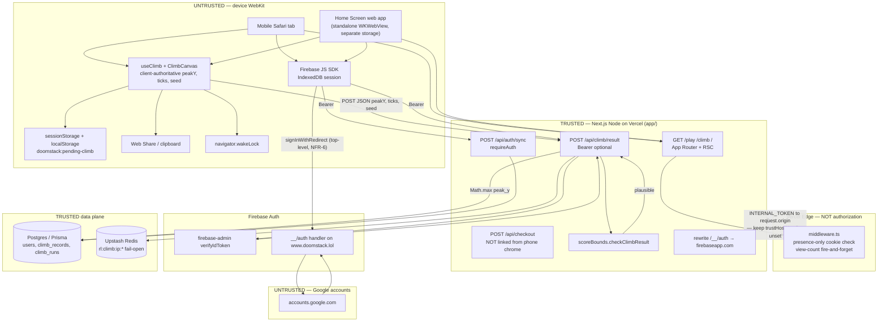

# iOS / mobile launch architecture — The Climb

**Date:** 2026-08-31  
**Stage:** architect (investigation only — no application code, no Capacitor tree)  
**Spec:** [`loop/ios-mobile-launch-spec.md`](ios-mobile-launch-spec.md) (AC-1–AC-38). First draft of this file was written in parallel while the spec was absent; this revision **re-keys to the spec** and does not invent a second vehicle.  
**Also read:** [`loop/ios-mobile-launch-mobile.md`](ios-mobile-launch-mobile.md) (client gaps G1–G12), [`loop/ios-mobile-launch-compliance.md`](ios-mobile-launch-compliance.md) (3.1.1 / 4.2 / 4.8), [`loop/ios-mobile-launch-cost.md`](ios-mobile-launch-cost.md).  
**Related (do not overwrite):** open PR [#49](https://github.com/leeran7/building-blocks/pull/49) owns `loop/architecture.md` (mobile vs desktop **leaderboard boards**). This file owns the **launch vehicle**. Board **behaviour** is in-scope here even if #49 is still open (spec Scope §6, AC-13–16).

---

## 1. Recommended vehicle (v1) and explicit rejections

**Recommend A — mobile web, iOS-first:** keep the existing Next.js App Router app on Vercel (`app/`), make Safari + optional Home Screen web app the iPhone launch surface, and treat phones as a **game-only chrome** over the same origin (`www.doomstack.lol`). One sentence why: the sim (`useClimb`), renderer (`ClimbCanvas`), auth (`Firebase` + `/__/auth` rewrite), and score write (`POST /api/climb/result`) already run in Mobile Safari; wrapping or rewriting them is a new product, not a launch.

**Not choosing:**

| ID | Vehicle | Why not for v1 |
|----|---------|----------------|
| **B** | Capacitor / WKWebView binary loading remote `doomstack.lol` or a bundled export | Same-origin Stripe + `/submit` collides with App Store Guideline **3.1.1**; a remote WebView is Guideline **4.2** (and **2.5.2** interpreted-code) rejection bait; Next.js App Router + Prisma **cannot** static-export into a bundled game binary without a second build. See ADR-2, §6. |
| **C** | Native Swift/SpriteKit or Unity rewrite of sim + renderer | Second game engine, second input path, second score oracle. Forbidden by `context/conventions.md` (match the stack) and by “do not introduce a second game engine for v1.” See ADR-3. |
| **D** | PWA-on-Android-first / TWA Play Store **in the same cycle** as iOS | Android Chrome already installs PWAs; Play TWA re-opens digital-goods billing (Play Billing vs web) on a **second** store. Do not dual-track store compliance with the iOS Home Screen launch. See ADR-4. |

Stack stays `context/profile.json`: Next.js App Router in `app/`, React + Tailwind, Prisma + Postgres, Upstash Redis, Firebase Auth, Stripe Checkout + webhooks (desktop/web paid path), Vercel. **No** second ORM, HTTP client, test runner, auth system, or game engine.

---

## 0. Spec-aligned assumptions

Product-spec is decisive on vehicle, phone home, paid chrome, and boards. These rows are the remaining load-bearing architect calls (not TBDs).

| ID | Decision | If inverted |
|----|----------|-------------|
| A-1 | v1 is **Safari + Home Screen** on `www.doomstack.lol`. No App Store / Capacitor / TWA this cycle. | §5 becomes the critical path — new loop. |
| A-2 | “Game-only” is **UI chrome** (spec Scope §4): hide paid CTAs in climb chrome; direct `/submit` and Checkout URLs still 200. | CDN/UA blocks or a `play.` origin need a new authDomain + CSP ADR. |
| A-3 | PR #49 `board` contract is **in the launch** (merge or equivalent). Enum stays `mobile \| desktop`. No third value `ios` / `pwa`. | Spec AC-13–16 fail. |
| A-4 | Online-only. No service worker (spec out of scope). | Vehicle B/C. |
| A-5 | Free leaderboard is a trust boundary; envelope ACs 35–38 are the interim control; F-1 / server re-sim stays Future (spec Trust decision). | Backend contract change, not a vehicle change. |
| A-6 | Google remains **top-level redirect** on web, including standalone (spec NFR-6, AC-20). Do not hide Google. Dual-write pending-climb so AC-19’s `sessionStorage` key still clears (ADR-9). | |
| A-7 | Coarse **landscape** is not a third board: rotate overlay, do not run fill-stage in landscape (ADR-16). Spec out-of-scope is the Orientation Lock **API**, not “landscape may poison Mobile.” | |
| A-8 | Power-up slots and unscoped `GET /api/tower` stay out of this loop. |

---

## 2. AC → architectural need

Spec ACs → architecture. qa-acceptance owns the DOM/HTTP assertions; this table is the **system** each AC needs.

| ACs | Need | Provision |
|-----|------|-----------|
| AC-1–3, AC-31, AC-33 | Phone home vs desktop paid home | Coarse `/` primary CTA → `/play` (≥44×44). Fine `/` primary stays `/auth/signup` or `/#towers`. **No** HTTP 302 `/` → `/play`. Navbar Free climb visible below `sm` (`FREE_CLIMB_HREF` already `/play`). |
| AC-4 | Game-only climb chrome | Lobby/HUD/results: no `checkout`, `/submit`, “enter the arena” / buy-altitude. Direct paid URLs still work. |
| AC-5–8 | Full-bleed play | `[data-climb-surface]` fill-stage; nav + tablist `inert`/`aria-hidden` or unmounted during climb (mobile G2); 44×44 pads; no “use a desktop…” copy; `visualViewport` resize remasures (already in `useCanvasSize`). |
| AC-9–12 | Home Screen | Manifest `display: standalone`, `start_url` pathname `/play`, colors `#0a0a0c`; 180 PNG apple-touch-icon; install hint exact phrase `Add to Home Screen` in browser-mode only; **no** `apple-itunes-app`. |
| AC-13–16 | Board split | Merge PR #49 or equivalent in this launch. Omit POST → mobile. Invalid `board` → 400 `INVALID_BOARD`. Paid towers unsplit. |
| AC-17–20 | Guest + auth | No login wall. Unauth POST `{ saved: false }`, no peak row. Google **top-level redirect** (keep `/__/auth`). Pending stash key `doomstack:pending-climb`; dual-write (ADR-9). |
| AC-21–23 | Share | `navigator.share` primary on iOS; copy fallback; no share when encode failed. |
| AC-24–26 | Audio + wake | `prime()` in Start handler (exists). Wake Lock request/release. Permissions-Policy must not send `wake-lock=()` or `screen-wake-lock=()`. |
| AC-27–30 | Legal | New `GET /privacy` and `GET /terms` 200; 44×44 links from footer and `/play` lobby. Copy headings are product/compliance; routes are this architecture. |
| AC-32, AC-34 | Desktop intact | Fine-pointer `/play` stays 9:16 (±0.02). Checkout unchanged. |
| AC-35–38 | Envelope | Existing `scoreBounds` / `checkClimbResult`. No new oracle. |
| NFR-8 | WebKit CI | Playwright (or equal) **WebKit** project. Chromium + iPhone UA does not satisfy AC-2/5/6/24. |
| NFR-7, ADR-16 | Landscape / iPad | Coarse iPad fill-stage is in product. Coarse **landscape iPhone**: rotate overlay, do not fill-stage (mobile G5). |

Realtime: **none**. No WebSocket, no multiplayer.  
Jobs: **none** new. Leaderboard revalidation is in-request `revalidatePath`.  
Auth: Firebase only (email, Google-in-Safari, anonymous).  
Payments: Stripe on web; **not** in the v1 phone chrome.

---

## 3. Data flow and trust boundaries



**Trust boundaries (load-bearing):**

1. **Device → `POST /api/climb/result`:** `peakY`, `ticks`, `seed`, `replayToken` are attacker-controlled. `scoreBounds` is a **damage cap**, not proof of honesty. `recordClimb` persists `Math.max` — a poisoned height cannot be lowered. Public leaderboard on `/` and `/climb` makes this reputation-adjacent (`context/trust.md` §1, learnings ledger). iOS launch **increases** write volume; it does not add a new oracle.
2. **Browser → Firebase:** ID tokens are proofs of authn, not of a fair run. Anonymous tokens have no `email`; the route returns `{ saved: false, reason: "anonymous" }` — that must stay true in standalone.
3. **Edge middleware is presence-only** (`firebaseToken` cookie). Authorization lives in route handlers (`requireAuth` / optional Bearer on climb). Do not add an Edge “mobile-only” gate that looks like authz.
4. **`INTERNAL_TOKEN` must not follow a request-derived origin** (`context/trust.md` §4). Capacitor/TWA that rewrite host headers make this worse — another reason B/D are rejected. `resolveBaseUrl()` / `BASE_URL` env remain the only allowed base for secret-bearing fetches.
5. **Home Screen storage ≠ Safari storage.** ITP and iOS installed-web-app isolation mean IndexedDB, cookies, and `localStorage` in the icon’d app are **not** the Safari tab’s. Google redirect is still the web path (spec AC-20); dual-write pending-climb (ADR-9) covers **same-container** hops. Cross-container (PWA → Safari) remains a residual hole — not a server table in v1.
6. **Paid money path is a different trust boundary** (Stripe webhooks, `payment_status`). Phone chrome must not deep-link into it in a Store binary; on the web it may exist off the primary path.

---

## 4. What must be added for a Home Screen web-app launch

All of this stays **inside** `app/`. No new mobile package.

### 4.1 Web app manifest (required)

Add `app/app/manifest.ts` (Next.js Metadata Route). Values are load-bearing:

| Field | Value | Why |
|-------|-------|-----|
| `name` | `The Climb` | Home Screen title under the icon. |
| `short_name` | `Climb` | ≤12 characters so iOS does not ellipsize. |
| `start_url` | `/play` | Game-only launch. Not `/` (paid marketing). |
| `scope` | `/` | **Must be origin root.** Scope `/play` would eject `/auth/*` and `/__/auth/*` into Safari and break login (ADR-7). |
| `display` | `standalone` | Hides Safari chrome. |
| `background_color` | `#0a0a0c` | `void` token — splash/letterbox. |
| `theme_color` | `#0a0a0c` | Matches `viewport.themeColor` already in `layout.tsx`. |
| `orientation` | `portrait` | Hint only on iOS; mobile board is the fill-stage. Do not also call `screen.orientation.lock` (no fullscreen API in Safari). |
| `icons` | PNG 192 and 512, `purpose: "any"` | iOS ignores maskable-only icons. SVG `app/app/icon.svg` (32×32) is **not** sufficient. |
| `id` | `https://www.doomstack.lol/play` | Stable identity if `start_url` later gains query params. |

Do **not** set `display_override` to `fullscreen` — iOS will ignore it and it fights safe-area math.

### 4.2 Apple-specific HTML / Next metadata (required)

In `app/app/layout.tsx` `generateMetadata()` / the `viewport` export, set:

```ts
appleWebApp: {
  capable: true,
  title: "The Climb",
  statusBarStyle: "black-translucent",
}
```

`black-translucent` is required so `viewport-fit: cover` (already set) plus `env(safe-area-inset-*)` (already read by `useSafeAreaInsets`) actually pad the HUD under the status bar / Dynamic Island. `default` status bar **steals** height and reports insets as 0.

Also:

- `app/apple-icon.png` **180×180** (iOS Home Screen). Next.js file convention; do not rely on the 32×32 SVG.
- Optional `apple-touch-startup-image` per device is **not** v1 (maintenance trap). `background_color` is enough.
- Manual `<meta name="apple-mobile-web-app-capable" content="yes">` is redundant if `appleWebApp.capable` is set; do not duplicate.

### 4.3 Icons (required)

Design-ux owns PNG export from the existing StackMark / `icon.svg` duotone (signal `#cbf24d`, ember `#ff5a2c`, void `#0a0a0c`). Required files:

| Path | Size | Used by |
|------|------|---------|
| `app/app/apple-icon.png` | 180×180 | iOS Home Screen / Share sheet |
| `app/app/icon.png` | 32×32 or 192×192 | Browser tab (may keep SVG) |
| Manifest 192 PNG | 192×192 | Android / installability |
| Manifest 512 PNG | 512×512 | Splash / store-like |

No rounded-rect baked in for Apple (iOS applies the mask). Do not use a white background — letterboxing would flash off-token.

### 4.4 Service worker (optional, default **off**)

v1 **does not ship a service worker** (ADR-6). iOS Add to Home Screen does not require one. Next.js 15 App Router + server components + Prisma cannot be a coherent offline shell; a SW that caches `/play` HTML will freeze players on a stale RSC payload.

If a later iteration adds one: `scope: "/play"`, network-first, **never** intercept `POST /api/climb/result`, **never** cache Firebase `/__/auth`. That is a new ADR.

### 4.5 Screen Wake Lock (required for long climbs)

On `handleStart` (same gesture as `unlockAudio()`):

1. `navigator.wakeLock?.request("screen")`
2. Re-request on `visibilitychange` → `visible` (iOS drops the lock when the app is backgrounded)
3. Release on run end, unmount, and mute-only does **not** release

Permissions-Policy today is `camera=(), microphone=(), geolocation=()` — wake-lock is **not** disabled. When anyone edits that header, they **must** keep `screen-wake-lock=(self)` (ADR-10). Do not enable `vibrate` — iOS Safari does not implement `navigator.vibrate`.

### 4.6 Web Share (required on coarse / standalone)

Replace the primary “Copy link” path on `(pointer: coarse)` and `display-mode: standalone` with:

```ts
navigator.share({ title, text, url: shareUrl })
```

Clipboard in iOS standalone often fails without a user-visible selection (ShareRun already catches and toasts). Keep Copy for fine-pointer. Do not add a new origin to CSP — Web Share is a browser surface. `twitter.com/intent/tweet` may stay as a desktop secondary; it is third-party and already allowed by navigation (not `connect-src`).

### 4.7 `display-mode: standalone` chrome hiding (required)

`/play` currently wraps `Navbar` + Leaderboard/Play tabs (`FreeStackShell`). In standalone those steal vertical pixels the fill-stage then measures via `visualViewport`.

Required CSS/layout contract:

- `@media (display-mode: standalone)` **and** `window.navigator.standalone === true` (older iOS): hide `Navbar` and the FreeStack tablist on `/play`.
- Keep a 44×44 in-canvas control to reach `/climb` (leaderboard) and sign-in — do not trap the player with no navigation.
- Hide paid destinations: `/#towers`, `/submit`, Dashboard-as-monetization, Get started → signup-for-paid. Sign in for **saving a climb** stays.
- Do **not** `window.location` replace `/` → `/play` for all iPhones (breaks OG, Applebot, paid marketing). Manifest `start_url` is the Home Screen entry; Safari landing page may still market, with Play as the primary CTA on coarse pointer.

### 4.8 Audio unlock (already present — do not regress)

`ClimbScene.handleStart` already calls `unlockAudio()` in the tap. `audioOutput.ts` already reroutes touch devices through a `playsinline` `<audio>` so the Silent switch does not mute the ringer channel. Learnings ledger: `ensureContext()` / `prime()` must stay inside that gesture; mute-toggle already unlocks on unmute. Investigation must not “simplify” this into an effect.

### 4.9 Install hint (required — spec AC-11)

iOS has **no** `beforeinstallprompt`. On coarse `/play` **lobby**, when `display-mode: browser`, a visible element’s text **must include the exact phrase** `Add to Home Screen`. Hide that copy when `display-mode: standalone` (and `navigator.standalone === true`). Do not invent an Install button. **No** `<meta name="apple-itunes-app">` (AC-12).

### 4.10 Phone home, chrome, and play-surface contract (required)

- Coarse `/` hero primary CTA → `/play`, ≥44×44 (AC-1). Fine `/` primary stays paid (AC-31). **No** 302 `/` → `/play` (AC-33).
- Navbar “Free climb” (`FREE_CLIMB_HREF` = `/play`) **visible below `sm`** (AC-3). Today it is `hidden sm:inline-flex`.
- Climb root carries `[data-climb-surface]` (AC-2, AC-5, AC-8).
- During climbing on coarse `/play`: site `nav` and Free-stack tablist are unmounted **or** `inert` + `aria-hidden="true"` so a tap at `(width/2, 20)` does not go to `/` (AC-5; mobile G2).
- Document under `fixed inset-0` must not rubber-band: `overflow: hidden` on `html`/`body` while climbing (mobile G1).
- Remove lobby copy `use a desktop for the best experience` (AC-7).
- `useCoarsePointer` must not first-paint the 9:16 desktop stage on phones (mobile G3): read `matchMedia('(pointer: coarse)')` before first canvas measure (inline bootstrap or default from a client-only wrapper that does not flash `fill: false`).

### 4.11 Legal routes (required — spec AC-27–30)

Add `app/app/privacy/page.tsx` and `app/app/terms/page.tsx` (App Router, 200). Privacy headings must include exact strings `Data we collect`, `Authentication`, and `Climb scores`. Link both from landing footer and `/play` lobby with ≥44×44 targets. Copy quality is compliance; **routes are in this launch**, not Store-only.

### 4.12 Landscape (required not to poison Mobile — ADR-16)

Spec lists Orientation Lock **API** as out of scope. Coarse iPhone **landscape fill-stage** is a different sightline (mobile G5) and would still POST `board: mobile`. v1 contract: if `window.innerWidth > window.innerHeight` on coarse `/play`, show a rotate-to-portrait overlay and **do not run** fill-stage or accept Start. Portrait resume is the same run if one was in progress (pause). Do not letterbox onto Desktop; do not invent a third board.

### 4.13 Board split (required — spec AC-13–16)

Merge PR #49 or land equivalent migrations `0010`/`0011` + `parseClimbBoard` in this launch. Not optional. Unique `(userId, category_slug, board)`. Omit POST → mobile. Paid towers unsplit.

---

## 5. What MUST exist before an App Store binary is even attempted

Vehicle B is a **later product**, gated on all of the following. Missing any one item is a stop. This section exists so a future loop does not “just wrap the site.”

### 5.1 Digital goods (Guideline 3.1.1) — pick exactly one

| Option | Meaning | Consequence |
|--------|---------|-------------|
| **Game-only binary** | The WKWebView (or native shell) **cannot navigate** to `/submit`, Checkout, paid stack buy flows, or any Stripe-hosted page. Allow-list paths: `/play`, `/climb`, `/auth/*`, `/__/auth/*`, `/api/climb/*`, `/api/auth/sync`. | Same origin still hosts Stripe for Safari. The **binary** must refuse those URLs (not “hide the button”). |
| **IAP** | Digital altitude / stacks sold via StoreKit. Web Stripe remains for the browser; entitlements must not diverge in a way Apple calls “steering.” | New payments stack — forbidden as a silent add. Needs its own architecture loop. |
| **External purchase (US/EU entitlements)** | StoreKit External Purchase Link / EU alternative. | Legal + entitlements + extra disclosure UI. Not v1. |

**Do not** ship a binary that can open `POST /api/checkout` success URLs. That is the collision the parent facts name.

### 5.2 Sign in with Apple (Guideline 4.8)

If the binary shows **Google** (or any third-party social login) as a primary account, **Sign in with Apple** is mandatory, equivalent UI, no extra interstitial. Firebase already can add `OAuthProvider("apple.com")`; it is **not** wired today. Web-only v1 does **not** add it (ADR-12). App Store prep must:

- Enable Apple provider on Firebase project `building-blocks-88190`
- Add Services ID + return URL on the Apple Developer team
- Extend CSP `frame-src` / `connect-src` with `https://appleid.apple.com` **in the same change**
- Map Apple `user` + email-relay to `users.email` (nullable/relay addresses) — **schema change**, because `users.email` is `String @unique` NOT NULL today and anonymous-without-email already cannot persist climbs

### 5.3 Native differentiators (Guideline 4.2 Minimum Functionality)

A WKWebView of `doomstack.lol` will be rejected as a repackaged website. Before filing:

- Native features that are not a website: Game Center / replay share sheet / haptics via `UIImpactFeedbackGenerator` / true offline bundled sim / push via APNs, **something** Apple can poke.
- Remote-URL wrappers additionally risk **2.5.2** (downloading interpreted code). Prefer a **bundled** game shell if a binary is ever attempted — which Next.js App Router cannot produce without a dedicated export of `src/game/**` + canvas, i.e. a second build graph.

### 5.4 Bundled vs remote URL (ADR-2 recap)

| Mode | Verdict |
|------|---------|
| Remote `https://www.doomstack.lol/play` in WKWebView | Reject for v1 and for a first binary: 4.2, 3.1.1 (unless path-locked), 2.5.2, host-header/token risk. |
| Bundled static export of the whole Next app | Impossible without dropping Prisma, RSC, and API routes. |
| Bundled `src/game` + canvas, API still remote | The only intellectually honest binary; it is a **new client** (closer to C than A). Not this loop. |

### 5.5 Privacy nutrition, legal, TestFlight

- App Store Privacy Nutrition labels: Firebase Auth (email), crash/perf if Sentry is added, advertising **none** unless that changes.
- Privacy Policy URL live on the same origin (web already needs this; the binary will be checked).
- Account deletion (Guideline 5.1.1(v)) if the binary offers account creation.
- Apple Developer Program membership, bundle ID, certificates, TestFlight group, builds that expire in 90 days.
- `ITSAppUsesNonExemptEncryption` / export compliance.

**v1 Home Screen does ship `/privacy` + `/terms` (AC-27–30).** Nutrition labels, in-app account deletion (5.1.1(v)), TestFlight, and export compliance apply only to a later binary.

---

## 6. Data models

**v1 adds no tables for icons, manifests, or wake lock.** It **does** add the PR #49 `board` column (or equivalent) — that is a data change **in this launch**, owned by the board-split contract, not by the Home Screen chrome. Do not pre-add `apple_user_id`.

### 6.1 Existing — `User` (`users`)

| Field | Type | Null | Notes |
|-------|------|------|-------|
| `id` | String (Firebase UID) | no | PK |
| `email` | String | no | Unique. Anonymous Firebase users **cannot** be inserted — climb save skips. |
| `emailVerified` | Boolean | no | default false |
| `display_name` | String | yes | Public handle override; moderation in `nameModeration.ts` |
| `createdAt` | DateTime | no | |

**Delete policy:** `onDelete: Cascade` to `ClimbRecord`; `ClimbRun.userId` SetNull. A user delete wipes peaks (irreversible for that uid) but historical `climb_runs` may remain anonymous.

**No Apple subject column until §5.2.** Do not pre-add `apple_user_id`.

### 6.2 Existing — `ClimbRecord` (`climb_records`)

| Field | Type | Null | Notes |
|-------|------|------|-------|
| `id` | String cuid | no | |
| `userId` | String | no | FK users |
| `category_slug` | String | no | Free climb always `"free"` (`FREE_STACK_SLUG`) |
| `peak_y` | Float | no | **Monotonic** — only raised in `nextPeak()` |
| `wins` | Int | no | default 0 |
| `updated_at` | DateTime | no | |

**Indexes today:** unique `(userId, category_slug)`; `(category_slug, peak_y DESC)` `climb_record_leaderboard_idx`. **After board split:** unique includes `board`; leaderboard index must include `board` (PR #49 schema). Do not rank Mobile with the pre-split index.

**This launch adds** `board` enum `mobile | desktop` to the unique key (one peak per user per board) by merging PR #49 or equivalent (ADR-13). Home Screen / coarse fill-stage writes **mobile**. Fine-pointer 9:16 writes **desktop**. Untagged history cut over to **desktop**; insert default / omit-POST is **mobile**. Unique key becomes `(userId, category_slug, board)`. Indexes: keep a leaderboard index that **includes** `board` (do not rank with a pre-split index).

### 6.3 Existing — `ClimbRun` (`climb_runs`)

| Field | Type | Null | Notes |
|-------|------|------|-------|
| `id` | String cuid | no | |
| `userId` | String | yes | SetNull on user delete |
| `category_slug` | String | no | `"free"` |
| `peak_y` | Float | no | Per-run, not monotonic |
| `finished` | Boolean | no | |
| `finished_tick` | Int | yes | |
| `seed` | String | no | |
| `replay_token` | String | yes | Deflate input log; max 32768 chars |
| `created_at` | DateTime | no | |

**Indexes:** `(category_slug, created_at)`, `(userId, created_at DESC)`.

**Delete policy:** rows are history. v1 does not expire them. 10× iOS play grows this table; that is an ops concern, not a launch blocker. Add a retention job only with a new ADR.

### 6.4 Enums (exhaustive)

**This repo today:** no `board` enum in schema.

**PR #49 (consume, do not redefine):**

```ts
type ClimbBoard = "mobile" | "desktop"
```

Parser: `parseClimbBoard` allow-list, **reject never default** on the write path (`INVALID_BOARD` 400). Omit/null → mobile (spec AC-13). Coarse fill-stage client may send `"mobile"` or omit; never UA. Fine-pointer client sends `"desktop"` or the server classifies via the stored play-surface field — **do not** trust `User-Agent`.

**Do not add** `ios` | `pwa` | `android` | `tablet`. Tablets with coarse pointer are `mobile` (fill-stage). Fine-pointer iPad with keyboard is `desktop`. Classifier is play surface (`climbBoardFromPointer`), not device marketing names (PR #49 ADR-3 — keep).

### 6.5 Paid models

`Block`, `Payment`, `Season` — **unchanged**. Phone chrome does not write them. Stripe webhook trust rules in `context/trust.md` §2 still apply on the web path.

### 6.6 Client-only keys (not DB)

| Key | Store | TTL | Why |
|-----|-------|-----|-----|
| `doomstack:pending-climb` | **sessionStorage and localStorage** (same key, same JSON) | 2 hours on the localStorage copy (`savedAt` + `v: 1`) | AC-19 asserts sessionStorage clear. localStorage backup survives iOS tab recreation (mobile G11). Neither hops Safari ↔ Home Screen |
| `doomstack:sfx-muted` | localStorage | none | Already exists |
| `firebaseToken` cookie | `Path=/; SameSite=Lax; Max-Age=604800` | 7 days | Presence-only for middleware; **not** httpOnly |

---

## 7. API contracts

No new REST resources for v1. Manifest is a static metadata route, not an authenticated API.

### 7.1 `POST /api/climb/result` (add `board`; keep envelope + optional auth)

| | |
|--|--|
| **Auth** | Optional `Authorization: Bearer <Firebase ID token>`. Missing/invalid/anonymous → **200** `{ saved: false, reason }` — never 401 for solo play. |
| **Rate limit** | `rl:climb:ip:<ip>`, 60 / 60s, **fail-open**. Not partitioned by board (PR #49 ADR-4 — keep). |
| **Idempotency** | None. Duplicate posts create extra `ClimbRun` rows; `peak_y` Math.max is safe. Client `posted` flag prevents double-fire **in one scene**. Do not add `Idempotency-Key` in v1 (ADR-14). |
| **4xx shape** | `{ error: string, code?: string }` |

**Request JSON**

| Field | Type | Required | Notes |
|-------|------|----------|-------|
| `peakY` | finite number | yes | Untrusted. Bounded by `checkClimbResult`. |
| `seed` | string | yes | |
| `ticks` | finite number | yes for bound | Fallback: `finishedTick` for stale stashes. |
| `finished` | boolean | no | default false |
| `finishedTick` | number \| null | no | |
| `categorySlug` | string | no | Ignored for placement; server forces `"free"`. |
| `replayToken` | string | no | Max `MAX_REPLAY_TOKEN_LENGTH` (32768). |
| `board` | `"mobile"` \| `"desktop"` | no (omit → mobile) | Invalid / non-enum → **400** `{ error, code: "INVALID_BOARD" }` (never coerce). Coarse fill-stage omits or sends `mobile`. Fine 9:16 sends `desktop`. |

**200**

```json
{ "saved": true, "peakY": 0, "improved": false, "rank": 1, "totalClimbers": 1, "handle": "string" }
```

or `{ "saved": false, "reason": "anonymous" | "invalid_token" | "persist_error" }` (`persist_error` may be 500).

**400** `{ "error": "Invalid JSON" }` · `{ "error": "Invalid climb result" }` · `{ "error": "Implausible climb result", "code": "IMPLAUSIBLE_RESULT" }`  
**429** `{ "error": "Too many requests", "code": "RATE_LIMITED" }`

### 7.2 `POST /api/auth/sync`

Auth required. Fail-**closed** Redis 20 / 60s / uid. Upserts `users`. Phone clients keep calling it from `AuthContext` after non-anonymous sign-in. No change.

### 7.3 `POST /api/checkout`

**Out of phone chrome.** Auth required. Fail-open 30 / 60s. Must not gain a deep link from standalone UI. Binary (future) must not load it.

### 7.4 `GET /play`

Public. Optional `?r=<replayToken>`. `start_url`. No auth wall (parent: anonymous play).

### 7.5 `GET /manifest.webmanifest`

Public, cacheable (`Cache-Control: public, max-age=3600` is fine). No secrets. Do not put Firebase API keys in the manifest.

### 7.6 `GET /privacy` and `GET /terms`

Public HTML. **200**. No auth. Privacy body contains headings `Data we collect`, `Authentication`, `Climb scores` (AC-27). No PII in the page itself.

### 7.7 Error / CSP on new origins

Do not add Apple or Sentry hosts until those SDKs exist. Current `connect-src` already includes Stripe, Google APIs, Firebase. `Permissions-Policy` stays camera/mic/geo disabled.

---

## 8. Folder tree (v1 stays in `app/` — no new mobile tree)

Specialist ownership for a **future implementer** (this loop’s nextStage is docs, not implementer):

```
app/
  app/
    layout.tsx              frontend + design-ux  (appleWebApp, viewport — already)
    manifest.ts             frontend              (NEW)
    apple-icon.png          design-ux             (NEW 180)
    icon.svg                design-ux             (existing)
    play/page.tsx           frontend              (start_url; standalone chrome)
    climb/page.tsx          frontend              (leaderboard; board tabs — #49)
    privacy/page.tsx        frontend + compliance (NEW, AC-27)
    terms/page.tsx          frontend + compliance (NEW, AC-28)
    auth/**                 frontend              (Google stays redirect; no popup)
    api/climb/result/       backend               (board field — #49 contract)
    api/auth/sync/          backend
    api/checkout/           backend               (not in phone chrome)
  src/
    components/Game/        frontend              (ClimbScene, ShareRun, audio)
    components/FreeStackShell.tsx  frontend       (hide chrome in standalone)
    hooks/useCanvasSize.ts  frontend              (visualViewport — exists)
    hooks/useCoarsePointer.ts
    hooks/useSafeAreaInsets.ts
    hooks/useWakeLock.ts    frontend              (NEW, Start-gesture)
    hooks/useDisplayMode.ts frontend              (NEW, standalone vs browser)
    hooks/usePendingClimb.ts frontend             (NEW, dual-write stash)
    game/useClimb.ts        frontend              (sim — do not fork)
    game/scoreBounds.ts     backend-shared
    game/climbBoard.ts      data/frontend         (PR #49 — in this launch)
    lib/firebase.ts         frontend
    lib/authCookie.ts       frontend
    config/public.ts        frontend              (siteUrl, authDomain)
    db/climb.ts             data
  next.config.js            security + devops     (CSP, Permissions-Policy, rewrites)
  prisma/schema.prisma      data                  (board column via #49 / equivalent)
```

**Forbidden in this loop / v1:** `ios/`, `android/`, `capacitor.config.*`, `Info.plist`, Unity/SpriteKit projects, a second `package.json` for a mobile client.

Repo root `agents/`, `orchestrator/`, `pack/` are unrelated to the launch vehicle.

---

## 9. Failure modes

### 9.1 iOS audio unlock

WebKit starts `AudioContext` **suspended**. `resume()` plus a source `start()` must run inside the **Start climb** tap (`unlockAudio` → `prime()` → silent one-sample kick). Effects, rAF, and replay `autoStart` are **not** gestures — replays stay silent unless the user taps (already gated with `worldLive`). Mute-while-never-unlocked used to no-op; unmute now unlocks — keep that. Silent switch: without `audioOutput.ts` media-element routing, SFX ride the ringer channel and die. Do not “simplify” to `ctx.destination` on iPhone.

### 9.2 Safari ITP / storage partitions

- **Why `/__/auth` exists:** `authDomain = www.doomstack.lol` so `signInWithRedirect` is first-party. Reverting to `building-blocks-88190.firebaseapp.com` re-breaks Safari.
- **Home Screen ≠ Safari tab:** cookies, IndexedDB (Firebase session), `localStorage` are partitioned. A player signed in in Safari is signed **out** in the icon’d app.
- **Google redirect from standalone** may **open Safari** and never return to the PWA (partitioned storage). Spec still requires Google redirect (AC-20). Mitigate with manifest `scope: "/"` (ADR-7) so `/__/auth` stays in-app when WebKit cooperates; dual-write pending-climb (ADR-9). Residual: if iOS ejects to Safari, the run saves in **Safari’s** container after sign-in — player must finish share/rank there. Do not hide Google (ADR-8).
- **7-day / ITP eviction** of unused site data is milder for added-to-home-screen apps but still not a contract. Online-only v1.

### 9.3 `visualViewport` chrome

Safari’s collapsing URL bar fires `visualViewport` `resize`. `useCanvasSize` already listens and ignores pinch (`scale !== 1`). In **standalone**, the URL bar is gone so height is stabler, but:

- `black-translucent` + Dynamic Island changes `safe-area-inset-top`
- Home indicator `safe-area-inset-bottom` must keep `TouchControls` above `TOUCH_CONTROLS_MIN_BOTTOM`
- Keyboard (email sign-in) shrinks `visualViewport` — if the canvas is still mounted behind a sheet, it will remeasure; freeze measurement while a text input is focused (implementer note)

Fill-stage **breaks** the 9:16 fairness lock on purpose (PR #49). Landscape iPhone fill-stage would see a **wider** world on the Mobile board — **forbidden** (ADR-16): rotate overlay, do not `screen.orientation.lock()`.

### 9.4 Standalone display-mode

`matchMedia("(display-mode: standalone)")` is false in a Safari tab even after Add to Home Screen (they are different processes). `navigator.standalone` is iOS-specific. Use **both**. Opening an `https://` link with `target=_blank` from standalone may dump the user into Safari; keep in-app `Link` for `/climb` and `/auth/signin`. External tweet intents **will** leave the PWA — acceptable for desktop, avoid as the primary share on iOS (Web Share stays in-app).

### 9.5 `sessionStorage` pending-climb after redirect (current bug class)

Today: `sessionStorage["doomstack:pending-climb"]` on anonymous finish and on “Sign in” click (`ClimbScene.tsx`). Failures:

1. `sessionStorage` dies when iOS recreates the tab after Google redirect.
2. Even `localStorage` does **not** cross Safari ↔ Home Screen.
3. Stashes from before `ticks` existed are already special-cased in the route.

**v1 fix (ADR-9):** dual-write the same JSON to `sessionStorage` **and** `localStorage` under `doomstack:pending-climb`. After a successful save, **clear both** (AC-19 names sessionStorage). Include `v: 1`, `ticks`, `savedAt`. TTL 2h on the localStorage copy. Do **not** build `pending_climbs` table in v1. Residual: Google-from-standalone that ejects to a **different** container cannot reclaim the run without a later server claim token.

### 9.6 Clipboard vs share sheet

`navigator.clipboard.writeText` in standalone iOS often rejects. ShareRun’s toast “Couldn’t copy link” is the current UX. Primary path: `navigator.share`. If `share` is missing, show the URL in a selectable `<input readonly>` so the user can copy as text (no Clipboard API).

### 9.7 External dependencies

| Dependency | Failure | Product behaviour |
|------------|---------|-------------------|
| Vercel / Next | Origin down | Game does not load. No offline shell (ADR-6). |
| Postgres / Prisma | Write fail | `POST /api/climb/result` → 500 `{ saved: false, reason: "persist_error" }`. Play continues; show “couldn’t save”. |
| Upstash Redis | Rate limit down | Climb **fail-open** (play). Auth sync **fail-closed** (no ghost users). Do not invert. |
| Firebase Auth | Outage | Anonymous play still works (no Bearer). Saves fail closed with `invalid_token` / no user. |
| Firebase `/__/auth` rewrite | Misconfig / host mismatch | Google redirect loops or ITP-broken session. Treat as Sev-1; do not “fix” with `trustHostHeader`. |
| Google accounts | User cancels | Stay anonymous; pending climb remains in sessionStorage + localStorage. |
| Screen Wake Lock | Unsupported (old iOS) | Ignore; climb still plays. Screen may dim. |
| Web Share | Unsupported | Selectable URL fallback. |
| Stripe | N/A on phone chrome | Web paid path unchanged: webhook `payment_status`, 2xx dead-letter rules. |
| Sentry | **Not installed** | Do not add `*.ingest.sentry.io` to CSP “just in case.” `docs/observability.md` remains optional. |

### 9.8 10× load

- **CGNAT:** many iPhones share one public IP. `rl:climb:ip:*` 60/min can 429 honest carrier traffic. Fail-open helps only when Redis is down, not when the bucket is full. At 10× concurrent mobile, raise the IP cap or add a second authenticated bucket (`rl:climb:uid:*`) **in addition**, not instead (learnings: partition every key that gates writes). Not a v1 launch blocker; it is the first scale ADR.
- **`revalidatePath("/")` + `/climb` on every saved run:** stampede at 10× finish rate. Debounce / tag-based revalidation later. Stale leaderboard for ≤60s ISR is acceptable.
- **Canvas O(floor²) geometry** (`towers.ts` / learnings): iPhone thermal throttling hits this first. Do not ship new per-tick React state. Performance agent owns memoization; vehicle A does not wait on it but **must not worsen it**.
- **`ClimbRun` growth:** insert-only history. 10× play → 10× rows. Rank queries use `ClimbRecord`, not a scan of runs.

---

## 10. Security

### 10.1 Authn vs authz

- **Authn:** Firebase ID token (client SDK + `verifyIdToken`). Cookie `firebaseToken` is **presence**, not proof.
- **Authz:** route handlers. Climb save: valid token **and** email (non-anonymous). Dashboard: `requireAuth`. Admin: `ADMIN_TOKEN` constant-time compare + rate limit. Middleware must not grow a “mobile role.”

### 10.2 PII

Leaderboard and OG images show **handles**, not emails (`handle.ts`). Do not put `users.email` in manifest, share text, or wake-lock logs. Share text is peak metres + replay URL only.

### 10.3 Secret **names** (never values, never in the client bundle)

`DATABASE_URL`, `DIRECT_URL`, `FIREBASE_PROJECT_ID`, `FIREBASE_CLIENT_EMAIL`, `FIREBASE_PRIVATE_KEY`, `STRIPE_SECRET_KEY`, `STRIPE_WEBHOOK_SECRET`, `ADMIN_TOKEN`, `INTERNAL_TOKEN`, `UPSTASH_REDIS_REST_URL`, `UPSTASH_REDIS_REST_TOKEN`, `BASE_URL`.  
Public by design (already in `PUBLIC_CONFIG`): Firebase `apiKey`, `authDomain`, `projectId`.  
Do **not** add `SENTRY_DSN` to the client without a CSP change in the same commit.

### 10.4 Do not forward secrets to request-derived URLs

`middleware.ts` today posts `INTERNAL_TOKEN` to `request.nextUrl.origin`. Safe only while `experimental.trustHostHeader` is unset (`next.config.js` `experimental: {}`). Vehicle B (Capacitor) and reverse proxies are how this becomes exfiltration. Any mobile wrapper **must** switch that fetch to `resolveBaseUrl()` / `BASE_URL` **before** the wrapper exists. Home Screen web app does not change the Host header — still do not enable `trustHostHeader` for “PWA debugging.”

### 10.5 Climb score trust

iOS launch is a **megaphone** for the existing hole: client `peakY` + monotonic persist + public `/` teaser. Controls that exist: `checkClimbResult` (generous envelope), IP rate limit, auth to persist. Controls that **do not** exist: `antiCheat.ts` is test-only (learnings); ranked re-sim (AC-17) is not a route. **Do not** claim the mobile leaderboard is fairer than desktop. **Do not** add a comment that “verification happens on iOS.” Server-derive or keep the known bound.

### 10.6 CSP vs new origins

Current policy (`app/next.config.js`): `default-src 'self'`; scripts Stripe + Google; connect Stripe + Google + Firebase; frame self + Stripe + Google + firebaseapp.

| Future origin | When to add | Directives |
|---------------|-------------|------------|
| `https://appleid.apple.com` | Sign in with Apple (Store prep only) | `frame-src`, `connect-src`, possibly `script-src` |
| Sentry ingest | If `@sentry/nextjs` is actually imported | `connect-src https://*.ingest.sentry.io` |
| Capacitor `capacitor://` / `ionic://` | Never in v1 | Would be a second origin class — refuse |
| Arbitrary `start_url` host | Never | Manifest `id` / `start_url` stay `www.doomstack.lol` |

Do not pre-allow Apple or Sentry. `img-src https:` is already wide (OG avatars later).

### 10.7 Write-on-read

Do not add `getOrCreate` on public `GET /play` or `GET /manifest.webmanifest`. User rows stay created on `POST /api/auth/sync` and self-heal in climb persist.

---

## 11. Hot paths, cache, N+1

| Path | Budget | Notes |
|------|--------|-------|
| rAF tick: `useClimb` + `ClimbCanvas` | 16.7 ms | Authoritative state in refs (learnings). `canvas.width` assign only on real resize. `devicePixelRatio` clamp still applies on 3× iPhones. |
| `POST /api/climb/result` | one persist / run | `climbRun.create` + `climbRecord` upsert + rank `count`. Not N+1 per floor. Index `climb_record_leaderboard_idx` must stay in `schema.prisma`. |
| `GET /play` | RSC + client sim | No DB on the play path except auth sync. |
| `GET /climb`, `GET /` | ISR ~30–60s | `revalidateClimbLeaderboard()` on persist. Cache keys are **paths**, not Redis. After #49, revalidate **both** boards’ URLs (`/climb`, `/climb?board=desktop`). |
| Redis | `rl:climb:ip:*` TTL 60s | Unbounded IPs — Upstash eviction is their problem; do not add a local `Map`. |
| Firebase IndexedDB | session | Partitioned per Safari vs Home Screen. |

N+1 risks: do not load Stripe, Recharts, or dashboard charts on `/play`. `GameOverlay` already `dynamic()`-imports `ClimbScene` on the landing page — keep.

---

## 12. ADRs

### ADR-1 — v1 launch vehicle is A (mobile web, iOS-first)

**Options:** A Safari + Home Screen; B Capacitor binary; C native/Unity rewrite; D Android TWA in the same cycle.

**Choice:** A.

**Reason:** The climb is already a WebKit Canvas 2D client on this origin, with first-party Firebase auth and a working touch fill-stage. B inherits 3.1.1 and 4.2. C forks the sim. D doubles store compliance. Matching `context/profile.json` is mandatory unless the spec requires a change; the spec (parent facts) does not require a Store binary.

**Consequence:** Implementers (later loop) add manifest/icons/meta/wake-lock/share/standalone chrome in `app/`. No Capacitor files. Paid Stripe remains desktop/web.

### ADR-2 — Reject Capacitor / remote WKWebView (B)

**Options:** (B1) WebView loads `https://www.doomstack.lol`; (B2) `next export` bundle; (B3) path-locked WebView allow-list.

**Choice:** None of B for v1. B3 is the only conceivable later binary and still needs §5.

**Reason:** Same origin hosts Stripe Checkout and `/submit`. A binary that can navigate there sells digital goods outside IAP (3.1.1). A WebView of a website fails 4.2. App Router + Prisma cannot static-export (B2). Remote HTML is 2.5.2-adjacent. Host headers in wrappers threaten `INTERNAL_TOKEN` (trust.md §4).

**Consequence:** Do not add `@capacitor/*`, `ios/`, or a second CI job that builds an IPA in this investigation or in the Home Screen implementer loop.

### ADR-3 — Reject native Swift/SpriteKit or Unity (C)

**Options:** Rewrite renderer only; rewrite sim+renderer; keep posting to `/api/climb/result`.

**Choice:** Reject all C for v1.

**Reason:** `useClimb` + `towers` + `powerups` + `scoreBounds` would duplicate. Two engines **will** diverge (learnings: one implementation for one rule). Conventions forbid a second game engine. Leaderboard trust would get worse if the native tick does not match `TICK_HZ`.

**Consequence:** No Unity project, no SpriteKit target, no parallel `src/game-ios`.

### ADR-4 — Reject Android-first TWA / Play in the same cycle (D)

**Options:** Ship TWA with iOS Home Screen; Android Chrome PWA only; Play later.

**Choice:** Do not include Play TWA in the iOS Home Screen loop. Android Chrome may use the **same** manifest opportunistically (icons, `display`) with **zero** Play submission.

**Reason:** Play digital-goods policy is a second billing stack. Chrome install UI already works without TWA. Parallel store QA is how this investigation fails.

**Consequence:** Manifest icons include 192/512 for Chrome, but no `assetlinks.json` / Digital Asset Links until a dedicated Android loop.

### ADR-5 — Game-only chrome, not a second origin

**Options:** (1) Separate `play.doomstack.lol`; (2) CDN deny `/submit` for iPhone UA; (3) UI chrome only.

**Choice:** 3.

**Reason:** A second origin rebuilds `authDomain`, cookies, CSP, and OG. UA deny-lists lie (iPad, Request Desktop Website) and break paid users who share phones. Store binaries need a **navigation allow-list** (§5.1); the web does not.

**Consequence:** Coarse-pointer + standalone hide paid CTAs. Typed URLs still work. Applebot still sees `/`.

### ADR-6 — No service worker in v1

**Options:** Workbox precache; `/play`-scoped SW; none.

**Choice:** None.

**Reason:** Next 15 RSC + API + Prisma cannot be an offline binary. A cached document is a **stale-game** outage. iOS A2HS does not require a SW. Android installability’s SW requirement is explicitly out of cycle (ADR-4).

**Consequence:** Online-only. Dead radio → local pending stash, no silent SW replay of POST.

### ADR-7 — Manifest `scope` is `/`, `start_url` is `/play`

**Options:** Scope `/play`; scope `/`.

**Choice:** `scope: "/"`, `start_url: "/play"`.

**Reason:** Auth lives at `/auth/*` and `/__/auth/*`. A `/play` scope forces those navigations into Safari, which is the ITP/session-split failure mode.

**Consequence:** Standalone can open `/climb` and sign-in without leaving the web app. Chrome hiding is CSS, not scope.

### ADR-8 — Keep Google top-level redirect on web; do not hide it in standalone

**Options:** (1) Hide Google in standalone; (2) Keep Google redirect everywhere; (3) Add Sign in with Apple now.

**Choice:** (2) — spec NFR-6 and AC-20. Popup is forbidden. SIWA is Future (ADR-12).

**Reason:** Product-spec requires Google redirect for guest-then-save (US-5). Hiding Google would fail AC-20’s control being present on coarse `/auth/signin`. Manifest `scope: "/"` (ADR-7) is the in-app return path. Partition risk is documented in §9.2, not designed around by removing the button.

**Consequence:** Sign-in UI is the same in Safari and Home Screen. Coach copy may mention “stay in this window.” No SIWA, no popup.

### ADR-9 — Pending climb: dual-write sessionStorage + localStorage; no new table

**Options:** sessionStorage only (today); localStorage only; dual-write; server `pending_climbs` claim token.

**Choice:** Dual-write same key `doomstack:pending-climb`. Clear both after one successful POST. localStorage copy carries `v: 1` + `savedAt` and expires at 2h.

**Reason:** AC-19 asserts the sessionStorage key is cleared — keep writing it. iOS often drops sessionStorage across Google redirect (mobile G11) — localStorage backup covers **same-container** recreation. A claim-token table is the cross-container fix and is out of v1 (new write path + authz).

**Consequence:** `ClimbScene.tsx` (or `usePendingClimb`) only. No Prisma migration. Read: try sessionStorage, then localStorage. Spec AC-19 still passes.

### ADR-10 — Wake Lock allowed; vibrate not in policy

**Options:** Disable all extra capabilities; allow `screen-wake-lock=(self)`.

**Choice:** Explicitly allow wake-lock when Permissions-Policy is next edited; do not add `vibrate`.

**Reason:** Parent fact: wake-lock/vibrate are currently **unmentioned** (allowed by default). A future `*` lockdown would silently kill always-on play. iOS has no `navigator.vibrate`.

**Consequence:** `handleStart` requests wake lock in the same gesture as audio unlock. Missing API → no-op.

### ADR-11 — Web Share is the iOS primary share path

**Options:** Clipboard only; tweet intent; `navigator.share`.

**Choice:** `navigator.share` on coarse/standalone; clipboard + tweet on fine pointer.

**Reason:** Clipboard is unreliable in standalone; tweet intent **leaves** the PWA.

**Consequence:** `ShareRun.tsx` grows a share-sheet button. No CSP change.

### ADR-12 — Do not add Sign in with Apple on web-only v1

**Options:** Add Apple now “for readiness”; wait for a binary.

**Choice:** Wait.

**Reason:** 4.8 applies to **App Store apps** that already offer third-party social login. Web does not need it. Apple email relay vs `users.email` NOT NULL is a real schema design, not a checkbox.

**Consequence:** §5.2 is a Store prerequisite list, not a Home Screen backlog.

### ADR-13 — Board split is in this launch (merge PR #49 or equivalent)

**Options:** Launch onto the unified board; wait on #49 as a hard dependency of *play*; merge/replicate #49 in the same launch; third `ios` board.

**Choice:** Merge or replicate #49 **before calling mobile launch done** (spec Scope §6, AC-13–16). No third enum value. Home Screen chrome (manifest, icons) must not ship as “the phone product” against a mixed board.

**Reason:** Fill-stage vs 9:16 is a different game. Spec forbids featuring a mixed free board. `parseClimbBoard` reject-never-default. Untagged history → desktop; omit-POST → mobile.

**Consequence:** Data specialist owns `0010`/`0011` + unique `(userId, category_slug, board)`. Frontend posts omit or `mobile` from coarse fill-stage and `desktop` from 9:16. Paid towers stay one ranking (AC-16).

### ADR-14 — Climb POST stays non-idempotent

**Options:** Idempotency-Key; natural key `(userId, seed)`; accept duplicate `ClimbRun`s.

**Choice:** Accept duplicate history rows. Peak remains monotonic.

**Reason:** `seed` is per mount/`newRunSeed()` — not unique across retries of the same finish. A new uniqueness constraint would drop legitimate re-climbs on the same seed if we ever reused seeds. v1 client `posted` is enough for one scene.

**Consequence:** Flaky mobile retries can insert two `climb_runs`. Do not 500. Do not unique-index `seed`.

### ADR-15 — Free-leaderboard trust is unchanged by the vehicle

**Options:** Block iOS launch until server re-sim; ship with `scoreBounds` only.

**Choice:** Ship with existing bounds. Do not pretend iOS is trusted more.

**Reason:** Learnings / `context/trust.md` §1. Spec Trust decision: envelope is interim; F-1 stays open. Vehicle A does not add an oracle.

**Consequence:** Security-reviewer keeps F-1 open. AC-35–38 must keep invoking production `checkClimbResult`, not a test double of the formula.

### ADR-16 — Coarse landscape is rotate-to-portrait, not fill-stage and not Orientation Lock

**Options:** (1) `screen.orientation.lock('portrait')`; (2) letterbox 9:16 in landscape and tag desktop; (3) fill-stage in landscape tagged mobile; (4) overlay + pause until portrait.

**Choice:** (4).

**Reason:** Spec out-of-scope is the **lock API** (Safari will not grant it without fullscreen). Option (3) poisons the Mobile board (wide-short sightline). Option (2) splits one phone across two boards. Manifest `orientation: portrait` is a hint only.

**Consequence:** Implementer adds a coarse landscape overlay with copy to rotate. Start is disabled until portrait. If a run is live and the phone rotates, pause + overlay; do not keep simulating into a different viewH.

---

## 13. Open questions (non-blocking for vehicle A)

1. Whether #49 merges as-is or this launch duplicates its migrations (ADR-13) — behaviour is fixed; git branch is not.
2. Existing ledger questions (power-up slots, `GET /api/tower`) — **not this loop**.
3. Server claim-token for **cross-container** pending climbs — follow-up if standalone Google ejects to Safari in production telemetry.
4. Legal prose beyond required privacy headings — compliance/docs (spec Open Question 1).

---

## 14. Implementer / docs checklist (when a later loop implements)

Investigation **must not** do these. Listed so the vehicle is unambiguous:

1. `app/app/manifest.ts` with ADR-7 values (`scope: "/"`, `start_url: "/play"`)
2. `appleWebApp` metadata + 180 PNG; no `apple-itunes-app`
3. Navbar Free climb visible below `sm`; coarse `/` primary CTA `/play`
4. `[data-climb-surface]`; nav/tabs inert or gone during climb; overflow hidden (G1)
5. Dual-write pending-climb; Google stays **redirect**
6. Wake Lock on Start; release on finish/hide; policy must not disable it
7. `navigator.share` primary on coarse; copy fallback
8. Merge/replicate PR #49 board contract (AC-13–16)
9. `/privacy` + `/terms` 200 with required headings; 44×44 links
10. Landscape rotate overlay (ADR-16); install hint exact phrase `Add to Home Screen`
11. Playwright **WebKit** project (NFR-8)
12. **No** Capacitor, **no** IPA, **no** SW, **no** Apple provider, **no** IAP

---

## 15. What this architecture is not

Not a replacement for PR #49’s `loop/architecture.md` (that file still owns cutover SQL). This file owns the **launch vehicle** and requires that board contract.  
Not a Store submission plan beyond the stop-list in §5.  
Not implementation.  
Not a second stack.
