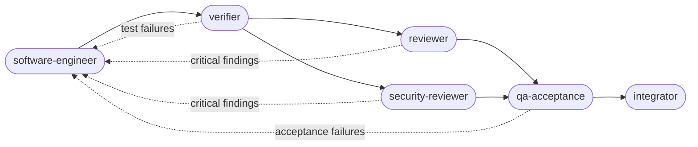

# Closed Loop Stages

## Primary loop (always run)



<details><summary>Text fallback</summary>

```
  software-engineer ◀─ ─ ─ ─ ─ ─ ─ ─ ─ ─ ─ ─ ─ ─ ─ ─ ─ ─ ─ ─ ─ ┐
          │                                                          │
          ▼                                                          │
      verifier ─ ─ ─ ─ ─ ─ ─ ─ ─ ─ ─ ─ ─ ─ ─ ─ ─ ─ ─ ─ ─ ─ ─ ─ ┤
     ╱        ╲                                                      │
    ▼          ▼                                                     │
 reviewer    security-reviewer                    findings / failures
    ╲          ╱                                                      │
     ▼        ▼                                                      │
  qa-acceptance ─ ─ ─ ─ ─ ─ ─ ─ ─ ─ ─ ─ ─ ─ ─ ─ ─ ─ ─ ─ ─ ─ ─ ─┘
          │
          ▼
     integrator
```

</details>

## Parallel quality gates (after verifier)

The orchestrator must dispatch these — doing the review in the parent does not count.

Run `reviewer` and `security-reviewer` in the **same message** (parallel). Then
`qa-acceptance`. All must pass before integrator:

- **reviewer** — correctness, edge cases, conventions (critical findings block)
- **security-reviewer** — auth, secrets, injection, dependencies
- **qa-acceptance** — end-to-end flows vs acceptance criteria (incl. finishing touches)

`nextStage` on a handoff cannot skip a required team member. The orchestrator
clamps skips back onto the sequence (see [team.md](team.md)).

## Terminal conditions

The orchestrator stops the loop when ALL are true:

1. Verifier status is `success`
2. Reviewer has no critical feedback
3. Security-reviewer has no critical findings
4. QA acceptance criteria all pass
5. Integrator reports CI green and PR merge-ready

## Loop-back routing

| Failure source | Route to |
|----------------|----------|
| Verifier test failures | software-engineer |
| Reviewer critical findings | software-engineer |
| Security critical findings | software-engineer |
| QA acceptance failures | software-engineer |
| CI failures in PR scope | software-engineer |
| CI failures unrelated to PR | integrator (merge base first) |
| Flaky/unclear failures | software-engineer (root-cause first) |

## Platform delegation

| Platform | Delegate to subagent |
|----------|---------------------|
| Cursor | Task tool with `subagent_type` **equal to the agent name** |
| Claude Code | Agent tool with `subagent_type` matching the agent name |
| Codex | Agent tool with `subagent_type` matching the agent name |

`custom` / `generalPurpose` / implementing the stage yourself is a loop defect.
See [team.md](team.md).
